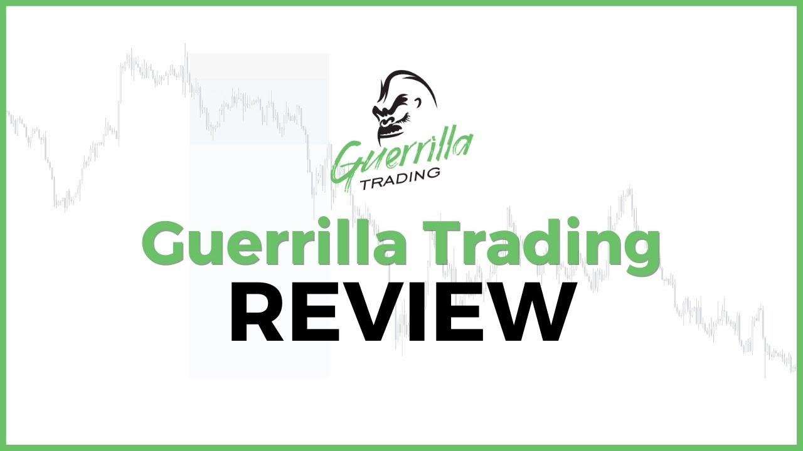

The financial markets represent an intricate ecosystem characterized by a multitude of trading strategies that employ both age-old and contemporary methods to achieve financial gain. Among these strategies, Guerrilla Trading stands out for its unique approach. It is defined by its high-frequency, rapid-fire transactions, which aim to capitalize on minuscule price fluctuations. This method diverges significantly from traditional practices, focusing instead on brief, opportunistic trades designed to exploit fleeting market movements.

Unlike mainstream trading strategies such as scalping or day trading, Guerrilla Trading is distinct in its execution and objectives. While scalping also involves short-duration trades to seize small gains, Guerrilla Trading takes this approach further by increasing the frequency and speed of transactions, often at a higher pace than even typical day trading activities. This relentless pursuit of small profits demands unwavering attention to market dynamics and precise timing to minimize market exposure.



The sophistication of Guerrilla Trading strategies is enhanced by the integration of algorithmic trading. As financial markets become increasingly competitive, algorithm-driven trading has grown crucial in executing Guerrilla Trading strategies with precision and speed. Algorithms, capable of processing vast amounts of market data in real-time, provide traders with the ability to identify and act on fleeting opportunities. This reliance on technology and data analysis represents a modern evolution in trading, where human intuition is complemented by computational efficacy.

In summary, Guerrilla Trading exemplifies the innovative strategies reshaping the modern trading landscape. Its emphasis on high-frequency, short-duration trades positions it as a compelling option for traders seeking to leverage market efficiencies. This article will investigate the nuances of Guerrilla Trading, contrasting it with analogous trading techniques and highlighting the role of algorithmic solutions within its framework. As this trading strategy gains prominence, understanding its mechanisms becomes vital for those looking to incorporate it into their trading repertoire.

## Table of Contents

## What is Guerrilla Trading?

Guerrilla Trading represents a high-frequency, short-term trading strategy specifically designed to capitalize on minute price movements within financial markets. Unlike long-term trading methodologies that aim for substantial profits over extended periods, Guerrilla Trading seeks quick, modest gains from each transaction. This strategy demands executing frequent, rapid trades throughout a trading session, thereby maintaining minimal market exposure.

In this trading strategy, the emphasis is on speed and precision, which are crucial in environments characterized by tight spreads and high liquidity, such as the foreign exchange (forex) market. High liquidity ensures that traders can enter and exit positions swiftly without significant price impact, which aligns with the fundamental objectives of Guerrilla Trading.

The methodology underlying Guerrilla Trading is relatively straightforward: identify minor price fluctuations, execute trades quickly, and secure small gains consistently. This approach minimizes exposure to the broader market [volatility](/wiki/volatility-trading-strategies), thereby reducing risk. However, the short time frame of trades means that each must be carefully timed to exploit these slight market movements effectively.

Consider the [forex](/wiki/forex-system) market, where currency pairs such as EUR/USD exhibit high [liquidity](/wiki/liquidity-risk-premium). In such scenarios, Guerrilla Traders utilize technical analysis tools, often relying on chart patterns and indicators that signal brief price fluctuations. For instance, moving average crossovers or candlestick patterns might inform trade decisions.

Furthermore, the minimal risk approach is achieved by maintaining limited positions and avoiding prolonged market stays, unlike swing or position trading strategies that engage in weeks or months of market exposure. This strategy is particularly attractive to traders who prefer an active, engaged trading style and possess the discipline to execute rapid transactions while managing stress levels associated with frequent decision-making.

## How Guerrilla Trading Works

In Guerrilla Trading, trades are executed swiftly, typically within minutes, and thus require exceptionally fast decision-making and execution skills. The strategy employs sophisticated technical analysis tools to pinpoint optimal entry and [exit](/wiki/exit-strategy) points, ensuring that each transaction aligns with prevailing market conditions. These tools often include indicators like the Moving Average Convergence Divergence (MACD), Relative Strength Index (RSI), and Bollinger Bands, which help traders discern fleeting price patterns and potential reversals.

The rapid turnover of positions in Guerrilla Trading means traders often operate in a high leverage environment, particularly within forex markets. Leverage amplifies potential returns but also enhances the risk, accentuating the need for precision in execution. For example, in forex trading, leverage ratios can reach as high as 50:1 or even more, allowing traders to control larger positions with a smaller amount of capital. This heightened leverage requires careful risk management; tiny deviations in price can lead to significant profit or loss.

The essence of Guerrilla Trading lies in the trader's ability to enter and exit positions almost instantaneously. Such speed is typically achieved through [algorithmic trading](/wiki/algorithmic-trading) systems, which execute trades with high precision and minimal latency. These algorithms are programmed to identify and act upon specific market signals. For example, a simple Python algorithm to implement a moving average crossover strategy might look like this:

```python
import pandas as pd

def moving_average_crossover(data, short_window=5, long_window=20):
    data['Short_MA'] = data['Close'].rolling(window=short_window, min_periods=1).mean()
    data['Long_MA'] = data['Close'].rolling(window=long_window, min_periods=1).mean()

    data['Signal'] = 0  # Default to 'hold'
    data['Signal'][short_window:] = np.where(data['Short_MA'][short_window:] > data['Long_MA'][short_window:], 1, -1)  # Buy when short MA crosses above long MA, sell when it crosses below

    return data
```

This code calculates short and long moving averages over the asset's closing price and generates buy or sell signals depending on the crossover of these averages. Such algorithmic setups enable Guerrilla Traders to capitalize on short-term opportunities with high efficiency.

Ultimately, the effectiveness of Guerrilla Trading hinges on the seamless integration of technical analysis and algorithmic precision, allowing traders to navigate the high-speed, high-stakes market environment with agility and confidence.

## Algorithmic Trading in Guerrilla Strategies

The integration of algorithmic trading within Guerrilla Trading strategies has become a vital component, offering the potential for increased efficiency and effectiveness. Algorithms facilitate the automation of these complex strategies by processing vast amounts of market data in real-time. This capability allows for the identification of fleeting profit opportunities, which is essential given the rapid pace and short duration of trades that characterizes Guerrilla Trading.

Algorithm-driven systems are particularly adept at executing trades with minimal human intervention, echoing the necessity for speed and precision in high-frequency trading environments. These systems can continuously monitor multiple trading parameters, such as price fluctuations and market trends, adjusting strategies dynamically to align with market conditions. This adaptability is crucial in executing large volumes of trades successfully without the delays introduced by manual tracking and analysis.

As technology continues to progress, the role of algorithms in Guerrilla Trading is expected to grow substantially. Advancements in [artificial intelligence](/wiki/ai-artificial-intelligence) (AI) and [machine learning](/wiki/machine-learning) are poised to enhance the predictive capabilities of these algorithms, allowing for more accurate forecasting and decision-making. With AI, traders can employ sophisticated models to analyze historical data and current market scenarios, thus optimizing entry and exit points with increased precision.

Moreover, algorithms can execute complex strategies that involve a multitude of variables and conditions, which would be challenging to manage manually. For example, they can be programmed to respond to specific triggers, such as breaking through support or resistance levels, ensuring that trades are executed at the most opportune moments.

The impact of algorithmic trading is augmented by high-speed computational infrastructure, which supports the rapid execution of trades and real-time analysis. As traders seek to maintain a competitive edge, algorithm sophistication becomes a crucial differentiator, enabling traders to capitalize on micro-fluctuations in market prices efficiently. Thus, the future of Guerrilla Trading is increasingly intertwined with the enhancements in algorithm-driven trading systems, where the focus remains on speed, precision, and disciplined risk management.

## Comparison with Other Trading Strategies

Guerrilla Trading is a distinct form of high-frequency trading that emphasizes rapid, short-duration trades compared to more traditional strategies like [day trading](/wiki/day-trading-spy) and swing trading. While day trading involves buying and selling financial instruments within the same trading day, with trades possibly lasting several hours, Guerrilla Trading opts for a much shorter exposure to the market. This strategy targets minute-by-minute price fluctuations, aiming to capture small yet frequent profits throughout the trading session. This difference in trade duration necessitates a higher transaction frequency, as Guerrilla traders execute more trades in a shorter amount of time compared to day traders.

In contrast to swing trading, which involves holding positions for several days to weeks to capitalize on expected market trends, Guerrilla Trading's focus is on immediate price shifts. Swing traders typically analyze broader market trends and may endure overnight risks as they await favorable price movements. Guerrilla Traders, however, minimize such risks by operating within a single trading session and closing all positions by the end of the day, thus avoiding any market movements that occur after hours.

The high-speed nature of Guerrilla Trading highlights the need for liquidity and precise market spreads. Successful implementation requires accessing markets where liquidity is plentiful, and transaction costs, indicated by the spread between bid and ask prices, remain low. This necessity for speed, coupled with a stringent emphasis on liquidity, makes Guerrilla Trading particularly demanding, as it requires traders to have a keen understanding of market dynamics and the ability to execute trades with precision.

Overall, the distinguishing factors between Guerrilla Trading and other strategies such as day trading and swing trading lie in the duration of holding positions and transaction frequency. These elements underline the prerequisite for advanced trading technologies and market acumen to effectively implement Guerrilla Trading strategies.

## Benefits and Drawbacks of Guerrilla Trading

Guerrilla Trading offers several benefits and drawbacks that are crucial for traders to consider. One of the primary advantages is the minimization of exposure to market volatility. By focusing on short-term trades and capturing minor price movements, Guerrilla Traders can achieve steady gains. This strategy reduces the risk of significant losses often associated with holding positions for extended periods, as the quick turnover rate limits exposure to unexpected market shifts.

However, the high-frequency nature of Guerrilla Trading brings about challenges, particularly in the form of increased transaction costs. Each trade incurs fees, and when the number of trades increases, these costs can significantly erode profit margins. The formula for calculating net profit in such high-turnover trading scenarios can be expressed as:

$$
\text{Net Profit} = \sum (\text{Profit per Trade} - \text{Transaction Cost})
$$

where the transaction cost is a factor of each completed trade. Even if individual trade profits are small but consistent, high transaction fees can accumulate, offsetting the cumulative gains.

A significant barrier to entry for Guerrilla Trading is the need for sophisticated technology and high trading acumen. This strategy heavily relies on advanced software to execute trades rapidly and accurately. Beginner traders might find it difficult to access or effectively use such technology, posing a challenge to their successful participation in Guerrilla Trading.

In addition to technical requirements, emotional discipline and precise execution are crucial to mitigate risks associated with rapid trades. The fast-paced environment demands traders remain calm and make decisions devoid of emotional interference. The ability to adhere strictly to predetermined strategies without succumbing to the psychological pressures of frequent trading is vital.

Moreover, successful Guerrilla Traders must maintain rigorous attention to detail in trade execution to prevent losses due to human error or latency. Any delay in entering or exiting positions could negate the intended benefits of quick trades. Thus, consistency in maintaining technological systems and personal discipline is non-negotiable. Overall, while Guerrilla Trading can yield consistent gains and efficiently manage market exposure, its high-frequency nature demands careful consideration of the associated costs, technical barriers, and psychological challenges.

## Real-world Examples and Implementation

Real-world examples of Guerrilla Trading provide insight into its operational effectiveness and inherent challenges. A key feature of this strategy is its reliance on historical analysis and algorithmic tools to identify trading opportunities. For instance, in the highly liquid forex market, traders frequently engage with currency pairs such as EUR/USD. The high liquidity and tight spreads of such pairs make them ideal for rapid-fire trading strategies like Guerrilla Trading. Historical data aids traders in recognizing repeatable patterns and trends, enhancing their ability to forecast short-term price movements.

Implementing Guerrilla Trading successfully mandates maintaining emotional control and adapting to dynamic market conditions. The market's constant fluctuations necessitate a trader's readiness to modify their strategies swiftly. Emotional discipline is crucial; the rapid pace can lead to impulsive decisions if not meticulously managed. Moreover, despite the short holding periods intended to minimize exposure to market volatility, unexpected events can still impact positions, necessitating vigilant risk management practices.

Technology is pivotal, forming the backbone of Guerrilla Trading operations. The rapid execution of trades is only feasible with robust technological infrastructure that minimizes latency. High-speed internet connections, sophisticated trading platforms, and cutting-edge computational hardware are indispensable in executing trades promptly and accurately. Additionally, the use of algorithmic trading systems can facilitate the execution of multiple trades without human intervention, ensuring that trades align with pre-defined criteria instantaneously.

For practical implementation, a trader might develop an algorithm to automatically execute trades based on technical indicators such as moving averages or relative strength indexes. A simple Python example for an algorithm utilizing moving averages might look something like this:

```python
def exponential_moving_average(prices, days):
    sma = sum(prices[:days]) / days
    multiplier = 2 / (days + 1)
    ema = [sma]

    for price in prices[days:]:
        ema.append(((price - ema[-1]) * multiplier) + ema[-1])

    return ema

# Assuming `prices` is a list of historical price data
short_ema = exponential_moving_average(prices, 5)
long_ema = exponential_moving_average(prices, 20)

# Trigger buy/sell based on crossover
if short_ema[-1] > long_ema[-1]:
    execute_trade('buy')
elif short_ema[-1] < long_ema[-1]:
    execute_trade('sell')
```

In conclusion, real-world implementations of Guerrilla Trading underscore its complexity and requirement for advanced capabilities, both human and technological. Traders must harness both analytical skills and emotional restraint, backed by a solid technological foundation, to exploit fleeting market opportunities efficiently.

## The Future of Guerrilla Trading

Technological advancements in Guerrilla Trading are paving the way for increased accessibility and efficiency, transforming the landscape and dynamics of this high-frequency trading strategy. Central to this evolution is the integration of machine learning and artificial intelligence (AI), which are set to revolutionize predictive modeling. Machine learning algorithms, particularly [deep learning](/wiki/deep-learning) and [reinforcement learning](/wiki/reinforcement-learning), can analyze vast datasets rapidly, identifying patterns and anomalies that might be imperceptible to human traders. This capability enhances decision-making processes by providing traders with predictive insights that are more nuanced and timely.

For instance, AI can use historical market data to forecast short-term price movements with elevated precision. An example of a Python implementation for predictive modeling might involve using libraries such as TensorFlow or scikit-learn to develop predictive algorithms:

```python
import numpy as np
from sklearn.model_selection import train_test_split
from sklearn.ensemble import RandomForestRegressor

# Example market data
market_data = np.random.rand(1000, 10)  # Simulated features of market data
price_movements = np.random.rand(1000)  # Simulated price movements

# Split data into training and testing
X_train, X_test, y_train, y_test = train_test_split(market_data, price_movements, test_size=0.2, random_state=42)

# Train a predictive model
model = RandomForestRegressor(n_estimators=100, random_state=42)
model.fit(X_train, y_train)

# Predict future price movements
predictions = model.predict(X_test)
```

Automation and the growing sophistication of algorithms are vital in maintaining competitiveness in fast-paced markets. High-frequency trading ([HFT](/wiki/high-frequency-trading-strategies)) environments demand the execution of numerous trades per second, necessitating algorithms that can act faster than traditional human strategies. Automated systems equipped with advanced algorithms can adjust trading strategies in real-time based on current market conditions, maximizing potential profits while mitigating risks.

Despite these technological advancements, the foundational principles of Guerrilla Trading, such as speed, precision, and disciplined risk management, remain critical. Speed ensures that traders can exploit brief market inefficiencies, precision guarantees that trades are executed with optimal accuracy, and disciplined risk management helps in avoiding significant losses from rapid position changes. These elements form the bedrock upon which advanced technological systems are built, ensuring that Human oversight and strategic planning continue to play a crucial role.

In conclusion, while technology enhances the capabilities of Guerrilla Trading, the core principles that underpin the strategy are just as important today as ever. These developments point to a future where the synergy between human insight and machine efficiency defines the cutting edge of trading in financial markets.

## Conclusion

Guerrilla Trading presents an intriguing approach to financial markets, focusing on high-frequency, short-duration trades. This method capitalizes on fleeting price movements by executing numerous trades within brief time windows. The potential for quick profits makes Guerrilla Trading attractive; however, it requires a disciplined approach, advanced technology, and a robust execution strategy. Traders must maintain a high degree of focus and emotional control to navigate the volatile, fast-paced environment effectively.

As financial technology continues to evolve, Guerrilla Trading might become a more prominent strategy for advanced traders seeking to leverage market efficiencies. With innovations in algorithmic trading, artificial intelligence, and machine learning, the ability to process vast amounts of data in real-time enhances the precision and speed necessary for Guerrilla Trading. Automated systems can execute trades faster than any human, improving the chances of success in these rapid transactions.

Understanding the intricacies of Guerrilla Trading helps traders assess its viability as part of their trading toolkit. By evaluating market conditions, transaction costs, and the technological infrastructure required, traders can determine whether this strategy aligns with their risk tolerance and financial goals. While technology plays a crucial role, the success of Guerrilla Trading still depends on a trader’s ability to implement disciplined risk management, ensuring that potential profits are not eroded by unforeseen market shifts or emotional decision-making.

## References & Further Reading

[1]: Bergstra, J., Bardenet, R., Bengio, Y., & Kégl, B. (2011). ["Algorithms for Hyper-Parameter Optimization."](https://dl.acm.org/doi/10.5555/2986459.2986743) Advances in Neural Information Processing Systems 24.

[2]: ["Advances in Financial Machine Learning"](https://www.amazon.com/Advances-Financial-Machine-Learning-Marcos/dp/1119482089) by Marcos Lopez de Prado

[3]: ["Evidence-Based Technical Analysis: Applying the Scientific Method and Statistical Inference to Trading Signals"](https://www.amazon.com/Evidence-Based-Technical-Analysis-Scientific-Statistical/dp/0470008741) by David Aronson

[4]: ["Machine Learning for Algorithmic Trading"](https://github.com/stefan-jansen/machine-learning-for-trading) by Stefan Jansen

[5]: ["Quantitative Trading: How to Build Your Own Algorithmic Trading Business"](https://www.amazon.com/Quantitative-Trading-Build-Algorithmic-Business/dp/1119800064) by Ernest P. Chan