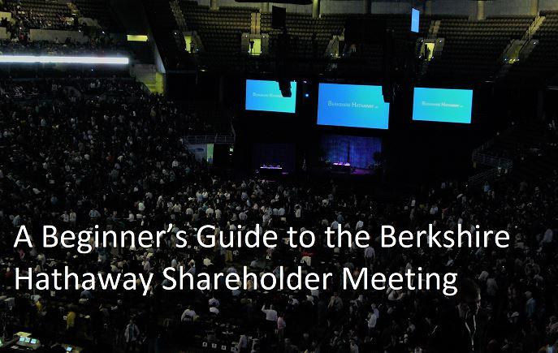

## Table of Contents

## What is the Berkshire Hathaway Annual Meeting?

The Berkshire Hathaway Annual Meeting is a big event that happens every year in Omaha, Nebraska. It is like a big party for a company called Berkshire Hathaway. The company is run by two famous investors, Warren Buffett and Charlie Munger. At the meeting, shareholders, which are people who own part of the company, come together to listen to Warren and Charlie talk about the company and how it is doing. They also answer questions from the shareholders.

The meeting is often called the "Woodstock for Capitalists" because it attracts a lot of people who are interested in investing and business. People come from all over the world to attend. Besides the main meeting, there are also other events like shopping at stores owned by Berkshire Hathaway and visiting exhibits. It's a fun and educational experience for anyone interested in learning more about business and investing.

## When and where is the Berkshire Hathaway Annual Meeting held?

The Berkshire Hathaway Annual Meeting happens every year in May. It is held in Omaha, Nebraska. This is where the company's headquarters is located.

The meeting takes place at the CHI Health Center Omaha. It is a big event that lasts for a few days. People come from all over the world to attend and learn about the company.

## How can I purchase tickets to the Berkshire Hathaway Annual Meeting?

To purchase tickets to the Berkshire Hathaway Annual Meeting, you need to be a shareholder of the company. This means you have to own at least one share of Berkshire Hathaway stock. You can buy the stock through a brokerage firm or online trading platform. Once you own the stock, you can request tickets for the meeting. You can do this by contacting Berkshire Hathaway's shareholder services or by filling out a form on their website.

The number of tickets you can get depends on how many shares you own. If you own one to 99 shares, you can get one ticket. If you own 100 to 199 shares, you can get two tickets, and so on. The tickets are free, but you need to pay for your own travel and accommodation to get to Omaha, Nebraska, where the meeting is held. It's a good idea to request your tickets early because they can sell out quickly.

## What should I expect at my first Berkshire Hathaway Annual Meeting?

At your first Berkshire Hathaway Annual Meeting, expect a fun and exciting experience. The meeting starts early in the morning and lasts for several hours. You'll see Warren Buffett and Charlie Munger sitting on stage, answering questions from shareholders. They talk about the company's performance, their thoughts on the economy, and even share some funny stories. The atmosphere is friendly and casual, like a big family gathering. People from all over the world come to listen and learn, so you'll meet lots of interesting folks who share your interest in business and investing.

Besides the main meeting, there are other things to do. You can visit the exhibit hall where you can shop at stores owned by Berkshire Hathaway, like See's Candies and Brooks Running. There are also booths where you can learn more about the different businesses the company owns. The city of Omaha gets really busy during the meeting, with special events and parties happening all around. It's a great chance to explore the city and maybe even meet Warren Buffett or Charlie Munger in person if you're lucky. Overall, your first Berkshire Hathaway Annual Meeting will be a memorable and educational experience.

## What are the key events and activities during the meeting?

At the Berkshire Hathaway Annual Meeting, the main event is the shareholders' meeting itself. It starts early in the morning and lasts for several hours. Warren Buffett and Charlie Munger sit on stage and answer questions from shareholders. They talk about how the company is doing, share their thoughts on the economy, and even tell funny stories. The atmosphere is friendly and casual, like a big family gathering. People from all over the world come to listen and learn, so you'll meet lots of interesting folks who share your interest in business and investing.

Besides the main meeting, there are other fun things to do. You can visit the exhibit hall where you can shop at stores owned by Berkshire Hathaway, like See's Candies and Brooks Running. There are also booths where you can learn more about the different businesses the company owns. The city of Omaha gets really busy during the meeting, with special events and parties happening all around. It's a great chance to explore the city and maybe even meet Warren Buffett or Charlie Munger in person if you're lucky.

## How can I prepare for the question and answer session with Warren Buffett and Charlie Munger?

To prepare for the question and answer session with Warren Buffett and Charlie Munger, you should start by learning about Berkshire Hathaway and its businesses. Read the company's annual report and any recent news about its investments. This will help you understand what they might talk about. You can also watch videos of past meetings to get an idea of the kinds of questions people ask and how Warren and Charlie answer them. Think about what you want to ask them. It could be about their thoughts on the economy, their investment strategies, or even their favorite businesses within Berkshire Hathaway.

During the session, be ready to listen carefully and take notes. Warren and Charlie often share a lot of wisdom and funny stories, so you'll want to remember the important points. If you get a chance to ask a question, keep it short and clear. They appreciate well-thought-out questions, but they also like when people keep it simple. Remember, the atmosphere is friendly and casual, so don't be nervous. Enjoy the experience and learn as much as you can from these two legendary investors.

## What investment insights can attendees gain from the meeting?

At the Berkshire Hathaway Annual Meeting, attendees can gain a lot of investment insights from Warren Buffett and Charlie Munger. They talk about how the company is doing, what they think about the economy, and what they look for when they invest in a business. They share their wisdom and experience, which can help people understand how to make smart investment choices. For example, they often talk about the importance of investing in companies that you understand and that have a strong business model. They also stress the value of patience and long-term thinking in investing.

Another thing attendees can learn is how Warren and Charlie think about risk and how they manage it. They often explain why they choose certain investments over others and how they protect their money during tough economic times. They might talk about specific companies they own and why they believe in them. By listening to their stories and advice, people can get a better idea of how to approach investing in a way that makes sense for them. Overall, the meeting is a great chance to learn directly from two of the best investors in the world.

## How does the annual meeting influence Berkshire Hathaway's stock price?

The Berkshire Hathaway Annual Meeting can have an effect on the company's stock price. When Warren Buffett and Charlie Munger share their thoughts on the economy and their investments, it can make people feel more confident or worried about the company. If they say good things about how the company is doing, the stock price might go up because people want to buy more shares. But if they say something that makes people think the company might not do well, the stock price could go down because people might want to sell their shares.

The meeting also gets a lot of attention from the news and investors all over the world. This attention can make more people interested in buying Berkshire Hathaway stock. Sometimes, just the excitement of the meeting can make the stock price go up a little bit. But the real impact depends a lot on what Warren and Charlie say and how people react to it. Overall, the meeting can move the stock price, but it's just one of many things that affect it.

## What are some networking opportunities available at the meeting?

At the Berkshire Hathaway Annual Meeting, there are many chances to meet and talk with other people who like business and investing. You can meet other shareholders from all over the world. They come to the meeting because they are interested in what Warren Buffett and Charlie Munger have to say. You can talk to them about the meeting, ask them about their thoughts on investing, or even make new friends. The atmosphere is friendly and casual, so it's easy to start a conversation with someone new.

Besides the main meeting, there are other events where you can meet people. You can go to the exhibit hall and visit the booths of different businesses owned by Berkshire Hathaway. While you're there, you can chat with the people working at the booths or other visitors. There are also special events and parties happening in Omaha during the meeting. These events are great places to meet other investors and business people. You might even get a chance to meet Warren Buffett or Charlie Munger in person if you're lucky.

## How can I maximize my learning experience at the Berkshire Hathaway Annual Meeting?

To get the most out of your learning experience at the Berkshire Hathaway Annual Meeting, start by doing some homework before you go. Read the company's annual report and any recent news about its investments. This will help you understand what Warren Buffett and Charlie Munger might talk about. You can also watch videos of past meetings to see the kinds of questions people ask and how they answer them. Think about what you want to learn from them. It could be their thoughts on the economy, their investment strategies, or even their favorite businesses within Berkshire Hathaway. The more you know going in, the more you'll get out of it.

During the meeting, listen carefully and take notes. Warren and Charlie share a lot of wisdom and funny stories, so you'll want to remember the important points. If you get a chance to ask a question, keep it short and clear. They appreciate well-thought-out questions, but they also like when people keep it simple. Don't forget to visit the exhibit hall and talk to other shareholders. You can learn a lot from the people around you who are also interested in business and investing. Enjoy the experience and soak up as much knowledge as you can from these two legendary investors.

## What are the common mistakes to avoid when attending the meeting?

One common mistake to avoid when attending the Berkshire Hathaway Annual Meeting is not doing your homework before you go. If you don't read the company's annual report or learn about its investments, you might not understand what Warren Buffett and Charlie Munger are talking about. This can make the meeting less interesting and you might miss out on learning important things. Also, if you don't think about what you want to ask them, you might not get the most out of the question and answer session. So, take some time to prepare before you go.

Another mistake is not taking advantage of all the opportunities at the meeting. The exhibit hall is a great place to learn about the different businesses owned by Berkshire Hathaway and to meet other shareholders. If you don't visit it, you're missing out on a lot of fun and learning. Also, don't be shy about talking to the people around you. They are there because they are interested in the same things you are, and you can learn a lot from them. The meeting is a big event with lots to see and do, so make sure you make the most of it.

## How have the themes and focuses of the annual meetings evolved over the years?

Over the years, the themes and focuses of the Berkshire Hathaway Annual Meetings have changed a bit. At first, the meetings were mostly about the company's businesses and how they were doing. Warren Buffett and Charlie Munger talked a lot about the companies they owned and how they were making money. As time went on, the meetings started to cover more than just the company. They began to talk about bigger things like the economy, how to invest wisely, and even how to live a good life. People came to the meetings not just to learn about Berkshire Hathaway, but also to hear what Warren and Charlie thought about the world.

These days, the meetings are more like big events that attract people from all over the world. They still talk about the company and its businesses, but they also share their wisdom on a lot of different topics. The meetings have become a place where people come to learn from two of the best investors in the world. They talk about things like how to manage risk, the importance of patience in investing, and even funny stories from their lives. The focus has shifted from just the company to a broader look at business, investing, and life.

## References & Further Reading

[1]: Bergstra, J., Bardenet, R., Bengio, Y., & Kégl, B. (2011). ["Algorithms for Hyper-Parameter Optimization."](https://dl.acm.org/doi/10.5555/2986459.2986743) Advances in Neural Information Processing Systems 24.

[2]: ["Advances in Financial Machine Learning"](https://www.amazon.com/Advances-Financial-Machine-Learning-Marcos/dp/1119482089) by Marcos Lopez de Prado

[3]: ["Evidence-Based Technical Analysis: Applying the Scientific Method and Statistical Inference to Trading Signals"](https://www.amazon.com/Evidence-Based-Technical-Analysis-Scientific-Statistical/dp/0470008741) by David Aronson

[4]: ["Machine Learning for Algorithmic Trading"](https://github.com/stefan-jansen/machine-learning-for-trading) by Stefan Jansen

[5]: ["Quantitative Trading: How to Build Your Own Algorithmic Trading Business"](https://books.google.com/books/about/Quantitative_Trading.html?id=j70yEAAAQBAJ) by Ernest P. Chan