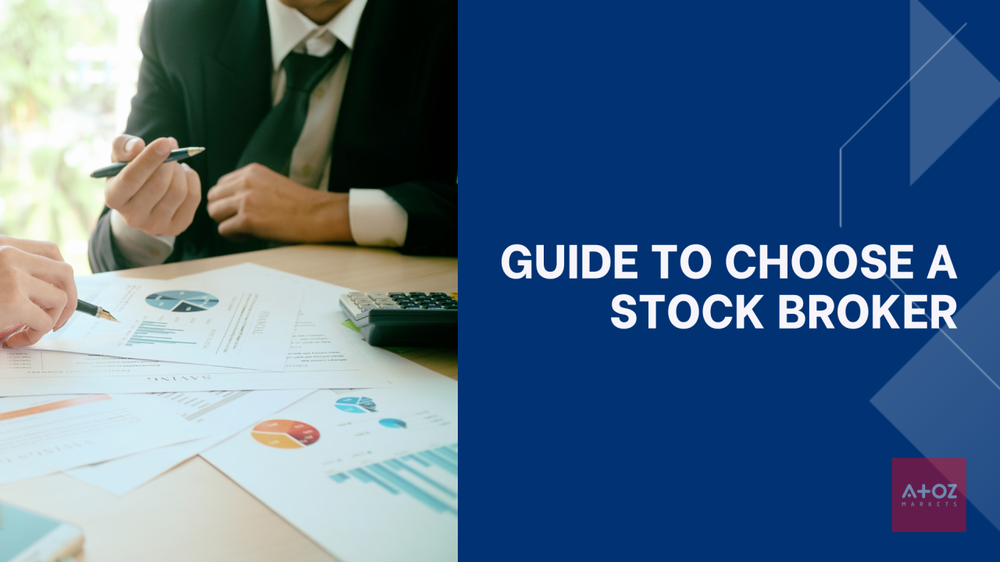

## Table of Contents

## What is an online stock brokerage and why is it important for investing?

An online stock brokerage is a company that lets you buy and sell stocks and other investments using the internet. Instead of going to a physical office or calling a broker on the phone, you can use a website or an app to manage your investments from anywhere. This makes it easy and convenient for people to invest their money in the stock market.

Online stock brokerages are important for investing because they make it easier and cheaper for people to start investing. They often have lower fees than traditional brokeries, which means you can keep more of your money. Also, because you can do everything online, you can quickly buy or sell stocks whenever you want, without having to wait for a broker to do it for you. This can help you make better investment decisions and grow your money over time.

## What are the key factors to consider when selecting an online stock brokerage?

When choosing an online stock brokerage, one of the first things to think about is the fees they charge. Some brokerages have low or no fees for trading stocks, but they might charge for other things like account maintenance or withdrawing money. It's important to understand all the costs so you can pick a brokerage that won't take too much of your money in fees. Another thing to consider is how easy the brokerage's website or app is to use. You want a platform that is simple to navigate so you can buy and sell stocks without any trouble.

Another key [factor](/wiki/factor-investing) is the variety of investment options the brokerage offers. Some brokerages let you invest in stocks, bonds, mutual funds, and even cryptocurrencies, while others might have fewer choices. It's good to pick a brokerage that has the types of investments you're interested in. Also, think about the customer support the brokerage provides. If you have questions or run into problems, it's helpful to have a brokerage with good customer service that can help you out quickly. By considering these factors, you can find an online stock brokerage that fits your needs and helps you invest wisely.

## How do trading fees and commissions affect my choice of an online brokerage?

Trading fees and commissions are important when you're [picking](/wiki/asset-class-picking) an online brokerage. These are the costs you pay every time you buy or sell a stock. Some brokerages charge a lot for each trade, while others might not charge anything at all. If you plan to trade a lot, these fees can add up quickly and eat into your profits. So, if you're someone who likes to buy and sell stocks often, you'll want to choose a brokerage with low or no trading fees to keep more of your money.

On the other hand, if you're more of a long-term investor and don't trade very often, the trading fees might not matter as much to you. In that case, you might be okay with a brokerage that charges a bit more per trade but offers other benefits like better customer service or a wider range of investment options. The key is to think about how often you'll be trading and how those fees will impact your overall investing strategy.

## What types of investment products should I look for in an online brokerage?

When picking an online brokerage, you should look for one that offers a variety of investment products. Stocks are a common choice where you buy a piece of a company. You can also look for brokerages that offer bonds, which are like loans you give to a company or the government. Mutual funds and exchange-traded funds (ETFs) are also good options. They let you invest in a bunch of different stocks or bonds all at once, which can help spread out your risk.

Some brokerages also offer options trading, which can be more complicated but can also offer bigger rewards or losses. If you're interested in newer types of investments, you might want a brokerage that lets you buy cryptocurrencies like Bitcoin. It's good to pick a brokerage that has the types of investments you want to make, so you can build a diverse portfolio that matches your goals and how much risk you're willing to take.

## How important is the user interface and trading platform when choosing a brokerage?

The user interface and trading platform are very important when choosing a brokerage. A good user interface makes it easy for you to buy and sell stocks without getting confused. If the website or app is hard to use, you might make mistakes or miss out on good investment opportunities. A simple and clear interface can help you make quick decisions and keep track of your investments easily.

The trading platform is also key because it's where you'll be doing all your trading. A good platform will have all the tools and features you need, like charts, research tools, and real-time data. This can help you make better investment choices. If the platform is slow or crashes a lot, it could cause you to lose money or miss out on trades. So, it's worth spending time trying out different brokerages to see which one has the best user interface and trading platform for you.

## What are the differences between full-service and discount brokerages?

Full-service brokerages and discount brokerages are two types of services that help you invest in the stock market, but they work in different ways. Full-service brokerages offer a lot of help and advice. They have financial advisors who can give you personal advice on what to invest in, help you plan for your future, and even manage your investments for you. Because they offer so much help, full-service brokerages usually charge higher fees and commissions. They are good for people who want a lot of guidance and don't mind paying more for it.

On the other hand, discount brokerages focus on giving you a simple way to buy and sell stocks without all the extra help. They usually have lower fees and commissions because they don't offer as much personal advice. With a discount brokerage, you'll need to do your own research and make your own investment decisions. They are good for people who are confident in their investing skills and want to save money on fees. So, the main difference is the level of service and the cost: full-service brokerages offer more help at a higher price, while discount brokerages offer less help at a lower price.

## How can I evaluate the reliability and security of an online brokerage?

To evaluate the reliability and security of an online brokerage, you should first check if the brokerage is regulated by a financial authority. In the U.S., this could be the Securities and Exchange Commission (SEC) or the Financial Industry Regulatory Authority (FINRA). These organizations make sure that brokerages follow rules to keep your money safe. You can usually find this information on the brokerage's website or by doing a quick search online. Also, look for reviews and ratings from other users to see if they had good experiences with the brokerage. If a lot of people say the brokerage is reliable and secure, that's a good sign.

Another important thing to look at is the security measures the brokerage uses to protect your account and personal information. A good brokerage will have strong encryption to keep your data safe, and they might also offer two-factor authentication, which adds an extra step to make sure it's really you logging in. You can usually find details about their security on their website. It's also a good idea to see if the brokerage has insurance that protects your money if something goes wrong. Many brokerages in the U.S. are covered by the Securities Investor Protection Corporation (SIPC), which can help you get your money back if the brokerage fails. By checking these things, you can feel more confident that your investments are in safe hands.

## What educational resources and tools should I expect from a top online brokerage?

A top online brokerage should offer a variety of educational resources and tools to help you learn about investing and make smart choices. These resources might include articles, videos, and webinars that explain how the stock market works, different types of investments, and strategies for investing. They might also have courses or tutorials that guide you through the basics of trading and help you understand more advanced topics like options trading. Some brokerages even offer live workshops or classes where you can ask questions and learn from experts.

In addition to educational content, top brokerages often provide tools that can help you analyze the market and make informed decisions. These might include stock screeners that help you find stocks that meet certain criteria, charting tools that let you see how stocks have performed over time, and research reports that give you detailed information about companies and the economy. Some brokerages also offer simulators where you can practice trading with fake money before you start using real money. Having access to these resources and tools can make a big difference in how well you do as an investor.

## How does customer service and support impact my experience with an online brokerage?

Good customer service and support can make a big difference in your experience with an online brokerage. If you have questions or run into problems, it's really helpful to have someone who can answer your questions quickly and clearly. A brokerage with good customer service might have people you can call, chat with online, or even email. They can help you understand how to use the platform, fix any issues you're having, and give you advice on your investments. This can make you feel more confident and comfortable as you invest your money.

On the other hand, if a brokerage has bad customer service, it can make your experience frustrating and stressful. You might have to wait a long time to get help, or the people you talk to might not be able to answer your questions well. This can be really annoying, especially if you're trying to make a quick decision about buying or selling a stock. So, when you're choosing a brokerage, it's a good idea to think about how important good customer service is to you and pick one that will give you the support you need.

## What are the tax implications and account types offered by different brokerages?

When you invest through an online brokerage, you need to think about the tax implications and the types of accounts they offer. Different brokerages might have different rules about taxes, but usually, you'll have to pay taxes on any money you make from your investments, like when you sell a stock for more than you paid for it. This is called capital gains tax. Some brokerages might give you tools to help you figure out your taxes, but it's a good idea to talk to a tax professional to make sure you're doing everything right.

Brokerages also offer different types of accounts that can affect your taxes. A regular brokerage account, also called a taxable account, means you'll have to pay taxes on your earnings each year. But some brokerages also offer tax-advantaged accounts like IRAs (Individual Retirement Accounts) and 401(k)s. With these accounts, you might get tax breaks now or when you retire, depending on the type of account. For example, with a traditional IRA, you can deduct your contributions from your taxes now, but you'll pay taxes when you take the money out later. With a Roth IRA, you pay taxes on your contributions now, but your earnings can be tax-free when you retire. It's important to understand these differences so you can choose the right account for your goals.

## How do mobile trading apps compare across different online brokerages?

Mobile trading apps are a big part of online brokerages these days. Different brokerages have their own apps, and they can be quite different from one another. Some apps are really easy to use, with simple buttons and clear screens that make it easy to buy and sell stocks. Others might be more complicated, with lots of charts and tools that can be helpful if you know what you're doing, but might be confusing if you're new to investing. The best apps are usually the ones that work well and don't crash a lot, so you can trade whenever you want, even if you're away from your computer.

Another thing to think about is what features the app has. Some apps let you do everything you can do on the website, like checking your account, looking at research, and setting up alerts. Others might not have all the same features, so you might need to use the website for some things. It's also good to see if the app has good customer support, like being able to chat with someone if you have a problem. Overall, the best mobile trading app for you will depend on what you need and how you like to invest.

## What advanced features should experienced traders look for in an online brokerage?

Experienced traders should look for online brokerages that offer advanced trading tools and features. One important feature is the ability to trade options, futures, and other complex financial products. These tools can help experienced traders make more sophisticated investment strategies. Another feature to look for is advanced charting and technical analysis tools. These tools let traders look at detailed charts and use indicators to predict how stocks might move in the future. Also, having access to real-time market data and news can be really helpful for making quick decisions.

Another thing experienced traders might want is the ability to use [algorithmic trading](/wiki/algorithmic-trading). This means they can set up computer programs to buy and sell stocks automatically based on certain rules. This can be a big time-saver and can help traders take advantage of market opportunities. Good brokerages also offer risk management tools, like stop-loss orders, which can help traders limit their losses if the market moves against them. By choosing a brokerage with these advanced features, experienced traders can have more control over their investments and make better decisions.

## References & Further Reading

[1]: Bergstra, J., Bardenet, R., Bengio, Y., & Kégl, B. (2011). ["Algorithms for Hyper-Parameter Optimization."](https://papers.nips.cc/paper/4443-algorithms-for-hyper-parameter-optimization) Advances in Neural Information Processing Systems 24.

[2]: ["Advances in Financial Machine Learning"](https://www.amazon.com/Advances-Financial-Machine-Learning-Marcos/dp/1119482089) by Marcos Lopez de Prado

[3]: ["Evidence-Based Technical Analysis: Applying the Scientific Method and Statistical Inference to Trading Signals"](https://www.amazon.com/Evidence-Based-Technical-Analysis-Scientific-Statistical/dp/0470008741) by David Aronson

[4]: ["Machine Learning for Algorithmic Trading"](https://github.com/PacktPublishing/Machine-Learning-for-Algorithmic-Trading-Second-Edition) by Stefan Jansen

[5]: ["Quantitative Trading: How to Build Your Own Algorithmic Trading Business"](https://www.amazon.com/Quantitative-Trading-Build-Algorithmic-Business/dp/1119800064) by Ernest P. Chan