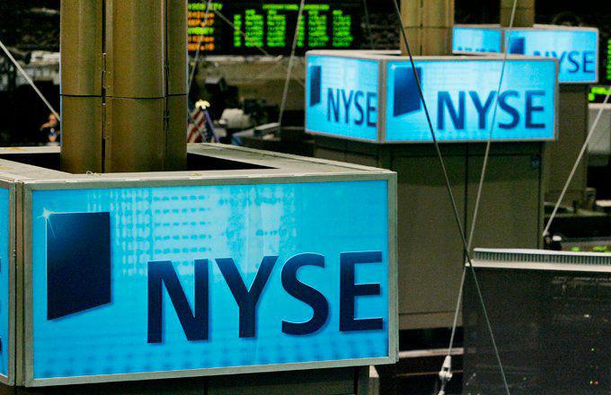

## Table of Contents

## What is an S&P 500 ETF?

An S&P 500 ETF is a type of investment fund that tracks the performance of the S&P 500 index. The S&P 500 is a list of 500 big companies in the United States, like Apple, Microsoft, and Amazon. When you buy shares of an S&P 500 ETF, you're basically buying a tiny piece of all those companies at once. This makes it easier for you to invest in a broad part of the market without having to pick individual stocks.

ETFs, or Exchange-Traded Funds, are popular because they are easy to buy and sell, just like stocks. They also have lower fees compared to many other types of funds. By investing in an S&P 500 ETF, you can spread your risk across many different companies and industries. This can help your investment grow over time, even if some companies in the index don't do well.

## Why should I invest in an S&P 500 ETF?

Investing in an S&P 500 ETF is a smart choice because it gives you a piece of the biggest and most successful companies in the U.S. all at once. Instead of trying to pick which companies might do well, you get a little bit of all of them. This means you don't have to worry about one company doing badly because the success of the others can help balance it out. It's like having a safety net for your investment.

Another reason to invest in an S&P 500 [ETF](/wiki/etf-trading-strategies) is that it's easy and usually costs less than other types of investments. You can buy and sell shares of an ETF just like you would with a stock, and the fees are typically lower than those of mutual funds. Over time, these lower fees can make a big difference in how much money you keep. Plus, because the S&P 500 has a history of growing over the long term, it's a good way to build wealth slowly and steadily.

## How do S&P 500 ETFs work?

S&P 500 ETFs work by following the performance of the S&P 500 index. The S&P 500 is a list of 500 big companies in the United States. When you buy shares of an S&P 500 ETF, you're buying a small piece of all those companies at the same time. The ETF tries to match the ups and downs of the S&P 500 index. So, if the companies in the S&P 500 do well and the index goes up, the value of your ETF shares will go up too. If the companies don't do so well and the index goes down, your ETF shares will go down as well.

To make sure the ETF matches the S&P 500, the people who manage the ETF buy and sell stocks to keep the ETF's holdings the same as the companies in the index. This is called "tracking" the index. The ETF is traded on the stock market, just like a regular stock. This means you can buy and sell shares of the ETF whenever the market is open. Because it's easy to trade and the fees are usually low, S&P 500 ETFs are a popular way for people to invest in the overall performance of the U.S. economy without having to pick individual stocks.

## What are the benefits of investing in an S&P 500 ETF?

Investing in an S&P 500 ETF is a great way to own a piece of the biggest and most successful companies in the U.S. without having to pick them yourself. When you buy shares of an S&P 500 ETF, you get a little bit of all 500 companies in the index. This spreads your risk because if one company doesn't do well, the others might help balance it out. It's like having a safety net for your investment. Plus, you don't need to be an expert in [picking](/wiki/asset-class-picking) stocks; the ETF does that for you by tracking the S&P 500.

Another big benefit is that S&P 500 ETFs are easy to buy and sell, just like regular stocks, and they usually have lower fees than other types of investments. This means you can start investing with less money and keep more of your returns over time. Because the S&P 500 has a history of growing over the long term, investing in an S&P 500 ETF can help you build wealth slowly and steadily. It's a simple and smart way to participate in the overall growth of the U.S. economy.

## What are the risks associated with S&P 500 ETFs?

Investing in an S&P 500 ETF comes with some risks. One big risk is that the whole market can go down. Even though the S&P 500 includes lots of different companies, if the overall economy is doing badly, the value of your ETF might drop too. This means you could lose money, especially if you need to sell your shares during a time when the market is low.

Another risk is that the S&P 500 can be affected by things happening all around the world. For example, if there's a big problem in another country that affects the U.S. economy, your ETF might feel the impact. Also, while ETFs usually have low fees, there are still some costs involved. These fees might seem small, but over many years, they can add up and eat into your returns.

Even though S&P 500 ETFs are designed to spread your risk by including many companies, they are not completely safe. It's important to remember that all investments have some level of risk, and the value of your ETF can go up and down. It's a good idea to think about how long you plan to keep your money invested and how much risk you're okay with before you decide to invest.

## How do I compare different S&P 500 ETFs?

When you want to compare different S&P 500 ETFs, the first thing to look at is the expense ratio. This is the fee that the ETF charges you for managing your money. A lower expense ratio means you get to keep more of your investment returns. For example, if one ETF has an expense ratio of 0.03% and another has 0.10%, the first one is cheaper and might be a better choice if all else is equal.

Another thing to consider is the tracking error. This shows how closely the ETF follows the S&P 500 index. A smaller tracking error means the ETF is doing a good job at matching the performance of the index. You can also look at the size of the ETF, which is called its assets under management (AUM). Bigger ETFs might be more stable and easier to buy and sell. Finally, think about the company that manages the ETF. Some companies have a better reputation or more experience, which might make you feel more comfortable with their products.

## What are the key factors to consider when selecting an S&P 500 ETF?

When choosing an S&P 500 ETF, the first thing to think about is the expense ratio. This is the fee the ETF charges you for managing your money. A lower expense ratio means you keep more of your investment returns. For example, if one ETF has an expense ratio of 0.03% and another has 0.10%, the first one is cheaper. Over time, these small differences can add up to a lot of money, so it's important to pick an ETF with a low expense ratio.

Another key [factor](/wiki/factor-investing) is the tracking error. This shows how closely the ETF follows the S&P 500 index. A smaller tracking error means the ETF is doing a good job at matching the performance of the index. You should also consider the size of the ETF, which is called its assets under management (AUM). Bigger ETFs might be more stable and easier to buy and sell. Lastly, think about the company that manages the ETF. Some companies have a better reputation or more experience, which might make you feel more comfortable with their products.

## How does the expense ratio impact the performance of an S&P 500 ETF?

The expense ratio is a fee that the ETF charges you for managing your money. It's like a small percentage of your investment that you have to pay each year. If the expense ratio is high, it means you're paying more in fees, which can eat into your returns over time. For example, if you invest $10,000 in an ETF with a 0.10% expense ratio, you'll pay $10 a year in fees. That might not sound like a lot, but over many years, those fees can add up and reduce the amount of money you make from your investment.

On the other hand, if the expense ratio is low, you get to keep more of your investment returns. A lower expense ratio means more of your money stays in your pocket. For instance, if you invest the same $10,000 in an ETF with a 0.03% expense ratio, you'll only pay $3 a year in fees. Over time, choosing an ETF with a lower expense ratio can make a big difference in how much your investment grows. So, when you're picking an S&P 500 ETF, it's smart to look for one with a low expense ratio to help your money grow as much as possible.

## What is the difference between a traditional S&P 500 ETF and a leveraged S&P 500 ETF?

A traditional S&P 500 ETF aims to match the performance of the S&P 500 index. When you invest in one of these ETFs, your money grows or shrinks based on how well the 500 companies in the index are doing. These ETFs are designed to be safe and steady, tracking the market's ups and downs without trying to beat it. They're popular because they're easy to understand and usually have low fees.

A leveraged S&P 500 ETF, on the other hand, tries to give you bigger gains or losses by using borrowed money or financial tricks. For example, a 2x leveraged S&P 500 ETF aims to give you twice the daily return of the S&P 500. If the index goes up 1%, your ETF might go up 2%. But if the index goes down 1%, your ETF could go down 2% too. These ETFs are riskier and meant for short-term trading, not for long-term investing like traditional ETFs.

## How can I evaluate the historical performance of an S&P 500 ETF?

To evaluate the historical performance of an S&P 500 ETF, you should look at how it has done over different time periods, like the last year, five years, or even longer. You can find this information on websites like those of the ETF providers or financial news sites. Look at the total return, which includes any dividends the ETF paid out. This gives you a better idea of how much money you would have made if you had invested in the ETF during those times. Comparing the ETF's performance to the S&P 500 index itself is also helpful because it shows you how well the ETF is tracking the index.

Another thing to consider is how the ETF has performed during different market conditions, like when the market was going up or down. This can give you an idea of how the ETF might behave in the future. You should also look at the [volatility](/wiki/volatility-trading-strategies), which tells you how much the ETF's value has gone up and down over time. Lower volatility means the ETF's value has been more stable, which might be better if you don't like taking big risks. By looking at all these factors, you can get a good sense of how the S&P 500 ETF has performed in the past and decide if it's a good fit for your investment goals.

## What are the tax implications of investing in an S&P 500 ETF?

When you invest in an S&P 500 ETF, you need to think about taxes. If you hold the ETF for more than a year before selling, any profit you make is considered a long-term capital gain. In the U.S., long-term capital gains are usually taxed at a lower rate than your regular income, which can be good for you. But if you sell your ETF shares within a year, any profit is a short-term capital gain, and that gets taxed at your regular income tax rate, which could be higher.

ETFs are also good because they often have fewer taxable events than other types of funds. This is because of how they are structured. When an ETF needs to make changes to its holdings, it can do so in a way that doesn't trigger a lot of taxes for investors. But, if the ETF pays out dividends, you'll have to pay taxes on those too. The tax rate on dividends can be different depending on whether they are qualified or non-qualified dividends. It's a good idea to talk to a tax advisor to understand all the tax rules and how they apply to your situation.

## How do I incorporate an S&P 500 ETF into my overall investment strategy?

Adding an S&P 500 ETF to your investment strategy can help you spread your money across many big companies in the U.S. without having to pick them yourself. You can think of it as the main part of your investment plan, like the foundation of a house. By putting a big part of your money into an S&P 500 ETF, you're betting on the overall growth of the U.S. economy. This can be a good idea if you want a safe and steady way to grow your money over time. Just make sure to pick an ETF with a low expense ratio so you keep more of your returns.

You can also use an S&P 500 ETF to balance out riskier investments you might have, like individual stocks or other types of funds. If you have some money in stocks that might go up and down a lot, having some in an S&P 500 ETF can help even things out. This way, if your riskier investments don't do well, the steady growth of the S&P 500 ETF might help protect your overall investment. It's like having a safety net. Just remember to think about how much risk you're okay with and how long you plan to keep your money invested before you decide how much to put into an S&P 500 ETF.

## References & Further Reading

[1]: Carrion, A. (2013). ["Very fast money: High-frequency trading on the NASDAQ."](https://www.sciencedirect.com/science/article/pii/S138641811300027X) Journal of Financial Markets, 16(4), 680-711.

[2]: Kirilenko, A. A., Kyle, A. S., Samadi, M., & Tuzun, T. (2017). ["The Flash Crash: High-Frequency Trading in an Electronic Market."](https://www.jstor.org/stable/26652722) The Journal of Finance, 72(3), 1211-1240.

[3]: Lowenstein, R. (2000). ["When Genius Failed: The Rise and Fall of Long-Term Capital Management."](https://archive.org/details/whengeniusfailed00lowe) Random House Trade Paperbacks.

[4]: Lopez de Prado, Marcos (2018). ["Advances in Financial Machine Learning."](https://www.amazon.com/Advances-Financial-Machine-Learning-Marcos/dp/1119482089) Wiley.

[5]: Jansen, Stefan (2020). ["Machine Learning for Algorithmic Trading."](https://github.com/stefan-jansen/machine-learning-for-trading) Packt Publishing.