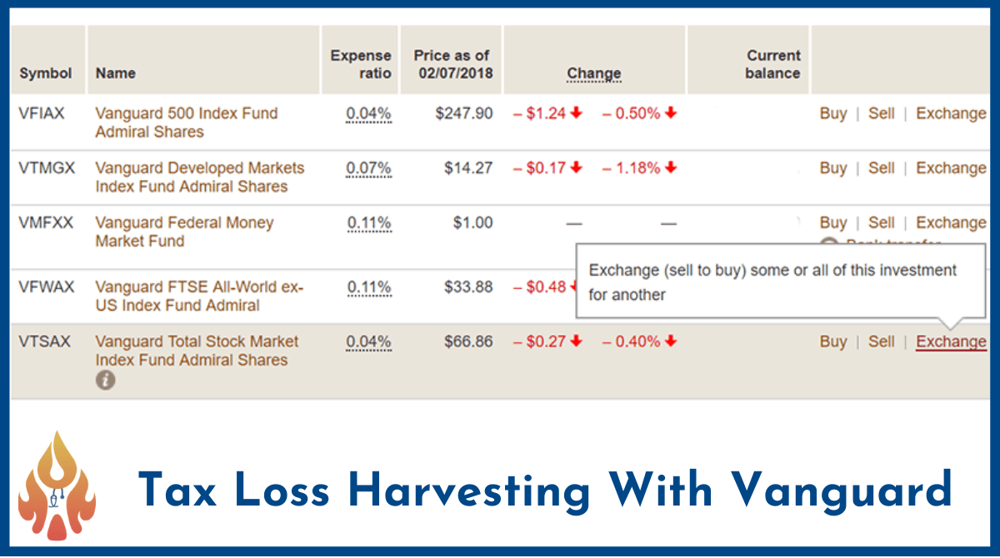

## Table of Contents

## What is tax-loss harvesting?

Tax-loss harvesting is a way to save money on taxes by selling investments that have lost value. When you sell an investment for less than you paid for it, you can use that loss to reduce the taxes you owe on other gains or income. This strategy can help you lower your tax bill and keep more of your money.

For example, if you made a profit from selling one stock, but lost money on another, you could sell the losing stock to offset the taxes on your profit. By doing this, you can reduce the amount of taxes you have to pay. It's a smart way to manage your investments and taxes at the same time.

## How does tax-loss harvesting work with ETFs?

Tax-loss harvesting with ETFs works a bit like it does with individual stocks, but it can be easier because ETFs are baskets of many stocks or other assets. If you own an ETF that has gone down in value, you can sell it at a loss. This loss can then be used to reduce the taxes you owe on other investments that have made money. For example, if you sold another ETF or stock at a profit, you could use the loss from the first ETF to lower the taxes on that profit.

The key with ETFs is that they often track an index or a specific sector, so if one [ETF](/wiki/etf-trading-strategies) in your portfolio goes down, you can usually find another similar ETF to buy right away. This is important because of the "wash-sale" rule, which says you can't buy the same or a "substantially identical" investment within 30 days before or after selling at a loss. By switching to a different but similar ETF, you can still stay invested in the market while harvesting your tax losses.

## What are the benefits of tax-loss harvesting with ETFs?

Tax-loss harvesting with ETFs can help you save money on taxes. When you sell an ETF that has lost value, you can use that loss to lower the taxes you owe on other investments that made money. This means you get to keep more of your earnings. ETFs are great for this because they often track a whole group of stocks or a specific part of the market, so it's easier to find another similar ETF to buy if you need to sell one at a loss.

Another benefit is that ETFs make it easier to avoid the wash-sale rule. This rule says you can't buy the same or a very similar investment within 30 days before or after selling at a loss. With ETFs, you can switch to a different but similar ETF and still stay invested in the market. This way, you can keep your investment strategy on track while also taking advantage of tax savings.

## What are the potential risks or downsides of tax-loss harvesting?

One risk of tax-loss harvesting is the wash-sale rule. This rule says you can't buy the same or a very similar investment within 30 days before or after selling at a loss. If you break this rule, you can't use the loss to reduce your taxes right away. You have to wait until you sell the new investment, which can be a long time. This can make tax-loss harvesting tricky and you need to be careful about when you buy and sell.

Another downside is that tax-loss harvesting can be hard to do right. You need to know a lot about taxes and investments. If you make a mistake, you might not save as much on taxes as you hoped. Also, if you sell an investment at a loss, you might miss out if that investment goes up in value later. So, you need to think carefully about whether tax-loss harvesting is worth it for you.

## How do you identify ETFs suitable for tax-loss harvesting?

To find ETFs that are good for tax-loss harvesting, you need to look at ones that have gone down in value. You can do this by checking the price of the ETF now and comparing it to what you paid for it. If the current price is lower, you can sell it at a loss and use that loss to lower your taxes. It's important to pick ETFs that you think might not go up a lot in the next 30 days because of the wash-sale rule. This rule says you can't buy the same or a very similar investment within 30 days before or after selling at a loss.

Another thing to think about is finding a similar ETF to buy after you sell the one at a loss. This way, you can stay invested in the market and not miss out on any gains. For example, if you sold an S&P 500 ETF at a loss, you could buy a different S&P 500 ETF or one that tracks a similar index. This helps you keep your investment strategy on track while also taking advantage of tax savings. It's a good idea to talk to a financial advisor to make sure you're [picking](/wiki/asset-class-picking) the right ETFs for tax-loss harvesting.

## What are the key tax rules to consider when harvesting losses with ETFs?

When you're harvesting losses with ETFs, you need to know about the wash-sale rule. This rule says you can't buy the same or a very similar ETF within 30 days before or after you sell it at a loss. If you do, you can't use that loss to lower your taxes right away. You have to wait until you sell the new ETF, which might take a long time. So, it's important to find a different but similar ETF to buy after you sell the one at a loss. This way, you can stay invested in the market and still take advantage of the tax savings.

Another key tax rule to think about is how you use the losses you harvest. You can use these losses to offset any gains you made from selling other investments. If your losses are more than your gains, you can use up to $3,000 of the extra loss to lower your regular income. Any leftover loss can be carried over to future years. This means you can keep using those losses to save on taxes in the future. It's a good idea to talk to a tax advisor to make sure you're doing everything right and getting the most out of your tax-loss harvesting strategy.

## How often should you monitor your ETF portfolio for tax-loss harvesting opportunities?

You should check your ETF portfolio for tax-loss harvesting opportunities at least once a year, usually towards the end of the year. This is because you want to use any losses to lower your taxes for that year. If you find an ETF that has lost value, you can sell it and use that loss to reduce the taxes you owe on other investments that made money.

However, it can also be good to check your portfolio more often, like every few months. The market can change a lot, and new opportunities for tax-loss harvesting might come up. By keeping an eye on your ETFs throughout the year, you can make sure you don't miss out on any chances to save on taxes. Just remember to be careful about the wash-sale rule and talk to a financial advisor if you need help.

## Can tax-loss harvesting be automated with ETFs, and if so, how?

Yes, tax-loss harvesting can be automated with ETFs. Many robo-advisors and investment platforms offer automated tax-loss harvesting services. These services use computer programs to watch your ETF portfolio all the time. If they see an ETF that has lost value, they will sell it for you and buy a similar ETF to replace it. This way, you can take advantage of tax savings without having to do the work yourself.

Automated tax-loss harvesting can save you time and help you save more money on taxes. The computer programs are good at finding the best times to sell and buy ETFs to avoid the wash-sale rule. This rule says you can't buy the same or a very similar investment within 30 days before or after selling at a loss. By letting a computer handle it, you can keep your investment strategy on track and still save on taxes without worrying about all the details.

## What is the wash-sale rule and how does it affect tax-loss harvesting with ETFs?

The wash-sale rule is a tax law that says you can't buy the same or a very similar investment within 30 days before or after you sell it at a loss. If you do, you can't use that loss to lower your taxes right away. You have to wait until you sell the new investment, which might take a long time. This rule is important to know when you're doing tax-loss harvesting because it can stop you from getting the tax savings you want.

When you're harvesting losses with ETFs, the wash-sale rule can make things tricky. If you sell an ETF at a loss, you need to find a different but similar ETF to buy right away. This way, you can stay invested in the market and still take advantage of the tax savings. By being careful about when you buy and sell ETFs, you can make sure you follow the wash-sale rule and get the most out of your tax-loss harvesting strategy.

## How do you calculate the tax savings from harvesting losses with ETFs?

To figure out how much you can save on taxes by harvesting losses with ETFs, you need to know how much money you lost when you sold the ETF. Let's say you bought an ETF for $10,000 and it's now worth $8,000. If you sell it, you have a loss of $2,000. You can use this $2,000 loss to lower the taxes you owe on other investments that made money. For example, if you made a $3,000 profit from selling another ETF, you can use the $2,000 loss to reduce the taxable profit to $1,000. This means you'll pay taxes on $1,000 instead of $3,000, which saves you money.

If your losses are more than your gains, you can use up to $3,000 of the extra loss to lower your regular income. So, if you had no gains but a $5,000 loss from selling an ETF, you could use $3,000 of that loss to reduce your taxable income for the year. Any leftover loss, like the remaining $2,000 in this case, can be carried over to future years. This means you can keep using those losses to save on taxes in the future. By understanding how to calculate these savings, you can make smart choices about when to harvest losses with your ETFs.

## What advanced strategies can be used to maximize tax-loss harvesting with ETFs?

One advanced strategy to maximize tax-loss harvesting with ETFs is to use multiple ETFs that track similar but not identical indexes. This helps you avoid the wash-sale rule because you can sell one ETF at a loss and buy another similar one right away. For example, if you sell an S&P 500 ETF at a loss, you could buy an ETF that tracks the Dow Jones Industrial Average. This way, you can keep your money invested in the market while still taking advantage of the tax savings. By carefully choosing different ETFs, you can do tax-loss harvesting more often and save more on taxes.

Another strategy is to keep an eye on your portfolio all year, not just at the end of the year. The market can change a lot, and new opportunities for tax-loss harvesting might come up. If you check your ETFs every few months, you can find losses to harvest throughout the year. This can help you save more on taxes because you can use those losses to offset gains as they happen. By being proactive and watching your portfolio closely, you can make the most of tax-loss harvesting and keep more of your money.

## How does tax-loss harvesting with ETFs fit into a broader investment strategy?

Tax-loss harvesting with ETFs can be a smart part of your overall investment plan. It helps you save money on taxes by selling ETFs that have lost value and using those losses to lower the taxes you owe on other investments that made money. This means you get to keep more of your earnings. ETFs are great for this because they track a whole group of stocks or a specific part of the market, so it's easy to find another similar ETF to buy if you need to sell one at a loss. By doing tax-loss harvesting, you can keep your investment strategy on track and still take advantage of tax savings.

Including tax-loss harvesting in your investment strategy also means you need to be careful about the wash-sale rule. This rule says you can't buy the same or a very similar investment within 30 days before or after selling at a loss. If you break this rule, you can't use the loss to reduce your taxes right away. By picking different but similar ETFs to buy after you sell one at a loss, you can stay invested in the market and still save on taxes. It's a good idea to check your ETFs throughout the year, not just at the end, so you don't miss out on any chances to save on taxes. By being proactive and watching your portfolio closely, you can make the most of tax-loss harvesting and keep more of your money.

## References & Further Reading

[1]: ["Exchange-Traded Funds and the New Dynamics of Investing"](https://academic.oup.com/book/3366) by Anita K. Krug

[2]: Bodie, Z., Kane, A., & Marcus, A. J. (2014). ["Investments."](https://www.mheducation.com/highered/product/Investments-Bodie.html) McGraw-Hill Education.

[3]: ["A Random Walk Down Wall Street: The Time-Tested Strategy for Successful Investing"](https://www.amazon.com/Random-Walk-Down-Wall-Street/dp/0393358380) by Burton G. Malkiel

[4]: Poterba, J. M., & Shoven, J. B. (2002). ["Exchange-Traded Funds: A New Investment Option for Taxable Investors."](https://economics.mit.edu/sites/default/files/publications/Exchange-Traded%20Funds%20A%20New%20Investment%20Option.pdf) NBER Working Paper Series.

[5]: ["Algorithmic Trading and DMA: An Introduction to Direct Access Trading Strategies"](https://www.amazon.com/Algorithmic-Trading-DMA-introduction-strategies/dp/0956399207) by Barry Johnson