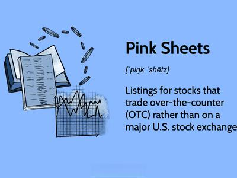

The world of stock trading offers a spectrum of opportunities catering to investors of varying expertise and objectives. Among these prospects is over-the-counter (OTC) trading, a market wherein stocks are bought and sold through a decentralized broker-dealer network, bypassing traditional centralized exchanges like the New York Stock Exchange (NYSE) or NASDAQ. This market structure provides flexibility and accessibility, particularly for securities from smaller companies that may not meet the stringent listing criteria of major exchanges. OTC trading allows for a diverse array of securities including stocks, bonds, and derivatives, thereby opening up possibilities for investors to engage with emerging companies and industries.

This article aims to serve as a comprehensive guide to navigating the OTC stock market. It will elucidate the nature of OTC stocks, detail the mechanics of trading them, and critically assess the risks and benefits associated with these investments. The discussion will further extend to the technological innovations shaping OTC markets, particularly the application of algorithms and automated trading. Such advancements offer dynamic tools for managing the unique challenges of this market, particularly in dealing with its inherent volatility and lower liquidity.



Understanding OTC markets is crucial for both seasoned investors seeking diversification and newcomers eager to explore beyond conventional stock exchanges. Through this examination, investors can identify the opportunities that align with their portfolios and risk tolerance. This knowledge is vital for making informed decisions that leverage the distinctive features of OTC markets, whether it be for long-term growth or strategic short-term gains.

## Table of Contents

## What Are Over-the-Counter (OTC) Stocks?

Over-the-counter (OTC) stocks represent a segment of the financial securities market where securities are traded via a decentralized broker-dealer network rather than through centralized exchanges like the New York Stock Exchange (NYSE) or the NASDAQ. This market structure allows for the trading of stocks of smaller companies that do not meet the stringent listing requirements and financial thresholds imposed by major exchanges. Consequently, the OTC market caters to a diverse array of securities, including but not limited to stocks, bonds, and derivatives.

A key characteristic of OTC stocks is their potential for substantial returns. This potential is often in alignment with the smaller, sometimes more innovative companies that operate within the OTC market. However, the possibility of high returns in this sphere is accompanied by heightened risks. One of the primary reasons for this increased risk is the relatively relaxed regulatory framework governing OTC markets. Unlike major exchanges which mandate stringent financial disclosure and governance standards, the OTC market operates under less rigorous oversight. This environment can lead to a lack of transparency and, thus, greater susceptibility to market manipulation and fraud.

The OTC market is stratified into different tiers, each of which imposes varying levels of disclosure and reporting requirements, providing investors with some degree of information regarding the security they intend to trade. These tiers include:

1. **OTCQX**: Often considered the highest tier of the OTC market, OTCQX listed companies typically comply with more substantial financial standards and disclose information comparable to those required on established exchanges. It's often seen as a recognition of quality within the OTC framework.

2. **OTCQB**: Known as the venture market, this tier is designed for early-stage and developing U.S. and international companies. The companies in this tier are required to provide current financial reporting and must undergo annual verification and management certification processes.

3. **Pink Sheets**: This tier represents the most speculative segment of the OTC market, often comprising stocks with minimal financial disclosure. Its companies may not meet any specific financial standards and can thus offer the least transparency.

Investors contemplating participation in the OTC market should thoroughly understand these tiers and perform diligent research to mitigate risks associated with the inherently speculative nature of OTC stocks. They must be vigilant, evaluating the credibility and financial health of companies while navigating the OTC landscape.

## How to Trade OTC Stocks

Trading over-the-counter (OTC) stocks requires establishing an account with a brokerage that provides access to the OTC markets. Many reputable brokers, such as [Interactive Brokers](/wiki/interactive-brokers-api), TD Ameritrade, and Charles Schwab, offer this service, enabling investors to participate in trading stocks that are not listed on major exchanges like the NYSE or NASDAQ.

When participating in OTC trading, investors can place trades through these brokers in a manner largely similar to trading on well-established exchanges. However, several factors must be taken into account due to the unique nature of OTC markets. 

One significant consideration is [liquidity](/wiki/liquidity-risk-premium). OTC stocks typically exhibit lower liquidity compared to those traded on prominent exchanges, which means there can be fewer shares available to buy or sell at any given time. This lower liquidity often results in wider bid-ask spreads, impacting the cost of trading and potentially the returns on investment. For instance, if the bid price is $2.00 and the ask price is $2.20, the spread is $0.20, representing a cost to the investor.

Before investing in OTC stocks, conducting thorough research and due diligence is imperative, given their speculative nature. Unlike stocks on major exchanges, OTC stocks may lack comprehensive financial reporting and regulatory oversight, which increases investment risk. Prospective investors should analyze company fundamentals, market conditions, and any available financial data.

To mitigate risks associated with OTC trading, setting strategic entry and [exit](/wiki/exit-strategy) points is advisable. Determining at what price you intend to enter (buy) and exit (sell) a trade can help manage potential losses and optimize gains. For example, a trader may set an entry point based on technical analysis indicators, ensuring that the stock demonstrates a certain trading pattern or reaches a specific price level before buying. Exit points can be aligned with target profit margins or set stop-loss orders to limit potential losses if the stock price declines.

Overall, while OTC markets present opportunities distinct from traditional exchanges, the complexity and risks necessitate a careful and informed approach to trading.

## The Risks and Rewards of OTC Trading

While the potential for high returns in OTC (Over-the-Counter) trading can be enticing, the associated risks must not be underestimated. OTC markets are characterized by less regulatory oversight compared to major exchanges, such as the NYSE or NASDAQ, which increases vulnerability to fraudulent activities. Among the most common frauds is the pump-and-dump scheme. In such schemes, the price of a stock is artificially inflated through misleading or exaggerated statements, attracting unsuspecting investors. Once the price is driven up, the fraudsters sell their shares, leaving the majority with devalued stocks.

OTC stocks typically exhibit high [volatility](/wiki/volatility-trading-strategies) and low liquidity. High volatility means that prices can change rapidly in a very short period, often without significant [volume](/wiki/volume-trading-strategy). Low liquidity implies that there are fewer buyers and sellers, making it challenging to execute trades at desired prices. This environment can widen the bid-ask spread, leading investors to potentially buy at higher prices and sell at lower prices than intended.

Despite these challenges, OTC markets offer investment opportunities in promising small-cap companies. These are often newly emerging companies with potential for substantial growth. For investors with a well-researched approach, the rewards can be considerable. However, this potential comes with the caveat of increased risk due to the speculative nature of many OTC-listed firms.

Investors should employ diversification strategies to mitigate such risks. Diversification involves spreading investments across various asset classes, industries, and geographical regions to reduce exposure to any single investment's adverse performance. A diversified portfolio might include a mix of OTC stocks and securities from major exchanges, bonds, and other investment vehicles.

Consulting with financial advisors can also be beneficial for managing the inherent risks of OTC trading. Professional advisors can offer guidance on portfolio management, risk assessment, and strategies tailored to individual investment goals and risk tolerance. By emphasizing thorough research, strategic diversification, and prudent advice, investors can navigate the complexities of the OTC market while maximizing their potential for returns.

## Algorithmic Trading in the OTC Market

Algorithmic trading involves the use of computer programs to execute trades based on pre-established criteria and can be effectively applied in the over-the-counter (OTC) market. This technology offers several advantages, notably speed and precision, allowing for rapid execution of trades in a market characterized by high volatility and low liquidity. By minimizing the delay associated with human decision-making, [algorithmic trading](/wiki/algorithmic-trading) can capitalize on fleeting market opportunities and fluctuating prices.

Automated trading systems are designed to manage the complexities of OTC trading by analyzing vast datasets to predict market movements. These systems leverage statistical models and [machine learning](/wiki/machine-learning) algorithms to identify trends and execute trades accordingly. For instance, a basic algorithm might use moving averages to determine buy or sell signals. A simple example in Python might involve the calculation of a moving average crossover:

```python
import pandas as pd

def moving_average_strategy(prices, short_window, long_window):
    short_ma = prices.rolling(window=short_window, min_periods=1).mean()
    long_ma = prices.rolling(window=long_window, min_periods=1).mean()

    signals = pd.DataFrame(index=prices.index)
    signals['signal'] = 0.0
    signals['signal'][short_window:] = np.where(short_ma[short_window:] > long_ma[short_window:], 1.0, -1.0)

    return signals

prices = pd.Series([100, 102, 104, 103, 108, 105, 107])
signals = moving_average_strategy(prices, 2, 4)
print(signals)
```

While these systems provide significant benefits, they also require a deeper understanding of both trading algorithms and the unique characteristics of OTC markets. The OTC market is less regulated than centralized exchanges, which can introduce additional challenges such as price discrepancies and limited transparency. Therefore, investors must ensure they have a robust understanding of the market dynamics and the technical aspects of the trading systems they employ.

For investors interested in algorithmic trading, collaboration with specialists is often beneficial. Programmers with expertise in financial mathematics and data science can assist in developing customized algorithms tailored to specific trading strategies. Alternatively, investors might consider utilizing third-party firms that specialize in automated trading solutions, offering a turnkey approach to deploying algorithms in the OTC market.

By integrating algorithmic trading into their strategies, investors can potentially enhance the efficiency and effectiveness of their trading operations in the OTC market. However, it remains critical to continuously monitor and refine algorithms to adapt to changing market conditions, ensuring ongoing alignment with personal investment objectives and risk tolerances.

## Conclusion

Over-the-counter (OTC) markets present investment opportunities distinct from those available in traditional stock exchanges, providing avenues for potentially high-profit investments. The flexibility of OTC markets enables access to a wide range of securities, often representing smaller or emerging companies that might not qualify for listing on major exchanges. This diversification potential can be appealing, but it necessitates a comprehensive approach to risk management. Due diligence becomes paramount in the OTC environment due to its inherent risk factors, such as lower liquidity and less regulatory oversight compared to traditional exchanges. Developing robust trading strategies is essential to navigate these challenges effectively.

Integrating modern technology, particularly algorithmic trading, can enhance one's ability to compete in the OTC market. Algorithmic systems process vast amounts of data swiftly, allowing investors to manage trades with precision and potentially capitalize on market volatility. For those considering this approach, a solid understanding of the underlying technology and collaboration with tech experts may be beneficial.

As with any investment decision, aligning trading activities with individual financial goals and risk tolerance is crucial. Investors should conduct thorough self-assessment to define these parameters clearly. By gaining a nuanced understanding of OTC markets and applying careful strategic planning, investors can make well-informed decisions that align with their broader investment objectives. Balancing potential gains with mindful risk management can lead to a rewarding investment experience in the OTC landscape.

## References & Further Reading

[1]: ["Advances in Financial Machine Learning"](https://www.amazon.com/Advances-Financial-Machine-Learning-Marcos/dp/1119482089) by Marcos Lopez de Prado

[2]: ["Evidence-Based Technical Analysis: Applying the Scientific Method and Statistical Inference to Trading Signals"](https://www.amazon.com/Evidence-Based-Technical-Analysis-Scientific-Statistical/dp/0470008741) by David Aronson

[3]: ["Machine Learning for Algorithmic Trading"](https://github.com/PacktPublishing/Machine-Learning-for-Algorithmic-Trading-Second-Edition) by Stefan Jansen

[4]: ["Quantitative Trading: How to Build Your Own Algorithmic Trading Business"](https://books.google.com/books/about/Quantitative_Trading.html?id=j70yEAAAQBAJ) by Ernest P. Chan

[5]: Securities and Exchange Commission. ["OTC Trading."](https://www.sec.gov/about/divisions-offices/division-trading-markets/over-counter-market)

[6]: Financial Industry Regulatory Authority. ["Understanding the Risks of Trading Penny Stocks."](https://www.finra.org/investors/insights/regulated-by-FINRA)