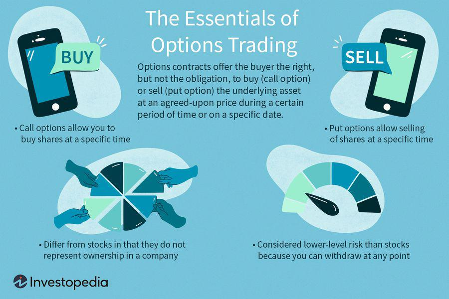

Investing in stocks can offer significant financial rewards, presenting an exciting opportunity for individuals looking to grow their wealth. Despite its potential, the stock market can also appear daunting to beginners, filled with complex terminology and volatile movements that may deter new investors from participating. This guide serves as a foundational resource aimed at demystifying stock market intricacies, providing practical advice to help newcomers make informed decisions with confidence.

Embarking on a stock investing journey involves understanding not only the strategies for buying and selling but also the broader principles that govern the market. From the fundamental techniques of purchasing stocks to more advanced topics such as algorithmic trading, this guide is crafted to ensure a comprehensive grasp of the essential elements necessary for successful investing. Our goal is to equip you with the knowledge to navigate the stock market effectively, emphasizing risk reduction and maximizing potential returns.



By exploring these topics, you will gain clarity on how to commence your investment activities wisely. Each section of this guide is curated to enhance your understanding and build your confidence, ultimately transforming the perceived complexity of stock investing into an accessible avenue for achieving financial growth.

## Table of Contents

## Understanding the Basics of the Stock Market

The stock market is a complex yet captivating financial domain where shares of publicly-listed companies are bought, sold, and issued. It encompasses various markets and exchanges, such as the New York Stock Exchange (NYSE) and NASDAQ, which facilitate these transactions. The primary purpose of the stock market is to provide companies with the means to raise capital by issuing shares to investors, while simultaneously offering investors opportunities to own a portion of the company and potentially benefit from its growth and success.

Key participants in the stock market include investors, stock brokers, traders, and financial institutions, each contributing uniquely to the market's functionality. Investors can be individuals or institutions aiming to purchase shares to achieve investment goals, such as portfolio diversification or capital appreciation. Stock brokers act as intermediaries between investors and the stock exchanges, executing buy and sell orders on behalf of their clients. Traders, who can be professionals or individual investors, actively buy and sell stocks to capitalize on short-term market movements. Financial institutions such as mutual funds, pension funds, and hedge funds play a significant role by managing large sums of money and influencing market liquidity and stock prices.

Stocks, or equities, represent fractional ownership in a company. When investors purchase a company's stock, they acquire a claim on part of its assets and earnings, proportional to the number of shares owned. This ownership grants shareholders the potential to profit from dividends and price appreciation but also exposes them to risks if the company's performance declines. Understanding the basics of stocks and their role in the market helps mitigate initial apprehension, empowering investors to make informed decisions.

Moreover, stock prices are influenced by a variety of factors, including company performance, economic indicators, market sentiment, and geopolitical events. Supply and demand dynamics dominate the stock market, determining the price at which stocks trade. When demand for a stock exceeds supply, prices rise, whereas an oversupply of shares leads to a price decline. This volatile nature of the stock market underscores the importance of thorough research and careful analysis before making investment decisions.

For beginners, familiarity with basic stock market concepts is vital to navigating this dynamic environment successfully. By comprehending the roles of different market participants and the fundamentals of stock ownership, investors can approach stock market investing with greater confidence and reduced anxiety.

## Essential Tips for Beginner Investors

Investing in the stock market can seem daunting for beginners, but adopting the right strategies can mitigate risks and set the foundation for success. Here are essential tips to guide novice investors:

1. **Start Small**: It's prudent to begin with a modest investment, allowing you to familiarize yourself with market dynamics and trading platforms without committing significant capital. This approach not only minimizes potential losses but also helps build confidence and knowledge over time. Starting small also creates a buffer against impulsive decisions when acclimating to the market’s fluctuations.

2. **Diversification Is Key**: Diversifying your investment portfolio by spreading investments across different sectors and asset classes can help reduce risk. Diversification ensures that poor performance in one area is offset by stronger performance in another. For instance, consider investing in a mix of stocks, bonds, and mutual funds. This diversification can be mathematically represented by portfolio variance:
$$
   \sigma^2_p = \left(\sum_{i=1}^{n} w_i^2 \sigma_i^2\right) + \sum_{i=1}^{n}\sum_{j\neq i}^{n} w_i w_j \sigma_i \sigma_j \rho_{ij}

$$

   Here, $w_i$ and $w_j$ are the portfolio weights of assets $i$ and $j$, $\sigma_i$ and $\sigma_j$ are their standard deviations, and $\rho_{ij}$ is the correlation between the returns of assets $i$ and $j$.

3. **Avoid Emotional Investing**: Emotional decisions can lead to poor investment outcomes. It's critical to base investment choices on thorough research and analysis rather than gut feelings or market hype. By maintaining a disciplined approach, investors can better withstand market volatility and avoid panic selling during downturns.

4. **Educate Yourself Continuously**: The stock market is constantly evolving. Staying up to date with market trends, economic indicators, and global events is vital for making informed decisions. Regularly reading financial news, attending webinars, and utilizing resources like online courses can enhance your understanding and adapt your strategies accordingly. 

These foundational tips can help beginners build a robust framework for investment, allowing them to navigate the stock market with greater confidence and competence. By adhering to a strategy that emphasizes starting small, diversifying investments, minimizing emotional influence, and continuous education, investors can optimize their potential for success in the long run.

## How to Buy Stocks: A Step-by-Step Guide

To purchase stocks, follow this structured approach to ensure informed decision-making and effective portfolio management.

**Open a Brokerage Account:** The first step in stock investment is to establish a brokerage account. Select a brokerage firm that resonates with your investment objectives and offers intuitive tools. Consider aspects such as commission fees, trading platforms, customer service, and educational resources. Companies like Charles Schwab, Fidelity, and E*TRADE are popular choices among investors, offering platforms that cater to both beginners and experienced traders.

**Research Stocks:** Before purchasing stocks, comprehensively research your potential investments. Utilize various resources, including financial news outlets, analyst reports, and the company's financial statements. Key financial documents like the income statement, balance sheet, and cash flow statement provide critical insights into a company's performance. For instance, a company's Price-Earnings (P/E) ratio and its Earnings Per Share (EPS) are fundamental metrics that can indicate financial health and market valuation.

**Place Your Order:** With a brokerage account and thorough research at hand, it's time to execute trades. Decide between a market order, which buys or sells the stock immediately at the current market price, or a limit order, which sets specific criteria for the transaction, such as a minimum sale price or maximum purchase price. Limit orders can offer more control over the purchasing process, especially during periods of market volatility, by ensuring that trades occur at a desired price point.

**Review Performance:** After purchasing stocks, continuously review the performance of your investments against market indices like the S&P 500 or Dow Jones Industrial Average. This practice helps assess whether your portfolio is performing as expected or needs rebalancing. Utilize the brokerage platform's analytical tools to track performance metrics and make data-driven adjustments to your investment strategy as necessary.

In summary, buying stocks involves opening a brokerage account, undertaking thorough research, strategically placing orders, and routinely reviewing investment performance. This disciplined approach helps not only in navigating the complexities of the stock market but also in optimizing investment outcomes.

## Exploring Algorithmic Trading for Beginners

Algorithmic trading, sometimes referred to as algo trading, utilizes computer programs to make buy and sell decisions in financial markets. These programs operate based on predefined criteria, such as timing, price, quantity, or any mathematical model. The key advantage of [algorithmic trading](/wiki/algorithmic-trading) is its ability to execute orders more rapidly and systematically than human traders, potentially capitalizing on minuscule price movements in highly liquid markets.

One of the primary benefits of algorithmic trading is its capacity to remove emotion from the trading process. By relying on computers to make split-second decisions based on established rules, traders can avoid emotionally-driven errors often experienced during market upheavals. This is particularly advantageous when markets are volatile, as it enables consistent strategy execution without deviation.

For beginners interested in algorithmic trading, there's no need for extensive programming skills. Several platforms, such as Surmount, provide user-friendly interfaces and tools that simplify the creation of algorithms. These platforms often include modules for [backtesting](/wiki/backtesting)—an essential process where new strategies are tested on historical data to assess potential effectiveness without risking real capital.

A simple example of an algorithmic trading strategy is a moving average crossover strategy. This strategy uses two moving averages—a short-term and a long-term average. The primary rule might be to buy when the short-term average crosses above the long-term average and sell when the opposite occurs. In Python, such a strategy could be implemented as follows:

```python
import pandas as pd

# Suppose 'data' is a DataFrame with a 'close' column for closing prices
short_window = 40
long_window = 100

data['short_mavg'] = data['close'].rolling(window=short_window, min_periods=1).mean()
data['long_mavg'] = data['close'].rolling(window=long_window, min_periods=1).mean()

# Generate signals
data['signal'] = 0.0
data['signal'][short_window:] = np.where(data['short_mavg'][short_window:] > data['long_mavg'][short_window:], 1.0, 0.0)

# Calculate positions
data['positions'] = data['signal'].diff()
```

This script calculates the short and long moving averages and generates trading signals based on their crossovers. Importantly, it demonstrates how mathematical models and historical data can be utilized to automate the decision-making process in trading.

Despite its advantages, algorithmic trading is not without challenges. For instance, technical glitches can occur, leading to unintended consequences if not properly managed. Thus, having a robust risk management strategy is essential. Tools such as stop-loss orders and real-time monitoring systems can help mitigate these risks.

In summary, algorithmic trading offers beginners an opportunity to engage in systematic and unemotional trading with relative ease due to platforms designed with user-friendly interfaces. While introductory programming or mathematical skills can be beneficial, they are not strictly necessary, opening the field to a broader range of aspiring investors.

## Risks and Challenges

Market [volatility](/wiki/volatility-trading-strategies) is one of the most significant risks associated with stock investing. Prices of stocks can fluctuate dramatically due to changes in market conditions, economic indicators, geopolitical events, or company-specific news. This volatility can lead to substantial losses if not managed appropriately. For instance, a stock may suddenly lose a significant portion of its value due to an unexpected financial report, even if the broader market remains stable. 

Overconfidence is another common risk for beginner investors. After a few successful trades, one might develop an inflated sense of skill and knowledge, leading to riskier decisions. This psychological bias can cause investors to ignore market analysis and fundamentals, leading to severe financial repercussions. Relying solely on past performance without thorough research may result in overlooking upcoming market declines or sector-specific downturns.

Technical glitches represent a distinct risk, particularly with the advent of algorithmic trading. While these computer-driven trades can enhance speed and efficiency, they also introduce the potential for system failures or erroneous transactions. For example, a programming error in the trading algorithm might execute trades at incorrect prices, leading to unexpected financial losses. Such events have occurred historically, with the Flash Crash of 2010 being a notable example where rapid stock selling was triggered by automated trading systems.

A comprehensive risk management strategy is essential to mitigate these challenges. Implementation of stop-loss orders is a practical approach to manage market volatility and potential losses. A stop-loss order allows an investor to set a predetermined price point at which a stock is automatically sold, limiting the loss on a position. Here is a simple Python example illustrating a basic stop-loss order:

```python
def execute_stop_loss(current_price, stop_loss_price):
    if current_price <= stop_loss_price:
        print("Stop-loss triggered. Selling stock.")
    else:
        print("Stock is within safe range.")

# Example usage
current_stock_price = 95  # Current market price of the stock
stop_loss_price = 100     # Predefined stop-loss price

execute_stop_loss(current_stock_price, stop_loss_price)
```

In conclusion, awareness of these potential risks enables investors to adopt proactive strategies, like diversification, technical analysis, and maintaining awareness of external factors that can impact market conditions. Staying informed and applying disciplined investing tactics contributes significantly to achieving long-term financial goals while minimizing potential pitfalls.

## Long-Term Investment Strategies

Long-term investment strategies are fundamental for investors seeking to build substantial wealth over time while managing risk. One popular strategy is value investing, which involves identifying stocks that are undervalued by the market. Investors in value stocks look for companies with strong fundamentals, such as consistent earnings, healthy financial statements, and potential for growth. This approach assumes that the market will eventually recognize the true value of these companies, leading to stock price appreciation.

Income investing is another strategy, focusing on purchasing stocks that deliver consistent dividends or fixed income. This can provide a steady income stream for investors, making it particularly attractive for those in or approaching retirement. Companies that pay dividends are often well-established and financially stable, offering lower risk compared to high-[growth stocks](/wiki/growth-stocks). Additionally, reinvesting dividends can compound returns over time.

Passive investing through index funds or Exchange Traded Funds (ETFs) represents a more cost-effective and lower-effort strategy. By investing in a diversified collection of stocks reflective of a specific index, such as the S&P 500, investors can achieve broad market exposure. This method reduces the need for active stock selection and management, as the funds automatically adjust to track the performance of their respective indices. Over the long term, passive investments have historically performed well, often outperforming actively managed funds due to lower fees and broader market exposure.

These strategies require a focus on the long term, with investors often holding positions for years to capitalize on compound growth. It is important to remain patient and disciplined, avoiding the temptation to make frequent trades based on short-term market fluctuations.

## Conclusion

Investing in stocks provides a range of opportunities for financial growth and wealth accumulation. However, to capitalize on these opportunities effectively, it requires a considered approach and a commitment to continuous learning. Building a strong foundation is essential; understanding basic principles of the stock market helps in mitigating risks and makes for informed decision-making. As one becomes more comfortable with the investment landscape, exploring advanced strategies becomes feasible, enhancing both expertise and potential returns.

Choosing a suitable method of investing can significantly impact success. For beginners inclined towards individual stocks, gaining confidence in analyzing financial statements and market trends is crucial. Alternatively, those favoring a more automated approach may opt for robo-advisors or algorithmic trading, which can offer the advantages of disciplined strategy execution without the emotional biases that often accompany manual trading. Each approach presents its unique benefits and risks, making it important for investors to assess which aligns best with their financial goals and risk tolerance.

Ongoing education is a vital component of successful investing. The stock market is dynamic, with continual shifts influenced by economic indicators, geopolitical events, and corporate developments. Staying informed requires diligence, through reading financial news, attending seminars, or participating in investment forums. Patience is another key attribute; stock market investing is typically a long-term endeavor. Building wealth through stock investments often resembles a marathon rather than a sprint, necessitating endurance and strategic pacing to navigate through periods of volatility and downturns.

In summary, stock investing can be both rewarding and challenging. With patience, perseverance, and a thirst for knowledge, investors can harness the potential of the stock market to achieve their financial ambitions while managing and mitigating inherent risks.

## References & Further Reading

[1]: ["The Intelligent Investor"](https://en.wikipedia.org/wiki/The_Intelligent_Investor) by Benjamin Graham

[2]: ["A Random Walk Down Wall Street: The Time-Tested Strategy for Successful Investing"](https://www.amazon.com/Random-Walk-Down-Wall-Street/dp/0393358380) by Burton G. Malkiel

[3]: ["Algorithmic Trading: Winning Strategies and Their Rationale"](https://books.google.com/books/about/Algorithmic_Trading.html?id=WAlFDwAAQBAJ) by Ernest P. Chan

[4]: ["Technical Analysis of the Financial Markets: A Comprehensive Guide to Trading Methods and Applications"](https://www.amazon.com/Technical-Analysis-Financial-Markets-Comprehensive/dp/0735200661) by John J. Murphy

[5]: ["Common Stocks and Uncommon Profits and Other Writings"](https://www.amazon.com/Common-Stocks-Uncommon-Profits-Writings/dp/0471445509) by Philip A. Fisher

[6]: ["Stocks for the Long Run: The Definitive Guide to Financial Market Returns & Long-Term Investment Strategies"](https://www.amazon.com/Stocks-Long-Run-Definitive-Investment-ebook/dp/B09ZDK7T2G) by Jeremy J. Siegel

[7]: ["Market Volatility"](https://www.investopedia.com/terms/v/volatility.asp) by Robert J. Shiller

[8]: ["The Little Book of Common Sense Investing: The Only Way to Guarantee Your Fair Share of Stock Market Returns"](https://www.amazon.com/Little-Book-Common-Sense-Investing/dp/1119404509) by John C. Bogle