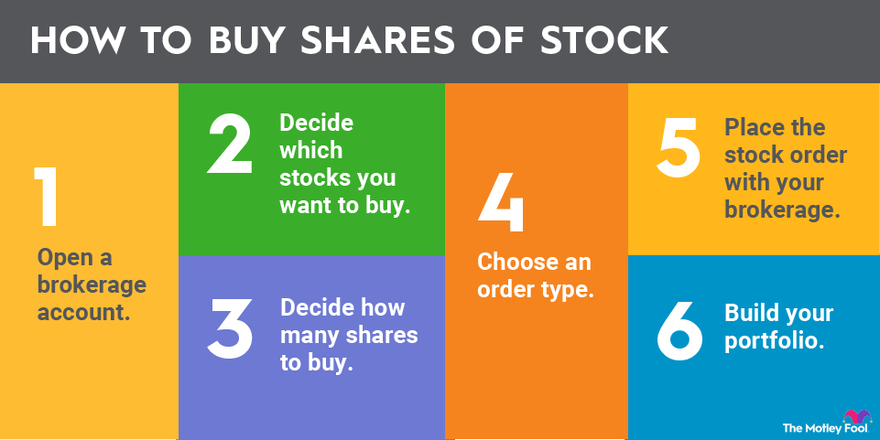

## Table of Contents

## What are stocks and why should someone consider buying them?

Stocks are pieces of ownership in a company. When you buy a stock, you are buying a small part of that company. The price of a stock can go up or down based on how well the company is doing and what people think about it. If the company does well, the stock price usually goes up, and if the company does poorly, the stock price usually goes down.

People might want to buy stocks because they can make money in two ways. First, if the stock price goes up, they can sell the stock for more than they paid for it. This is called a capital gain. Second, some companies pay their shareholders money regularly, which is called a dividend. By buying stocks, people can also spread out their money across different companies and industries, which can help reduce risk. Over time, investing in stocks has often been a good way to grow money, even though it can be risky in the short term.

## How do I start investing in stocks as a beginner?

To start investing in stocks as a beginner, you first need to open a brokerage account. A brokerage account is like a special bank account where you can buy and sell stocks. You can choose from many different brokers, like Robinhood, E*TRADE, or Charles Schwab. When picking a broker, think about things like how much it costs to trade, how easy the app or website is to use, and what kind of help they offer for new investors. Once you have your account set up, you'll need to add money to it so you can start buying stocks.

After you have your account ready and some money in it, the next step is to decide which stocks to buy. As a beginner, it's a good idea to start with companies you know and trust. You can also look at something called an index fund, which is a type of investment that includes a lot of different stocks all at once. This can help spread out your risk. When you're ready to buy, you can use your broker's app or website to place an order. Remember, investing in stocks can be risky, so it's important to only invest money you can afford to lose and to keep learning as you go.

## What are the different types of stocks available for investment?

There are mainly two types of stocks: common stocks and preferred stocks. Common stocks are the most common type that people buy. When you own common stocks, you get to vote on big company decisions and you can make money if the stock price goes up or if the company pays dividends. Preferred stocks are different because they usually don't let you vote, but they often pay a fixed dividend. This means you get paid before common stockholders if the company decides to share its profits.

Stocks can also be divided into different categories based on the size of the company and how fast it is growing. Large-cap stocks are from big, well-known companies that are usually more stable. Mid-cap stocks come from medium-sized companies that might grow faster but are a bit riskier. Small-cap stocks are from smaller companies that can grow a lot but are also the riskiest. There are also growth stocks, which are from companies that are growing quickly and might not pay dividends, and value stocks, which are from companies that might be undervalued and could be a good deal.

Understanding these types of stocks can help you make better choices when you're picking which ones to buy. Each type has its own risks and rewards, so it's important to think about what fits best with your goals and how much risk you're willing to take.

## How do I choose the right stocks to invest in?

Choosing the right stocks to invest in can feel hard, but it's easier if you know what to look for. Start by thinking about what you want from your investment. Are you looking for quick growth, or do you want steady income from dividends? Once you know your goals, look at different companies. Pick ones you know and trust, or ones that have a good track record. You can also look at things like how much money the company makes, how fast it's growing, and if it has a lot of debt. These things can help you figure out if a stock is a good choice for you.

Another way to choose stocks is to look at what other people think. You can read reports from experts or see what stocks big investors are buying. But remember, just because someone else thinks a stock is good doesn't mean it's right for you. Always do your own research too. It's also a good idea to spread your money across different stocks and types of companies. This way, if one stock goes down, you won't lose all your money. Over time, as you learn more, you'll get better at picking stocks that fit your goals and how much risk you're okay with.

## What is the difference between individual stocks and stock mutual funds or ETFs?

When you buy individual stocks, you are buying a piece of one specific company. If you buy stock in Apple, for example, you own a small part of Apple. The price of your investment goes up or down based on how well Apple is doing. This can be risky because if Apple does badly, you could lose a lot of money. But if Apple does well, you could make a lot of money too. Picking individual stocks means you have to do a lot of research to find the right companies to invest in.

Stock mutual funds and ETFs, on the other hand, are different because they hold many different stocks all at once. When you buy a share of a mutual fund or an ETF, you are buying a small piece of all the stocks in that fund. This spreads out your risk because if one company in the fund does badly, it won't hurt your investment as much. Mutual funds are usually managed by professionals who pick the stocks for you, while ETFs often try to match the performance of a specific index, like the S&P 500. Both can be a good way to invest in the stock market without having to pick individual stocks yourself.

## How important is diversification in a stock portfolio?

Diversification is very important in a stock portfolio because it helps to spread out risk. When you put all your money into just one or a few stocks, you could lose a lot if those companies do badly. But if you spread your money across many different stocks, some might go down but others might go up. This way, the good ones can help balance out the bad ones, making your overall investment safer.

Diversification doesn't just mean buying different stocks, though. It's also good to invest in different types of companies and industries. For example, you might want to have some stocks from big, stable companies, some from smaller, faster-growing ones, and some from different sectors like technology, healthcare, and energy. This way, if one industry has a tough time, your whole portfolio won't be affected as much. By diversifying, you give yourself a better chance of doing well over time, even if some parts of the market don't do as well.

## What are the common strategies for stock trading (e.g., day trading, swing trading, long-term investing)?

There are different ways to trade stocks, and each way has its own style and goals. Day trading is when you buy and sell stocks in the same day, trying to make money from small changes in the stock's price. Day traders need to watch the market closely all day and make quick decisions. It can be exciting but also risky because the stock market can be unpredictable in the short term. Swing trading is another way, where you hold onto stocks for a few days or weeks, trying to catch bigger price moves. Swing traders look for patterns in the stock's price and try to buy low and sell high over a short period.

Long-term investing is a different approach where you buy stocks and hold them for many years. The idea is to pick good companies and let them grow over time. Long-term investors don't worry too much about daily price changes. They believe that over many years, the stock market goes up, and good companies will do well. This way of investing is often seen as less risky than day trading or swing trading because it focuses on the long-term growth of the company, rather than trying to guess short-term price changes.

Each of these strategies has its own pros and cons. Day trading and swing trading can make money quickly but need a lot of time and skill. Long-term investing might not make you rich overnight, but it can be simpler and less stressful. It's important to choose a strategy that fits your goals, how much time you can spend, and how much risk you're okay with.

## How do I analyze a company's financial health before buying its stock?

To analyze a company's financial health before buying its stock, start by looking at its financial statements. These include the income statement, balance sheet, and cash flow statement. The income statement shows how much money the company made and spent over a period of time. You want to see if the company is making more money than it's spending, which is called a profit. The balance sheet shows what the company owns and owes at a specific time. Look for a strong balance sheet with more assets than liabilities. The cash flow statement tells you how much cash is coming in and going out. A company with good cash flow can pay its bills and invest in growth.

Next, look at some key financial ratios to get a better picture of the company's health. The price-to-earnings (P/E) ratio compares the stock's price to how much money the company makes. A lower P/E might mean the stock is a good deal, but it's important to compare it to other companies in the same industry. The debt-to-equity ratio shows how much the company is borrowing compared to what the owners have put in. A high ratio can mean more risk. The return on equity (ROE) tells you how well the company is using the money shareholders have invested. A higher ROE is usually better. By looking at these statements and ratios, you can get a good idea of whether a company is a smart investment.

## What are the tax implications of buying and selling stocks?

When you buy and sell stocks, you need to think about taxes. If you make money from selling a stock for more than you paid for it, that's called a capital gain. The tax you pay on this gain depends on how long you held the stock. If you held it for less than a year, it's a short-term capital gain, and you'll pay your regular income tax rate on it. If you held it for more than a year, it's a long-term capital gain, and you'll pay a lower tax rate, which can be 0%, 15%, or 20%, depending on your income.

Another thing to think about is dividends. Some companies pay their shareholders money regularly, and this is called a dividend. The tax you pay on dividends also depends on how long you've held the stock. If you've held it for more than 60 days during the 121-day period that begins 60 days before the ex-dividend date, you'll pay the lower long-term capital gains tax rate on your dividends. If you haven't held it that long, you'll pay your regular income tax rate. It's important to keep track of these things because they can affect how much money you keep after taxes.

## How can I use technical analysis to make informed stock buying decisions?

Technical analysis is a way to look at stock prices and try to guess where they might go next. It uses charts and other tools to find patterns in how the stock's price has moved in the past. People who use technical analysis look at things like moving averages, which smooth out the price over time, and support and resistance levels, which are prices where the stock often stops going down or up. They also use indicators like the Relative Strength Index (RSI) to see if a stock is overbought or oversold. By studying these patterns and indicators, you can try to find good times to buy or sell a stock.

Using technical analysis can help you make better decisions about when to buy or sell stocks. For example, if you see that a stock's price is bouncing off a support level and the RSI shows it's not overbought, you might decide it's a good time to buy. On the other hand, if the stock's price is hitting a resistance level and the RSI shows it's overbought, you might think about selling. Technical analysis isn't perfect, and it doesn't work all the time, but it can give you more information to help you make smarter choices.

## What are the risks associated with stock market investments and how can they be mitigated?

Investing in the stock market can be risky because stock prices can go up and down a lot. Sometimes, the whole market can drop suddenly, which is called a market crash. If you buy a stock and the company does badly, the stock price can go down, and you might lose money. Even if you spread your money across different stocks, there's still a chance that many of them could go down at the same time. Also, if you need your money quickly and the market is down, you might have to sell your stocks for less than you paid for them.

To make these risks smaller, you can do a few things. One way is to spread your money across different types of investments, not just stocks. This is called diversification. By having some money in stocks, some in bonds, and maybe some in other things like real estate, you can lower the chance that all your money will go down at once. Another way is to think about how long you can leave your money in the market. If you can wait for many years, you might be able to ride out the ups and downs and still make money in the end. Also, doing a lot of research and picking good companies to invest in can help you make smarter choices and lower your risk.

## How do advanced investors use options and futures to enhance their stock investment strategies?

Advanced investors use options and futures to make their stock investment strategies better and to manage risk. Options are like a special kind of contract that gives you the right, but not the obligation, to buy or sell a stock at a certain price before a certain date. For example, if you think a stock's price will go up, you can buy a call option, which lets you buy the stock at a lower price later. If you think the stock's price will go down, you can buy a put option, which lets you sell the stock at a higher price later. By using options, investors can make money from small changes in stock prices without having to buy the stock itself. They can also use options to protect their investments, like buying a put option to limit how much they could lose if the stock's price goes down.

Futures are another tool that advanced investors use. A future is a contract to buy or sell something, like a stock or a commodity, at a set price on a specific date in the future. Investors use futures to guess where the market is going and to protect themselves from big price changes. For example, if an investor thinks the price of a stock will go up, they can buy a future contract for that stock. If the price does go up, they can make money from the difference between the price they agreed on and the higher market price. Futures can be risky because they require you to put up money upfront, called margin, and you could lose that money if the market moves against you. But they can also help investors manage risk and make money in different market conditions.

## What are essential tips for beginner investors?

Investing in the stock market can seem daunting for beginners, but adopting the right strategies can mitigate risks and set the foundation for success. Here are essential tips to guide novice investors:

1. **Start Small**: It's prudent to begin with a modest investment, allowing you to familiarize yourself with market dynamics and trading platforms without committing significant capital. This approach not only minimizes potential losses but also helps build confidence and knowledge over time. Starting small also creates a buffer against impulsive decisions when acclimating to the market’s fluctuations.

2. **Diversification Is Key**: Diversifying your investment portfolio by spreading investments across different sectors and asset classes can help reduce risk. Diversification ensures that poor performance in one area is offset by stronger performance in another. For instance, consider investing in a mix of stocks, bonds, and mutual funds. This diversification can be mathematically represented by portfolio variance:
$$
   \sigma^2_p = \left(\sum_{i=1}^{n} w_i^2 \sigma_i^2\right) + \sum_{i=1}^{n}\sum_{j\neq i}^{n} w_i w_j \sigma_i \sigma_j \rho_{ij}

$$

   Here, $w_i$ and $w_j$ are the portfolio weights of assets $i$ and $j$, $\sigma_i$ and $\sigma_j$ are their standard deviations, and $\rho_{ij}$ is the correlation between the returns of assets $i$ and $j$.

3. **Avoid Emotional Investing**: Emotional decisions can lead to poor investment outcomes. It's critical to base investment choices on thorough research and analysis rather than gut feelings or market hype. By maintaining a disciplined approach, investors can better withstand market volatility and avoid panic selling during downturns.

4. **Educate Yourself Continuously**: The stock market is constantly evolving. Staying up to date with market trends, economic indicators, and global events is vital for making informed decisions. Regularly reading financial news, attending webinars, and utilizing resources like online courses can enhance your understanding and adapt your strategies accordingly. 

These foundational tips can help beginners build a robust framework for investment, allowing them to navigate the stock market with greater confidence and competence. By adhering to a strategy that emphasizes starting small, diversifying investments, minimizing emotional influence, and continuous education, investors can optimize their potential for success in the long run.

## References & Further Reading

[1]: ["The Intelligent Investor"](https://en.wikipedia.org/wiki/The_Intelligent_Investor) by Benjamin Graham

[2]: ["A Random Walk Down Wall Street: The Time-Tested Strategy for Successful Investing"](https://www.amazon.com/Random-Walk-Down-Wall-Street/dp/0393358380) by Burton G. Malkiel

[3]: ["Algorithmic Trading: Winning Strategies and Their Rationale"](https://books.google.com/books/about/Algorithmic_Trading.html?id=WAlFDwAAQBAJ) by Ernest P. Chan

[4]: ["Technical Analysis of the Financial Markets: A Comprehensive Guide to Trading Methods and Applications"](https://www.amazon.com/Technical-Analysis-Financial-Markets-Comprehensive/dp/0735200661) by John J. Murphy

[5]: ["Common Stocks and Uncommon Profits and Other Writings"](https://www.amazon.com/Common-Stocks-Uncommon-Profits-Writings/dp/0471445509) by Philip A. Fisher

[6]: ["Stocks for the Long Run: The Definitive Guide to Financial Market Returns & Long-Term Investment Strategies"](https://www.amazon.com/Stocks-Long-Run-Definitive-Investment-ebook/dp/B09ZDK7T2G) by Jeremy J. Siegel

[7]: ["Market Volatility"](https://www.investopedia.com/terms/v/volatility.asp) by Robert J. Shiller

[8]: ["The Little Book of Common Sense Investing: The Only Way to Guarantee Your Fair Share of Stock Market Returns"](https://www.amazon.com/Little-Book-Common-Sense-Investing/dp/1119404509) by John C. Bogle