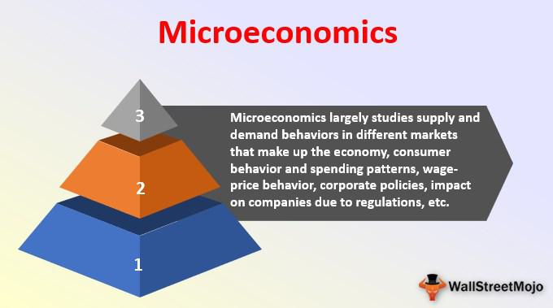

## Table of Contents

## What is microeconomics and how does it differ from macroeconomics?

Microeconomics is the study of how individuals and businesses make choices about using limited resources. It looks at things like how people decide what to buy, how much to work, and how companies decide what to produce and how much to charge. Microeconomics helps us understand how these small decisions affect the overall market and economy.

Macroeconomics, on the other hand, looks at the bigger picture of the economy. It studies things like the total amount of goods and services produced, overall employment levels, and how the government manages the economy through policies. While microeconomics focuses on individual and business behavior, macroeconomics is concerned with the performance and structure of the entire economy.

The main difference between the two is their scope. Microeconomics deals with specific parts of the economy, like a single market or a single consumer, while macroeconomics looks at the economy as a whole. Both are important because they help us understand different aspects of economic life and how they influence each other.

## What are the basic principles of supply and demand?

Supply and demand are the basic forces that drive the economy. Supply is how much of a product or service is available. Demand is how much people want that product or service. When there is a lot of something and not many people want it, the price goes down. When there is not much of something and a lot of people want it, the price goes up. This balance between supply and demand helps set prices in the market.

Changes in supply and demand can happen for many reasons. For supply, things like the cost to make the product, technology, or natural events can change how much is available. For demand, things like people's income, tastes, and the price of other products can change how much people want something. When supply and demand change, they move toward a new balance, and prices change too. Understanding these changes helps businesses and people make better choices.

## How do consumers make choices according to the utility theory?

Utility theory says that people choose things that make them the happiest or most satisfied. This happiness or satisfaction is called utility. When people decide what to buy, they look at how much happiness each thing will give them compared to its price. They want to get the most happiness for their money. For example, if you have $10, you might choose between buying a movie ticket or a meal. You will pick the one that you think will make you happier.

People also think about how much happiness they get from the next item they buy. This is called marginal utility. If you already have one ice cream, the second one might not make you as happy as the first one did. So, people keep buying things until the happiness they get from the last thing they bought is just worth the cost. This way, they make sure they are spending their money in the best way to feel the most satisfied.

## What is the concept of elasticity in microeconomics?

Elasticity in microeconomics tells us how much the quantity of something people buy or sell changes when its price changes. It's like measuring how sensitive people are to price changes. If a small change in price makes a big change in how much people buy, we say the demand is elastic. If the price change doesn't affect how much people buy very much, we say the demand is inelastic. For example, if the price of a luxury car goes up a little and people stop buying it a lot, that's elastic demand. But if the price of medicine goes up and people still need to buy it, that's inelastic demand.

There are different kinds of elasticity. Price elasticity of demand is the most common one, but there's also price elasticity of supply, which looks at how much the amount of something that sellers offer changes with price. There's also income elasticity of demand, which shows how much more or less people buy when their income changes. Understanding elasticity helps businesses set prices and helps governments make policies. It's important because it shows how changes in the market can affect what people do and how much they buy or sell.

## How do firms determine the optimal level of production?

Firms figure out the best amount to produce by looking at their costs and how much they can sell. They want to make as much money as they can, so they need to find the sweet spot where the cost of making one more item is just covered by how much they can sell it for. This is called the profit-maximizing level of output. To find this, firms look at their total costs, which include things like the cost of materials and labor, and their total revenue, which is how much money they get from selling their products.

Sometimes, firms also think about other things like how much space they have in their factory or how many workers they can hire. They might use a tool called marginal analysis, which means looking at the extra cost and the extra revenue from making one more item. If the extra revenue is more than the extra cost, it makes sense to produce more. If the extra cost is more than the extra revenue, they should produce less. By doing this, firms can find the best level of production that helps them make the most profit.

## What are the different market structures and how do they affect pricing and output?

Market structures are the different ways that markets can be set up, and they affect how companies set prices and decide how much to produce. There are four main types: perfect competition, monopolistic competition, oligopoly, and monopoly. In perfect competition, there are many small companies selling the same thing, so they all have to charge the same price. If one company tries to charge more, people will just buy from someone else. This means companies in perfect competition make just enough money to keep going, and they produce as much as they can without losing money. Monopolistic competition is similar, but companies sell slightly different things, so they can charge a little more than their costs to make some extra money.

In an oligopoly, there are only a few big companies that control most of the market. They watch each other closely and often set prices together to make sure they all make good money. If one company lowers its prices, the others might do the same, so they all try to keep prices high. This means they might not produce as much as they could because they want to keep prices up. A monopoly is when there is only one company selling something, and they can set any price they want because people have no other choice. They might not produce as much as they could because they want to keep prices high and make more money per item.

Each market structure leads to different pricing and output levels. In perfect competition and monopolistic competition, prices are usually lower and output is higher because there is more competition. In oligopolies and monopolies, prices are higher and output is lower because there is less competition. Understanding these structures helps us see why some things cost more than others and why some companies make more money.

## How does game theory apply to microeconomic decision making?

Game theory is like a tool that helps us understand how people make choices when they have to think about what others might do. In microeconomics, it's used a lot when companies are deciding things like prices or how much to produce. Imagine two companies selling the same thing. If one lowers its price, the other might do the same to keep customers. Game theory helps these companies guess what the other will do and pick the best move for themselves. It's like playing chess, but with money and business decisions.

In a simple example, let's say two ice cream shops are next to each other. If one shop lowers its prices, the other might too, or they might keep their prices the same and hope people still come to them for other reasons, like better service. Game theory helps them see all the possible outcomes and choose the one that makes them the most money. It's not just about one company's decision; it's about understanding how their choice affects others and how others' choices affect them. This way, companies can make smarter decisions that help them do better in the market.

## What role do externalities play in market outcomes?

Externalities are the effects that the choices of one person or company have on others, without those others being involved in the choice. These effects can be good or bad. For example, if a factory pollutes the air, that's a bad externality because it harms people who live nearby. On the other hand, if someone plants a garden that makes the neighborhood prettier, that's a good externality because it makes life nicer for everyone around.

Externalities can make markets work differently than they would if everyone only thought about themselves. When there are bad externalities, like pollution, companies might make too much of something because they don't pay for the harm they cause. This can lead to more pollution than is good for society. On the flip side, when there are good externalities, like a garden, people might not do enough of the good thing because they don't get paid for the benefits they give to others. Governments sometimes step in to fix these problems, like by making rules to reduce pollution or giving money to people who do good things for the community.

## How do public goods and common resources differ from private goods?

Public goods and common resources are different from private goods because of who can use them and how they are paid for. Private goods are things like food or clothes that you buy for yourself. If you buy a sandwich, no one else can eat it. These goods are easy to stop others from using, and it's easy to make people pay for them. But public goods, like street lights or national defense, are different. Everyone can use them, and it's hard to stop anyone from using them. Also, it's hard to make people pay for them because you can't easily tell who is using them.

Common resources are things like fish in the ocean or public parks. They are a bit like public goods because everyone can use them, but they are different because they can run out if too many people use them. If too many people fish in the same area, there might not be enough fish left for others. So, common resources need to be managed carefully to make sure everyone can keep using them. Both public goods and common resources show why sometimes the government needs to step in to make sure these things are available and used fairly.

## What are the implications of asymmetric information in markets?

Asymmetric information happens when one side of a deal knows more than the other side. This can cause problems in markets because it's hard for people to make good choices when they don't know everything. For example, if you're buying a used car, the seller might know about hidden problems with the car, but you don't. This can make you worried about getting a bad deal, so you might not want to buy the car or might offer a lower price. This problem can make it harder for good cars to be sold because buyers are scared of getting a bad one.

Because of asymmetric information, markets can work less well. People might not trust each other, so they don't want to do business. To fix this, some markets use things like warranties or inspections to make sure people feel safer about their choices. Governments might also make rules to help people know more about what they're buying. By doing these things, markets can work better, and people can feel more sure about making deals.

## How do behavioral economics insights challenge traditional microeconomic models?

Behavioral economics looks at how people actually make choices, not just how they should make them. Traditional microeconomic models say that people always make the best choice for themselves, like choosing the thing that makes them the happiest for the least amount of money. But behavioral economics says this isn't always true. People can make choices that don't seem to make sense, like buying something just because it's on sale, even if they don't need it. They might also stick with what they know, even if there's a better choice out there, because changing is hard.

These ideas challenge the old models because they show that people don't always act in their own best interest. They might be influenced by things like how a choice is presented to them, or they might care more about what others think than about what's best for them. This means that markets and businesses need to think about these behaviors when they make plans. Understanding how people really make choices can help make better policies and help businesses sell things in ways that work better for everyone.

## What advanced analytical tools are used in microeconomic research?

In microeconomic research, one of the main tools used is econometrics. Econometrics is like using math and [statistics](/wiki/bayesian-statistics) to study how the economy works. Researchers use it to look at data and see if their ideas about the economy are right. For example, they might use it to see how changing the price of a product affects how much people buy it. They use special computer programs and math formulas to do this. It helps them make predictions and understand things better.

Another important tool is game theory. Game theory is like studying how people make choices when they have to think about what others will do. It's used a lot to understand how companies decide on things like prices or how much to produce. Researchers use it to make models that show different choices and outcomes. This helps them see how companies might act in different situations and how that affects the market. Game theory is really useful for understanding competition and how businesses make decisions.

There are also other tools like experimental economics and behavioral economics. Experimental economics involves setting up experiments to see how people make choices in controlled situations. This helps researchers understand things that are hard to see just by looking at data. Behavioral economics looks at how people's feelings and habits affect their choices, which can be different from what traditional economic models say. These tools help researchers get a fuller picture of how the economy works by looking at real human behavior.

## What is Economic Theory and How is it Applied?

Economic theory encompasses a broad spectrum of concepts and models that provide insights into the functioning of economies and the interactions between various [agents](/wiki/agents) within these systems. At its core, economic theory seeks to understand the allocation of scarce resources and the decision-making processes that underpin economic activities.

Key economic theories such as supply and demand, game theory, and behavioral economics play crucial roles in shaping our understanding of market mechanisms. The law of supply and demand describes how prices and quantities of goods and services are determined in a competitive marketplace. According to this theory, the market price of a good adjusts to bring the quantity supplied and the quantity demanded into balance.

$$
Q_d = f(P, I, X)
$$
$$
Q_s = g(P, W, Z)
$$

where $Q_d$ is the quantity demanded, $Q_s$ is the quantity supplied, $P$ is the price of the good, $I$ is income, $W$ is the wage rate, and $X$ and $Z$ are sets of other relevant variables.

Game theory, developed by John von Neumann and Oskar Morgenstern, provides a framework for analyzing situations where players make strategic decisions. It is instrumental in studying competition and cooperation between firms, the design of auctions, and the development of strategies under uncertainty.

Behavioral economics, pioneered by scholars like Daniel Kahneman and Amos Tversky, integrates insights from psychology into economic theory. It challenges the traditional assumption of rationality by considering how cognitive biases and emotions influence economic decisions. This field has had profound implications for understanding consumer behavior and designing policy interventions that account for human behavior.

These economic theories are vital for predicting market trends, formulating policies, and crafting strategies that promote business growth and sustainability. For instance, central banks use economic models to anticipate inflation trends and set interest rates accordingly, thereby influencing national economic policies. Businesses apply game-theoretical models to strategize in competitive markets, and policymakers use behavioral insights to craft regulations that address market failures and consumer protection.

Economic theory's real-world applications extend across domains such as finance, policy-making, and technological innovation. In finance, models based on economic theory guide investment decisions and risk management strategies. Policymakers utilize these theories to design economic policies that enhance growth and stability. Technological advancements, particularly in fintech, are increasingly informed by economic principles leading to innovations in areas like digital currencies and electronic trading platforms.

Incorporating economic theory into practical applications ensures that decision-making is anchored in proven principles and empirical evidence. This theoretical grounding helps stakeholders navigate complex economic landscapes, mitigate risks, and exploit emerging opportunities. As these theories continue to evolve, their integration into practice remains a cornerstone for informed economic decision-making, fostering both innovation and sustainability in global economic systems.

## References & Further Reading

[1]: ["Microeconomic Theory: Basic Principles and Extensions"](https://www.amazon.com/Microeconomic-Theory-Basic-Principles-Extensions/dp/1305505794) by Walter Nicholson and Christopher Snyder

[2]: Kahneman, D., & Tversky, A. (1979). ["Prospect Theory: An Analysis of Decision under Risk."](https://www.jstor.org/stable/1914185) Econometrica, 47(2), 263-291.

[3]: Von Neumann, J., & Morgenstern, O. (1944). ["Theory of Games and Economic Behavior"](https://psycnet.apa.org/record/1945-00500-000) Princeton University Press.

[4]: Lopez de Prado, M. (2018). ["Advances in Financial Machine Learning"](https://www.amazon.com/Advances-Financial-Machine-Learning-Marcos/dp/1119482089) Wiley.

[5]: Jansen, S. (2020). ["Machine Learning for Algorithmic Trading: Predictive models to extract signals from market and alternative data for systematic trading strategies with Python."](https://www.amazon.com/Machine-Learning-Algorithmic-Trading-alternative/dp/1839217715) Packt Publishing.