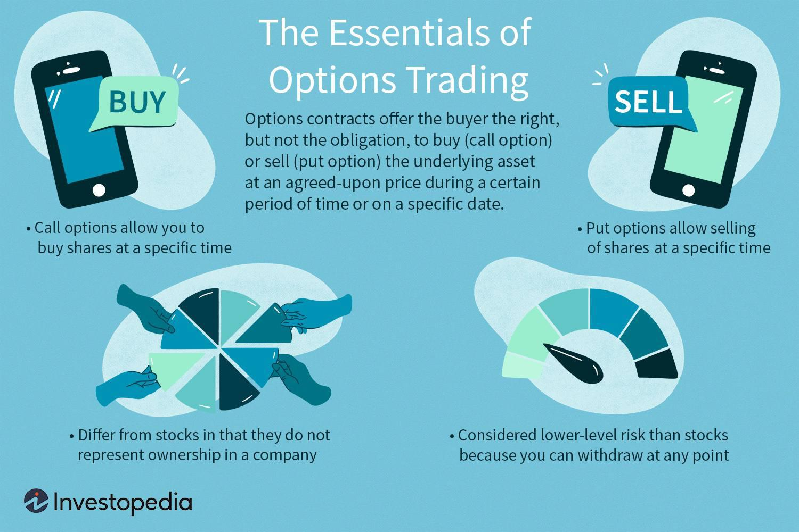

Financial markets serve as dynamic arenas where assets like stocks, bonds, currencies, and derivatives such as options are traded. Options, specifically, play a crucial role as financial instruments that provide investors the right, but not the obligation, to buy or sell an asset at a predetermined price before a specified expiration date. They are pivotal both for risk management and speculative purposes, allowing traders to hedge against potential losses or capitalize on market movements without committing to ownership of the underlying assets.

Trading strategies are vital in maximizing investment outcomes. They serve as structured plans that dictate when and how to purchase or sell assets, based on specific market signals or conditions. The deployment of these strategies, particularly in options trading, can lead to optimized returns by systematically managing risks and rewards associated with market volatility. For example, strategies like the covered call or protective put are designed to generate income or protect against losses, demonstrating the importance of a tactical approach in trading.



Algorithmic trading, or algo trading, represents a rapidly growing segment of the financial markets. It refers to the use of pre-programmed instructions and algorithms to automate trading activities. The appeal of algorithmic trading lies in its ability to execute orders with speed and precision, surpassing the capabilities of human traders. This technological edge is particularly transformative in the complex and fast-paced world of options trading, where market conditions can change in fractions of a second.

This article seeks to explore the intersection of options trading strategies with algorithmic trading. By examining how technology-driven strategies enhance or transform conventional trading approaches, the article aims to provide insights into the efficiencies introduced by algorithmic solutions. We will study various concepts, strategies, and benefits that arise from integrating algorithms into options trading, highlighting the potential for both improved performance and new challenges.

As we advance through this exploration, we will unpack the roles of options within financial markets and discuss popular trading strategies before integrating these with algorithmic approaches. This comprehensive analysis will provide traders with both foundational and advanced understanding, equipping them for navigating the future of trading in an increasingly automated environment.

## Table of Contents

## Understanding Options Trading in Financial Markets

Options trading is an essential facet of financial markets, serving as both a tool for risk management and a mechanism for speculative strategies. Options are financial derivatives, which derive their value from an underlying asset, such as stocks, indices, or commodities. An option grants the holder the right, but not the obligation, to buy (in the case of a call option) or sell (in the case of a put option) the underlying asset at a predetermined price, known as the strike price, before or at expiration.

**Basic Concepts: Call Options, Put Options, and Strike Prices**

In options terminology, a call option provides the holder the right to purchase the underlying asset at the strike price, anticipating that the asset's price will rise above the strike. Conversely, a put option offers the right to sell the asset at the strike price, expecting the asset's price to fall below the strike. The strike price is a critical [factor](/wiki/factor-investing), determining the profitability threshold for exercising options. Traders use these options to leverage positions, hedge risks, or capitalize on price movements within the market.

**Role in Risk Management and Speculation**

Options trading is instrumental in risk management, allowing investors to hedge against market [volatility](/wiki/volatility-trading-strategies) and potential losses. For instance, an investor holding a portfolio of stocks can purchase put options to protect against potential downturns. On the speculative front, traders might buy call options if they predict an increase in stock prices, enabling significant profits from relatively low capital investment. This dual nature as both a hedging tool and a speculative instrument underscores its versatility and strategic importance.

**Fit within the Broader Financial Market Ecosystem**

The integration of options trading into the financial market ecosystem enhances market efficiencies and [liquidity](/wiki/liquidity-risk-premium). Options provide additional layers of market depth, as they reflect traders' anticipations of future market movements, influencing price discovery. Moreover, options are integral to constructing sophisticated financial instruments, including derivatives like swaps and futures, expanding their relevance across various financial sectors.

**Advantages and Challenges of Trading Options**

Trading options offers several advantages, including leverage, flexibility, and diverse strategies for varying market conditions. Leverage enables substantial exposure to asset movements with a smaller initial investment than required for buying the asset outright. Flexibility arises from the multitude of strategies—ranging from simple single-option plays to complex multi-leg constructions—that cater to bullish, bearish, or neutral market views.

However, trading options presents challenges, primarily stemming from complexity and the requirement for predictive accuracy regarding timing and movement of underlying assets. The time-sensitive nature of options can lead to complete loss of investment if not executed properly, making expertise and robust risk assessment essential components of successful options trading.

In summary, options are powerful financial instruments that offer strategic advantages in both risk management and speculative practices. Understanding their dynamics and place within the financial markets equips traders and investors with the tools necessary for optimizing their investment approaches.

## Popular Options Trading Strategies

Options trading strategies are essential tools for investors aiming to optimize returns and mitigate risks in financial markets. This section explores some of the most popular strategies: Covered Call, Protective Put, and Straddle. Understanding these strategies' risk-reward profiles and applications in various market conditions helps traders make informed decisions.

### Overview of Common Options Trading Strategies

**Covered Call**: A covered call involves holding a long position in a stock while simultaneously selling a call option on the same stock. The objective is to generate additional income from the option premium. This strategy is typically used by investors who believe the stock price will increase slightly or remain stable in the near term.

- **Risk and Reward Profile**: The risk in a covered call is limited to the stock's price declining, with the potential reward capped at the strike price plus the premium received. It provides steady income but limits upside potential.

- **When to Use**: This strategy is best suited for stable market conditions with slight upward trends. Investors favor covered calls when seeking income from stocks with modest volatility.

**Protective Put**: A protective put involves buying a put option for a stock already owned. This strategy acts as an insurance policy, allowing the investor to sell the stock at the strike price if its market value falls below that.

- **Risk and Reward Profile**: The risk is limited to the premium paid for the put option, while the reward is theoretically unlimited as the stock price can appreciate without impacting the put.

- **When to Use**: Protective puts are useful in uncertain market conditions or when stock volatility is high. They provide downside protection while allowing participation in potential upside movement.

**Straddle**: A straddle involves buying both a call and a put option on the same underlying asset at the same strike price and expiration date. This strategy profits from significant price movement in either direction, making it ideal for volatile markets.

- **Risk and Reward Profile**: The maximum risk is the total premium paid for both options, while the reward is uncapped if the stock moves substantially in either direction.

- **When to Use**: Straddles are advantageous during periods of anticipated market volatility, such as earnings announcements or economic data releases. They allow traders to capitalize on large price changes regardless of direction.

### Factors to Consider When Choosing an Options Strategy

Several factors influence the choice of an options strategy:

1. **Market Volatility**: Strategies like straddles are better suited for volatile markets, while covered calls perform well in stable conditions.

2. **Investment Goals**: Income generation might lead to a preference for covered calls, whereas risk-averse investors may lean toward protective puts for downside protection.

3. **Risk Tolerance**: Understanding the risk-reward profile of each strategy is crucial. High-risk strategies might not suit conservative investors.

4. **Time Horizon**: The duration for holding a strategy influences choice, especially for options with different expiration dates.

5. **Market Forecast**: Correctly predicting market direction is vital for implementing successful strategies, particularly for those dependent on price movement like straddles.

By aligning strategies with market conditions, goals, and risk tolerance, traders can enhance their investment outcomes in options trading.

## Algorithmic Trading in the Context of Options

Algorithmic trading, or algo trading, employs computer programs to automate and execute trading decisions at speeds and frequencies that are unmatched by human traders. This approach leverages mathematical models and algorithms to determine the optimal timing, pricing, and quantity of orders. Algo trading's primary characteristics include the use of complex calculations, pre-defined instructions, and high-frequency trading capabilities that can process numerous transactions in milliseconds.

### Enhancing Efficiency in Options Trading

Algorithmic trading enhances the efficiency of executing options strategies by automating the decision-making process and minimizing human error. Traditional options trading requires constant monitoring and rapid responses to market fluctuations. In contrast, automated systems can quickly analyze vast datasets and execute trades based on pre-set criteria, such as price movements or volatility thresholds.

For instance, an algorithm might be designed to purchase call options when a stock's price dips below its moving average, indicating a potential upward trend. Such automation ensures that strategies are executed consistently and precisely, maximizing the potential for profit while reducing the risk of emotional trading decisions.

### Tools and Platforms for Algorithmic Trading Systems

Developing [algorithmic trading](/wiki/algorithmic-trading) systems requires specific tools and platforms. These typically include programming languages like Python or C++, which provide the flexibility to code complex strategies. Python, particularly, is favored for its rich ecosystem of libraries such as Pandas for data manipulation, NumPy for numerical operations, and SciPy for scientific computations. Additionally, specialized financial libraries like QuantLib and trading-specific frameworks facilitate the building of sophisticated trading models.

Trading platforms like MetaTrader, [Interactive Brokers](/wiki/interactive-brokers-api), and Trading Technologies offer integrated environments to develop, test, and deploy algorithmic strategies. They often feature APIs that allow direct market access and real-time data feeds, critical for back-testing strategies against historical data.

### Advantages of Using Algorithms in Trading

Utilizing algorithms in trading presents several advantages:

1. **Speed**: Algorithms can execute orders within milliseconds, which is critical in fast-moving markets.

2. **Precision**: Pre-defined rules ensure trades are executed at the exact conditions specified, reducing slippage and improving consistency.

3. **Reduced Emotion**: Removing human emotions from the trading process helps mitigate impulsive actions that often result from fear or greed.

4. **Scalability**: Algorithms can simultaneously manage multiple trades across various securities, something challenging for manual traders.

### Examples of Algo Trading Applied to Options Strategies

One common application of algo trading in options is the implementation of delta-neutral strategies. These strategies seek to profit from volatility without being affected by small price movements in the underlying asset. For example, a gamma [scalping](/wiki/gamma-scalping) strategy uses algorithms to dynamically adjust a portfolio's delta to remain neutral, thus minimizing directional risk.

Another example is the execution of straddle strategies, where traders simultaneously buy call and put options at the same strike price. An algorithm can be programmed to identify optimal entry and [exit](/wiki/exit-strategy) points based on volatility indicators and execute trades efficiently, even during volatile market conditions.

Moreover, automated systems can optimize covered call strategies by systematically writing calls against a stock portfolio. The algorithm evaluates market conditions and adjusts the strike prices and option expirations to enhance income generation while managing downside risk.

In conclusion, integrating algo trading into options strategies not only augments trading efficiency but also opens the door to more sophisticated and adaptive trading methodologies.

## Integrating Algo Trading with Options Strategies

The integration of algorithmic trading with options trading strategies combines the precision and efficiency of algorithms with the flexibility and potential for complex risk management offered by options. This synergy allows traders to optimize their trading operations by leveraging technology to implement strategies, manage risk, and adapt to market conditions swiftly.

### Steps to Develop and Implement an Algorithmic Options Trading Strategy

1. **Define Objectives and Strategy**: Begin by clearly defining the objectives of the trading strategy, such as hedge plays, volatility trading, or directional bets. Select the options strategy that aligns best with these goals, such as covered calls or straddles.

2. **Data Collection and Analysis**: Gather historical and real-time market data, focusing on price data, volatility indices, and economic indicators. Analyzing this data helps identify profitable patterns and models suitable for option trades.

3. **Developing the Algorithm**: Creating a trading algorithm involves writing code that can execute the chosen strategy autonomously. This includes setting criteria for entry and exit points, risk management rules, and order execution logic. Python is commonly used, and libraries like Pandas and NumPy can assist with data analysis, while frameworks such as QuantConnect or Zipline help with backtesting.

    ```python
    import pandas as pd
    import numpy as np

    def moving_average_strategy(data, window=20):
        """
        Example simple moving average strategy.
        """
        data['SMA'] = data['Close'].rolling(window=window).mean()
        data['Signal'] = 0
        data.loc[data['Close'] > data['SMA'], 'Signal'] = 1
        data.loc[data['Close'] < data['SMA'], 'Signal'] = -1
        return data
    ```

4. **Backtesting and Optimization**: Test the algorithm with historical data to evaluate its performance. Assess its profitability, risk metrics (like maximum drawdown), and sensitivity to different market conditions. Optimization may involve fine-tuning parameters and improving algorithms based on test outcomes.

5. **Implementation and Monitoring**: Deploy the strategy in live markets. Continuous monitoring is crucial to ensure that algorithms perform as expected and to adapt to changing market dynamics quickly.

### Challenges and Considerations

- **Market Data and Latency**: Reliable data feeds are essential, and latency can impact the profitability of high-frequency strategies.
- **Complexity and Maintenance**: Developing sophisticated algorithms can become complex, requiring ongoing maintenance to address bugs and adapt to evolving market conditions.
- **Regulatory Compliance**: Adhering to legal and regulatory standards is a critical component, as algorithmic trading is subject to various trading laws and regulations.

### Risk Management and Optimization Techniques

Effective risk management in algo-driven options trading involves diversification, setting strict limits on exposure, and employing stop-loss and take-profit points programmatically. Position-sizing techniques, such as the Kelly Criterion, can be integrated into algorithms to determine the optimal size of trades.

### Case Studies

Consider a [hedge fund](/wiki/hedge-fund-trading-strategies) implementing an algorithmic strategy using options to manage portfolio risk during volatile market periods. By employing a delta-neutral strategy, the fund can use algorithms to automatically adjust its positions in response to market movements, maintaining a balance between the options and the underlying assets.

Another scenario involves a retail trader utilizing an iron condor strategy executed through algorithms. The algorithm dynamically adjusts the strikes and expiries based on implied volatility, aiming to capitalize on time decay while managing market exposure efficiently.

By carefully integrating algorithmic trading with options strategies, traders can achieve a competitive edge in the financial markets, optimizing their approaches through technology.

## Benefits and Risks of Algo Options Trading

Algorithmic options trading offers several benefits that make it an attractive approach in modern financial markets. A key advantage is efficiency. Algorithms can process vast amounts of data and execute trades faster than any human can manage. This speed not only reduces latency in transactions but also ensures that trades are executed at optimal prices. 

Consistency is another significant benefit. Algorithms eliminate human error and emotional decision-making, which can lead to inconsistency in trading performance. By strictly following pre-defined rules and strategies, algorithmic trading ensures that each trade aligns with the overall investment plan, providing predictable and reliable outcomes.

Scalability is equally important. Algorithms can handle multiple trades simultaneously across different markets and time zones. This scalability allows traders to expand their operations without additional staffing, significantly increasing the potential for profit through diversification.

Despite these benefits, algorithmic options trading is not without its risks. Technology failures, such as software glitches or data feed errors, can disrupt trading operations. Furthermore, market volatility poses a substantial risk, as algorithms might make rapid decisions based on outdated or erroneous data, potentially leading to significant losses.

To mitigate these risks, traders can implement various strategies. Regularly updating and testing algorithms in different market conditions helps ensure robust performance. Risk management tools, such as stop-loss orders and diversification strategies, can protect against severe market downturns.

Regulatory and ethical considerations are crucial in algorithmic trading. Traders must comply with all relevant regulations to avoid legal repercussions. Ethical concerns, such as market manipulation or consumer exploitation, require algorithmic designs that foster fair trading practices. Transparency and accountability are essential to maintaining trust in algorithmic systems.

Continuous monitoring and adaptation are vital for the success of algorithmic trading strategies. Markets are dynamic, and changes in market conditions or regulatory environments can impact algorithm performance. Traders should regularly review and adjust their algorithms to maintain their effectiveness in achieving financial goals. This ongoing process of refinement ensures that algorithmic systems remain competitive and aligned with evolving market landscapes.

## Future Trends in Algo Trading and Options Strategies

Emerging trends and technologies are significantly shaping the landscape of algorithmic trading and options strategies. One notable area of development is [artificial intelligence](/wiki/ai-artificial-intelligence) (AI) and [machine learning](/wiki/machine-learning) (ML), which are revolutionizing how traders analyze market data and make decisions. These technologies enable the handling and processing of massive datasets to identify patterns and correlations that may not be immediately apparent to human analysts. Machine learning models, particularly those involving [deep learning](/wiki/deep-learning), can adapt to changing market conditions by learning from historical data and improving over time. For instance, [reinforcement learning](/wiki/reinforcement-learning), a subset of ML, allows algorithms to optimize trading strategies through trial and error, simulating a trading environment to enhance decision-making capabilities.

Predictions for market evolution suggest that AI-driven analytics will become a cornerstone in trading, leading to increased predictive accuracy and more sophisticated strategy formulations. The incorporation of AI and ML techniques can result in more dynamic and nuanced risk management, offering traders an edge in volatile markets. As the capabilities of AI expand, strategies can be adjusted in real-time, responding efficiently to market sentiment and price fluctuations. This adaptability may lead to a significant shift in investor behavior, with a preference for data-driven, automated systems that minimize human error.

The advancements in trading platforms and tools are further amplifying these capabilities. Innovations such as cloud-based trading solutions and open APIs are enhancing the scalability and flexibility of trading strategies. These tools provide traders with real-time market data, computational resources, and the ability to implement complex algorithms seamlessly. For instance, high-frequency trading platforms, which thrive on speed and precision, stand to benefit from these technological improvements. Additionally, platforms equipped with advanced risk analytics and portfolio optimization tools provide traders with comprehensive insights to refine their strategies continuously.

However, the proliferation of automated trading systems necessitates a reconsideration of regulatory frameworks. As trading becomes increasingly automated, regulatory bodies are tasked with ensuring that these technologies operate within ethical and transparent boundaries. This involves addressing issues such as the potential for algorithmic manipulation, ensuring fair market access, and maintaining the integrity of financial markets. Future regulation may focus on creating standards for AI and ML application in trading, emphasizing transparency, accountability, and risk management.

In conclusion, the integration of AI and machine learning continues to transform algorithmic options trading. The constant evolution of trading platforms and regulatory environments will further influence these advancements, presenting both opportunities and challenges for market participants. Traders and investors will need to stay informed and adaptable, leveraging the latest technological innovations to optimize their strategies and maintain a competitive edge in an ever-evolving market landscape.

## Conclusion

The intersection of options trading and algorithmic trading presents a compelling avenue for enhancing financial market engagements. Options trading, with its inherent complexity and flexibility, offers unique opportunities for both risk management and speculative gains. When combined with the precision and efficiency of algorithmic trading, these opportunities can be maximized, enabling traders to execute strategies with greater speed and accuracy.

Key strategies in options trading, such as covered calls, protective puts, and straddles, each come with their unique risk and reward profiles. Algorithmic trading can optimize these strategies by automating the decision-making process, thereby reducing the emotional biases that often affect human traders. Algorithms can quickly analyze vast datasets and execute trades in milliseconds, leading to consistent and potentially more profitable outcomes.

Despite the advantages of speed and precision, algo options trading carries its own risks. Technology failures, algorithmic errors, and unexpected market volatility can lead to significant losses. Therefore, it is crucial for traders to implement robust risk management techniques, including continuous monitoring and back-testing of algorithms. Ensuring compliance with regulatory standards and ethical trading practices is also essential to mitigate legal and financial risks.

For traders considering algo options trading, starting with a solid understanding of both the underlying options strategies and the technical aspects of algorithm development is essential. Engaging with educational resources, attending workshops, and using simulation platforms can aid in gaining the necessary experience before live trading. 

Encouragement for continued exploration in this field is imperative, as the landscape is rapidly evolving with advancements in artificial intelligence and machine learning. These technologies hold the promise of further refining trading strategies and improving decision-making processes.

In looking forward, the potential for innovation and growth in algo options trading is significant. As trading platforms become more sophisticated and computational power increases, traders are likely to benefit from more refined tools and strategies. Maintaining a focus on continuous learning and adaptation will be key to thriving in this dynamic environment.

## References & Further Reading

[1]: Bergstra, J., Bardenet, R., Bengio, Y., & Kégl, B. (2011). ["Algorithms for Hyper-Parameter Optimization."](https://dl.acm.org/doi/10.5555/2986459.2986743) Advances in Neural Information Processing Systems 24.

[2]: ["Advances in Financial Machine Learning"](https://www.amazon.com/Advances-Financial-Machine-Learning-Marcos/dp/1119482089) by Marcos Lopez de Prado

[3]: ["Evidence-Based Technical Analysis: Applying the Scientific Method and Statistical Inference to Trading Signals"](https://www.amazon.com/Evidence-Based-Technical-Analysis-Scientific-Statistical/dp/0470008741) by David Aronson

[4]: ["Machine Learning for Algorithmic Trading"](https://github.com/stefan-jansen/machine-learning-for-trading) by Stefan Jansen

[5]: ["Quantitative Trading: How to Build Your Own Algorithmic Trading Business"](https://www.amazon.com/Quantitative-Trading-Build-Algorithmic-Business/dp/1119800064) by Ernest P. Chan