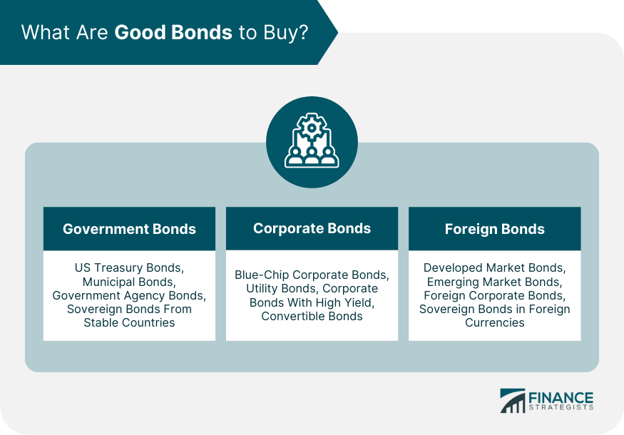

## Table of Contents

## What are bonds and why should someone consider investing in them?

Bonds are like IOUs where you lend money to a government or a company, and they promise to pay you back with interest over time. They are considered safer than stocks because they provide a steady income through interest payments, and the return of your initial investment when the bond matures. This makes them a good choice if you want to keep your money safe while still earning some income.

Someone should consider investing in bonds if they want a more predictable and stable source of income. Bonds can help balance out the risk in a portfolio that also includes stocks, which can be more volatile. They are especially useful for people who are closer to retirement or those who need a regular income to cover their expenses. By including bonds in their investment mix, people can protect their savings and still see some growth over time.

## What are the different types of bonds available for investment?

There are several types of bonds that people can invest in, each with its own features and risks. Government bonds are issued by national governments and are considered very safe because they are backed by the government's ability to tax its citizens. In the U.S., these are called Treasury bonds. Municipal bonds are issued by states, cities, or other local government bodies to fund projects like schools or highways. They often offer tax benefits, which can be attractive to investors.

Corporate bonds are issued by companies to raise money for their business activities. These can be riskier than government bonds because the financial health of the company can affect its ability to pay back the bond. Within corporate bonds, there are investment-grade bonds, which are considered safer, and high-yield or "junk" bonds, which offer higher interest rates but come with a higher risk of default. Lastly, there are also international bonds, which are issued by foreign governments or companies. These can add diversity to an investment portfolio but also come with additional risks like currency fluctuations.

In summary, the main types of bonds are government bonds, municipal bonds, corporate bonds, and international bonds. Each type offers different levels of risk and reward, so investors can choose based on their financial goals and how much risk they are willing to take.

## How do corporate bonds differ from treasury bonds?

Corporate bonds and Treasury bonds are both types of bonds that you can invest in, but they come from different sources. Corporate bonds are issued by companies that want to raise money for their business. They promise to pay you back with interest over time. Treasury bonds, on the other hand, are issued by the government of a country, like the U.S. government. They are considered very safe because the government can use taxes to pay back the money it owes.

The main difference between corporate and Treasury bonds is the level of risk and the [interest rate](/wiki/interest-rate-trading-strategies) they offer. Corporate bonds can be riskier because if the company runs into financial trouble, it might not be able to pay you back. Because of this higher risk, corporate bonds usually offer higher interest rates to attract investors. Treasury bonds are seen as safer, so they often have lower interest rates. This means that if you want a safer investment, you might choose Treasury bonds, but if you're willing to take on more risk for a potentially higher return, corporate bonds could be the way to go.

## What are municipal bonds and what are their tax advantages?

Municipal bonds are bonds that are issued by states, cities, or other local government groups. They use the money they get from selling these bonds to pay for things like building schools, fixing roads, or other public projects. When you buy a municipal bond, you are lending money to the local government, and they promise to pay you back with interest over time.

One big advantage of municipal bonds is that they often come with tax benefits. The interest you earn from these bonds is usually not taxed by the federal government. This means you get to keep more of the money you earn from the bond. Sometimes, if you live in the state or city that issued the bond, you might not have to pay state or local taxes on the interest either. This can make municipal bonds a good choice if you want to earn some money without having to pay a lot in taxes.

## What are foreign bonds and what unique risks do they present?

Foreign bonds are bonds that are issued by governments or companies from other countries. When you buy a foreign bond, you are lending money to that foreign government or company, and they promise to pay you back with interest. These bonds can be a good way to add variety to your investments because they come from different parts of the world. For example, you might buy bonds from Japan or Germany, which can be different from the bonds you can get in your own country.

However, foreign bonds come with some unique risks that you should know about. One big risk is changes in currency value. If the currency of the country that issued the bond goes down compared to your own currency, you might get less money back than you expected. Another risk is that the political or economic situation in that country could change, which might make it harder for them to pay you back. So, while foreign bonds can offer new opportunities, they also come with extra things to think about before you decide to invest in them.

## How can one assess the creditworthiness of a bond issuer?

To assess the creditworthiness of a bond issuer, you can look at credit ratings from agencies like Moody's, Standard & Poor's, and Fitch. These agencies give grades to bonds based on how likely they think the issuer is to pay back the money. A high rating, like AAA or AA, means the bond is considered very safe. A lower rating, like BB or below, means the bond is riskier and there's a higher chance the issuer might not pay you back. These ratings are a good starting point because they are based on a lot of research and analysis.

Another way to assess creditworthiness is by looking at the financial health of the issuer. For companies, you can check their financial statements to see how much money they are making and how much debt they have. For governments, you can look at things like their budget, how much they owe, and their economic stability. If a company or government is doing well financially, they are more likely to be able to pay back their bonds. Talking to a financial advisor can also help because they can give you more detailed information and help you understand what all this means for your investment.

## What is the yield of a bond and how is it calculated?

The yield of a bond is like the interest rate you earn on your investment. It tells you how much money you will get back each year compared to the price you paid for the bond. If you buy a bond for $1,000 and it pays you $50 every year, the yield is 5%. This is important because it helps you see how good of a deal the bond is.

To calculate the yield, you can use a simple formula: Yield = Annual Interest Payment / Bond Price. For example, if a bond pays $50 every year and you bought it for $1,000, you would do $50 divided by $1,000, which equals 0.05 or 5%. But sometimes, the price of a bond can change after you buy it. If the price goes up or down, the yield will change too. So, it's good to keep an eye on both the price and the yield to understand how your investment is doing.

## How does the interest rate environment affect bond prices?

The interest rate environment has a big impact on bond prices. When interest rates go up, new bonds that are issued will have higher interest rates to attract investors. This makes older bonds with lower interest rates less attractive, so their prices go down. On the other hand, when interest rates go down, new bonds will have lower interest rates, making older bonds with higher rates more attractive, so their prices go up. It's like a seesaw: when interest rates go up, bond prices go down, and when interest rates go down, bond prices go up.

This relationship happens because investors always want the best deal. If you can buy a new bond with a higher interest rate, why would you keep an old bond with a lower rate? So, to sell the old bond, you have to lower its price until it's a good deal again. This is why it's important to keep an eye on what's happening with interest rates if you're investing in bonds. It can help you understand why the value of your bonds might be changing.

## What are the risks associated with bond investments?

Investing in bonds comes with some risks that you should know about. One big risk is interest rate risk. When interest rates go up, the price of bonds you already own can go down. This happens because new bonds will have higher interest rates, making your old bonds less attractive to other investors. If you need to sell your bond before it matures, you might get less money back than you paid for it. Another risk is credit risk, which means the chance that the company or government that issued the bond might not be able to pay you back. This is more likely with corporate bonds, especially if the company is not doing well financially.

Another risk to think about is inflation risk. Inflation is when the cost of things goes up over time. If inflation goes up a lot, the money you get from your bond might not be worth as much as when you first invested. This can eat away at the value of your investment. Lastly, there's also the risk that comes with foreign bonds, called currency risk. If you buy a bond from another country and their currency loses value compared to your own, you might get less money back when you convert it. So, while bonds can be a safer investment than stocks, they still come with their own set of risks that you need to consider.

## How can bonds be used to diversify an investment portfolio?

Bonds can help you spread out your investments so you're not putting all your money in one place. When you have a mix of different types of investments, like stocks and bonds, it's called diversification. This can help protect your money because if one type of investment goes down, the others might still be doing okay. Bonds are often seen as safer than stocks because they give you a steady income and are less likely to lose a lot of value quickly. So, by adding bonds to your portfolio, you can balance out the riskier parts of your investments.

For example, if you have a lot of money in stocks and the stock market has a bad year, your whole portfolio could lose a lot of value. But if you also have some money in bonds, those bonds might still be paying you interest and holding their value better than the stocks. This can help cushion the blow and keep your overall investment from dropping too much. By mixing bonds with other investments, you can create a more stable and balanced portfolio that can weather different economic conditions.

## What are bond ratings and how should they influence investment decisions?

Bond ratings are like grades that tell you how safe a bond is. They are given by special companies called credit rating agencies, like Moody's, Standard & Poor's, and Fitch. These agencies look at how likely the company or government that issued the bond is to pay you back. A high rating, like AAA or AA, means the bond is very safe. A lower rating, like BB or below, means the bond is riskier and there's a bigger chance you might not get your money back. These ratings help you understand the risk of the bond before you decide to buy it.

When you're thinking about investing in a bond, the rating can help you make a smart choice. If you want a safe investment, you should look for bonds with high ratings. These bonds might not pay as much interest, but they are more likely to pay you back. If you're willing to take more risk for a chance at higher returns, you might consider bonds with lower ratings. These bonds pay more interest to make up for the higher risk, but there's a bigger chance the issuer might not be able to pay you back. So, the bond rating should guide you in choosing bonds that fit your comfort with risk and your investment goals.

## How can one purchase bonds directly or through investment vehicles like bond funds?

You can buy bonds directly or through investment vehicles like bond funds. To buy bonds directly, you can go through a broker or directly from the issuer. For example, if you want to buy U.S. Treasury bonds, you can do it through the TreasuryDirect website. For corporate or municipal bonds, you'll usually need to use a brokerage firm. They will have a list of bonds you can choose from, and you can pick the ones that fit your goals and how much risk you're willing to take.

Another way to invest in bonds is through bond funds. These are like big baskets of different bonds managed by professionals. When you buy into a bond fund, you're not buying a single bond but a share of the whole fund. This can be easier because you don't have to pick individual bonds yourself. Bond funds can be bought through investment companies or through your retirement account. They come in different types, like government bond funds, corporate bond funds, or even international bond funds, so you can choose one that matches what you're looking for in an investment.

## References & Further Reading

[1]: Fabozzi, F. J. (2012). ["Bond Markets, Analysis, and Strategies"](https://books.google.com/books/about/Bond_Markets_Analysis_and_Strategies_ten.html?id=bQpNEAAAQBAJ). Pearson Education. 

[2]: Lopez de Prado, M. (2018). ["Advances in Financial Machine Learning"](https://www.amazon.com/Advances-Financial-Machine-Learning-Marcos/dp/1119482089). Wiley.

[3]: Jansen, S. (2020). ["Machine Learning for Algorithmic Trading: Predictive models to extract signals from market and alternative data for systematic trading strategies with Python"](https://github.com/stefan-jansen/machine-learning-for-trading). Packt Publishing.

[4]: Fabozzi, F. J., & Mann, S. V. (2010). ["Handbook of Fixed-Income Securities"](https://www.mhebooklibrary.com/doi/book/10.1036/9781260473902?contentTab=true). McGraw-Hill Education. 

[5]: Aronson, D. R. (2006). ["Evidence-Based Technical Analysis: Applying the Scientific Method and Statistical Inference to Trading Signals"](https://www.amazon.com/Evidence-Based-Technical-Analysis-Scientific-Statistical/dp/0470008741). Wiley.

[6]: Chan, E. (2008). ["Quantitative Trading: How to Build Your Own Algorithmic Trading Business"](https://github.com/ftvision/quant_trading_echan_book). Wiley.

[7]: Aldridge, I. (2013). ["High-Frequency Trading: A Practical Guide to Algorithmic Strategies and Trading Systems"](https://www.ahmetbeyefendi.com/wp-content/uploads/2020/07/High-Frequency-Trading-Irene-Aldridge.pdf). Wiley.