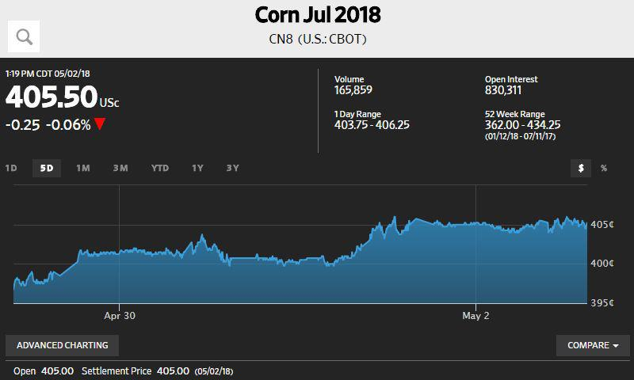

Futures trading has become a cornerstone of modern investment strategies, offering investors the ability to hedge risk and seek profits in various market conditions. Essentially, a futures contract is a financial agreement between a buyer and a seller to trade an asset at a predetermined price and future date. This aspect of predictability allows traders to manage potential risks associated with price fluctuations of commodities, stocks, and other financial instruments.

Understanding futures quotes is central to evaluating market conditions and making informed trading decisions. These quotes provide essential information such as open, high, low, and settle prices, as well as trading volume. By analyzing these components, traders can gauge market trends, identify trading opportunities, and form robust strategies that align with their investment goals.



The advent of algorithmic trading has further revolutionized futures trading. Algorithmic trading utilizes computer programs to execute trades based on predefined criteria without human intervention. This technological advancement has brought unparalleled efficiency and precision to futures trading by harnessing vast amounts of data to drive trading decisions. Through sophisticated algorithms, traders can optimize their entry and exit points while minimizing the emotional biases that often accompany manual trading.

This article explores the nuances of quotes in futures trading, emphasizing the pivotal role of algorithmic trading. By melding traditional trading principles with modern technological innovations, investors can gain a competitive edge in the futures market, leveraging data-driven insights and precision execution to enhance their trading outcomes.

## Table of Contents

## Understanding Futures and Their Quotes

Futures are financial instruments involving agreements to buy or sell a specific asset at a predetermined price on a set future date. They are integral components of global financial markets, widely utilized for hedging, speculation, and price discovery. This contractual obligation in futures allows buyers and sellers to lock in prices, mitigating the risk of unpredictable price movements in the underlying asset. 

Futures quotes serve as essential indicators of the market's state, and they provide a variety of critical data points, including:

- **Open Price**: The initial price at which trading for a futures contract begins during a given session.
- **High and Low Prices**: The highest and lowest prices recorded for the contract within the trading session.
- **Settle Price**: An official price established by the exchange, reflecting its perceived fair value at the close and used for daily mark-to-market settlement.
- **Trading Volume**: Reflects the total number of contracts exchanged during the session, indicating market activity levels and potential trends.

Understanding and analyzing these quotes enable traders to assess market sentiment and identify potential trading opportunities. By tracking the variations in these data points, one can interpret market [volatility](/wiki/volatility-trading-strategies) and investor behavior.

Futures contracts are often coded and standardized to represent specific products, expiry dates, and delivery months. For instance, a common contract code in the futures market might include an identifier for the underlying asset, followed by a code designating the delivery month and year. This format helps in organizing and categorizing various contracts across different markets, promoting efficient identification and trading.

To illustrate, a [crude oil](/wiki/crude-oil) futures contract might be denoted as CLZ23, where "CL" stands for Crude Oil, "Z" signifies December as the delivery month (in a standardized alphabetic system), and "23" denotes the year 2023. Such codification systematizes the trading process, allowing traders to easily access and interpret the market specifics they are interested in.

By mastering the interpretation of futures quotes, traders can gain insights into market dynamics, enabling strategic decision-making regarding entry and [exit](/wiki/exit-strategy) positions.

## Algorithmic Trading in Futures Markets

Algorithmic trading, commonly known as algo trading, implements sophisticated computer programs to execute trades automatically based on predefined strategies. This automated approach eliminates the need for human intervention, allowing for rapid transactions that can take advantage of short-lived market opportunities.

Algo trading capitalizes on vast amounts of data, utilizing technical indicators and complex algorithms to determine optimal points for entering or exiting trades. These algorithms parse historical and real-time data, identifying patterns or trends that may suggest future price movements. For instance, moving averages, [momentum](/wiki/momentum) indicators, and volatility metrics are frequently integrated into trading models to enhance decision-making precision.

The automation of trading decisions presents substantial benefits by mitigating emotional biases, which often cloud judgment and contribute to inconsistent performance when humans manually execute trades. Consistency in executing strategies is improved through automated systems, which remain unaffected by fear or greed, two emotions that frequently lead to suboptimal trading outcomes.

Platforms such as UltraAlgo have democratized access to algo trading, equipping both novice and seasoned traders with AI-driven tools and technical resources. These platforms offer user-friendly interfaces, facilitating the creation and deployment of algorithmic strategies without necessitating advanced programming skills. By providing pre-configured algorithms and customization options, they enable traders to harness the power of automation effectively.

In addition, traders can employ [backtesting](/wiki/backtesting) features in these platforms to simulate trading strategies against historical data. This validates the robustness and potential profitability of their trading models before deployment in real market conditions. An effective strategy aligns with market conditions by continuously adapting algorithmic parameters in response to evolving market dynamics.

## Benefits of Algorithmic Trading for Futures

Algorithmic trading, often referred to as algo trading, significantly enhances the efficiency of futures trading by executing trades with speed and precision, thereby minimizing the potential for human error. This automation process allows for the rapid processing of market data and execution of trades based on pre-established criteria, a capability unmatched by manual trading methods.

A key advantage of [algorithmic trading](/wiki/algorithmic-trading) is its ability to perform backtesting. This involves applying trading strategies to historical market data to evaluate their potential effectiveness before deploying them in live markets. Backtesting is crucial as it provides traders with insights into a strategy's performance under different market conditions and helps in refining strategies for improved outcomes. By analyzing historical performance, traders can identify patterns and behaviors which can increase the likelihood of success in future trades.

Moreover, algorithmic trading facilitates diversification across various asset classes, including stocks, ETFs (Exchange-Traded Funds), and [forex](/wiki/forex-system). Diversification is a fundamental risk management technique that can lead to enhanced portfolio performance by mitigating the impact of adverse market movements in any single asset class. By automating the trading process across these various classes, traders can efficiently manage a broader spectrum of investments, optimizing returns while balancing risk.

Advanced technical indicators integrated into algo trading platforms further empower traders to refine their strategies. By leveraging complex mathematical models and technical indicators, traders can identify precise entry and exit points, enhancing their potential for profit maximization. Indicators such as moving averages, Relative Strength Index (RSI), and Bollinger Bands are commonly used in algorithms to assess market trends and volatility, aiding in more informed decision-making.

In conclusion, algorithmic trading offers numerous benefits in futures markets, enabling traders to operate with improved efficiency, accuracy, and effectiveness. By incorporating advanced analytical tools and strategies, algo trading enhances the trader's ability to respond to market dynamics and capitalize on trading opportunities.

## How to Navigate Algo Trading Platforms

Navigating algorithmic trading platforms involves understanding and utilizing a variety of features designed to enhance trading efficiency and decision-making. These platforms provide real-time data, customizable watchlists, and advanced charting tools, which are crucial for conducting thorough market analysis. The availability of real-time data allows traders to monitor market movements, enabling swift reactions to price changes and volatility. Customizable watchlists help traders focus on specific assets or markets, allowing them to track performance and potential opportunities tailored to their trading strategies.

Integration with brokerage services is a vital feature that streamlines the trading process. By linking directly with brokers, trading platforms enable users to execute trades swiftly without needing to navigate multiple systems. This seamless integration not only makes the trading process more efficient but also minimizes the risk of execution errors due to manual input. Such integration typically involves linking application programming interfaces (APIs) provided by brokers, allowing for automated trade execution as predefined conditions are met.

User-friendly interfaces are key components that differentiate successful trading platforms. These interfaces are designed to enhance both strategic decision-making and quick adaptiveness to shifting market climates. Intuitive interfaces enable traders to configure their trading environments efficiently, access tools and data swiftly, and customize layouts to suit personal preferences and strategies. This adaptability supports traders in making informed and timely decisions, which is especially critical given the fast-paced nature of financial markets.

To fully harness the capabilities of algo trading platforms, traders should invest time in mastering the available features. This includes understanding how to set up and interpret various technical indicators, optimize watchlists, and effectively use backtesting tools to refine trading strategies based on historical data. Additionally, familiarizing oneself with the integration processes for brokerage services can ensure smoother transaction flows and enhance trading accuracy.

In conclusion, mastering these features is pivotal for traders to boost their trading efficacy. Focused learning and continuous practice are recommended to leverage the full potential of algorithmic trading platforms, leading to improved trading outcomes and a strategic advantage in the markets.

## Challenges and Considerations

Algorithmic trading (algo trading) introduces sophisticated techniques for executing trades but comes with its own set of challenges and considerations that traders must address to succeed in the futures markets.

Understanding coding and strategy development are fundamental requirements for implementing algorithmic trading. Traders need to not only comprehend programming languages like Python but also grasp how to design and test strategies that align with their market predictions. Algorithmic strategies often involve applying various quantitative models, such as mean-reversion or trend-following, which require robust coding skills for their development and implementation. Here is an example of a simple moving average crossover strategy coded in Python:

```python
import pandas as pd

def moving_average(df, short_window, long_window):
    df['Short_MA'] = df['Close'].rolling(window=short_window, min_periods=1).mean()
    df['Long_MA'] = df['Close'].rolling(window=long_window, min_periods=1).mean()
    df['Signal'] = 0
    df['Signal'][short_window:] = np.where(df['Short_MA'][short_window:] > df['Long_MA'][short_window:], 1, 0)
    df['Position'] = df['Signal'].diff()
    return df

data = pd.read_csv('futures_data.csv')
result = moving_average(data, short_window=40, long_window=100)
```

Technical issues like connectivity or platform failures pose significant risks in algo trading. System downtimes or interruptions can lead to missed or erroneous trades, affecting profitability. Hence, it is crucial to implement robust fail-safes and contingency plans. This might include redundancy systems and continuous monitoring to ensure uninterrupted service and quick recovery from technical hitches.

Continuous monitoring of algorithmic strategies is critical. Market conditions are dynamic, and a strategy that works well under certain conditions might perform poorly under different circumstances. Continuous evaluation and fine-tuning of strategies are essential to ensure they remain aligned with current market conditions. This approach mitigates risks associated with algorithm misalignment with market trends.

Appropriate capital allocation and risk management are imperative to ensure sustained profitability. Traders should employ risk management techniques such as stop-loss orders, position sizing, and diversification across strategies or asset classes. These practices help in minimizing losses during unfavorable market movements. Employing risk management mathematics, traders can calculate the optimal position size using formulas like the Kelly Criterion:

$$
f^* = \frac{bp - q}{b}
$$

where $f^*$ is the fraction of the capital to bet, $b$ is the odds received on the wager, $p$ is the probability of winning, and $q$ is the probability of losing.

In summary, while algorithmic trading in futures markets offers numerous advantages, it also requires careful attention to coding, strategy development, technical reliability, ongoing strategy alignment, and rigorous risk management. Addressing these challenges effectively can lead to successful trading and long-term profitability.

## Conclusion

Futures trading, when combined with algorithmic strategies, provides traders with innovative methods to achieve higher profitability while effectively managing risk. The integration of advanced algorithms enables the analysis of vast data sets, leading to precise trading signals and enhanced decision-making capabilities. This confluence of traditional trading with modern technology allows for a more comprehensive approach to market engagement.

Utilizing algorithmic platforms empowers traders by offering precision and data-driven insights, effectively sharpening their competitive edge in the market. Algorithms can swiftly process real-time data and historical patterns, offering a significant advantage in identifying lucrative opportunities. By relying on these data-centric tools, traders can make decisions rooted in statistical evidence rather than emotional assumptions.

As technological advancements continue to reshape the futures market landscape, traders equipped with algorithmic tools can navigate this complexity with increased confidence and operational efficiency. The ability to automatically execute trades based on algorithmically generated signals reduces execution time and minimizes potential human errors, thereby optimizing overall performance.

The dynamic nature of markets necessitates that traders remain informed and adaptable. Continuous learning and adaptation are crucial for capitalizing on emerging trends and technological improvements within algo trading. Staying updated with the latest tools, strategies, and market developments ensures that traders can effectively respond to changing conditions and maintain a competitive stance in the ever-evolving futures markets.

## References & Further Reading

[1]: Bergstra, J., Bardenet, R., Bengio, Y., & Kégl, B. (2011). ["Algorithms for Hyper-Parameter Optimization."](https://papers.nips.cc/paper/4443-algorithms-for-hyper-parameter-optimization) Advances in Neural Information Processing Systems 24.

[2]: ["Advances in Financial Machine Learning"](https://www.amazon.com/Advances-Financial-Machine-Learning-Marcos/dp/1119482089) by Marcos Lopez de Prado

[3]: ["Evidence-Based Technical Analysis: Applying the Scientific Method and Statistical Inference to Trading Signals"](https://www.amazon.com/Evidence-Based-Technical-Analysis-Scientific-Statistical/dp/0470008741) by David Aronson

[4]: ["Machine Learning for Algorithmic Trading"](https://github.com/stefan-jansen/machine-learning-for-trading) by Stefan Jansen

[5]: ["Quantitative Trading: How to Build Your Own Algorithmic Trading Business"](https://www.amazon.com/Quantitative-Trading-Build-Algorithmic-Business/dp/1119800064) by Ernest P. Chan

[6]: Aldridge, I. (2013). ["High-Frequency Trading: A Practical Guide to Algorithmic Strategies and Trading Systems"](https://onlinelibrary.wiley.com/doi/pdf/10.1002/9781119203803.fmatter). Wiley.

[7]: Narang, R.K. (2013). ["Inside the Black Box: A Simple Guide to Quantitative and High Frequency Trading"](https://onlinelibrary.wiley.com/doi/book/10.1002/9781118662717). Wiley Finance.

[8]: Lequeux, P. (2012). ["Quantitative Technical Analysis: An Integrated Approach to Trading System Development and Trading Management"](https://dl.acm.org/doi/book/10.5555/2789309). Financial Times Prentice Hall.