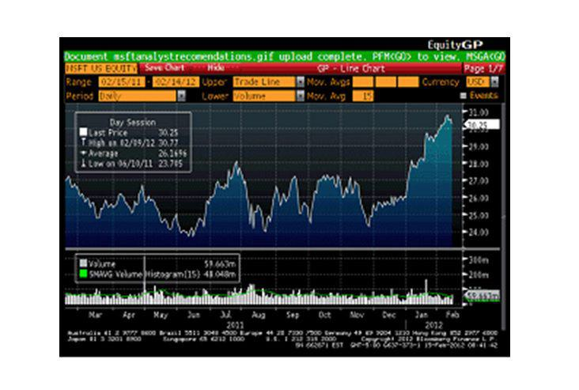

In financial markets, staying ahead requires more than just basic tools. Bloomberg Terminal, a market leader in financial software, offers unparalleled access to real-time data and advanced analytics. For investment professionals, the ability to access and analyze data quickly and accurately is crucial for making informed decisions. The Bloomberg Terminal, with its extensive suite of features, has become an indispensable asset in the competitive landscape of financial trading and investment management.

This article explores key financial software investment tools, focusing particularly on the Bloomberg Terminal and its influential role in algorithmic trading. Algorithmic trading, which utilizes computer algorithms to execute trades at high speeds and volumes, relies heavily on timely and accurate data. Bloomberg Terminal provides such data, along with customizable applications and analytics that support the development and execution of algorithmic trading strategies. By integrating its powerful functionalities, financial professionals can enhance their trading strategies and optimize investment decision-making processes.



In addition to focusing on Bloomberg Terminal, this article will also examine other competitive options available to financial professionals. While Bloomberg Terminal continues to be a premier choice for many, there are alternative platforms like Refinitiv Eikon and FactSet, which offer unique features and capabilities. These platforms provide financial professionals with a range of options tailored to various needs and budget constraints.

In summary, as financial markets evolve rapidly, the integration of advanced financial software tools like Bloomberg Terminal is essential for gaining a competitive edge. By leveraging real-time data and analytics, investment professionals can make better-informed decisions and refine their trading strategies effectively.

## Table of Contents

## Bloomberg Terminal: An Overview

Established in 1981, Bloomberg Terminal has significantly transformed the way financial information is accessed and analyzed. This platform remains a cornerstone for financial professionals, continuously evolving to meet the changing demands of the industry.

The Bloomberg Terminal provides an expansive suite of tools designed for financial analysis, trading, and risk management. These tools are integral for users who require accurate and timely financial data and analysis. Offering real-time market data that spans multiple asset classes—such as equities, commodities, currencies, and fixed income—the terminal is invaluable to professionals who need to make informed decisions quickly. This capability is crucial for traders, investment bankers, portfolio managers, and analysts who operate in high-stakes environments where speed and accuracy are of the essence.

The terminal integrates this data in a coherent and accessible format, enabling users to quickly extract the needed information. For instance, the terminal's analytics tools allow users to evaluate data trends through advanced visualization techniques. Interactive charts and graphs enhance the user’s ability to comprehend complex datasets, facilitating more informed decision-making processes.

Portfolio managers and financial analysts benefit substantially from the functionalities offered by Bloomberg Terminal. Its extensive database allows for efficient data access and manipulation, providing insights that are vital for strategic planning and execution. Moreover, the platform supports trade execution directly, which is particularly advantageous for market participants who require seamless integration between analysis and trading activities.

Beyond its data provision and analytical capabilities, Bloomberg Terminal also offers market insights and news coverage, ensuring users remain updated with the latest developments and trends. This comprehensive approach helps professionals anticipate market movements and devise strategies accordingly. The integration of precise market news and contextual analysis aids in constructing narratives around financial events, which is essential for strategic portfolio adjustments.

Overall, Bloomberg Terminal's multifaceted functionalities have made it an indispensable tool for those engaged in financial markets, equipping them with the means to succeed in an increasingly complex environment.

## Financial Software: Enhancing Investment Decisions

Financial software plays a crucial role in making informed investment decisions, with the Bloomberg Terminal being a leading example. By providing real-time data and sophisticated analytical capabilities, it equips financial professionals with the necessary tools for effective market analysis and strategy development. At its core, Bloomberg Terminal integrates a wide array of functionalities designed to optimize investment decision-making.

One of the key features is the access to real-time data across global markets, which offers users the latest financial news, pricing information, and trading volumes. This immediacy is vital for making timely investment choices and reacting quickly to market changes, thereby enhancing decision-making efficacy.

Equally important are the robust analytical tools that Bloomberg Terminal provides. These tools enable users to conduct thorough financial analysis, including valuation models, economic forecasts, and performance metrics. By leveraging these capabilities, investors gain a deeper understanding of market trends and the potential impact on their portfolios.

Additionally, Bloomberg Terminal offers extensive [backtesting](/wiki/backtesting) facilities, allowing investors to test and refine their investment strategies using historical data. Backtesting involves simulating the trading strategy over past data to evaluate its effectiveness and refine accordingly. This feature is essential for investors who seek to optimize their strategies before applying them in real-time markets, reducing potential risk.

Advanced charting capabilities further enhance the decision-making process. Bloomberg’s charting tools allow users to visualize and analyze market trends, correlations, and patterns. These visual tools come with customizable options for technical analysis, enabling users to overlay different indicators and identify investment opportunities.

Risk management is another critical aspect supported by Bloomberg Terminal. It offers sophisticated risk assessment tools such as Value at Risk (VaR) models, which estimate the potential loss in value of an asset or portfolio over a defined period for a given confidence interval. Stress testing features allow investors to simulate different market scenarios and understand potential impacts on their portfolios, helping in constructing more resilient investment strategies.

Overall, Bloomberg Terminal’s comprehensive suite of tools and features greatly enhances the investment decision-making process, providing users with the data and analytics needed to navigate complex financial markets effectively. Its integration into an investor's workflow not only optimizes their analyses but also gives them a competitive edge in the constantly evolving market landscape.

## Algorithmic Trading and Bloomberg Terminal

Bloomberg Terminal plays a crucial role in [algorithmic trading](/wiki/algorithmic-trading) by offering essential trade analytics and customizable applications that cater to the intricate needs of traders. The platform's ability to provide real-time data feeds is fundamental in developing and backtesting trading algorithms, a critical aspect of this automated trading strategy. The dynamic nature of financial markets necessitates rapid analysis and decision-making, which Bloomberg Terminal facilitates through its integrated tools.

Algorithmic trading involves executing orders using automated and pre-programmed trading instructions accounting for variables such as time, price, and [volume](/wiki/volume-trading-strategy). Bloomberg Terminal supports this by offering data-driven insights that enhance the precision of algorithmic strategies. Among the complex trading strategies it aids are [arbitrage](/wiki/arbitrage), [market making](/wiki/market-making), and [trend following](/wiki/trend-following).

Arbitrage strategies, for example, benefit from Bloomberg's real-time data and powerful analytical capabilities to identify and execute trades that exploit price differentials across different markets or instruments. Market making strategies rely on the terminal's capacity to provide instantaneous market data, thereby enabling the generation of profit through bid-ask spread exploitation.

Trend following, a strategy that involves going long or short depending on the prevailing market trends, also draws on Bloomberg Terminal's robust tools. The platform offers sophisticated charts and data to enhance traders' ability to discern trends accurately.

A practical application of Bloomberg Terminal in algorithmic trading can be illustrated through the implementation of a moving average crossover strategy using Python and Bloomberg's API. This strategy involves using two moving averages of different lengths (a shorter and a longer one) to generate buy or sell signals.

```python
import blpapi
import numpy as np
import pandas as pd

def calculate_moving_average(prices, window):
    return prices.rolling(window=window).mean()

def moving_average_crossover_strategy(short_window, long_window, symbol):
    session = blpapi.Session()
    # Assume session starts successfully
    ref_data_service = session.openService("//blp/refdata")
    # Fetch historical data
    request = ref_data_service.createRequest("HistoricalDataRequest")
    request.getElement("securities").appendValue(symbol)
    session.sendRequest(request)

    # Handle response (pseudo-code, for demonstration)
    data = pd.DataFrame()  # Assume this contains fetched historical prices
    data['Short_MA'] = calculate_moving_average(data['price'], short_window)
    data['Long_MA'] = calculate_moving_average(data['price'], long_window)

    data['Signal'] = np.where(data['Short_MA'] > data['Long_MA'], 1.0, 0.0)
    data['Position'] = data['Signal'].diff()

    return data

# Example usage
strategy_data = moving_average_crossover_strategy(20, 50, "AAPL US Equity")
print(strategy_data.tail())
```

In this Python script, `moving_average_crossover_strategy` calculates the short-term and long-term moving averages for a given stock symbol using Bloomberg's historical price data. It generates trading signals based on whether the short-term moving average crosses above or below the long-term moving average.

Bloomberg Terminal's data-rich environment through its API integration empowers quantitative analysts to refine and execute algorithmic strategies effectively. The example underscores the terminal's capability to seamlessly integrate with programming environments to optimize trading strategies based on rigorous data analysis.

## Competitors and Alternatives

In the financial software market, several notable alternatives to Bloomberg Terminal offer distinct features catering to diverse professional needs. Refinitiv Eikon, a leading competitor, stands out with its highly customizable user interface and seamless integration with Microsoft Excel. This customization enables users to tailor their interface for specific workflows, enhancing the user experience and efficiency in data analysis and reporting.

FactSet offers a comprehensive suite of tools, specifically designed for buy-side analysts. It is renowned for delivering industry-specific solutions and exceptional client service. FactSet's platform also provides in-depth financial research, helping users to make informed investment decisions. The focus on buy-side analysis makes it a preferred choice for investment managers and hedge funds, offering insights and analytics critical for portfolio management.

For smaller traders and those requiring more cost-effective solutions, several options present viable alternatives. TradingView is a popular choice among retail traders for its intuitive web-based interface and extensive charting capabilities. It allows for the sharing of user-generated scripts and ideas, fostering a community-driven approach to market analysis.

Koyfin, another emerging platform, provides financial data and visualizations without the hefty price tag. It offers a robust set of tools for equity research and macroeconomic analysis, catering to users needing detailed financial insights without incurring high costs.

MetaStock is recognized for its focus on technical analysis, providing software tools for traders interested in systematic trading strategies. Its suite of products includes charting tools and data feeds that support the analysis of stocks, [forex](/wiki/forex-system), and commodities.

Morningstar Direct appeals to investors interested in extensive fund analysis. It offers comprehensive data and analytics on mutual funds, ETFs, and other investment vehicles, aiding investment decisions based on performance metrics and ratings.

These competitors and alternatives to Bloomberg Terminal address varying needs across the financial industry, offering tools for different user groups ranging from individual traders to institutional analysts. Each platform's unique features allow financial professionals to choose solutions best aligned with their specific investment and analytical requirements.

## Integrating Bloomberg Terminal into Investment Strategies

Integrating Bloomberg Terminal into investment strategies offers significant advantages by providing robust data and analytics capabilities. The terminal facilitates risk management through tools like Value at Risk (VaR) and stress testing. VaR, a vital tool for quantifying the potential loss in value of a portfolio, uses statistical techniques to measure the maximum expected loss over a specified period at a given confidence level. Bloomberg Terminal computes VaR by analyzing historical market data and employing models such as the historical simulation or the Monte Carlo simulation, thus aiding investors in effectively optimizing their portfolios against potential market downturns.

Stress testing complements VaR by evaluating how a portfolio might perform under hypothetical adverse market conditions. By simulating diverse economic scenarios, investors can assess the resilience of their investment strategies and make informed adjustments to mitigate risks. Bloomberg's stress testing tool allows users to customize scenarios and analyze potential impacts on their portfolios, thus enhancing decision-making processes and overall portfolio management.

Case studies highlight the successful integration of Bloomberg's analytics in improving portfolio performance. For instance, a portfolio manager might utilize Bloomberg's comprehensive data sets and charting capabilities to identify market trends, thereby adjusting asset allocations to capitalize on emerging opportunities. Using Bloomberg's analytics, investors can refine their strategies by closely monitoring market indicators and reacting swiftly to shifts, a crucial [factor](/wiki/factor-investing) in gaining an edge in volatile markets.

Quantitative analysts can leverage Bloomberg's data to develop algorithmic trading strategies. By employing programming languages such as Python, analysts integrate Bloomberg's real-time data with custom algorithms to automate trading decisions. For example, a moving average crossover strategy can be implemented by accessing Bloomberg data through the Bloomberg API. The strategy involves calculating short-term and long-term moving averages and executing trades when these averages cross, signaling potential buy or sell opportunities.

Here is a basic Python example of implementing a moving average crossover using Bloomberg API data:

```python
import requests
import pandas as pd

# Function to fetch data from Bloomberg API
def fetch_bloomberg_data(ticker, start_date, end_date):
    # Replace the following URL with the bank-provided endpoint for accessing data
    api_url = f"https://api.bloomberg.com/v3/time_series?ticker={ticker}&start={start_date}&end={end_date}"
    response = requests.get(api_url)
    return pd.DataFrame(response.json())

# Calculate moving averages and generate buy/sell signals
def moving_average_strategy(ticker, short_window, long_window, start_date, end_date):
    data = fetch_bloomberg_data(ticker, start_date, end_date)
    data['short_mavg'] = data['close'].rolling(window=short_window, min_periods=1).mean()
    data['long_mavg'] = data['close'].rolling(window=long_window, min_periods=1).mean()
    data['signal'] = 0
    data['signal'][short_window:] = np.where(data['short_mavg'][short_window:] > data['long_mavg'][short_window:], 1, 0)
    data['positions'] = data['signal'].diff()
    return data

# Example usage
# Specify parameters
ticker = 'AAPL US Equity'
short_window = 40
long_window = 100
start_date = '2022-01-01'
end_date = '2023-01-01'

strategy_data = moving_average_strategy(ticker, short_window, long_window, start_date, end_date)
print(strategy_data.tail())
```

This simple example demonstrates the process of setting up a trading strategy that automates buy and sell signals based on crossover points, showcasing how Bloomberg Terminal can be integrated into algorithmic trading workflows, yielding enhanced strategic insights and execution capabilities.

## Conclusion

Bloomberg Terminal stands as an indispensable resource for investors, offering extensive capabilities in data analytics, trade execution, and comprehensive financial insights. Its powerful tools enable professionals to enhance investment strategies by providing real-time market information and advanced analytics that directly impact decision-making processes. By optimizing portfolio management, Bloomberg Terminal helps investors to efficiently allocate resources, assess risks, and maximize potential returns.

As the financial landscape evolves, the incorporation of emerging technologies such as [artificial intelligence](/wiki/ai-artificial-intelligence) (AI) and [machine learning](/wiki/machine-learning) is expected to transform investment processes further. These advancements promise to enhance predictive accuracy and strategic refinement, allowing investors to navigate markets with greater precision. Bloomberg Terminal is well-positioned to integrate these technologies, ensuring users remain at the cutting edge of financial innovation.

To maintain a competitive edge, leveraging Bloomberg Terminal and its array of sophisticated features is essential for modern market participants. By staying informed and adapting to technological advancements, investors can enhance their strategic approach and secure better outcomes in today's complex financial environment.

## References & Further Reading

[1]: Lopez de Prado, M. (2018). ["Advances in Financial Machine Learning"](https://www.amazon.com/Advances-Financial-Machine-Learning-Marcos/dp/1119482089). Wiley.

[2]: Aronson, D. (2007). ["Evidence-Based Technical Analysis: Applying the Scientific Method and Statistical Inference to Trading Signals"](https://www.amazon.com/Evidence-Based-Technical-Analysis-Scientific-Statistical/dp/0470008741). Wiley.

[3]: Jansen, S. (2020). ["Machine Learning for Algorithmic Trading"](https://github.com/stefan-jansen/machine-learning-for-trading). Packt Publishing.

[4]: Chan, E. P. (2008). ["Quantitative Trading: How to Build Your Own Algorithmic Trading Business"](https://github.com/ftvision/quant_trading_echan_book). Wiley.

[5]: Bloomberg L.P. ["Bloomberg Terminal."](https://www.bloomberg.com/professional/products/bloomberg-terminal/) Bloomberg Professional Services.