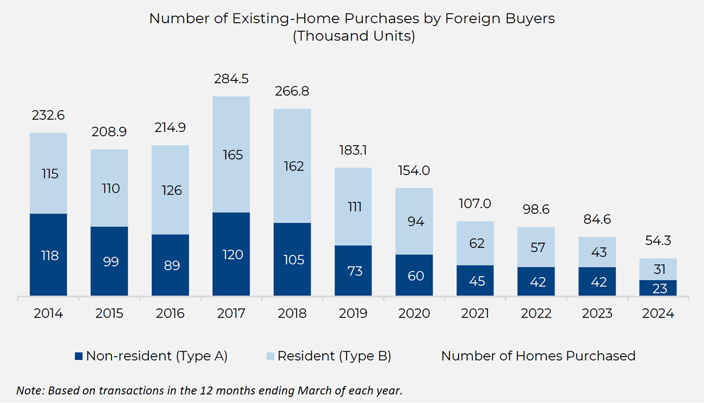

The U.S. real estate market has been a long-standing focal point for foreign investors, drawn by the nation's economic stability, transparent legal framework, and diverse investment opportunities. Historically, these characteristics have provided a secure environment for wealth preservation and growth, facilitating both short-term gains and long-term asset appreciation. The allure of investing in U.S. real estate is further bolstered by strategic geographical locations, such as major metropolitan areas, which consistently demonstrate robust housing demand and resilient market performance.

As globalization progresses, international real estate investment is experiencing significant transformations, notably with the integration of algorithmic trading strategies. Algorithmic trading, initially a staple of stock markets, is being increasingly adopted in the real estate domain to enhance investment decisions through data-driven insights and automated processes. By employing algorithms in real estate investments, investors aim to identify potential opportunities, optimize portfolio diversification, and improve overall efficiency. This technological advancement in investment strategy is reshaping traditional investment models, enabling investors to make informed decisions with unprecedented speed and precision.



This article scrutinizes the profound impact of algorithmic trading on international real estate investment, particularly highlighting its influence on the U.S. market. It aims to provide foreign buyers with a comprehensive guide to navigating this evolving landscape, focusing on practical strategies to harness the full potential of algorithmic tools. By understanding these dynamics, foreign investors can better position themselves to capitalize on the opportunities within the U.S. real estate sector while effectively managing potential challenges.

## Table of Contents

## The Appeal of U.S. Real Estate for Foreign Buyers

Foreign investors have long found the U.S. real estate market to be an attractive landscape due to its reputation for economic stability and robust legal protections. The U.S. economy is the largest in the world, characterized by a dynamic and diverse economic structure that offers numerous investment opportunities across various sectors, including real estate. A stable economic environment reduces the risks associated with volatile market fluctuations, thereby reassuring investors of the long-term reliability of their investments.

One primary driver of foreign investment in U.S. real estate is the country's strong legal framework, which includes transparent property laws and protections for property owners. The legal system is designed to safeguard investments against fraud and disputes, offering a sense of security that is critical for foreign investors. This legal assurance encourages foreign buyers to pursue both residential and commercial properties in the U.S. market.

Foreign investors are also drawn to U.S. real estate by the potential for high returns. Historically, the U.S. real estate market has offered competitive returns relative to global averages. This performance is enhanced by factors such as capital appreciation and rental income, which provide lucrative opportunities for investors seeking to diversify their financial portfolios.

The diversity of investment opportunities in the U.S. also plays a significant role in attracting foreign buyers. The real estate market in the U.S. encompasses a wide range of property types, from residential homes and luxury apartments to commercial buildings and industrial real estate. This variety allows investors to tailor their investments according to their preferences and risk profiles.

Certain U.S. cities stand out as popular destinations for foreign real estate investment. Cities like Miami, Austin, Phoenix, and New York are particularly attractive due to their vibrant economies, thriving cultural scenes, and significant development prospects. Miami, with its favorable climate and growing international business presence, is a hub for investors from Latin America and Europe. Austin's burgeoning tech industry and quality of life make it a prime target for investment. Phoenix offers a rapidly expanding market with affordable property prices, while New York remains a global financial center attractive for its prestigious real estate.

In summary, the U.S. real estate market is appealing to foreign investors due to its economic stability, strong legal protections, potential for high returns, and variety of investment opportunities. The combination of these factors, along with city-specific attractions, continues to make the U.S. an ideal destination for international real estate investments.

## Challenges Faced by Foreign Investors

Foreign buyers in the U.S. real estate market encounter several significant challenges. Among these are stricter financing conditions and intricate tax implications, which require careful navigation.

One of the most critical tax considerations is the Foreign Investment in Real Property Tax Act (FIRPTA). This law imposes tax withholding on foreign persons selling U.S. real estate. Under FIRPTA, the buyer is typically required to withhold 15% of the gross sales price to ensure tax compliance, which can impact the [liquidity](/wiki/liquidity-risk-premium) and cash flow for foreign investors[^1]. Understanding FIRPTA is crucial for foreign investors to manage potential financial obligations effectively.

Financing hurdles also present a substantial barrier. Foreign investors often face higher down payment requirements than domestic buyers, which can range from 30% to 50% of the property's value. This requirement can strain the investor's capital resources and may limit the number of properties they can purchase. Additionally, foreign buyers may have to deal with non-conforming loan requirements. These are loans that do not meet the standard guidelines set by Fannie Mae and Freddie Mac, usually resulting in higher interest rates and stricter terms. 

The complexity of these conditions underscores the importance of engaging with legal and financial advisors familiar with the U.S. real estate landscape. Their guidance can help foreign investors navigate these challenges, ensuring compliance with regulations and optimizing financial strategies for property investments.

[^1]: Internal Revenue Service. (n.d.). FIRPTA Withholding. Retrieved from [irs.gov](https://www.irs.gov/individuals/international-taxpayers/firpta-withholding)

## Algorithmic Trading and Real Estate Investment

Algorithmic trading, a method historically linked with financial markets like stocks and commodities, is increasingly being harnessed within the sphere of real estate investments. This approach uses complex algorithms and advanced data analytics to enhance the investment process by making it more systematic and efficient. These algorithms can analyze a large variety of data sources, including historical prices, economic indicators, or even publicly available data on property sales and rental yields, to aid in decision-making.

One of the main advantages of employing [algorithmic trading](/wiki/algorithmic-trading) in real estate is the capability to process and analyze vast datasets quickly. By doing so, investors can identify trends and patterns that may not be discernible through conventional analysis. This, in turn, facilitates more precise forecasting and risk management. For example, algorithms can be programmed to identify properties with high rental yields or those that are undervalued relative to market conditions, offering real-time notifications to investors about potential buying opportunities.

Algorithmic trading can also contribute to portfolio diversification—a key [factor](/wiki/factor-investing) in mitigating investment risk. By using algorithms, investors can optimize their portfolios by systematically allocating resources across a range of property types and geographical locations. This not only diversifies risk but also seeks to maximize returns by capitalizing on different market dynamics.

Moreover, algorithms can streamline operational efficiencies by automating several aspects of the investment process, such as executing transactions and monitoring ongoing market conditions. This reduces the need for manual intervention and minimizes human error, thus providing investors with a competitive edge.

The implementation of [machine learning](/wiki/machine-learning) in these algorithms can further refine their decision-making prowess. For instance, machine learning models can incorporate dynamic learning features, allowing algorithms to continuously improve their prediction accuracy based on new data. This adaptive learning capability enables investors to benefit from real-time insights, improving overall strategy responsiveness to market changes.

To illustrate, a simple algorithm for assessing investment opportunities in a given market might operate as follows:

```python
import numpy as np
import pandas as pd

# Sample function to calculate expected value of property yield
def calculate_yield(price, rent):
    return (rent * 12) / price

# Hypothetical dataset of properties
data = pd.DataFrame({
    'property_id': [1, 2, 3],
    'price': [300000, 450000, 800000],
    'monthly_rent': [1500, 2000, 3000]
})

# Calculate yield for each property
data['yield'] = data.apply(lambda row: calculate_yield(row['price'], row['monthly_rent']), axis=1)

# Identify properties with yield greater than 5%
investment_opportunities = data[data['yield'] > 0.05]
```

In this simple model, properties yielding higher than 5% are flagged as attractive investment opportunities. The algorithm quickly sifts through data, pinpointing potential properties that meet specific criteria.

Through the integration of algorithmic trading techniques, foreign investors can more effectively identify and capitalize on profitable opportunities within the U.S. real estate market. The data-driven insights and automated processes offer a strategic advantage, potentially transforming traditional investment methodologies.

## Maximizing Opportunities with Algo Trading

Foreign investors can effectively utilize algorithmic tools to navigate the U.S. real estate market, offering enhanced precision in investment strategies and maximizing potential returns. These tools, which are increasingly being applied beyond traditional financial markets, allow investors to analyze vast quantities of data for more informed decision-making.

Firstly, selecting algorithmic tools specifically designed for real estate investing is crucial. Such tools provide data-driven insights that enhance decision-making capabilities by processing and analyzing information related to rental yields, property appreciation rates, and local market conditions. By integrating machine learning and [artificial intelligence](/wiki/ai-artificial-intelligence) (AI), these tools can identify patterns and predict trends that might not be immediately apparent to human analysts.

Rental yield is a critical metric that assesses the profitability of an investment property. It can be calculated using the formula:

$$
\text{Rental Yield (\%)} = \left( \frac{\text{Annual Rental Income}}{\text{Property Value}} \right) \times 100
$$

Algorithmic trading tools can process historical and real-time rental data to forecast potential rental incomes more accurately. Additionally, property appreciation rates, which indicate the increase in property value over time, can be predicted by models that analyze economic indicators, demographic shifts, and historical price trends.

Understanding local market conditions is another area where algorithms excel. These tools can leverage datasets encompassing employment rates, population growth, and infrastructure development to provide a comprehensive view of market viability. Such insights allow foreign investors to identify high-potential investment areas, thereby enhancing their portfolio diversification.

Moreover, by utilizing algorithms, investors can automate certain aspects of property management. This includes setting competitive rental prices, scheduling maintenance activities, and tenant management, which contributes to optimizing operational efficiency and ensuring stable revenue streams.

In conclusion, by harnessing the power of algorithmic trading tools, foreign investors can enhance their strategies in the U.S. real estate market. Through data-driven insights related to rental yields, property values, and local market conditions, investors can achieve informed decision-making and maximize their potential returns in the complex and dynamic landscape of real estate investing.

## Practical Steps for Foreign Investors

To effectively engage in U.S. real estate investment, foreign investors must adopt a strategic approach that combines thorough market research, the utilization of advanced algorithmic platforms, and the implementation of suitable legal structures. Each of these steps plays a vital role in maximizing investment potential and ensuring compliance with regulatory demands.

### Market Research and Expert Consultation

Foreign investors should commence their venture by conducting comprehensive market research. This encompasses understanding local market conditions, trends, and property valuations. Engaging with local real estate experts and consultants provides invaluable insights into the nuances of particular markets, such as neighborhood dynamics, growth prospects, and regulatory landscapes. Local expertise is essential to identify high-potential investments and comprehend the intricacies of market fluctuations.

### Utilization of Algorithmic Platforms

The adoption of algorithmic platforms has revolutionized the way real estate data is processed and analyzed. These platforms facilitate the management of vast quantities of data related to property values, rental yields, market trends, and economic indicators. By employing sophisticated algorithms, investors can enhance strategic planning and decision-making processes. Algorithmic trading tools can analyze real estate metrics to identify optimal investment opportunities, improving portfolio diversification and risk management.

Here is a basic example of how Python can be used to analyze real estate data:

```python
import pandas as pd

# Load real estate data
data = pd.read_csv('real_estate_data.csv')

# Filter properties with high rental yields
high_yield_properties = data[data['rental_yield'] > 0.07]

# Calculate average appreciation rate
average_appreciation = data['appreciation_rate'].mean()

# Display high-yield properties
print("High-Yield Properties:\n", high_yield_properties)
print("\nAverage Appreciation Rate: {:.2f}%".format(average_appreciation * 100))
```

This code snippet demonstrates how to load a dataset, filter for properties with high rental yields, calculate average appreciation rates, and display the results, aiding investors in identifying promising investments.

### Legal Structures and Tax Implications

Legal structures such as Limited Liability Companies (LLCs) offer foreign investors significant advantages. Establishing an LLC can help mitigate tax burdens, as it allows for the potential avoidance of double taxation and enhances privacy. Furthermore, LLCs provide a streamlined framework for property management and facilitate the transfer of ownership. It is advisable for investors to consult with legal and tax professionals to select the most appropriate structure that aligns with both investment goals and regulatory obligations.

By strategically incorporating market research, technology, and appropriate legal frameworks, foreign investors can effectively navigate the U.S. real estate market, optimizing returns and minimizing risks.

## Conclusion

Foreign investment in U.S. real estate presents considerable potential for both wealth creation and portfolio diversification. The robust economic framework and diverse market opportunities in the United States continue to attract global investors seeking stable and lucrative investments. However, foreign investors face various challenges, such as complex financing terms and intricate legal regulations, which necessitate a strategic approach to decision-making.

Algorithmic tools offer a modern solution to these challenges, enabling investors to make informed decisions through comprehensive data analysis and predictive modeling. These tools can process vast datasets to uncover trends and opportunities that may not be immediately obvious, thereby enhancing the investor’s ability to navigate the U.S. real estate market effectively.

Understanding local market conditions, property appreciation rates, and rental yields are essential for maximizing investment returns. By leveraging the computational power of algorithms, investors can gain deeper insights into these key metrics, allowing them to make data-driven decisions that align with their investment goals.

To thrive in the U.S. real estate landscape, foreign buyers must not only familiarize themselves with market dynamics but also harness the power of technology to overcome regulatory and financial obstacles. By integrating algorithmic tools into their investment strategies, foreign investors can tap into the wealth of opportunities available, ensuring both profitability and long-term sustainability in their real estate ventures.

## References & Further Reading

[1]: Bergstra, J., Bardenet, R., Bengio, Y., & Kégl, B. (2011). ["Algorithms for Hyper-Parameter Optimization."](https://dl.acm.org/doi/10.5555/2986459.2986743) Advances in Neural Information Processing Systems 24.

[2]: ["Advances in Financial Machine Learning"](https://www.amazon.com/Advances-Financial-Machine-Learning-Marcos/dp/1119482089) by Marcos Lopez de Prado

[3]: ["Evidence-Based Technical Analysis: Applying the Scientific Method and Statistical Inference to Trading Signals"](https://www.amazon.com/Evidence-Based-Technical-Analysis-Scientific-Statistical/dp/0470008741) by David Aronson

[4]: ["Machine Learning for Algorithmic Trading"](https://github.com/stefan-jansen/machine-learning-for-trading) by Stefan Jansen

[5]: ["Quantitative Trading: How to Build Your Own Algorithmic Trading Business"](https://www.amazon.com/Quantitative-Trading-Build-Algorithmic-Business/dp/1119800064) by Ernest P. Chan