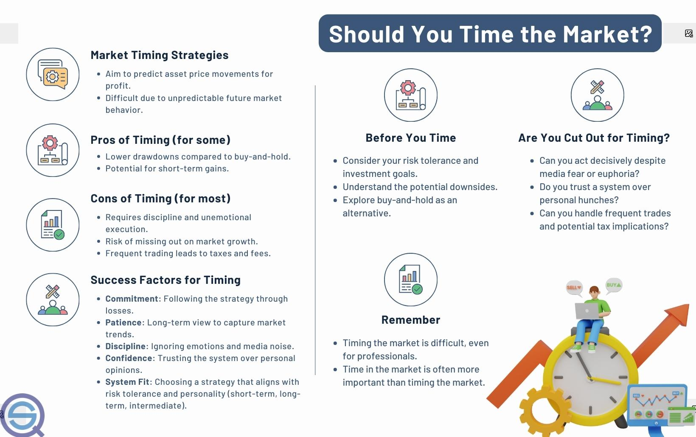

## Table of Contents

## What are the basic principles of timing stock sales?

Timing stock sales can be tricky, but there are some basic principles to keep in mind. One important principle is to have a clear plan before you start. Decide what your goals are and when you might want to sell your stocks. This could be based on reaching a certain profit, or if the stock price drops to a certain level. Having a plan helps you make decisions without getting too emotional about the ups and downs of the market.

Another principle is to pay attention to the market and the news. Big events or changes in the economy can affect stock prices. If you see something that might impact your stocks, it might be a good time to sell. Also, it's helpful to look at trends over time, not just what's happening right now. Stocks can go up and down a lot in the short term, but looking at longer trends can give you a better idea of when to sell.

Lastly, it's important to think about taxes and fees. When you sell stocks, you might have to pay taxes on any profits you make. There can also be fees for buying and selling stocks. These costs can eat into your profits, so it's good to think about them when deciding when to sell. Keeping these principles in mind can help you make smarter decisions about timing your stock sales.

## How can beginners identify the right time to sell stocks?

For beginners, figuring out the right time to sell stocks can feel tricky. One simple way to start is by setting clear goals for your stocks. Decide ahead of time what profit you want to make or how much loss you're willing to accept. This can help you sell your stocks without getting too caught up in the moment. If your stock reaches the profit you set or drops to your loss limit, it might be a good time to sell.

Another thing to watch is what's happening in the market and the news. Big events or changes in the economy can make stock prices go up or down. If you see something that might affect your stocks, it could be a sign to sell. Also, don't just look at what's happening right now. Look at how the stock has been doing over time. If it's been going down for a while, it might be time to sell, even if it goes up a little bit now and then.

Lastly, remember to think about taxes and fees. When you sell stocks, you might have to pay taxes on any money you make. There can also be fees for buying and selling stocks. These costs can take away from your profits, so keep them in mind when deciding when to sell. By setting clear goals, watching the market, and thinking about costs, beginners can get better at knowing when to sell their stocks.

## What common mistakes should be avoided when timing stock sales?

One common mistake beginners make when timing stock sales is letting emotions take over. It's easy to get excited when stock prices go up and want to hold on for even more profit. But if you don't sell when you planned to, you might miss out on your gains. On the other hand, if stock prices drop, it's easy to panic and sell too soon. Having a clear plan and sticking to it can help you avoid these emotional decisions.

Another mistake is not paying attention to the bigger picture. Sometimes, people focus too much on what's happening right now and forget to look at trends over time. Stocks can go up and down a lot in the short term, but it's the longer trends that really matter. If you only look at the short term, you might sell too early or too late. Always try to see how your stocks are doing over weeks or months, not just days.

Lastly, many beginners forget about taxes and fees. When you sell stocks, you might have to pay taxes on any profits you make. There can also be fees for buying and selling stocks. These costs can eat into your profits, so it's important to think about them when deciding when to sell. Always consider the full cost of selling before you make your move.

## How does market volatility affect the timing of stock sales?

Market [volatility](/wiki/volatility-trading-strategies) means that stock prices can go up and down a lot in a short time. This can make it hard to decide when to sell your stocks. When the market is very volatile, you might see your stock prices change a lot from day to day. This can make you feel like you need to sell quickly to avoid losing money. But selling just because the market is moving a lot can lead to selling at the wrong time. It's important to stick to your plan and not let the ups and downs of the market scare you into making a quick decision.

On the other hand, market volatility can also create opportunities. If you see that your stock has dropped a lot because of market swings, but you believe in the company long-term, you might want to hold on to it. Sometimes, waiting out the volatility can lead to bigger gains later. The key is to understand why the market is being volatile and decide if it's a good time to sell based on your goals and the bigger picture, not just the short-term ups and downs.

## What role do economic indicators play in deciding when to sell stocks?

Economic indicators are like signs that tell us how the economy is doing. They can help you decide when to sell your stocks. For example, if you see that unemployment is going up or that the economy is slowing down, it might be a good time to sell your stocks. These signs can mean that companies might not make as much money, which can make stock prices go down. So, keeping an eye on these indicators can help you sell your stocks before they lose too much value.

On the other hand, if economic indicators are showing good news, like low unemployment or a growing economy, you might want to hold onto your stocks. Good economic news can mean that companies will do well and their stock prices might go up. But remember, economic indicators are just one part of the puzzle. You should also think about your own goals and the specific stocks you own when deciding when to sell.

## How can technical analysis help in timing stock sales?

Technical analysis is a way to look at stock charts and patterns to help decide when to sell stocks. It uses things like moving averages, which show the average price of a stock over time, to see if a stock is going up or down. If a stock price goes below its moving average, it might be a sign to sell because the stock could keep going down. Technical analysis also looks at patterns like "head and shoulders" or "double tops," which can tell you if a stock might be about to drop. By studying these patterns, you can make a better guess about when to sell your stocks.

Another part of technical analysis is looking at things like [volume](/wiki/volume-trading-strategy), which is how many shares of a stock are being traded. If a lot of people are selling a stock and the volume is high, it might be a good time for you to sell too. Technical analysis also uses tools like the Relative Strength Index (RSI), which tells you if a stock is overbought or oversold. If the RSI shows a stock is overbought, it might be time to sell because the price could go down soon. By using these tools and patterns, technical analysis can help you time your stock sales better and make more informed decisions.

## What are the tax implications of timing stock sales?

When you sell stocks, you need to think about taxes. If you make a profit, you have to pay capital gains tax. How much tax you pay depends on how long you held the stock. If you held it for more than a year, it's called a long-term capital gain, and the tax rate is usually lower. But if you held it for less than a year, it's a short-term capital gain, and you'll pay a higher tax rate, like your regular income tax. So, timing your stock sales can help you pay less in taxes. If you can wait until you've held the stock for over a year, you might save money on taxes.

Another thing to think about is the tax year. If you sell stocks near the end of the year, it might push you into a higher tax bracket for that year. This means you could pay more in taxes than if you waited until the next year. Also, if you have losses from selling stocks, you can use those losses to lower your taxes. You can use up to $3,000 of losses to reduce your taxable income each year. So, timing your sales to use these losses can help you save on taxes. It's a good idea to talk to a tax advisor to make the best plan for your situation.

## How should long-term investment goals influence the timing of stock sales?

Long-term investment goals should guide when you decide to sell your stocks. If your goal is to save for retirement or a big purchase far in the future, you might not need to sell your stocks right away. Instead, you can keep them for a long time, hoping they will grow in value. This means you might wait to sell until you are closer to your goal or until the stock reaches a price you're happy with. By focusing on your long-term goals, you can avoid selling your stocks too soon just because the market is going up and down.

On the other hand, if your long-term goal is to build a steady income from your investments, you might sell stocks at different times to get money when you need it. For example, you could sell some stocks each year to give yourself a regular income. This way, you can still keep some of your stocks for the long term while using others to meet your income needs. By thinking about your long-term goals, you can make smarter choices about when to sell your stocks and make sure they help you reach what you want in the future.

## What advanced strategies can be used for timing stock sales in different market conditions?

One advanced strategy for timing stock sales is using options. Options let you buy or sell stocks at a certain price in the future. You can use options to protect your stocks from big drops in the market. For example, if you think the market might go down soon, you can buy a "put option." This gives you the right to sell your stock at today's price, even if the market drops. This way, you can wait to see if the market goes back up before you sell your stock. Options can be tricky, so it's good to learn about them before you start using them.

Another strategy is called dollar-cost averaging. This means you sell your stocks a little bit at a time instead of all at once. This can help you avoid selling all your stocks when the market is low. For example, if you have 100 shares, you might sell 20 shares each month for five months. This way, you can sell some shares when the price is high and some when it's low, which can help you get a better average price. Dollar-cost averaging works well in different market conditions because it helps you spread out the risk of selling at the wrong time.

Lastly, you can use sector rotation to time your stock sales. This means you watch which parts of the economy are doing well and sell stocks from the parts that are not doing as well. For example, if technology stocks are going up but energy stocks are going down, you might sell your energy stocks and keep your technology stocks. Sector rotation can help you take advantage of changes in the market. By moving your money from weaker sectors to stronger ones, you can make better decisions about when to sell your stocks.

## How can portfolio diversification impact the timing of stock sales?

Portfolio diversification means spreading your money across different types of investments, like stocks, bonds, and real estate. When you have a diversified portfolio, it can affect when you decide to sell your stocks. If one part of your portfolio is doing really well, like your technology stocks, you might not need to sell them right away. But if another part, like your energy stocks, is not doing so well, you might decide to sell those to cut your losses. By having different investments, you can balance out the ups and downs of the market and make smarter choices about when to sell.

Diversification also helps you think about your overall investment goals. If you have a mix of short-term and long-term investments, you can time your stock sales to meet those different goals. For example, you might sell some stocks to get money for a short-term need, like buying a house, while keeping other stocks for your long-term retirement plan. This way, you can sell your stocks at the right times to help you reach your different goals without putting all your eggs in one basket.

## What are the psychological factors to consider when timing stock sales?

When you're thinking about when to sell your stocks, it's important to understand how your feelings can affect your choices. One big feeling is fear. If the market is going down and you're scared of losing more money, you might sell your stocks too soon. This is called "panic selling." On the other hand, if you're feeling too excited because your stocks are going up a lot, you might hold onto them too long, hoping for even more profit. This can make you miss the best time to sell. It's good to have a plan and stick to it, so your feelings don't make you sell at the wrong time.

Another feeling to watch out for is overconfidence. Sometimes, if you've made good choices before, you might think you can always pick the right time to sell. But the market can be hard to predict, and thinking you know everything can lead to bad decisions. It's also important to think about "loss aversion," which means you might hold onto a stock that's losing money because you don't want to accept the loss. But sometimes, selling a losing stock can be the smart move. By understanding these feelings and having a clear plan, you can make better choices about when to sell your stocks.

## How do global economic events influence the optimal timing for selling stocks?

Global economic events can have a big impact on when you should sell your stocks. Things like changes in interest rates, big political events, or even natural disasters in other countries can make stock prices go up or down. For example, if a big country like the United States raises its interest rates, it might make borrowing money more expensive for companies. This can slow down the economy and make stock prices drop. So, if you see these kinds of events happening, it might be a good time to sell your stocks before they lose too much value.

On the other hand, good global economic news can make stock prices go up. If a country's economy is growing fast or if there's a big trade deal between countries, it can make people feel more confident about investing. This can push stock prices higher. If you think these good events will keep happening, you might want to hold onto your stocks longer to get more profit. But remember, global events can be hard to predict, so it's important to keep watching the news and think about how these events fit into your own investment plan.

## References & Further Reading

[1]: Bergstra, J., Bardenet, R., Bengio, Y., & Kégl, B. (2011). ["Algorithms for Hyper-Parameter Optimization."](https://dl.acm.org/doi/10.5555/2986459.2986743) Advances in Neural Information Processing Systems 24.

[2]: ["Advances in Financial Machine Learning"](https://www.amazon.com/Advances-Financial-Machine-Learning-Marcos/dp/1119482089) by Marcos Lopez de Prado

[3]: ["Evidence-Based Technical Analysis: Applying the Scientific Method and Statistical Inference to Trading Signals"](https://www.amazon.com/Evidence-Based-Technical-Analysis-Scientific-Statistical/dp/0470008741) by David Aronson

[4]: ["Machine Learning for Algorithmic Trading"](https://github.com/stefan-jansen/machine-learning-for-trading) by Stefan Jansen

[5]: ["Quantitative Trading: How to Build Your Own Algorithmic Trading Business"](https://www.amazon.com/Quantitative-Trading-Build-Algorithmic-Business/dp/1119800064) by Ernest P. Chan