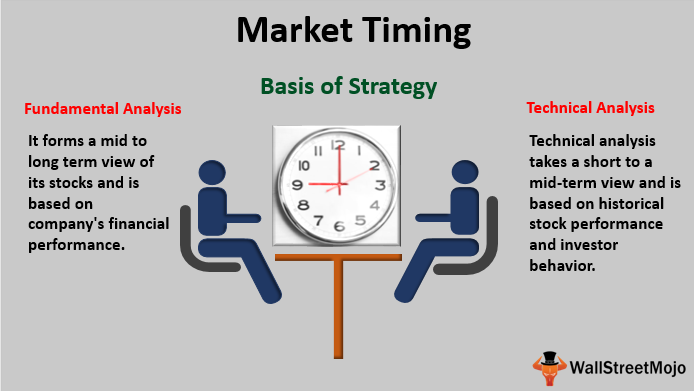

In the fast-paced world of investing, timing is a crucial element that can significantly influence returns. Investment professionals and individual investors alike recognize that the precise timing of market entries and exits is fundamental to maximizing returns and minimizing losses. This article explores the key aspects of investment advice, timing sales, and the influence of stock market algorithmic trading, three interrelated areas that play pivotal roles in crafting successful investment strategies.

Optimal timing is about acting at the most favorable moments based on analysis and market conditions. Investors who master timing stand to enhance their profits significantly. This involves not only knowing the right time to buy assets but also recognizing when to sell them to preserve or maximize capital. The ability to time sales effectively can be achieved by considering various indicators, such as economic data, market sentiment, and specific stock performance metrics.



Algorithmic trading has transformed how market timing is approached. By using computer algorithms, traders can execute orders at speeds and frequencies impossible for a human trader. These algorithms analyze vast datasets to predict price movements and determine favorable entry and exit points. Understanding how algorithmic trading functions and affects market dynamics allows investors to better align their personal strategies with contemporary trading environments.

Whether you're navigating the market for the first time or are experienced, grasping these concepts is essential. Such an understanding can significantly boost your portfolio's performance by improving your investment strategy through informed decision-making. By aligning your approach to include optimal timing, algorithmic insights, and strategic selling, you equip yourself to navigate the complexities of modern financial markets more effectively.

## Table of Contents

## The Importance of Timing in Investment

Timing is a critical element in investing that can determine the success or failure of a portfolio. The decision of when to buy or sell securities deeply impacts overall returns and portfolio performance. While market timing can be notoriously difficult, integrating it into investment strategies is essential for achieving optimal results. 

Market timing involves predicting future market price movements to make decisions about buying or selling securities at the right moment. This requires a sophisticated understanding of market dynamics, economic indicators, and investor sentiment. It is often compared to both fundamental and technical analysis, each providing different insights. Fundamental analysis focuses on the intrinsic value of a security based on company performance, while technical analysis examines historical price and volume data to identify patterns and trends.

Despite the challenges associated with market timing, it provides a framework for making informed investment decisions. Investors who master timing can potentially enhance their returns by entering or exiting positions at advantageous moments. Various strategies can be employed to aid in effective market timing, such as [momentum](/wiki/momentum) trading, which involves buying securities that have shown an upward trend, or contrarian investing, which involves purchasing assets contrary to prevailing market sentiment.

However, it is important to acknowledge the risks involved. Markets are influenced by an array of unpredictable factors, making precise timing difficult. This uncertainty can lead to potential misjudgments. Hence, a balanced approach, combining market timing with other analytical tools, is recommended for investors aiming at maximizing returns while mitigating risk.

In summary, while market timing is complex, it remains an indispensable aspect of crafting a robust investment strategy. It allows investors to make educated guesses on market movements, enhancing their ability to generate significant returns over time.

## Algorithmic Trading: A Game Changer

Algorithmic trading, commonly known as algo trading, revolutionizes the financial markets by employing computer algorithms to execute trading orders at exceedingly high speeds, often within microseconds. These algorithms are designed to make rapid and informed trading decisions by processing immense volumes of data, a task typically impossible for human traders to perform with the same efficiency and speed.

At its core, [algorithmic trading](/wiki/algorithmic-trading) leverages complex mathematical models and statistical analyses. The algorithms are programmed to follow a set of rules or conditions that determine when and how trades should be placed. This automated approach enables traders to exploit market conditions, such as price discrepancies and market inefficiencies, that are too fleeting for manual trading to capture.

Algorithmic trading's capacity to handle vast datasets is particularly advantageous for analyzing historical and real-time market data to identify lucrative trading opportunities. For instance, high-frequency trading ([HFT](/wiki/high-frequency-trading-strategies)), a subset of algorithmic trading, can predict market trends by evaluating large datasets to capture [arbitrage](/wiki/arbitrage) opportunities. The algorithms can incorporate indicators such as moving averages, momentum, and [volume](/wiki/volume-trading-strategy), allowing traders to act swiftly on them.

Another significant impact of algorithmic trading is its role in stock market timing. By analyzing patterns and market signals at a granular level, algorithms can suggest optimal entry and [exit](/wiki/exit-strategy) points for trades, improving the timing of buy and sell decisions. This precision timing can be crucial for investors aiming to maximize their returns while minimally exposing themselves to market risk.

Moreover, individual investors can gain valuable insights by examining how algorithms influence market dynamics. Understanding the strategies employed by algo traders—such as [trend following](/wiki/trend-following), [statistical arbitrage](/wiki/statistical-arbitrage), and mean reversion—can help individual investors tailor their strategies in harmony with these automated systems. For instance, by observing the impact of an algorithm's trading patterns on stock prices, investors can adjust their portfolios accordingly or even develop their algorithmic strategies to stay competitive.

Recognizing the influence of algorithmic trading, the use of these systems has surged in recent years, with a significant proportion of trades on major exchanges now facilitated by algorithms. This shift underscores the importance of technology in modern trading and highlights the necessity for traders, both institutional and individual, to harness such tools to remain effective in highly competitive markets.

In summary, algorithmic trading has fundamentally transformed financial markets through its ability to execute high-speed trades, process extensive data rapidly, and optimize market timing. As this technology continues to evolve, its impact on trading strategies and market conditions will only become more pronounced, offering traders unparalleled capabilities to enhance their decision-making processes and trading outcomes.

## When to Sell: Tips for Investors

Knowing when to sell a stock is as pivotal as the decision to purchase one. Numerous indicators may signal the appropriate time to divest a stock from your portfolio, and a strategic approach is essential to maximize returns and minimize potential risks.

One primary indicator is the achievement of price targets. Investors set these targets based on expected growth or valuation metrics. Once the stock hits or surpasses this predefined price level, selling becomes a way to lock in profits. For instance, if an investor buys a stock at $50, anticipating it will rise to $75, reaching this threshold provides a rational sell signal.

Deterioration in fundamentals is another critical cue for selling. This encompasses elements like declining earnings, shrinking profit margins, or worsening debt levels. A thorough examination of financial statements and earnings reports can uncover signs of trouble, suggesting it may be prudent to liquidate holdings before losses mount.

Additionally, better investment opportunities can drive the decision to sell. Allocating capital to assets with superior growth potential or more attractive valuations can enhance overall portfolio performance. Reassessing current investments in light of emerging prospects should be a regular practice for astute investors.

Corporate actions such as mergers or acquisitions can also necessitate selling. These events might lead to significant changes in a company's business model or financial status, potentially affecting the stock's future performance. In such cases, investors need to evaluate whether the newly formed entity aligns with their investment goals.

Bankruptcy scenarios, while rarer, are a clear indication to sell. These situations drastically diminish a stock’s value and [liquidity](/wiki/liquidity-risk-premium), posing significant risks to investors. Proactive selling before a company files for bankruptcy can mitigate severe losses.

The decision to sell should blend data-driven insights with strategic foresight. Leveraging analytical tools such as discounted cash flow models or price-to-earnings ratios provides a quantifiable foundation for sell decisions. However, qualitative factors, including market conditions and geopolitical events, also warrant consideration.

For investors seeking a programmatic approach, Python can be leveraged to set up algorithms that monitor stock performance against pre-established criteria. For instance:

```python
def should_sell(price_target, current_price, fundamentals, market_conditions):
    if current_price >= price_target:
        return True
    if fundamentals == 'deteriorating':
        return True
    if market_conditions == 'unfavorable':
        return True
    return False

# Sample usage
price_target = 75
current_price = 80
fundamentals = 'stable'
market_conditions = 'favorable'

sell_decision = should_sell(price_target, current_price, fundamentals, market_conditions)
```

This hybrid approach to decision-making, integrating both computational advancements and human expertise, optimizes the timing of sales, ultimately fostering enhanced investment outcomes.

## The Role of Algorithmic Trading in Market Liquidity and Volatility

Algorithmic trading, a hallmark of modern financial markets, plays a significant role in shaping market liquidity and [volatility](/wiki/volatility-trading-strategies). By allowing transactions to be automated and executed at high speed, algorithmic trading enhances market liquidity, characterized by the ease with which assets can be bought and sold. This process often leads to tighter bid-ask spreads—the difference between the highest price a buyer is willing to pay and the lowest price a seller is willing to accept. Tighter spreads reduce the cost of trading, making markets more efficient and accessible.

The effect of algorithmic trading on price discovery is another key aspect of its contribution to market liquidity. Price discovery refers to the process by which market prices are determined through the interaction of buyers and sellers. Algorithms can process and react to market information much faster than human traders, aiding in the quick adjustment of prices to reflect new data. This capability enhances the transparency and efficiency of financial markets, as prices more accurately reflect the underlying value of traded assets.

Despite these benefits, algorithmic trading also introduces challenges, particularly in terms of market volatility. The rapid execution of trades can amplify price movements, potentially leading to sudden and significant fluctuations in asset prices. This heightened volatility is often a result of high-frequency trading (HFT), a subset of algorithmic trading that takes advantage of small price disparities across markets by executing a large number of orders in fractions of a second. The speed and volume of such trades can create feedback loops, where initial price shifts trigger a cascade of subsequent trades that amplify the original movement.

Flash crashes—brief, dramatic drops in asset prices followed by quick recoveries—exemplify the potential risks associated with algorithmic trading-induced volatility. For instance, the May 6, 2010, flash crash witnessed the Dow Jones Industrial Average plummet nearly 1,000 points within minutes, driven by aggressive automated trading algorithms.

To navigate these complexities, investors need a nuanced understanding of how algorithmic trading affects both liquidity and volatility. It involves recognizing the dual nature of these algorithms: they contribute to more efficient markets through improved liquidity and price discovery, yet also pose risks through potential volatility spikes. Regulatory frameworks and circuit breakers are tools to mitigate excessive volatility, ensuring markets remain orderly even as trading technologies evolve.

In summary, while algorithmic trading significantly enhances market liquidity, its impact on volatility calls for careful consideration and adaptation by market participants. Understanding these dynamics empowers investors to make informed decisions in today's rapidly evolving financial landscape.

## Strategies for Successful Market Timing

Market timing involves strategic decision-making that goes beyond chance. Successful market timing requires an understanding of market trends, pattern recognition, and the cyclical nature of financial markets. Investors use various strategies to make informed trading decisions and optimize their portfolios. Three commonly employed strategies are trend following, mean reversion, and index fund rebalancing. Each strategy has distinct characteristics and takes a different approach to capitalizing on market movements, aligning with investors' risk tolerance and financial objectives.

Trend following is a strategy where investors attempt to capitalize on market movements by aligning their trades with established market trends. The fundamental principle behind trend following is that asset prices tend to move in sustained trends due to investor behavior. Traders using this strategy typically rely on technical analysis, employing tools like moving averages, trend lines, and momentum indicators to identify ongoing trends and potential entry and exit points. This strategy can be effective during periods of strong trending markets but may struggle in sideways or volatile market conditions where prices lack clear direction.

Mean reversion is another widely-used market timing strategy, premised on the idea that asset prices tend to revert to their historical average or mean over time. Investors employing a mean reversion strategy look for assets that have deviated significantly from their long-term average price, with the expectation that these prices will eventually return to their historical norms. Key indicators for mean reversion include moving averages, Bollinger Bands, and historical price ranges. While this strategy can be profitable in choppy or range-bound markets, it can lead to losses if assets continue in an extended trend without reverting.

Index fund rebalancing involves adjusting the weightings of assets within a portfolio. This strategy is based on the notion that periodic rebalancing helps maintain a desired risk level and captures gains from outperforming assets. Often, investors set a target asset allocation that reflects their risk preferences and financial goals, then regularly assess and adjust their portfolios to ensure they align with these targets. Rebalancing acts as a risk control measure, preventing overexposure to outperforming sectors or securities. This approach can be particularly effective for long-term investors seeking stable growth and risk management.

In practice, these market timing strategies may be combined or adjusted to fit an investor's specific needs. An investor might decide to follow trends within certain asset classes while simultaneously employing mean reversion techniques for others. Additionally, quantitative analysis and data-driven insights are often integrated into strategy execution, allowing investors to make more informed decisions. By aligning these strategies with personal risk tolerance and financial objectives, investors can enhance their likelihood of making timely and profitable investment decisions.

## Balancing Human Insight and Algorithmic Analysis

In contemporary investing, integrating human insight with algorithmic analysis offers a robust approach to maximizing returns. While algorithms excel in processing large datasets at high speeds, providing rapid and precise trade executions, they lack the nuanced understanding that human judgment can offer. This dual approach leverages the strengths of both technology and human insight, creating a comprehensive strategy that adapts to complex market conditions.

Algorithms are designed to detect patterns and execute trades based on predefined criteria. They can analyze past market data, recognize trends, and predict short-term price movements with a high degree of accuracy. For example, a momentum algorithm might identify an upward trend in a stock's price and automatically place buy orders to capitalize on this trajectory. The mathematical underpinnings of such algorithms often rely on sophisticated statistical models and [machine learning](/wiki/machine-learning) techniques. Python, a popular language for algorithmic trading, provides libraries such as NumPy and pandas, which are instrumental in handling and analyzing vast datasets efficiently.

However, this mechanized approach has limitations. It often fails to account for qualitative factors such as political events, regulatory changes, or unexpected economic shifts that can influence market behavior. Human investors, with their capacity for qualitative analysis, can interpret such events and adjust strategies accordingly. They can assess the broader economic landscape, drawing connections that an algorithm, confined by its code, would overlook.

A hybrid investment strategy melds these quantitative and qualitative aspects. By using algorithms for routine data analysis and trade execution, investors can free themselves to focus on complex decision-making processes influenced by external factors. Consider the following Python snippet, which illustrates a simple moving average strategy to identify potential buying opportunities. This example highlights the quantitative component of the hybrid approach:

```python
import pandas as pd

# Load stock data
data = pd.read_csv('stock_data.csv')

# Calculate moving averages
data['SMA_50'] = data['Close'].rolling(window=50).mean()
data['SMA_200'] = data['Close'].rolling(window=200).mean()

# Identify potential buy signals
data['Buy_Signal'] = (data['SMA_50'] > data['SMA_200']) & (data['SMA_50'].shift(1) <= data['SMA_200'].shift(1))

# Print potential buy dates
print(data[data['Buy_Signal']])
```

This code calculates two moving averages (50-day and 200-day) and generates buy signals when the short-term moving average crosses above the long-term average. While the algorithm detects potential opportunities quantitatively, the final investment decision can be refined by human insight. Investors might consider additional factors such as the company's latest earnings report or macroeconomic conditions before executing trades.

By harnessing both algorithmic precision and human intuition, investors create robust strategies that are resilient to market fluctuations. This synthesis not only optimizes decision-making but also provides a safeguard against the limitations inherent in relying solely on automation or intuition. Ultimately, balancing human insight with algorithmic analysis empowers investors to navigate the complexities of modern markets with greater confidence and agility.

## Conclusion

Incorporating timing strategies and leveraging algorithmic trading can significantly impact investment performance by enhancing the precision and efficiency of trading activities. Algorithmic trading uses mathematical models and statistical analysis to execute trades at speeds and frequencies not possible for human traders. This capability allows investors to respond rapidly to market movements, thus optimizing entry and exit points and potentially increasing returns.

Investors who understand and adapt to technological advancements in trading can position themselves more strategically in the market. By integrating programming skills and data analytics, they can customize trading algorithms to suit their investment style and risk tolerance. Such an approach fosters a proactive stance, enabling investors to seize profitable opportunities and mitigate risks effectively.

Staying informed and adaptable is essential to thriving in the evolving landscape of investment and stock market trading. Continual learning and adaptation to new tools and techniques can provide a competitive edge. Embracing a mindset of perpetual growth and innovation helps investors navigate the complexities of modern financial markets, thereby placing themselves at an advantageous position to benefit from ever-changing market dynamics.

## References & Further Reading

[1]: Bergstra, J., Bardenet, R., Bengio, Y., & Kégl, B. (2011). ["Algorithms for Hyper-Parameter Optimization."](https://dl.acm.org/doi/10.5555/2986459.2986743) Advances in Neural Information Processing Systems 24.

[2]: ["Advances in Financial Machine Learning"](https://www.amazon.com/Advances-Financial-Machine-Learning-Marcos/dp/1119482089) by Marcos Lopez de Prado

[3]: ["Evidence-Based Technical Analysis: Applying the Scientific Method and Statistical Inference to Trading Signals"](https://www.amazon.com/Evidence-Based-Technical-Analysis-Scientific-Statistical/dp/0470008741) by David Aronson

[4]: ["Machine Learning for Algorithmic Trading"](https://github.com/stefan-jansen/machine-learning-for-trading) by Stefan Jansen

[5]: ["Quantitative Trading: How to Build Your Own Algorithmic Trading Business"](https://www.amazon.com/Quantitative-Trading-Build-Algorithmic-Business/dp/1119800064) by Ernest P. Chan