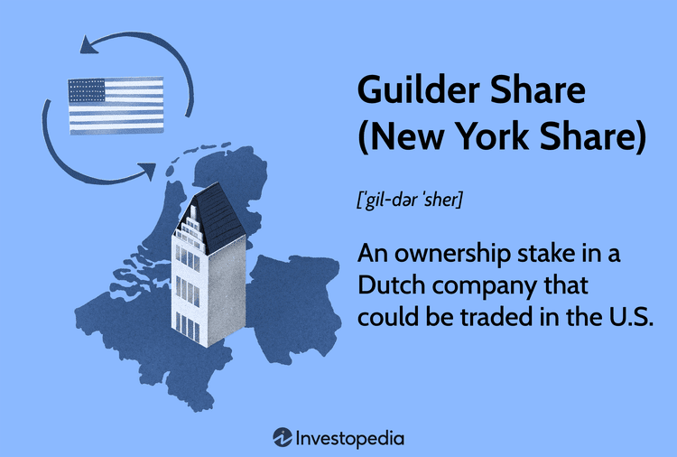

Guilder shares, colloquially referred to as New York Shares, played a critical role in global trading practices involving Dutch companies prior to the development of American Depository Receipts (ADRs). These financial instruments were integral at a time when strict Dutch regulations prohibited the trading of domestic stocks on foreign exchanges. By creating a workaround, Guilder shares enabled U.S. investors to own stakes in companies primarily listed in the Netherlands, while Dutch companies could still tap into the capital-rich U.S. markets. This mechanism fundamentally allowed Dutch businesses to grow internationally, despite regulatory constraints.

This article examines the trajectory of Guilder shares, from their inception as a financial innovation to their eventual transition into ADRs. Such shares provided a bridge between geographically diverse markets, facilitating international investment and expanding economic opportunities. Furthermore, we will evaluate the impact of these shares on both U.S. investors and Dutch enterprises, considering the regulatory and economic changes they introduced.

Moreover, this discussion will highlight how the transition from Guilder shares to ADRs represented an essential evolution in global trading mechanisms. ADRs have since become the preferred method of international equity trading, offering enhanced accessibility and efficiency. By reviewing this historical shift, we aim to underscore the legacy of Guilder shares and their contribution to the modern framework for cross-border financial integration.

## Table of Contents

## What Were Guilder Shares?

Guilder shares were a financial instrument representing ownership stakes in Dutch companies that were traded in the United States through the New York Stock Exchange (NYSE). These shares offered a solution for U.S. investors interested in purchasing stakes in Dutch companies without requiring the movement of the actual shares across international borders. 

The need for Guilder shares arose from strict Dutch regulations that prohibited the trading of domestic stocks outside the Netherlands. These regulations aimed to maintain control over the local financial market and protect the Dutch economy by ensuring that trading activities remained within the country's jurisdiction. As a consequence, Dutch companies struggled to attract foreign investment, particularly from lucrative markets such as the United States.

To circumvent these restrictions, Guilder shares were introduced as a creative workaround. They allowed U.S. investors to effectively own portions of Dutch companies without transgressing Dutch regulatory constraints. The concept involved canceling shares in the Netherlands, consolidating them, and issuing equivalent securities on the NYSE as Guilder shares. This process ensured compliance with Dutch laws while simultaneously granting foreign investors the ability to participate in the Dutch economy.

Guilder shares provided numerous advantages. They enabled Dutch companies to tap into the vast pool of American capital, thereby fostering economic growth and expansion. Moreover, U.S. investors benefited by gaining access to profitable investment opportunities in the Dutch market. The introduction of Guilder shares was a pivotal development in cross-border financial transactions, setting a precedent for future innovations in international trading systems.

## Mechanism of Guilder Shares

Guilder shares were a distinctive financial instrument designed to navigate the restrictive Dutch regulatory environment that prohibited the trading of domestic stocks beyond its borders. The mechanism of Guilder shares was an innovative process that allowed Dutch companies to tap into the expansive U.S. capital markets through the New York Stock Exchange (NYSE).

The procedure began with the cancellation of shares within the Netherlands. This step was vital as it adhered to the Dutch laws that prevented the direct listing of domestic shares abroad. Once the shares were canceled, they were consolidated into a new form—Guilder shares—which could then be issued and traded on the NYSE. By transforming these shares, Dutch companies could attract investment from U.S. investors without violating any national regulations that restricted foreign trading of their original stock.

The concept effectively separated the ownership interest from the traditional geographic and regulatory confines. This financial maneuver provided a legal and efficient means for Dutch companies to secure much-needed capital from abroad while remaining compliant with their domestic laws. The regulatory framework necessitated such an approach, considering the stringent controls in place at the time, which were primarily designed to protect national economic interests and ensure adequate oversight of domestic corporate entities.

Guilder shares, therefore, served as a balancing act between regulatory compliance and international financial participation. They reflected an early effort to globalize capital markets, whereby Dutch firms could enhance their financial reach and diversify their investor base.

The introduction and operation of Guilder shares marked a foundational period in the history of international financial transactions, bridging national markets and setting the stage for future developments like American Depository Receipts (ADRs), which continue to facilitate cross-border investments to this day.

While Guilder shares are no longer in use, their role in enabling cross-border investment laid an important groundwork for the more sophisticated and flexible systems that followed. This historical mechanism underscores the continuous evolution of financial instruments in response to regulatory and market demands, highlighting the dynamic interplay between local laws and global market forces.

## The Shift to American Depository Receipts (ADRs)

With globalization accelerating in the latter half of the 20th century, the need for Guilder shares diminished considerably as American Depository Receipts (ADRs) emerged as the preferred method for foreign companies to list their shares on U.S. markets. The introduction of ADRs offered several advantages over the traditional Guilder shares, significantly impacting how Dutch companies approached their international trading strategies.

ADRs provide a more accessible and streamlined approach for foreign companies and U.S. investors alike. By allowing non-U.S. companies to have their shares traded in U.S. dollars, ADRs simplify the investment process for American investors who are less familiar with foreign currencies and the associated risks. This currency handling feature of ADRs mitigates potential exchange rate fluctuations, offering a more stable investment option for U.S. traders.

Moreover, the process of handling ADRs is considerably simplified compared to the older system of Guilder shares. When Dutch companies utilize ADRs, they typically engage with a depository bank in the U.S., which issues the ADRs on their behalf. This system omits the complicated procedures of canceling and consolidating shares in the Netherlands, as was necessary with Guilder shares, thereby easing the regulatory and administrative burden on these companies.

Today, ADRs represent a widely utilized framework by which Dutch companies can access the U.S. financial markets. This evolution reflects a broader trend of increased global financial integration, driven by the mechanisms that ADRs provide. Such mechanisms have allowed companies like Royal Dutch Shell, ASML Holding, and Unibail-Rodamco-Westfield to effortlessly tap into U.S. capital, contributing to a more interconnected global economy.

The widespread adoption of ADRs not only marks a shift in international trading practices but also underscores the continuous evolution of financial instruments to better accommodate the needs of both companies and investors in a rapidly globalizing world. This transition highlights the efficacy of ADRs in providing a more integrated, systematic approach to cross-border investment, paving the way for future advances in international financial operations.

## Current State of Dutch ADRs

Several Dutch companies currently list American Depository Receipts (ADRs), offering U.S. investors simplified access to foreign investments and increased exposure to the Dutch market. Prominent Dutch firms such as Royal Dutch Shell, ASML Holding, and Unibail-Rodamco-Westfield have embraced ADRs, capitalizing on their potential to attract a diverse pool of international investors.

**Royal Dutch Shell** is a prime example of a Dutch company leveraging ADRs to broaden its investor base. By listing on U.S. exchanges through ADRs, Shell allows American investors to participate in its performance without the complexity of dealing with foreign equity regulations and currency conversions.

**ASML Holding**, recognized for its significant role in the semiconductor industry, also benefits from the ADR structure. Investors interested in the burgeoning field of technology manufacturing can access ASML’s stocks with relative ease, thanks to the accessibility ADRs provide. This simplifies the trading process and eliminates concerns about foreign exchange fluctuations for U.S. investors.

**Unibail-Rodamco-Westfield**, a leading commercial real estate company, enhances its global capital reach through ADR listings. By facilitating investment flows from the U.S., it sustains a broader shareholder base and secures flexibility in managing its capital market activities.

Beyond traditional exchanges, the Over-The-Counter (OTC) market further diversifies the avenues available for U.S. investors to invest in Dutch entities. This market supports an even broader selection of ADRs, covering a spectrum of Dutch companies across various sectors. The OTC market is crucial for smaller firms or those seeking a more cost-effective method of entering the U.S. financial landscape. As an informal trading network, the OTC market provides flexibility and accessibility, expanding investment opportunities outside the formal stock exchanges.

Overall, the current state of Dutch ADRs reflects a mature integration of Dutch corporates into the U.S. market, providing mutual benefits of [liquidity](/wiki/liquidity-risk-premium), diversification, and international exposure for both Dutch companies and U.S. investors.

## Impact on the New York Stock Exchange (NYSE) and U.S. Investors

Guilder shares significantly influenced the dynamics of the New York Stock Exchange (NYSE) by enabling the listing of Dutch companies in the U.S. financial markets. Before the advent of American Depository Receipts (ADRs), these shares played a critical role in circumventing the limitations imposed by Dutch regulations on foreign trading of domestic stocks. This mechanism allowed Dutch corporations to access U.S. capital markets, thus facilitating an early form of international stock trading that was vital in the pre-globalization era.

One of the primary impacts of Guilder shares on the NYSE was the enhancement of diversity in investment opportunities available to U.S. investors. By providing access to stakes in prominent Dutch companies without the complexities associated with foreign trading, these shares contributed to the expansion of international portfolios among U.S. investors. This, in turn, laid the groundwork for future cross-border investment strategies and processes that are more seamless and integrated today.

As the financial world transitioned towards globalization, ADRs evolved to offer a more streamlined and efficient method of trading foreign stocks. For U.S. investors, ADRs mitigated many of the challenges previously associated with Guilder shares, such as currency conversion issues and regulatory hurdles. ADRs not only simplified the investment process but also enhanced liquidity and transparency in cross-border trading. This modern approach retains the legacy of cross-border cooperation initiated by Guilder shares, making foreign investment more accessible and enticing for a broader range of individual and institutional investors.

In summary, Guilder shares were pivotal in setting the stage for the internationalization of the NYSE. Their historical significance is preserved and extended through the use of ADRs, which continue to connect global markets, fostering a symbiotic relationship between U.S. investors and foreign enterprises.

## Conclusion

The transition from Guilder shares to American Depository Receipts (ADRs) marks a significant evolution in international trading practices. Initially, Guilder shares served as an innovative solution to strict Dutch regulations, enabling U.S. investors to participate in the Dutch financial market. However, as global financial markets evolved and integration increased, ADRs emerged as a more efficient mechanism for facilitating cross-border investments.

ADRs have effectively simplified foreign investments by providing a structured pathway for investors to hold shares in foreign companies through U.S. financial institutions. This simplification is reflected in the reductions in transaction costs, streamlined regulatory requirements, and improved liquidity for foreign securities in the U.S. market. In mathematical terms, ADRs eliminate the complexity of currency conversion and domestic taxation, allowing investors to focus on the fundamental performance of foreign companies, improving capital allocation efficiency on a global scale.

The legacy of Guilder shares remains an important historical precedent for modern cross-border trading arrangements. Their initial strategy of circumventing local market restrictions laid the groundwork for institutionalized global equity trading. While the mechanisms have changed, the core objective of expanding access to foreign market opportunities continues to drive innovation in international finance. Thus, the evolution from Guilder shares to ADRs has not only enhanced market accessibility but also fortified the framework for current and future global financial integration.

## References & Further Reading

[1]: ["The World's First Stock Exchange"](https://www.amazon.com/Worlds-Exchange-Columbia-Business-Publishing/dp/0231163789) by Lodewijk Petram

[2]: ["The Rise and Fall of the British Nation: A Twentieth-Century History"](https://www.amazon.com/Rise-Fall-British-Nation-Twentieth-Century/dp/0141975970) by David Edgerton (for historical context on global financial markets)

[3]: ["International Investments"] by Bruno Solnik and Dennis McLeavey (provides insight into cross-border investment practices)

[4]: ["American Depositary Receipts (ADRs): An Overview"](https://www.investopedia.com/terms/a/adr.asp) - Franklin Templeton Blog

[5]: ["Cross-Border Equity Trading"](https://repository.essex.ac.uk/23310/1/Alderighi_cross_border_flows.pdf) by CFA Institute Research Foundation (insights into mechanisms like Guilder shares and ADRs)