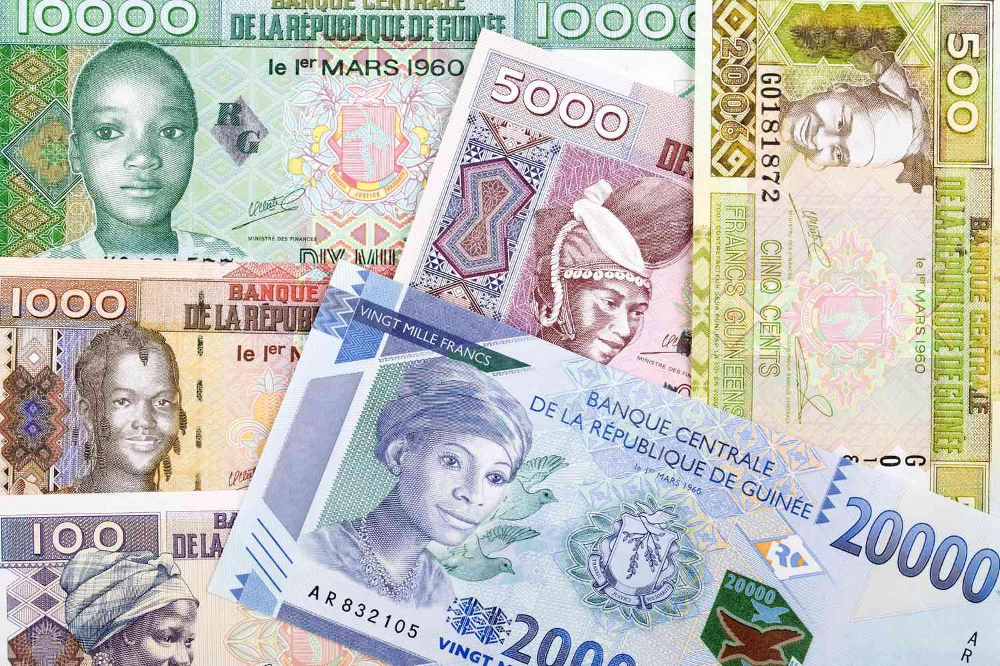

The Guinean Franc (GNF) serves as the official monetary unit of Guinea, a nation situated in the heart of West Africa. Despite its modest visibility on the global financial stage, the GNF occupies a critical position in Guinea's economic framework. A comprehensive analysis of this currency and its implications reveals insightful connections between the GNF and Guinea's economic performance, especially against the backdrop of advancements in algorithmic trading.

Algorithmic trading, often referred to as algo trading, employs intricate algorithms to make automated trading decisions. This approach is gaining significant traction in emerging markets, as it enhances the efficiency and speed of trading operations. With the GNF's integral role in Guinea's economy, understanding its evolution and current status is crucial, particularly when considering how algorithmic trading might transform currency trading in this region. For investors, insight into the GNF’s history, its economic impact, and the potential offered by algorithmic trading can provide a strategic advantage, offering a unique lens through which to view potential market opportunities and challenges.



## Table of Contents

## Understanding the Guinean Franc

The Guinean Franc (GNF), the official currency of the Republic of Guinea, has played a pivotal role in the nation's quest for economic stability and independence. Its history can be traced back to the period following Guinea's independence from France in 1958 when the nation took definitive steps to assert its monetary sovereignty. Prior to this, Guinea was part of the West African Franc Zone and used the CFA franc, a currency shared by several former French colonies in Africa.

The transition to the Guinean Franc marked a critical move towards financial independence, enabling Guinea to fashion monetary policies better suited to its unique economic circumstances. Upon its introduction, the GNF was pegged to the French franc, but Guinea eventually adopted a floating exchange rate system. This shift allowed the GNF to fluctuate based on supply and demand conditions in the global currency markets.

A floating exchange rate can contribute to economic sovereignty, enabling the country to employ independent monetary policies that target domestic economic conditions rather than maintaining currency stability with a foreign anchor. The mathematics of a floating rate are relatively straightforward: exchange rates between two currencies are determined by the ratio of demand for each currency. For instance, if the supply (S) of GNF is significantly less than its demand (D), the exchange rate (E) with another currency, like the USD, can be expressed as:

$$
E = \frac{D}{S}
$$

Over the years, the Guinean Franc has symbolized a broader movement toward self-reliance. It represents a significant milestone in Guinea’s financial independence, signifying the broader decalibration from colonial legacies. This currency evolution underscores Guinea's journey towards carving out a distinct economic identity within the international community.

## The Economic Landscape of Guinea

Guinea's economy is fundamentally supported by its abundant reserves of natural resources. The country is notably rich in minerals such as gold, high-grade iron ore, diamonds, and bauxite, with the latter being a primary export commodity. The exploitation and exportation of these resources provide significant revenue streams and are pivotal in driving economic activities. Despite the potential wealth from these resources, the economic growth of Guinea has often been undermined by political instability. Challenges such as fiscal management and currency stability remain prevalent issues that emerge from this instability.

The challenging political environment has affected investor confidence, creating uncertainties in economic policy direction and implementation. This has resulted in fluctuating levels of foreign direct investment, which is crucial for continued development and the expansion of the mining sector. The complexities of currency stability are also highlighted in how political instability impacts the management of the Guinean Franc (GNF), contributing to its [volatility](/wiki/volatility-trading-strategies) in both local and international markets.

In recent years, however, there have been signs of economic recovery. Guinea's GDP has shown growth as the country navigates through the residual impacts of past political turmoil and overcomes challenges from health crises, such as the Ebola outbreak in 2014 and 2015. These health crises severely impacted the economy by causing disruptions in both resource extraction and distribution. The recovery trajectory has been aided by efforts to stabilize and reform the political climate, alongside international support and investment in infrastructure and health.

Understanding these economic factors is essential for comprehending the dynamics of the GNF across local and international dimensions. The interplay between resource wealth, political conditions, and health emergencies paints a complex but critical picture of Guinea's economic landscape. This understanding is crucial for stakeholders involved in shaping the economic future of Guinea and aiming to harness the potential of its natural resources sustainably.

## Algorithmic Trading and its Impact on Currency Markets

Algorithmic trading utilizes complex algorithms to automate transactions in financial markets, bringing a significant increase in both speed and efficiency. This is particularly crucial for currency markets where rapid decision-making and execution are vital components for profitability.

For emerging markets, such as Guinea, [algorithmic trading](/wiki/algorithmic-trading) offers increased market participation and [liquidity](/wiki/liquidity-risk-premium). The Guinean Franc (GNF) benefits from such technological advancements, which can foster better market conditions and investor interest. In markets where timing and price precision are imperative, algorithms enhance the execution of trading strategies, reducing the time delay associated with human interventions.

The incorporation of algorithmic trading in currency markets could significantly stabilize and promote the growth of the GNF. Algorithms are capable of analyzing vast amounts of data at unprecedented speeds, predicting potential market movements with greater accuracy. This precision allows traders to hedge against market volatility more effectively, providing a more stable environment for the GNF.

Using Python, traders can implement algorithms to automate trading strategies for the GNF. For example, a simple moving average crossover strategy can be coded as follows:

```python
import pandas as pd

def moving_average_crossover_strategy(data, short_window=40, long_window=100):
    data['Short_Moving_Avg'] = data['Close'].rolling(window=short_window, min_periods=1).mean()
    data['Long_Moving_Avg'] = data['Close'].rolling(window=long_window, min_periods=1).mean()

    data['Signal'] = 0.0
    data['Signal'][short_window:] = np.where(data['Short_Moving_Avg'][short_window:] > data['Long_Moving_Avg'][short_window:], 1.0, 0.0)   
    data['Positions'] = data['Signal'].diff()

    return data

# Assuming 'df' is a DataFrame containing historical GNF exchange rates
# df = pd.read_csv('gnf_exchange_rates.csv')
# strategy_df = moving_average_crossover_strategy(df)
```

In this strategy, a buy signal is triggered when the short-term moving average surpasses the long-term moving average, indicating a potential upward price movement. Conversely, a sell signal is triggered when the short-term average drops below the long-term average.

Overall, the strategic use of algorithmic trading for the GNF may alter its volatility trends, leading to a more robust economic environment for Guinea. This transformation allows for a stronger integration of the GNF into global markets, improving economic resilience and opening up new opportunities for growth and stability.

## Opportunities and Challenges in Algo Trading GNF

Algorithmic trading offers several opportunities for enhancing market participation in Guinea by providing a more efficient and standardized process for buying and selling currencies like the Guinean Franc (GNF). By automating trading activities, the system can handle large orders at improved speeds and reduced costs, thus potentially increasing liquidity and narrowing bid-ask spreads. Additionally, algorithmic trading enables diversification of Guinea's economic base, which is primarily focused on natural resources. This diversification is particularly crucial for building a more resilient economy that isn't overly dependent on commodities such as bauxite and gold.

However, to successfully implement algorithmic trading for the GNF, Guinea faces several challenges that must be addressed. First and foremost is the infrastructure issue. The existing Internet infrastructure may not support the high-speed trading activities that algorithms require. Reliable and fast Internet connections are essential for executing trades at the necessary speed and precision.

Regulatory frameworks also present a challenge in the integration of algorithmic trading. Currently, Guinea's financial regulatory environment may not be equipped to manage the complexities introduced by such advanced trading systems. Establishing robust regulatory measures that align with international best practices for financial security is crucial. This includes implementing guidelines for data protection, trade transparency, and fraud prevention.

Moreover, the maturity of Guinea’s financial markets poses a significant challenge. A mature market typically has a variety of financial instruments and participants, fostering a more competitive and efficient trading environment. In contrast, Guinea's financial market is still developing and may lack the diversity and [volume](/wiki/volume-trading-strategy) required to fully benefit from algorithmic trading.

For Guinea to navigate these challenges, collaboration with international bodies and technology firms can be instrumental. These engagements can facilitate the transfer of knowledge and technology necessary to bolster infrastructure and regulatory frameworks. Additionally, improving Internet access and establishing clear, robust regulations will create a conducive environment for algorithmic trading.

Aligning with global best practices on data security and financial regulations is essential. For instance, employing encryption protocols to secure transaction data and using [machine learning](/wiki/machine-learning) algorithms to detect anomalous trading patterns can enhance market integrity. Furthermore, establishing a regulatory body to oversee algorithmic trading could help mitigate potential risks associated with automated trading.

In summary, while the adoption of algorithmic trading for the GNF offers significant opportunities, addressing infrastructure, regulatory, and market maturity challenges is vital for its success. By investing in technological upgrades and adopting international regulatory standards, Guinea can position itself to leverage algorithmic trading effectively, contributing to economic diversification and stability.

## Conclusion

The intersection of the Guinean Franc (GNF), Guinea's economy, and algorithmic trading presents a unique opportunity for both investors and policymakers. The potential application of algorithmic trading to stabilize and enhance the GNF's value could offer significant benefits to Guinea's economic development. This strategic approach could mitigate issues like currency volatility and enhance liquidity in the national financial market.

Algorithmic trading has the capacity to elevate the GNF's status on the global stage, efficiently integrating it into international currency systems. Advanced computational techniques used in algorithmic trading can improve the precision of market operations and may facilitate a more stable exchange rate for the GNF. As Guinea continues to embrace these technological advancements, its currency could become more attractive to foreign investors, fostering increased participation in its financial markets.

However, realizing these benefits depends on several critical factors. The development of robust and sustainable economic policies is vital to create a conducive environment for technology-driven trading methods. Furthermore, enhancing Guinea's technological infrastructure is also essential to support these sophisticated trading platforms. Fast and reliable internet connectivity, along with data security measures, must be prioritized to foster a thriving algorithmic trading ecosystem.

In conclusion, leveraging algorithmic trading could play a pivotal role in strengthening the GNF's position both locally and internationally. With careful policy implementation and technological improvements, Guinea could witness significant economic growth and stability, further integrating its currency into the global economy. This alignment could ultimately propel the nation toward a more diversified and resilient economic future.

## References & Further Reading

[1]: Calvo, S., & Reinhart, C. M. (1996). ["Capital Flows to Latin America: Is There Evidence of Contagion Effects?"](https://www.researchgate.net/publication/24115359_Capital_Flows_to_Latin_America_Is_There_Evidence_of_Contagion_Effects) International Monetary Fund.

[2]: [François Masson, "The Economy of Guinea"](https://en.wikipedia.org/wiki/Economy_of_Guinea) African Studies Review, 1973.

[3]: King, R. G., & Levine, R. (1993). ["Finance and Growth: Schumpeter Might Be Right."](https://academic.oup.com/qje/article-abstract/108/3/717/1881857) Quarterly Journal of Economics.

[4]: ["Trading and Exchanges: Market Microstructure for Practitioners"](https://www.amazon.com/Trading-Exchanges-Market-Microstructure-Practitioners/dp/0195144708) by Larry Harris

[5]: Narang, R. K. (2009). ["Inside the Black Box: A Simple Guide to Quantitative and High Frequency Trading"](https://onlinelibrary.wiley.com/doi/book/10.1002/9781118267738). Wiley.