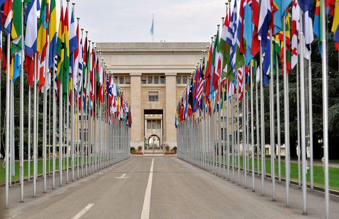

## Table of Contents

## What is the Gulf Tiger?

The Gulf Tiger is a nickname for the United Arab Emirates (UAE), a country in the Middle East. It is called the Gulf Tiger because it has grown very fast, like how a tiger grows quickly. The UAE has become very rich and successful in a short time, mainly because of oil and gas. But it is also doing well in other areas like trade, tourism, and building big projects.

The UAE is made up of seven smaller areas called emirates. The biggest one is Dubai, which is famous for its tall buildings and shopping. Another big one is Abu Dhabi, which has a lot of oil. The UAE has used its money to build good roads, schools, and hospitals. It also attracts many people from other countries to come and work there. This has helped the UAE to keep growing and becoming more successful.

## What are the main functionalities of the Gulf Tiger?

The Gulf Tiger, or the United Arab Emirates (UAE), has many important functions that help it grow and succeed. One big function is making and selling oil and gas. The UAE has a lot of oil, especially in Abu Dhabi, and this brings in a lot of money. The country uses this money to build good roads, schools, and hospitals. Another function is trade. The UAE is in a good spot for trading with other countries, and it has big ports and airports to help move goods around the world.

Another key function of the Gulf Tiger is tourism. Places like Dubai are famous for big buildings, fancy hotels, and shopping centers. This attracts many visitors from around the world, which helps the economy. The UAE also focuses on building big projects, like the tallest building in the world, the Burj Khalifa. These projects show how modern and advanced the country is. Finally, the UAE welcomes many people from other countries to come and work there. This helps the country grow and brings in new ideas and skills.

## How does the Gulf Tiger impact the economy of the Gulf region?

The Gulf Tiger, which is the United Arab Emirates (UAE), has a big impact on the economy of the Gulf region. The UAE is rich in oil and gas, and it sells these to other countries. This brings a lot of money into the region. The UAE uses this money to build good roads, schools, and hospitals. This helps not just the UAE, but also the nearby countries because they can use these roads and services too. The UAE also has big ports and airports, which help move goods around the world. This makes trade easier for the whole Gulf region.

Another way the Gulf Tiger impacts the economy is through tourism. Places like Dubai attract many visitors from around the world. These tourists spend money on hotels, shopping, and entertainment, which helps the economy grow. The UAE also builds big projects like the Burj Khalifa, which show how modern and advanced the country is. This can attract more business and investment to the Gulf region. Finally, the UAE welcomes many people from other countries to come and work there. These workers bring new skills and ideas, which can help the whole region grow and develop.

## What are the key technological features of the Gulf Tiger?

The Gulf Tiger, which is the United Arab Emirates (UAE), uses a lot of new technology to help it grow and be successful. One big area is smart cities. Places like Dubai and Abu Dhabi use technology to make life better for people. They have smart traffic systems that help cars move smoothly and reduce traffic jams. They also use technology to save energy and water, like smart lights that turn off when no one is around. Another important technology is in healthcare. The UAE has advanced hospitals with the latest machines and tools to help doctors take care of patients better.

Another key technological feature of the Gulf Tiger is in the area of renewable energy. The UAE is working on big projects to use the sun and wind to make electricity. This helps the country use less oil and gas, which is good for the environment. The UAE also uses technology to improve its economy. For example, it has a strong internet system and many businesses use technology to sell things online. This helps the UAE trade with other countries more easily. Overall, the UAE uses technology to make life better, save resources, and grow its economy.

## How does the Gulf Tiger compare to other economic models in the region?

The Gulf Tiger, which is the United Arab Emirates (UAE), is different from other economic models in the Gulf region because it does not just rely on oil and gas. While other countries in the region, like Saudi Arabia and Kuwait, mainly focus on selling oil, the UAE has worked hard to build a diverse economy. The UAE has invested in tourism, trade, and big projects like tall buildings and fancy hotels. This makes the UAE's economy stronger and less dependent on oil prices. The UAE also uses new technology and welcomes people from other countries to come and work there, which helps the economy grow even more.

Other countries in the Gulf region, like Qatar and Bahrain, have also tried to diversify their economies, but they are not as far along as the UAE. Qatar, for example, has focused on hosting big events like the World Cup to attract tourists and show off its wealth. Bahrain has worked on becoming a financial center, with banks and businesses. But these countries still rely a lot on oil and gas money. The UAE, on the other hand, has been more successful in building a strong economy that can handle changes in oil prices. This is why the UAE is often called the Gulf Tiger, because it has grown quickly and become very successful.

## What are the primary challenges faced by the Gulf Tiger?

The Gulf Tiger, which is the United Arab Emirates (UAE), faces some big challenges. One big challenge is that the UAE depends a lot on oil and gas. Even though it has worked hard to build other parts of its economy like tourism and trade, oil and gas still bring in a lot of money. If the price of oil goes down, it can hurt the UAE's economy. Another challenge is water. The UAE is in a desert, so it does not have a lot of water. It has to use a lot of energy to make fresh water from the sea, which can be expensive and hard to keep up.

Another challenge for the Gulf Tiger is the environment. The UAE is growing fast, and this can hurt the environment. Building big projects and using a lot of energy can make the air and water dirty. The UAE is trying to use more clean energy like solar power, but it is still a challenge. Also, the UAE has a lot of people from other countries coming to work there. This can be good for the economy, but it can also be hard to make sure everyone has a good place to live and work. The UAE needs to keep working on these challenges to keep growing and being successful.

## How do political factors influence the development of the Gulf Tiger?

Political factors play a big role in how the Gulf Tiger, or the United Arab Emirates (UAE), grows and develops. The UAE is made up of seven smaller areas called emirates, and they work together to make decisions. This can be good because it helps them share resources and plan big projects. But it can also be hard because sometimes the emirates might want different things. The UAE's leaders have to make sure everyone is happy and working together. They also have to keep good relationships with other countries, because trade and tourism are important for the economy.

Another important political [factor](/wiki/factor-investing) is how the UAE handles its laws and rules. The UAE has strict laws that help keep the country safe and stable. This can attract businesses and tourists because they feel safe there. But sometimes these strict laws can make it hard for people to speak freely or have different opinions. The UAE's leaders have to balance keeping the country safe with letting people have some freedom. They also have to make sure the laws help the economy grow, like making it easy for businesses to start and work there. Overall, political factors are very important for the Gulf Tiger's development.

## What role does infrastructure play in the success of the Gulf Tiger?

Infrastructure is very important for the success of the Gulf Tiger, which is the United Arab Emirates (UAE). The UAE has built a lot of good roads, bridges, and airports. These help people and goods move around easily. The UAE's big ports help it trade with other countries. This brings in a lot of money and helps the economy grow. The UAE also has good internet and technology. This makes it easy for businesses to work and sell things online. All these things make the UAE a good place for businesses and tourists to come.

Another way infrastructure helps the Gulf Tiger is by making life better for people who live there. The UAE has built good schools and hospitals. These help people learn and stay healthy. The UAE also uses technology to save energy and water. This is important because the UAE is in a desert and does not have a lot of water. Good infrastructure helps the UAE keep growing and being successful. It makes the country a nice place to live and work, which attracts more people and businesses.

## How can the Gulf Tiger adapt to global economic changes?

The Gulf Tiger, or the United Arab Emirates (UAE), can adapt to global economic changes by focusing on making its economy strong in different ways, not just oil and gas. The UAE has already started doing this by growing its tourism and trade. It can keep doing this by building more fancy hotels and big shopping centers to attract more tourists. The UAE can also make its ports and airports even better to help more goods move around the world. This way, even if oil prices go down, the UAE can still make money from other things.

Another way the Gulf Tiger can adapt is by using more new technology and clean energy. The UAE can keep working on big projects like solar power plants to use less oil and gas. This will help the environment and make the UAE's economy stronger. The UAE can also keep using technology to make life better for people, like smart traffic systems and good internet. By welcoming more people from other countries to come and work there, the UAE can bring in new ideas and skills. This will help the UAE keep growing and being successful, even when the world's economy changes.

## What are the long-term sustainability issues for the Gulf Tiger?

The Gulf Tiger, which is the United Arab Emirates (UAE), has some big challenges to keep growing in a good way over a long time. One big issue is that the UAE depends a lot on oil and gas. If the price of oil goes down, it can hurt the economy. The UAE has been trying to make money from other things like tourism and trade, but it still needs to do more to not rely so much on oil. Another problem is water. The UAE is in a desert, so it does not have a lot of water. It uses a lot of energy to make fresh water from the sea, which can be expensive and hard to keep up.

Another long-term issue for the Gulf Tiger is the environment. The UAE is growing fast, and this can hurt the environment. Building big projects and using a lot of energy can make the air and water dirty. The UAE is trying to use more clean energy like solar power, but it is still a challenge. Also, the UAE has a lot of people from other countries coming to work there. This can be good for the economy, but it can also be hard to make sure everyone has a good place to live and work. The UAE needs to keep working on these challenges to keep growing and being successful in a way that is good for the future.

## How does the Gulf Tiger address social and environmental concerns?

The Gulf Tiger, which is the United Arab Emirates (UAE), tries to take care of social and environmental problems in different ways. For social issues, the UAE works hard to make sure everyone has good schools and hospitals. It also welcomes people from other countries to come and work there. This helps the economy grow, but the UAE also tries to make sure these people have good places to live and work. The UAE has strict laws to keep the country safe and stable, which can help people feel happy and secure.

For environmental concerns, the UAE is trying to use less oil and gas by using more clean energy like solar power. It has big projects to make electricity from the sun and wind. This helps the environment because it makes less pollution. The UAE also uses technology to save water and energy, which is important because it is in a desert and does not have a lot of water. Even though the UAE is growing fast and building a lot, it is trying to do this in a way that does not hurt the environment too much.

## What advanced strategies are being considered to enhance the Gulf Tiger's competitiveness?

The Gulf Tiger, which is the United Arab Emirates (UAE), is thinking about new ways to stay ahead and keep growing. One big idea is to keep making the economy strong in different ways, not just oil and gas. The UAE can do this by building more fancy hotels and big shopping centers to attract more tourists. It can also make its ports and airports even better to help more goods move around the world. By doing these things, the UAE can make money from other things even if oil prices go down. Another idea is to use more new technology and clean energy. The UAE can keep working on big projects like solar power plants to use less oil and gas. This will help the environment and make the UAE's economy stronger.

Another strategy the Gulf Tiger is considering is to keep using technology to make life better for people. The UAE can use smart traffic systems and good internet to help businesses work and sell things online. By welcoming more people from other countries to come and work there, the UAE can bring in new ideas and skills. This will help the UAE keep growing and being successful, even when the world's economy changes. The UAE also needs to keep working on social and environmental issues. It can do this by making sure everyone has good schools and hospitals, and by using more clean energy to help the environment.

## References & Further Reading

[1]: Bergstra, J., Bardenet, R., Bengio, Y., & Kégl, B. (2011). ["Algorithms for Hyper-Parameter Optimization."](https://dl.acm.org/doi/10.5555/2986459.2986743) Advances in Neural Information Processing Systems 24.

[2]: ["Advances in Financial Machine Learning"](https://www.amazon.com/Advances-Financial-Machine-Learning-Marcos/dp/1119482089) by Marcos Lopez de Prado

[3]: ["Evidence-Based Technical Analysis: Applying the Scientific Method and Statistical Inference to Trading Signals"](https://www.amazon.com/Evidence-Based-Technical-Analysis-Scientific-Statistical/dp/0470008741) by David Aronson

[4]: ["Machine Learning for Algorithmic Trading"](https://github.com/stefan-jansen/machine-learning-for-trading) by Stefan Jansen

[5]: ["Quantitative Trading: How to Build Your Own Algorithmic Trading Business"](https://www.amazon.com/Quantitative-Trading-Build-Algorithmic-Business/dp/1119800064) by Ernest P. Chan