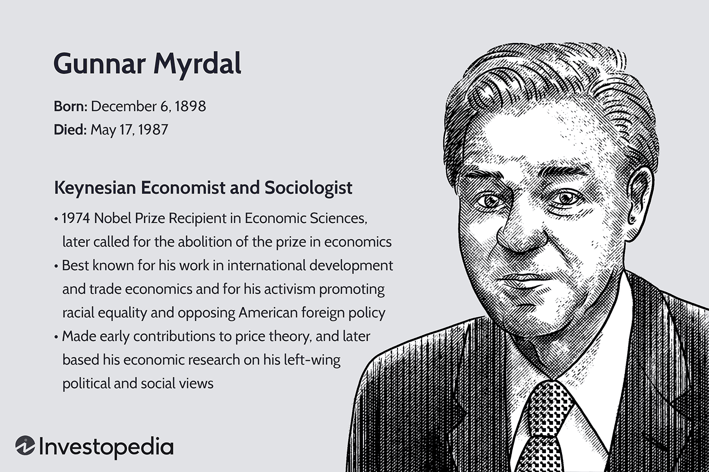

## Table of Contents

## Who was Gunnar Myrdal?

Gunnar Myrdal was a Swedish economist and sociologist who lived from 1898 to 1987. He is best known for his work on the social and economic issues in the United States, especially his book "An American Dilemma: The Negro Problem and Modern Democracy." This book, published in 1944, looked at the problems faced by African Americans and how these issues affected American society as a whole. Myrdal's research helped people understand the importance of addressing racial inequality.

In addition to his work on race, Myrdal also studied economic development and international trade. He won the Nobel Prize in Economics in 1974, which he shared with Friedrich Hayek. Myrdal's ideas about how to help poor countries develop economically were very influential. He believed that governments should play a big role in helping their economies grow. Myrdal was also involved in politics and served as a minister in the Swedish government. His work continues to be important in the fields of economics and sociology.

## What were Gunnar Myrdal's major contributions to economics?

Gunnar Myrdal made big contributions to economics, especially in understanding how poor countries can grow their economies. He believed that governments should help their economies by making good policies and investing in things like education and health care. Myrdal called this idea "institutional reform." He thought that if poor countries could change their institutions, like their laws and government systems, they could develop faster. His book "Asian Drama: An Inquiry into the Poverty of Nations" talked a lot about these ideas and became very important in the study of economic development.

Another big contribution Myrdal made was his idea of "cumulative causation." This means that once something starts to happen in an economy, it can keep getting bigger and bigger. For example, if a rich area gets richer, it can attract more businesses and people, making it even richer. Myrdal used this idea to explain why some places stay poor while others get richer. He thought that governments needed to step in to break these cycles and help poorer areas catch up. His work helped people understand that economic growth is not just about money, but also about how societies are organized and how people interact with each other.

## What is the significance of Gunnar Myrdal's book 'An American Dilemma'?

Gunnar Myrdal's book 'An American Dilemma: The Negro Problem and Modern Democracy' is very important because it looked at the big problem of racial inequality in the United States. Myrdal wrote about how African Americans faced a lot of unfair treatment and how this hurt the whole country. He talked to many people and did a lot of research to show that the way African Americans were treated was not fair and that it went against the idea of democracy that America believed in. The book helped people see that racial inequality was a big problem that needed to be fixed.

The book also had a big impact on how people thought about race and how laws were made. It was used in important court cases, like Brown v. Board of Education, which helped end segregation in schools. Many people read the book and started to understand that everyone should be treated equally. Myrdal's work helped start important conversations about race and pushed for changes in laws and society to make things more fair for everyone.

## How did Gunnar Myrdal's work influence social policy in the United States?

Gunnar Myrdal's book 'An American Dilemma' had a big impact on social policy in the United States. The book showed how African Americans were treated unfairly and how this hurt the whole country. It helped people see that racial inequality was a big problem that needed to be fixed. Myrdal's research was used in important court cases, like Brown v. Board of Education, which helped end segregation in schools. This case changed the law and made it so that all kids could go to school together, no matter their race.

Because of Myrdal's work, more people started to understand that everyone should be treated equally. His book helped start important conversations about race and pushed for changes in laws and society. It influenced the Civil Rights Movement, which fought for equal rights for African Americans. The ideas in 'An American Dilemma' helped shape new laws and policies that tried to make things more fair for everyone in the United States.

## What was Gunnar Myrdal's role in the development of the welfare state in Sweden?

Gunnar Myrdal played a big role in helping Sweden build its welfare state. He worked as a minister in the Swedish government and helped make policies that made life better for people. Myrdal believed that the government should help everyone have a good life, no matter if they were rich or poor. He helped create programs that gave people things like health care, education, and help when they were out of work. These ideas became very important in Sweden and helped make it a country where people take care of each other.

Myrdal's work also helped people understand why a welfare state was important. He wrote about how helping everyone in society could make the whole country stronger. His ideas were used to make laws that made sure everyone had what they needed to live well. Because of Myrdal, Sweden became known for its strong welfare system, where the government helps people have a good life. His work showed that when a country takes care of its people, everyone can do better.

## How did Gunnar Myrdal's concept of 'circular cumulative causation' impact economic theory?

Gunnar Myrdal's concept of 'circular cumulative causation' changed how people think about economic growth. He said that once something starts happening in an economy, it can keep getting bigger and bigger. For example, if a rich area gets richer, it can attract more businesses and people, making it even richer. This idea helped economists understand why some places stay poor while others get richer. Myrdal thought that this cycle could be hard to break without help from the government.

Myrdal's idea made people see that economic growth is not just about money, but also about how societies are organized and how people interact with each other. His work showed that if poor areas don't get help, they can stay poor for a long time. This concept influenced other economists to think about how to help poor countries develop. It led to new ideas about how governments can make policies to break these cycles and help everyone have a chance to do better.

## What was Gunnar Myrdal's view on the relationship between economic development and social justice?

Gunnar Myrdal believed that economic development and social justice were closely connected. He thought that for a country to grow and become richer, it needed to make sure that everyone was treated fairly. Myrdal said that if some people were left behind, the whole country would suffer. He believed that governments should help everyone have a good life, no matter if they were rich or poor. This meant making sure people had things like health care, education, and help when they were out of work.

Myrdal's ideas were important because they showed that economic growth was not just about money. He thought that if a country wanted to develop, it needed to focus on social justice too. This meant making laws and policies that helped everyone, not just a few people. Myrdal's work helped people understand that when a country takes care of its people, everyone can do better. His ideas influenced many countries to think about how to help their citizens have a better life while also growing their economies.

## How did Gunnar Myrdal contribute to the field of institutional economics?

Gunnar Myrdal made big contributions to institutional economics by showing how important institutions are for economic growth. He believed that the way a country's laws, government, and social systems are set up can help or hurt its economy. Myrdal thought that if poor countries wanted to develop, they needed to change their institutions to be fairer and more helpful. He called this idea "institutional reform." His book "Asian Drama: An Inquiry into the Poverty of Nations" talked a lot about these ideas and became very important in the study of economic development.

Myrdal's work helped people understand that economic growth is not just about money, but also about how societies are organized. He showed that if some people are left behind, the whole country can suffer. Myrdal believed that governments should make policies to help everyone have a good life, no matter if they are rich or poor. This meant making sure people had things like health care, education, and help when they were out of work. His ideas influenced many countries to think about how to help their citizens have a better life while also growing their economies.

## What criticisms have been leveled against Gunnar Myrdal's economic theories?

Some people have criticized Gunnar Myrdal's economic theories because they think he put too much focus on the role of government in helping poor countries grow. Critics say that Myrdal's ideas about governments making big changes to help their people might not always work. They believe that sometimes, letting businesses and markets do their own thing can help economies grow faster. They also think that Myrdal's ideas might make countries rely too much on their governments, which could slow down growth if the government does not do a good job.

Another criticism is that Myrdal's theories might not fit all countries the same way. Some people argue that what works in one place might not work in another because each country has its own unique problems and needs. Critics say that Myrdal's focus on changing institutions to help poor countries might not be the best solution for every country. They believe that sometimes, other things like technology or trade might be more important for helping economies grow.

## How did Gunnar Myrdal's interdisciplinary approach influence other social sciences?

Gunnar Myrdal's interdisciplinary approach had a big impact on other social sciences. He looked at problems from many different angles, like economics, sociology, and politics. This helped people see that big issues, like poverty and racial inequality, are connected to many parts of society. Myrdal's work showed that to understand these problems, you need to look at them in a complete way, not just from one point of view. His book 'An American Dilemma' is a good example of this. It combined economics, sociology, and history to talk about racial inequality in the United States. This approach helped other social scientists see the value in working together and using different fields to solve big problems.

Myrdal's ideas also influenced how people in other social sciences thought about their work. His focus on the importance of institutions and how they affect society made people in fields like political science and sociology think more about how laws and government systems shape people's lives. His concept of 'circular cumulative causation' helped economists and sociologists understand how cycles of poverty and wealth can keep going and how they can be changed. By showing that economic growth and social justice are connected, Myrdal encouraged other social scientists to think about how their work could help make society fairer and better for everyone.

## What was the impact of Gunnar Myrdal's work on international development economics?

Gunnar Myrdal's work had a big impact on international development economics. He believed that poor countries needed help from their governments to grow their economies. Myrdal thought that if poor countries changed their laws and government systems to be fairer, they could develop faster. His book "Asian Drama: An Inquiry into the Poverty of Nations" talked a lot about these ideas. It became very important in the study of economic development because it showed that economic growth was not just about money, but also about how societies were organized. Myrdal's ideas helped people understand that governments should play a big role in helping their economies grow by making good policies and investing in things like education and health care.

Myrdal's concept of 'circular cumulative causation' also changed how people thought about economic growth. He said that once something starts happening in an economy, it can keep getting bigger and bigger. For example, if a rich area gets richer, it can attract more businesses and people, making it even richer. This idea helped economists understand why some places stay poor while others get richer. Myrdal thought that this cycle could be hard to break without help from the government. His work showed that if poor areas don't get help, they can stay poor for a long time. This influenced other economists to think about how to help poor countries develop and led to new ideas about how governments can make policies to break these cycles and help everyone have a chance to do better.

## How has Gunnar Myrdal's legacy shaped contemporary economic and social policy debates?

Gunnar Myrdal's legacy has shaped today's economic and social policy debates by showing how important it is for governments to help everyone in society. He believed that economic growth and social justice go hand in hand. Myrdal's ideas about the need for governments to make good policies and invest in things like education and health care are still talked about today. Many people use his work to argue that if a country wants to grow, it needs to make sure everyone is treated fairly. His focus on helping poor countries develop by changing their laws and systems is still a big part of discussions about how to help poorer nations.

Myrdal's concept of 'circular cumulative causation' also plays a big role in today's debates. This idea helps people understand why some places stay poor while others get richer. It shows that once a cycle starts, it can be hard to break without help. This has led to discussions about how governments can step in to break these cycles and help everyone have a chance to do better. Myrdal's work continues to influence how people think about economic growth and social justice, pushing for policies that help everyone in society, not just a few.

## References & Further Reading

[1]: Gunner Myrdal, G. (1944). ["An American Dilemma: The Negro Problem and Modern Democracy."](https://en.wikipedia.org/wiki/An_American_Dilemma) Harper & Brothers.

[2]: Myrdal, G. (1968). ["Asian Drama: An Inquiry into the Poverty of Nations."](https://link.springer.com/content/pdf/10.1057/9780230289017_9.pdf) Pantheon.

[3]: Myrdal, G. (1957). ["Economic Theory and Underdeveloped Regions."](https://books.google.com/books/about/Economic_theory_and_under_developed_regi.html?id=aRdgAAAAIAAJ) Harper & Row.

[4]: Friedman, M., & Savage, L. J. (1952). ["The Expected-Utility Hypothesis and the Measurability of Utility."](https://www.jstor.org/stable/1825271) Journal of Political Economy, 60(6), 463-474.

[5]: Hayek, F. A. (1945). ["The Use of Knowledge in Society."](https://german.yale.edu/sites/default/files/hayek_-_the_use_of_knowledge_in_society.pdf) The American Economic Review, 35(4), 519-530.

[6]: Shreve, S. E. (2004). ["Stochastic Calculus for Finance I: The Binomial Asset Pricing Model."](https://link.springer.com/book/10.1007/978-0-387-22527-2) Springer.

[7]: Hull, J. C. (2018). ["Options, Futures, and Other Derivatives."](https://www.semanticscholar.org/paper/Options%2C-Futures%2C-and-Other-Derivatives-Hull/89bdee500c8623864fc9eb7a471546aa713acc44) Pearson.

[8]: Chong, E., Han, C., & Park, F. C. (2022). ["Deep Learning Networks for Stock Market Analysis and Prediction: Methodologies, Technologies, and Applications."](https://www.sciopen.com/article/10.26599/NR.2025.94906994) Expert Systems with Applications, 158, 113559.