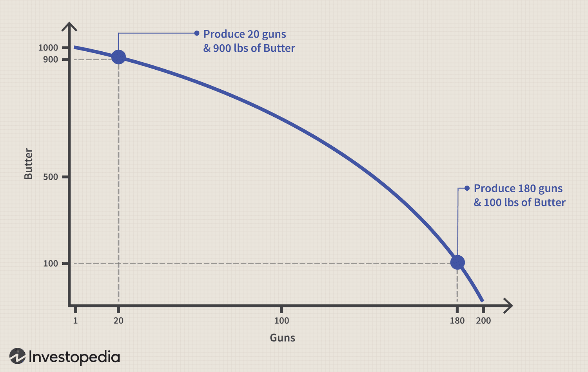

In the modern economic landscape, grasping the complexities of production possibilities and trade-offs is of paramount importance. Economics serves as a guiding framework for understanding how societies allocate scarce resources to maximize benefits. Key among these economic insights are concepts like the Production Possibility Frontier (PPF) and the Guns-and-Butter Curve, which illustrate fundamental principles of decision-making and opportunity costs.

The Production Possibility Frontier represents the maximum possible output combinations of two goods that an economy can achieve when resources are fully and efficiently utilized. It provides a visual depiction of the trade-offs that need to be made as resources are redistributed between different production outputs. Efficiency, opportunity cost, and resource allocation are all embedded in this foundational economic model, making it a vital tool for both theoretical and practical applications.



Meanwhile, the Guns-and-Butter Curve exemplifies the trade-off decisions between two specific categories: military and civilian goods. Originating during times of war or conflict, this curve has historical significance, illustrated by economies balancing defense expenditures against civilian needs. The underlying message of this curve—notably resource allocation constraints—remains relevant, reflecting broader economic strategies where sectors vie for limited resources.

These economic fundamentals extend beyond theoretical discourse, finding pertinent application in modern financial systems, particularly in algorithmic trading. In this high-frequency trading landscape, the core principles of trade-offs and resource allocation are crucial. Computational algorithms constantly assess risks and returns to optimize trading strategies, alluding to the trade-off dynamics encapsulated by the PPF and Guns-and-Butter Curve. Understanding these economic concepts enables robust algorithmic models that anticipate market movements and balance portfolios efficiently.

This article seeks to bridge traditional economic theories with contemporary practices like algorithmic trading, underscoring the importance of economic reasoning in navigating today’s multifaceted financial environment. By examining how production possibilities and trade-offs shape decision-making, we highlight their enduring relevance and adaptability in an evolving economic and technological landscape.

## Table of Contents

## Understanding Production Possibilities

The Production Possibility Frontier (PPF) is a vital graphical representation in economics, demonstrating the maximum feasible output combinations of two goods or services an economy can achieve using available resources and technology. At each point on the PPF, the economy is utilizing its resources fully and efficiently. Understanding the PPF enables economists and policymakers to comprehend the trade-offs and opportunity costs inherent in resource allocation. 

Opportunity cost is a core concept illustrated by the PPF. It refers to the value of the next best alternative foregone when a choice is made. For example, if an economy allocates more resources to produce good X, it must reduce the production of good Y, assuming fixed resources and technology. This trade-off is visually represented by the PPF's slope, indicating the opportunity cost of one good in terms of the other. 

In strategic decision-making, the PPF helps businesses and economies assess how best to utilize scarce resources. During times of resource constraints, such as financial crises or natural disasters, the PPF becomes an indispensable tool. It aids in determining which production combinations might yield the most significant benefit, allowing decision-makers to evaluate whether reallocating resources from one sector to another could generate better outcomes for economic growth or stability.

Operating inside the PPF implies resources are underutilized or inefficiently allocated, while points outside the PPF are unattainable given current resources. Thus, the PPF serves as a benchmark for assessing the efficiency of production processes. Strategies aimed at shifting the PPF outward—such as investments in technology and education—suggest an increase in an economy's productive capacity, enabling it to produce more goods and services than before.

To compute opportunity costs and evaluate efficient production levels, economic analysts often employ mathematical models. For instance, in Python, one could model a simple PPF using linear programming techniques or simulate shifts in the PPF due to technological advancements using computational algorithms.

In summary, the PPF is an essential framework for understanding the economic trade-offs and opportunity costs involved in resource allocation. It supports strategic planning and decision-making in both business and macroeconomic contexts, particularly when resources are limited. By clarifying these dynamics, the PPF helps guide policy formulation towards enhanced economic efficiency and growth.

## Trade-Offs in Economics: The Guns-and-Butter Curve

The Guns-and-Butter Curve is a fundamental model illustrating the trade-offs an economy faces when allocating resources between military and civilian goods. This economic model epitomizes the broader concept of opportunity costs, which refers to the cost of forgoing the next best alternative when making a decision. The trade-offs presented by the Guns-and-Butter Curve are vital for understanding how societies prioritize different production areas and the resulting implications on economic growth and stability.

Historically, this model was particularly significant during the Cold War era. During this period, nations, especially the United States and the Soviet Union, faced pronounced choices between allocating resources toward defense spending or towards consumer goods. The arms race necessitated a substantial portion of resources to be funneled into military and defense industries, leaving fewer resources for consumer goods production. For instance, when the U.S. increased its military spending during tense periods of the Cold War, it often had to curtail investments in domestic programs and consumer markets, demonstrating a direct application of the Guns-and-Butter Curve[1].

In contemporary contexts, the concept continues to be relevant. Nations today still confront similar trade-offs when determining budget allocations. These trade-off decisions can considerably impact an economy’s health. Developing countries may prioritize consumer goods to improve living standards, whereas countries facing security threats might increase defense spending, possibly hindering short-term economic consumer benefits.

Moreover, modern economic strategies frequently involve balancing these trade-offs across multiple sectors, not just between military and consumer goods. Governments need to distribute resources among healthcare, education, infrastructure, and technology, while still ensuring national security. For example, investment in public health has proven pivotal, especially in light of the recent global pandemic, which necessitated reallocation of considerable resources[2].

Understanding the Guns-and-Butter Curve's implications assists in comprehending how nations allocate their scarce resources and the potential economic outcomes of these decisions. By effectively managing these trade-offs, countries can strive towards sustainable economic growth, balanced governmental spending, and improved societal welfare.

---

[1] Ambrose, S. E. (1991). "The Cold War and the Arms Race." Historical Perspectives on the Cold War Era.

[2] Piketty, T. (2014). "Health and Economic Policy in a Global Context." Global Economic Review.

## Algorithmic Trading and Economic Trade-Offs

Algorithmic trading utilizes sophisticated computational algorithms to execute buying and selling decisions at speeds and frequencies that are beyond human capabilities. These algorithms are built on economic principles, efficiently managing trade-offs to optimize trading performance. One critical trade-off in [algorithmic trading](/wiki/algorithmic-trading) is between risk management and return optimization.

In risk management, algorithms are designed to minimize potential losses by analyzing vast amounts of market data and identifying patterns that may indicate unfavorable market movements. Techniques such as stop-loss orders, where a trade automatically closes once it reaches a certain loss threshold, are commonly employed. This concept aligns with the economic principle of limiting potential loss while pursuing profit, akin to the economic decision-making process evident in broader market scenarios.

Return optimization, on the other hand, focuses on maximizing the returns on investments. Algorithms frequently employ complex models, such as the Capital Asset Pricing Model (CAPM) and the Black-Scholes model, to predict asset movements and determine the expected return on investment. By assessing factors like market [volatility](/wiki/volatility-trading-strategies), interest rates, and historical price trends, these models guide algorithms to make informed trading decisions that aim to enhance profitability. Below is a basic representation of the CAPM model used in calculations:

$$
\text{Expected Return} = R_f + \beta \times (R_m - R_f)
$$

where $R_f$ represents the risk-free rate, $\beta$ is the beta of the security, and $R_m$ is the expected market return. This formula helps algorithms to quantify expected returns relative to the market risk.

Algorithms in trading also employ economic models such as mean-variance optimization, which aims to maximize returns for a given level of risk or minimize risk for a given level of return. These models apply mathematical strategies to construct efficient portfolios. They analyze covariances among asset classes and use this information to achieve an optimal asset allocation.

Moreover, algorithms continually adapt to new information through [machine learning](/wiki/machine-learning) techniques, enhancing their predictive accuracy. For example, [reinforcement learning](/wiki/reinforcement-learning), a subset of machine learning, allows algorithms to learn optimal trading strategies through trial and error in simulated environments before applying them in real-time trading scenarios. Here’s a basic illustration in Python showcasing a simplistic framework for a reinforcement learning algorithm:

```python
import numpy as np

class TradingAlgo:
    def __init__(self):
        self.state = [0]  # Initial state
        self.action_space = [-1, 0, 1]  # Sell, Hold, Buy
        self.learning_rate = 0.1
        self.discount_factor = 0.99
        self.q_table = np.zeros((1, len(self.action_space)))

    def choose_action(self, state):
        return np.argmax(self.q_table[state])

    def update_q_table(self, state, action, reward, next_state):
        q_predict = self.q_table[state, action]
        q_target = reward + self.discount_factor * np.max(self.q_table[next_state])
        self.q_table[state, action] += self.learning_rate * (q_target - q_predict)

# Instantiate the algorithm
algo = TradingAlgo()
```

This code represents a basic reinforcement learning model, structured to make and update decisions based on rewards received from the trading environment.

Algorithmic trading exemplifies the application of economic principles in financial strategies by balancing trade-offs between risk and return. As financial markets continue evolving, the reliance on algorithmic trading is expected to grow, underscoring the necessity of understanding economic models that govern these automated systems.

## Innovations in Managing Production and Trading

Technological advancements have played a pivotal role in expanding the boundaries of economic production capabilities, effectively shifting the production possibilities frontier (PPF) outward. This extension allows for more efficient utilization of resources, adapting to modern demands and economic environments. One of the key drivers in this evolution is the integration of advanced technology and data analysis into production and trading strategies.

In the context of production capabilities, technology has enhanced efficiency across various sectors. Automation, for instance, streamlines manufacturing processes, reducing costs and increasing output. The implementation of robotics and Internet of Things (IoT) sensors in factories optimizes the production line, providing real-time data that aids in minimizing waste and improving quality control. Moreover, digital twins—virtual models of physical systems—allow industries to simulate changes before implementing them physically, thus reducing the risk of costly errors.

On the trading front, data analysis and algorithmic strategies have transformed how financial markets operate. The proliferation of high-frequency trading ([HFT](/wiki/high-frequency-trading-strategies)) algorithms, which execute orders at microsecond speeds, exemplifies how technology leverages data for rapid decision-making. These algorithms analyze vast datasets to make predictions about market movements, capitalizing on slight price fluctuations that would be imperceptible to human traders. Risk management is also enhanced through sophisticated models that account for different market conditions and assets’ price volatilities. Python, for example, is widely used in algorithmic trading due to its rich ecosystem of data analysis libraries like Pandas and NumPy. A simple example of a moving average crossover strategy in Python might look like this:

```python
import pandas as pd

# Sample moving average crossover strategy
def moving_average_crossover(df, short_window, long_window):
    signals = pd.DataFrame(index=df.index)
    signals['signal'] = 0.0

    # Short-term moving average
    signals['short_mavg'] = df['Close'].rolling(window=short_window, min_periods=1, center=False).mean()
    # Long-term moving average
    signals['long_mavg'] = df['Close'].rolling(window=long_window, min_periods=1, center=False).mean()

    # Create signals
    signals['signal'][short_window:] = np.where(signals['short_mavg'][short_window:] > signals['long_mavg'][short_window:], 1.0, 0.0)

    # Generate trading orders
    signals['positions'] = signals['signal'].diff()

    return signals
```

Artificial intelligence (AI) and machine learning (ML) further refine these trading processes and bolster economic productivity. In trading, machine learning models can be trained to identify patterns and execute trades based on vast historical and real-time data. Such models are continually improved through techniques like reinforcement learning, where an agent iteratively learns successful trading strategies through trial and error, optimizing its actions based on rewards received from market movements.

AI also contributes significantly to economic productivity by optimizing supply chains. Through predictive analytics, businesses can forecast demand more accurately, reducing the occurrence of overproduction or stockouts. Machine learning algorithms can analyze patterns in supply chain data, offering insights that help in making strategic decisions, thereby reducing costs and improving service levels.

In conclusion, the incorporation of technology, AI, and machine learning into production and trading processes continues to extend the economic PPF, fostering increased productivity and efficiency. These advancements signal a profound shift in how resources can be manipulated to achieve optimal outputs, fundamentally altering traditional economic landscapes.

## Conclusion

Understanding the interplay between economics, production possibilities, and trade-offs is pivotal for optimizing decision-making across traditional markets and digital platforms. The insights gained from economic theories such as the Production Possibility Frontier (PPF) and the Guns-and-Butter Curve provide a structured approach to evaluating choices and their associated opportunity costs. These theories not only aid in strategic planning but also facilitate a deeper understanding of how resources can be efficiently utilized in various economic sectors.

Algorithmic trading exemplifies the application of these economic principles in modern financial strategies. By harnessing computational algorithms, traders can effectively manage trade-offs between risk and return, ensuring the optimization of investment portfolios. This application underscores the relevance of economic models in predicting market behaviors and enabling rapid decision-making processes.

As the economic landscape continues to evolve, driven by technological advancements such as [artificial intelligence](/wiki/ai-artificial-intelligence) and machine learning, the capacity for enhanced production possibilities and sophisticated trading tactics expands. These innovations are shifting the PPF outward, allowing for more productive use of resources and the development of refined economic strategies. Consequently, a comprehensive understanding of economics, production possibilities, and trade-offs is more critical than ever, equipping stakeholders to navigate the complexities of current and future markets effectively.

## References & Further Reading

[1]: Ambrose, S. E. (1991). "The Cold War and the Arms Race." Historical Perspectives on the Cold War Era.

[2]: Piketty, T. (2014). "Health and Economic Policy in a Global Context." Global Economic Review.

[3]: ["Advances in Financial Machine Learning"](https://www.amazon.com/Advances-Financial-Machine-Learning-Marcos/dp/1119482089) by Marcos Lopez de Prado

[4]: ["Machine Learning for Algorithmic Trading"](https://github.com/PacktPublishing/Machine-Learning-for-Algorithmic-Trading-Second-Edition) by Stefan Jansen

[5]: ["Quantitative Trading: How to Build Your Own Algorithmic Trading Business"](https://www.amazon.com/Quantitative-Trading-Build-Algorithmic-Business/dp/1119800064) by Ernest P. Chan