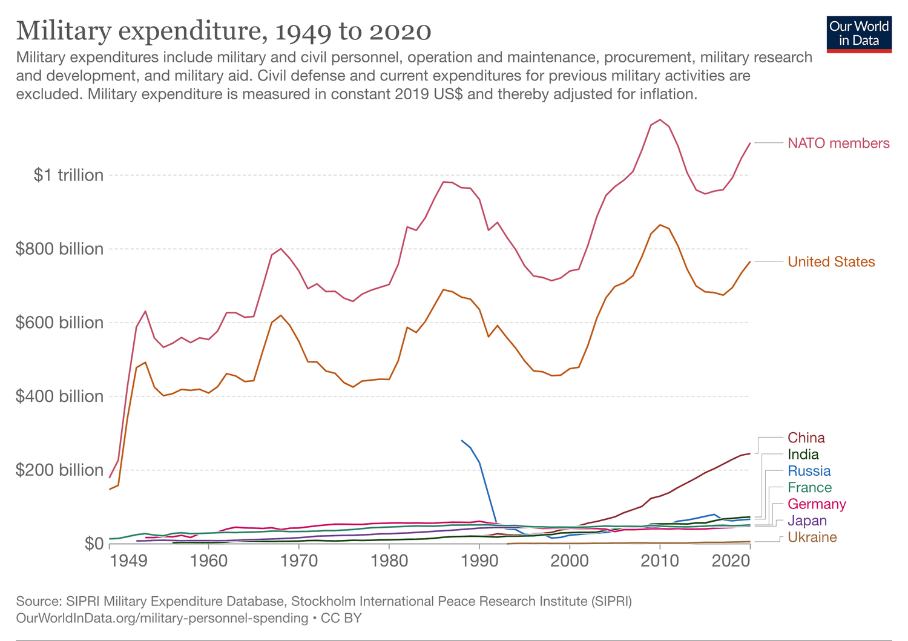

In a complex global economy, comprehending the dynamics of government spending is crucial for both policymakers and investors. One fundamental economic concept that aids this understanding is the 'guns and butter' model, which examines the trade-offs nations face between allocating resources to military expenditures ('guns') or civilian goods and services ('butter'). Historically, this model has highlighted the opportunity costs associated with prioritizing one type of spending over the other, particularly during times of geopolitical tension or economic constraint.

Recently, a novel intersection has surfaced that combines classical economic theories with the advancements of modern technology: algorithmic trading. The integration of these seemingly disparate domains offers new perspectives on both economic management and investment strategies. Algorithmic trading, which utilizes computer algorithms to execute trades at high speed based on predetermined criteria, is capable of processing vast data sets and adapting to market conditions almost instantaneously.



This article aims to provide insight into how the 'guns and butter' economic theory can offer valuable perspectives on government spending decisions. This theory, when integrated into algorithmic trading, has the potential to bolster financial strategies by offering a framework for understanding how governmental fiscal policies might impact markets. By examining the principles of the 'guns and butter' model and its continued relevance, we can better grasp its implications for algorithmic trading.

The focus here is to foster a thorough understanding of how traditional economic theories can be adapted to modern financial frameworks. This approach offers a nuanced perspective on fiscal policies and investment practices. By embracing such interdisciplinary strategies, there is significant potential for optimizing both governmental fiscal tactics and the outcomes of trading activities.

## Table of Contents

## Understanding the 'Guns and Butter' Economic Theory

The 'guns and butter' economic theory is a crucial model that illustrates the fundamental trade-off between allocating resources for military (guns) and civilian (butter) purposes. This model serves as a tool for understanding how governments prioritize their spending, reflecting the opportunity costs inherent in these decisions. During times of war, nations must often choose between strengthening military capabilities and investing in social welfare and infrastructure, given finite resources. This trade-off is not only relevant historically but also in contemporary economic policy discussions. Nations routinely debate how to balance defense budgets with expenditures on healthcare, education, and public services.

The model is rooted in the concept of opportunity cost, which represents the benefits foregone when choosing one alternative over another. In the context of 'guns and butter,' the opportunity cost is the value of civilian goods and services that could have been produced if military resources were instead allocated to civilian needs. The focus on opportunity cost fosters a clearer understanding of how strategic imperatives and societal needs can conflict and how these tensions shape policy decisions.

Despite its origins in historical conflicts and predominantly wartime scenarios, the 'guns and butter' model is still applicable today. It provides a framework for analyzing modern national budgets and resource allocations. As governments navigate complex decisions on spending, the model aids in evaluating the potential economic impacts of prioritizing military expenditures over social welfare programs. Debates often center on the economic repercussions of such decisions, where increased military spending could potentially spur technological advances and support defense-related industries, albeit at the potential expense of reduced funding for infrastructure, healthcare, and education.

In practical terms, applying the 'guns and butter' theory involves examining how past and present budgetary allocations have influenced both short-term and long-term economic growth. Factors such as GDP growth, unemployment rates, and inflation are often scrutinized in relation to spending priorities. For instance, investments in education and healthcare might yield substantial economic growth over time by enhancing human capital, while defense spending might lead to shorter-term gains in technological development and employment in specific sectors. This economic analysis enables policymakers and economists to assess the broader implications of their spending decisions and underscores the need for a strategic balance tailored to each nation's unique circumstances.

Through this understanding, the 'guns and butter' model remains a valuable conceptual tool for evaluating the trade-offs between military and civilian spending, providing insights into the nuanced economic ramifications of government fiscal policies.

## The Role of Government Spending in Economic Growth

Government spending is a critical lever in shaping a nation's economic landscape. It determines the allocation of resources across crucial sectors such as infrastructure, education, healthcare, and defense. The 'guns and butter' model encapsulates this allocation dilemma, highlighting the trade-off between military expenditure ('guns') and civilian goods ('butter'). Each category of spending carries distinct implications for economic growth, employment, inflation, and overall national welfare.

By judiciously balancing these expenditures, governments can steer economic direction. For instance, investing in infrastructure and education often yields long-term productivity gains, enhancing the workforce's skill set and the nation's overall competitiveness. On the other hand, military spending can lead to immediate job creation within defense industries but may not contribute as significantly to broad-based economic growth.

The economic multiplier effect is pivotal in understanding how government spending can stimulate or restrict economic activities. This concept indicates that an increase in public expenditure can lead to a more than proportional increase in national income. For example, infrastructure projects not only generate direct employment but also boost demand for materials and services, leading to secondary job creation across other sectors.

Empirical evidence from various nations illustrates diverse outcomes of spending strategies. During the post-World War II period, many countries shifted from military-focused expenditures to investing heavily in civilian sectors, catalyzing unprecedented economic growth. In contrast, excessive military spending without corresponding civilian investment can lead to economic imbalances and long-term fiscal challenges, as seen in some historical case studies.

Maintaining a balanced approach to government spending is crucial for sustainable economic growth and stability. Historical examples, such as the European post-war recovery and contemporary strategies in emerging economies, demonstrate the benefits of a well-rounded allocation of government resources. A balanced budget supports not only immediate economic needs but also prepares the ground for future development, ensuring that growth is both robust and inclusive.

In today's context, this balance is more important than ever, given the complexities of global economic interdependence and rapid technological change. Governments must navigate these challenges by adopting flexible yet strategic spending practices to foster long-term prosperity and stability.

 to Algorithmic Trading

Algorithmic trading signifies a transformative phase in financial markets through the use of computer algorithms to automate trading processes based on pre-defined criteria. This technological advancement enables traders to quickly analyze vast amounts of data, facilitating the prompt identification of profitable opportunities across global markets. By employing statistical and mathematical models, [algorithmic trading](/wiki/algorithmic-trading) minimizes human error and enhances execution efficiency.

The mechanism of algorithmic trading involves executing trade orders at the best possible price, handling repetitive tasks without fatigue, and processing orders at a speed and frequency that human traders cannot match. This capability is crucial in today's fragmented markets where speed and precision can significantly impact profitability. Algorithms can be programmed to consider various factors, such as timing, price, and [volume](/wiki/volume-trading-strategy), ensuring that trades align with specified strategies quickly and efficiently.

Algorithmic trading has several types, including high-frequency trading ([HFT](/wiki/high-frequency-trading-strategies)), which capitalizes on small price discrepancies within microseconds; market-making algorithms that provide [liquidity](/wiki/liquidity-risk-premium) to the markets; and statistical [arbitrage](/wiki/arbitrage) that exploits price inefficiencies between related financial instruments. Each type has its strategic objective, adapting to different market conditions and trader goals.

The growth of algorithmic trading on global trading floors is impressive, not just for the speed and execution it offers but also for its contribution to market liquidity and efficiency. However, it comes with challenges and considerations. The complexity of algorithms can lead to significant errors if improperly implemented or supervised. Flash crashes and market anomalies have underscored the potential risks associated with high-speed automated trading systems. [1]

Regulatory bodies around the world have recognized these challenges, leading to the establishment of frameworks designed to mitigate systemic risks. For instance, the European Union’s Markets in Financial Instruments Directive II (MiFID II) encompasses rules on algorithmic trading, requiring firms to ensure robust and tested systems. In the United States, the Securities and Exchange Commission (SEC) also monitors and regulates algorithmic trading practices, focusing on transparency and fairness in financial markets.

Ethical considerations are becoming increasingly important as technology continues to evolve. Issues such as market manipulation, predatory algorithms, and the impact of algorithmic decisions on broader economic conditions are garnering attention from both regulators and market participants. The ongoing debate about the ethical dimensions of algorithmic trading encompasses the potential conflicts between achieving high returns and adhering to fair trading practices.

In conclusion, while algorithmic trading has revolutionized how trades are executed in financial markets, it brings with it new responsibilities for traders, regulators, and technology developers to ensure that these powerful tools are used responsibly and ethically.

> [1] Aldridge, I. (2013). *High-Frequency Trading: A Practical Guide to Algorithmic Strategies and Trading Systems*. John Wiley & Sons.

## Integrating Economic Theories into Algorithmic Trading

Incorporating the 'guns and butter' model into algorithmic trading provides a novel framework for developing advanced investment strategies. The concepts from this economic theory can be transformed into mathematical models and algorithms to predict market responses based on shifts in governmental fiscal policies and global economic conditions. The 'guns and butter' model fundamentally considers how nations allocate resources between defense and civilian needs, thereby affecting economic indicators such as inflation, employment, and GDP growth. These indicators can, in turn, influence market behavior.

The integration process begins by translating the theoretical trade-offs of the 'guns and butter' concept into quantifiable metrics that can be programmed into trading algorithms. By analyzing historical data, the relationship between defense spending, social welfare expenditure, and market movements can be established. This relationship helps in formulating algorithms that can adapt to changes in economic policy, improving the prediction accuracy of market trends.

### Example Algorithm

Consider a basic algorithmic trading strategy where the objective is to determine the optimal asset allocation based on changing government expenditure patterns:

```python
import numpy as np

# Sample data: Percentage change in defense spending and market return
defense_spending = np.array([3.2, -1.5, 4.0, 2.1, -0.5])  # Yearly changes in defense spending
market_returns = np.array([0.5, -1.0, 1.2, 0.9, 0.2])     # Corresponding market returns

# Calculating correlation to determine the influence of defense spending on market returns
correlation = np.corrcoef(defense_spending, market_returns)[0, 1]
print(f"Correlation between defense spending and market returns: {correlation}")

# Deciding on asset allocation strategy
if correlation > 0:
    print("Increase asset allocation in sectors benefiting from defense spending.")
else:
    print("Reallocate assets towards civilian-focused industries.")
```

### Challenges and Benefits

One of the primary challenges in this integration is the complexity of accurately modeling the impact of government spending on market dynamics. The causal relationships may not be straightforward, and geopolitical variables often introduce noise to the data.

However, the benefits of integrating such a classic economic theory into algorithmic trading are significant. It enriches the investment strategy landscape, providing traders with a broader context for decision-making. Such algorithms can enhance trading efficiency, making them more adaptable to policy shifts that influence economic conditions.

In practice, these algorithms might incorporate [machine learning](/wiki/machine-learning) techniques to refine predictions. For instance, neural networks can model non-linear relationships between economic policy changes and market reactions, optimizing trading strategies.

Overall, blending economic theories like 'guns and butter' with algorithmic trading enhances investment models, leading to more informed and strategic decisions in financial markets.

## Case Studies: Real-World Applications

Analyzing real-world applications of the "guns and butter" economic theory integrated with algorithmic trading reveals intriguing possibilities and challenges. Historical data and simulated models serve as valuable tools for assessing how these concepts translate into practical investment strategies.

One notable example is the 1990s economic landscape. During this period, the U.S. government faced pivotal decisions regarding military expenditure reductions following the Cold War and increased investments in civilian projects. The resultant resource allocation shifts significantly impacted market dynamics. Algorithmic models developed to evaluate the U.S. economy's transition from defense-centric to a more civilian-oriented spending pattern provided insights into how fiscal policy adjustments could drive market trends. These models utilized variables such as defense budgets, GDP growth rates, and consumer spending changes to forecast market responses, aiding in developing profitable trading strategies.

Conversely, Japan's economic challenges in the 1990s highlight potential setbacks in applying these theories. Japan's "lost decade" reflected stagnant economic growth caused by a banking crisis and deflationary pressures. Despite increased government spending on infrastructure (a classic "butter" investment), the failure to address underlying financial system issues limited the effectiveness of algorithmic models reliant solely on fiscal policy indicators. This case underscores the importance of incorporating comprehensive economic data, including monetary policy and financial health metrics, into trading algorithms.

In more recent years, China's rise as a global economic powerhouse offers a diverse market backdrop for testing theoretical applications. The nation's dual approach of significant infrastructure investments ("butter") alongside expanding military capabilities ("guns") has presented unique challenges and opportunities for algorithmic trading. Models that emphasize the correlation between infrastructure spending and technology sector growth have achieved notable success, although those relying on military expenditure projections have shown mixed results due to the opacity of defense data in China.

These case studies underscore the need for adaptable trading models that account for varied economic contexts and unforeseen market disruptions. Varying geopolitical environments and domestic economic conditions necessitate a dynamic approach to algorithmic strategies, incorporating both real-time data analysis and historical economic insights. 

Ultimately, these examples illustrate the potential rewards and pitfalls of aligning economic theory with trading algorithms. They reveal the nuanced understanding required to leverage fiscal policy-shape market dynamics and underscore the value of technological advancements in refining these strategies further. Through such interdisciplinary approaches, traders can harness economic theories to navigate complex financial landscapes effectively.

## Conclusion: Future Insights and Developments

Merging the 'guns and butter' economic theory with algorithmic trading represents a significant opportunity for financial innovation. This interdisciplinary approach combines classical economic insights on resource allocation with the precision and speed of modern trading technologies. As we look ahead, several factors are set to refine these strategies further.

Technological advancements continue to enhance the capabilities of algorithmic trading. The integration of [artificial intelligence](/wiki/ai-artificial-intelligence) (AI) and machine learning into trading algorithms enables systems to learn from vast amounts of data and adapt to changing market conditions. This results in improved predictive accuracy and better risk management. For instance, AI can analyze historical government spending data to anticipate shifts in fiscal policy and adjust trading strategies accordingly.

The future landscape of financial markets will likely see increased reliance on AI-driven systems, especially as computational power grows and data analytics become more sophisticated. These advancements offer the potential for highly customized trading strategies that can respond dynamically to economic indicators derived from the 'guns and butter' framework. For policymakers, this means that financial regulations will need to evolve to ensure ethical and fair use of these technologies.

Moreover, a continuous feedback loop between traditional economic theories and algorithmic trading could create more resilient financial systems. By integrating economic indicators into algorithmic models, traders can develop strategies that not only seek profit but also contribute to market stability. Algorithms could consider factors such as inflation rates, employment [statistics](/wiki/bayesian-statistics), and geopolitical events associated with shifts in government spending priorities.

Optimizing governmental fiscal strategies and trading outcomes requires embracing these interdisciplinary approaches. By leveraging both time-tested economic frameworks and cutting-edge technological innovations, traders and policymakers can better navigate the complexities of modern economies. As we move forward, the collaboration between economists and technologists will be crucial in shaping a balanced and sustainable financial future.

In conclusion, the union of economic theories with algorithmic trading presents a promising trajectory for sophisticated and adaptive financial strategies. As technology and economic understanding deepen, the potential for innovation in this area will continue to expand, creating opportunities for enhanced investment practices and fiscal policy planning.

## References & Further Reading

[1]: Aldridge, I. (2013). *High-Frequency Trading: A Practical Guide to Algorithmic Strategies and Trading Systems*. John Wiley & Sons.

[2]: ["Guns or Butter Hypothesis"](https://en.wikipedia.org/wiki/Guns_versus_butter_model) on Investopedia - A comprehensive explanation of the 'guns and butter' economic model.

[3]: Emmanuel, S., & Primrose, S. (2018). [*Economic Strategy and National Security: A Next Generation Approach*](https://books.google.com/books/about/Economic_Strategy_And_National_Security.html?id=7XSmAAAAIAAJ) - An insightful look at the intersection of economic models and national security.

[4]: Marcos Lopez de Prado (2018). *Advances in Financial Machine Learning*. John Wiley & Sons - A detailed resource on the application of machine learning in finance, relevant to algorithmic trading.

[5]: Chan, E. P. (2009). *Quantitative Trading: How to Build Your Own Algorithmic Trading Business*. John Wiley & Sons - Provides foundational knowledge on developing algorithmic trading systems.

[6]: Neftci, S. N. (2004). [*Principles of Financial Engineering*](https://archive.org/details/isbn_9798181476448). Academic Press - Discusses quantitative techniques used in financial markets, including those applicable to algorithmic trading.

[7]: Richard J. Samuels (1994). *Rich Nation, Strong Army: National Security and the Technological Transformation of Japan*. Cornell University Press - Examines the trade-offs between military spending and civilian growth in Japan, relevant to the 'guns and butter' theory.