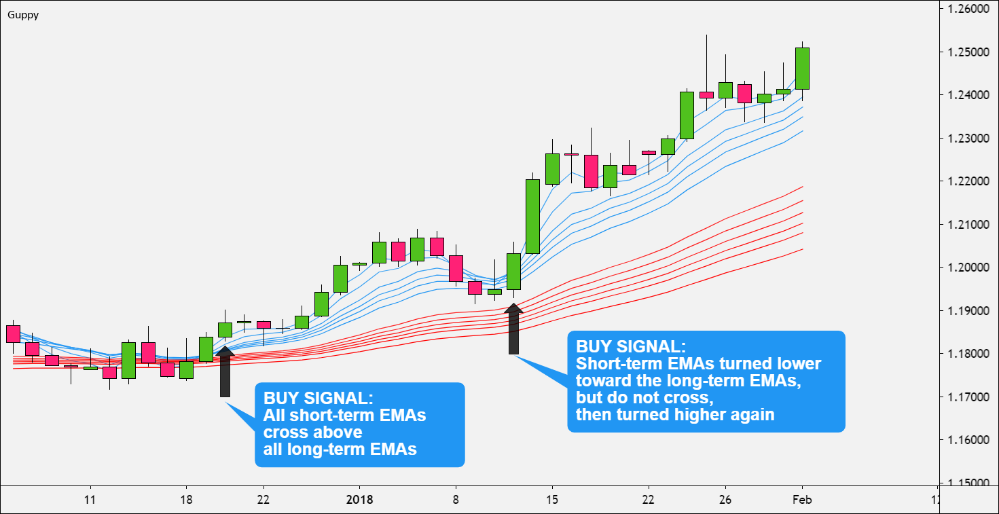

## Table of Contents

## What is the Guppy Multiple Moving Average (GMMA) and its purpose in trading?

The Guppy Multiple Moving Average (GMMA) is a technical analysis tool used by traders to understand the behavior of a stock or asset over time. It was developed by Daryl Guppy and consists of two groups of moving averages: short-term and long-term. The short-term group typically includes moving averages of 3, 5, 8, 10, 12, and 15 periods, while the long-term group includes averages of 30, 35, 40, 45, 50, and 60 periods. By plotting these moving averages on a chart, traders can see how the short-term and long-term trends interact with each other.

The purpose of the GMMA in trading is to help traders identify potential trends and changes in market sentiment. When the short-term moving averages start to separate from the long-term moving averages, it can signal the beginning of a new trend. If the short-term averages are above the long-term averages and spreading out, it suggests a strong bullish trend. Conversely, if the short-term averages are below and spreading out from the long-term averages, it indicates a bearish trend. Traders use these signals to make decisions about buying or selling assets, aiming to enter the market at the start of a trend and exit before it reverses.

## How does the GMMA differ from other moving average indicators?

The Guppy Multiple Moving Average (GMMA) is different from other moving average indicators because it uses two sets of moving averages instead of just one. Most other indicators, like the Simple Moving Average (SMA) or the Exponential Moving Average (EMA), use a single line to show the average price over a certain time. The GMMA, on the other hand, has a group of short-term moving averages and a group of long-term moving averages. This helps traders see both short-term and long-term trends at the same time.

Another way the GMMA is different is how it helps traders understand market trends. With other moving averages, traders might look for crossovers or specific patterns to make decisions. But with the GMMA, traders watch for the separation or compression of the two groups of averages. When the short-term averages start to move away from the long-term averages, it can signal a new trend starting. This makes the GMMA a useful tool for spotting trend changes early, which can be harder to do with single-line moving averages.

## What are the two groups of moving averages used in the GMMA?

The Guppy Multiple Moving Average (GMMA) uses two groups of moving averages to help traders see trends. The first group is the short-term moving averages. These include averages over 3, 5, 8, 10, 12, and 15 periods. They show what's happening in the market over a shorter time and help traders see quick changes in price.

The second group is the long-term moving averages. These cover longer periods and include averages over 30, 35, 40, 45, 50, and 60 periods. They show the bigger picture of the market's direction over time. By looking at both groups together, traders can understand both short-term and long-term trends and make better decisions about when to buy or sell.

## What are the specific periods used for the short-term moving averages in the GMMA?

The short-term moving averages in the Guppy Multiple Moving Average (GMMA) are used to show what's happening in the market over a shorter time. These averages help traders see quick changes in price. The periods used for these short-term moving averages are 3, 5, 8, 10, 12, and 15. 

By looking at these short-term averages, traders can get a sense of how the market is moving right now. If these averages start to move away from the longer-term averages, it might mean a new trend is starting. This can help traders decide when it's a good time to buy or sell.

## What are the specific periods used for the long-term moving averages in the GMMA?

The long-term moving averages in the Guppy Multiple Moving Average (GMMA) help traders see the bigger picture of the market's direction over time. These averages are used to understand trends that last longer than the quick changes shown by the short-term averages. The periods used for these long-term moving averages are 30, 35, 40, 45, 50, and 60.

By looking at these long-term averages, traders can see if the market is in a strong trend that might last for a while. When the short-term averages start to move away from these long-term averages, it can signal the start of a new trend. This helps traders make better decisions about when to buy or sell, based on both the short-term and long-term movements in the market.

## How do you calculate the short-term moving averages for the GMMA?

To calculate the short-term moving averages for the Guppy Multiple Moving Average (GMMA), you start by choosing the specific periods for the short-term group. These periods are 3, 5, 8, 10, 12, and 15 days. For each period, you take the average price of the asset over that number of days. For example, for the 3-day moving average, you add up the closing prices of the last three days and then divide by 3. You do the same for the other periods: add up the closing prices for the last 5 days and divide by 5, for the last 8 days and divide by 8, and so on.

Once you have calculated the moving average for each period, you plot these averages on a chart. The 3-day moving average will be the most responsive to recent price changes, while the 15-day moving average will be smoother and less reactive. By looking at how these short-term moving averages move together, traders can see if the market is starting to change direction quickly. If these averages start to spread out and move away from the long-term averages, it might mean a new trend is beginning, which can help traders decide when to buy or sell.

## How do you calculate the long-term moving averages for the GMMA?

To calculate the long-term moving averages for the Guppy Multiple Moving Average (GMMA), you pick the periods for the long-term group. These periods are 30, 35, 40, 45, 50, and 60 days. For each period, you find the average price of the asset over that number of days. For example, to get the 30-day moving average, you add up the closing prices of the last 30 days and then divide by 30. You do the same for the other periods: add up the closing prices for the last 35 days and divide by 35, for the last 40 days and divide by 40, and so on.

Once you have calculated the moving average for each period, you put these averages on a chart. The 30-day moving average will show the trend over a longer time than the 60-day moving average, which will be even smoother and less affected by recent price changes. By watching how these long-term moving averages move together, traders can see if the market is in a strong trend that might last for a while. If the short-term averages start to spread out and move away from these long-term averages, it could mean a new trend is starting, helping traders decide when to buy or sell.

## How can the GMMA be used to identify potential buy and sell signals?

The Guppy Multiple Moving Average (GMMA) helps traders spot when to buy or sell by looking at how the short-term and long-term moving averages move on a chart. When the short-term moving averages start to spread out and move away from the long-term averages, it's a sign that a new trend might be starting. If the short-term averages are above the long-term averages and spreading out, it means the market is getting more bullish. This could be a good time to buy because the price might keep going up.

On the other hand, if the short-term moving averages are below the long-term averages and spreading out, it shows that the market is getting more bearish. This might be a good time to sell because the price could keep going down. By watching these signals, traders can try to get into the market at the start of a trend and get out before it turns around.

## What are the common strategies for trading using the GMMA?

One common strategy for trading using the GMMA is to buy when the short-term moving averages start to spread out and move above the long-term moving averages. This shows that the market is getting more bullish and the price might keep going up. Traders watch for this signal to enter a trade, hoping to catch the start of an upward trend. They might set a stop-loss order below the long-term averages to limit their losses if the market turns around.

Another strategy is to sell when the short-term moving averages spread out and move below the long-term averages. This indicates that the market is getting more bearish and the price could keep going down. Traders use this signal to exit their positions or to sell short, aiming to profit from the downward trend. They might set a stop-loss order above the long-term averages to manage their risk if the market unexpectedly reverses.

Some traders also use the GMMA to confirm trends before making trades. If both the short-term and long-term averages are moving in the same direction, it shows a strong trend. Traders might wait for this confirmation before entering a trade, reducing the risk of getting caught in a false start. They keep an eye on how the averages interact, adjusting their trades based on whether the market continues to follow the trend or if the averages start to compress, signaling a potential reversal.

## How can the GMMA be customized for different trading styles or assets?

The GMMA can be changed to fit different ways of trading or different things you want to trade. If you like to trade quickly, you might make the short-term moving averages even shorter, like using 2, 3, 4, 5, 6, and 7 days instead of the usual 3, 5, 8, 10, 12, and 15 days. This way, you can see changes in the market faster. For trading things that don't move as fast, like big stocks or gold, you might want to make the long-term moving averages longer, maybe using 50, 60, 70, 80, 90, and 100 days instead of the usual 30, 35, 40, 45, 50, and 60 days. This helps you see the bigger trends that take more time to change.

You can also change the GMMA for different trading goals. If you want to make sure you're catching strong trends, you might wait until the short-term and long-term averages are really far apart before you decide to buy or sell. Or, if you want to trade more often and catch smaller moves, you might start a trade when the averages just start to spread out a little bit. This way, you can use the GMMA to fit how you like to trade and what you're trading, making it a helpful tool for all kinds of traders.

## What are the limitations and potential pitfalls of using the GMMA?

One big problem with using the GMMA is that it can give you wrong signals sometimes. The market can be tricky, and what looks like the start of a new trend might just be a short change that goes back to normal soon. If you jump into a trade too quickly because the short-term averages are moving away from the long-term ones, you might lose money if the trend doesn't last. Also, the GMMA works best in markets that are moving clearly up or down, but it's not as good in markets that are just moving sideways without a strong trend.

Another thing to watch out for is that the GMMA can be slow to show you that a trend has changed. By the time the short-term and long-term averages spread out enough to tell you a new trend is starting, the market might already have moved a lot. This means you might miss the best time to get into a trade. Plus, if you're trading things that move fast, like some stocks or cryptocurrencies, the GMMA might not be quick enough to help you make good decisions. It's important to use the GMMA along with other tools and to know its limits so you don't rely on it too much.

## How can the GMMA be combined with other technical indicators for improved analysis?

You can use the GMMA along with other tools to get a better picture of the market. For example, adding the Relative Strength Index (RSI) can help you see if a stock is overbought or oversold. If the GMMA shows a new trend starting and the RSI is over 70, it might mean the stock is overbought and could go down soon. This can help you decide if it's a good time to sell. On the other hand, if the RSI is under 30 and the GMMA shows a new upward trend, it might be a good time to buy because the stock could go up.

Another useful tool to use with the GMMA is the Moving Average Convergence Divergence (MACD). The MACD can show you when the momentum of a trend is changing. If the GMMA shows that the short-term averages are spreading out from the long-term averages, and the MACD line crosses above the signal line, it's a strong sign that a bullish trend is starting. This can give you more confidence to buy. If the MACD line crosses below the signal line while the GMMA shows the short-term averages moving away from the long-term averages, it might be a good time to sell because a bearish trend could be starting.

## What is Understanding Moving Averages?

Moving averages (MAs) are a key aspect of technical analysis, serving as tools to smooth out price data and make it easier to detect trends. Essentially, a moving average is a statistical calculation that takes the average value of a security's price over a specific number of periods. The primary goal is to filter out short-term fluctuations and highlight longer-term trends or cycles. There are several types of moving averages, the most common being the Simple Moving Average (SMA) and the Exponential Moving Average (EMA).

Simple Moving Average (SMA) is the basic form of a moving average, calculated by summing up the closing prices over a given number of periods and then dividing by that number of periods. Mathematically, it is expressed as:

$$
\text{SMA} = \frac{P_1 + P_2 + \cdots + P_n}{n}
$$

where $P_1, P_2, \ldots, P_n$ represent the closing prices over $n$ periods.

In contrast, the Exponential Moving Average (EMA) gives more weight to recent prices, making it more responsive to new information. This is accomplished through a smoothing [factor](/wiki/factor-investing) that applies decreasing weights to older prices. The formula for EMA is:

$$
\text{EMA}_t = \alpha \cdot P_t + (1 - \alpha) \cdot \text{EMA}_{t-1}
$$

where $\alpha = \frac{2}{n + 1}$ is the smoothing factor, $P_t$ is the price at time $t$, and $n$ is the number of periods.

Moving averages are instrumental in identifying market trends. When the price of a security trades consistently above its moving average, it may indicate an uptrend. Conversely, when the price remains below the moving average, it might suggest a downtrend. Moving averages also act as dynamic support and resistance levels.

As foundational tools in technical analysis, moving averages are essential for creating more advanced trading strategies. By analyzing crossovers, where a short-term MA crosses above or below a long-term MA, traders can generate buy or sell signals. For example, a common strategy involves using a 50-day SMA and a 200-day SMA; when the 50-day SMA crosses above the 200-day SMA, it is considered a bullish signal, known as a "golden cross."

The use of multiple moving averages enhances strategy development, allowing traders to gauge different time frames and market dynamics more effectively. By employing a combination of short-term and long-term MAs, investors can better visualize the potential direction of the trend and adjust their positions accordingly.

Overall, understanding and applying moving averages is crucial for technical analysts seeking to develop reliable trading strategies and make informed decisions in financial markets.

 to Guppy Multiple Moving Average (GMMA)

The Guppy Multiple Moving Average (GMMA), conceived by Australian trader Daryl Guppy, is a sophisticated technical analysis tool crafted to enhance traders' ability to gauge market trends and shifts effectively. The GMMA consists of two distinct groups of Exponential Moving Averages (EMAs) which help traders to analyze various aspects of price behavior over different time frames. These two groups—a set of short-term EMAs and a set of long-term EMAs—are fundamental to the GMMA's unique approach in identifying changes in market [momentum](/wiki/momentum) and sentiment.

### Structure and Components of GMMA

The GMMA is composed of two major components:

1. **Short-term EMAs:** These consist of six moving averages calculated over periods of 3, 5, 8, 10, 12, and 15 days. The primary function of the short-term group is to follow the traders’ actions and the immediate market sentiment. They react quickly to price changes and are instrumental in signaling shifts in short-term market trends.

2. **Long-term EMAs:** Similarly, this group includes six EMAs but is calculated over longer periods of 30, 35, 40, 45, 50, and 60 days. The long-term group reflects the perspectives of investors and long-term holders. It is less sensitive to immediate price fluctuations and focuses on capturing the broader, more sustained market trends.

### Purpose of Using Two Groups of Moving Averages

The strategy behind using two distinct groups of moving averages within the GMMA framework is to provide a comprehensive view of market dynamics. The short-term EMAs enable traders to detect swift changes in market momentum, while the long-term EMAs offer insights into the underlying trend stability and investor confidence. The convergence and divergence observed between these two groups can reveal key insights:

- **Convergence:** When short-term EMAs converge towards the long-term EMAs, it indicates a potential stabilization or a period of consolidation in the market, suggesting that traders and investors may be aligning in their perspectives.

- **Divergence:** Conversely, when short-term EMAs diverge widely from the long-term EMAs, it may signal a ramp-up in volatility or the emergence of new trends, as immediate market sentiment deviates from longer-term expectations.

### Capturing Shifts in Market Momentum and Sentiment

The design of the GMMA effectively captures shifts in market momentum and sentiment by leveraging the interplay between the short-term and long-term EMAs. When a trend begins to form or reverse, the short-term EMAs will adjust more rapidly than the long-term EMAs. This dynamic provides early warning signals of a potential market turn. The separation between the two sets of EMAs can indicate the strength of the trend; a wide gap suggests a strong and robust trend, while a narrow gap may imply weakening momentum or the potential for a reversal.

By systematically evaluating price data through these dual lenses, traders using the GMMA are better equipped to discern the underlying forces at play within the market, allowing for more informed decision-making and strategic positioning. The GMMA thus acts as a bridge between short-term traders' impulses and the long-term views held by investors, offering a balanced and nuanced interpretation of market activity.

## What are GMMA Formulas and Calculations?

The Guppy Multiple Moving Average (GMMA) is a popular tool used in technical analysis to capture shifts in market momentum and sentiment by combining short-term and long-term moving averages. This section focuses on the calculation of GMMA and its components, providing a step-by-step guide to understanding this approach.

### Calculating GMMA

**Short-term Moving Averages (STMA):**

The short-term group consists of six Exponential Moving Averages (EMAs) with periods 3, 5, 8, 10, 12, and 15. EMAs place more weight on recent prices, making them responsive to new market data.

To calculate an EMA, the formula is:

$$

\text{EMA}_{t} = (P_{t} \times K) + (\text{EMA}_{t-1} \times (1 - K))
$$

where:
- $P_{t}$ is the current price,
- $K = \frac{2}{n+1}$ is the smoothing factor,
- $n$ is the number of periods,
- $\text{EMA}_{t-1}$ is the EMA of the previous period.

Applying this formula for each of the specified periods (3, 5, 8, 10, 12, 15) establishes the short-term trends in the market.

**Long-term Moving Averages (LTMA):**

The long-term group includes six EMAs with periods 30, 35, 40, 45, 50, and 60. These moving averages are less sensitive to recent price changes, providing a view of the broader market trend.

The EMA formula remains the same, but using longer periods:

$$
\text{EMA}_{t} = (P_{t} \times K) + (\text{EMA}_{t-1} \times (1 - K))
$$

Calculate $K$ for each long-term period (30, 35, 40, 45, 50, 60) and apply it in the formula to assess long-term trends.

### Illustrative Example for GMMA Calculation

Assume a hypothetical dataset of daily closing prices: [100, 102, 104, 103, 105, 107, 109]. Calculating the short-term and long-term EMAs involves iterating through these prices using the respective formulas for the STMA and LTMA period groups.

Example Python Code:

```python
def calculate_ema(prices, period):
    k = 2 / (period + 1)
    ema_values = [sum(prices[:period]) / period]  # Starting with the SMA for initial EMA
    for price in prices[period:]:
        ema = (price * k) + (ema_values[-1] * (1 - k))
        ema_values.append(ema)
    return ema_values

prices = [100, 102, 104, 103, 105, 107, 109]

# Calculate short-term EMAs
short_term_periods = [3, 5, 8, 10, 12, 15]
short_term_emas = {period: calculate_ema(prices, period) for period in short_term_periods}

# Calculate long-term EMAs
long_term_periods = [30, 35, 40, 45, 50, 60]
long_term_emas = {period: calculate_ema(prices, period) for period in long_term_periods}

print("Short-Term EMAs:", short_term_emas)
print("Long-Term EMAs:", long_term_emas)
```

### Comparison with Single Moving Average

GMMA's use of multiple EMAs contrasts with single moving average analysis, which typically examines just one average and may not capture nuanced shifts in trend. Single EMAs or Simple Moving Averages (SMA) provide a singular perspective, often resulting in delayed or less reliable signals compared to GMMA's multi-layered approach. With GMMA, the interaction between short-term and long-term averages provides a more comprehensive view of market dynamics, aiding traders in making better-informed decisions.

## References & Further Reading

[1]: Guppy, Daryl. ["Trend Trading: A Seven-Step Approach to Success."](https://www.amazon.com/Trend-Trading-seven-approach-success/dp/0731400852) Wiley Finance.

[2]: Aronson, David R. ["Evidence-Based Technical Analysis: Applying the Scientific Method and Statistical Inference to Trading Signals."](https://www.amazon.com/Evidence-Based-Technical-Analysis-Scientific-Statistical/dp/0470008741) Wiley.

[3]: Murphy, John J. ["Technical Analysis of the Financial Markets: A Comprehensive Guide to Trading Methods and Applications."](https://archive.org/details/technicalanalysi0000murp) New York Institute of Finance.

[4]: Prado, Marcos López de. ["Advances in Financial Machine Learning."](https://www.amazon.com/Advances-Financial-Machine-Learning-Marcos/dp/1119482089) Wiley.

[5]: Jansen, Stefan. ["Machine Learning for Algorithmic Trading."](https://github.com/stefan-jansen/machine-learning-for-trading) Independently published.

[6]: Chan, Ernest P. ["Quantitative Trading: How to Build Your Own Algorithmic Trading Business."](https://github.com/ftvision/quant_trading_echan_book) Wiley.