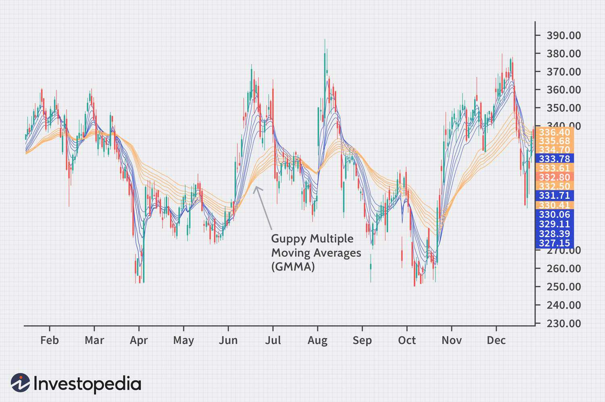

Technical analysis is a method used by traders to evaluate securities and make trading decisions by analyzing statistical trends collected from trading activity, such as price movement and volume. Moving averages (MAs) are a fundamental component of technical analysis, used to smooth out price data by creating a constantly updated average price, which helps in identifying the direction of the trend over a certain period.

The importance of moving averages lies in their ability to filter out the noise from random price fluctuations, thereby providing a clearer view of the price trend. Moving averages can also act as support and resistance levels, helping traders to make crucial buy or sell decisions. There are various types of moving averages, including the Simple Moving Average (SMA) and Exponential Moving Average (EMA), each offering different levels of sensitivity to recent price changes.



The Guppy Multiple Moving Average (GMMA) is an advanced tool introduced by trader and author Daryl Guppy. It is designed to capture shifts in market momentum and sentiment by using two distinct groups of moving averages: short-term and long-term. The GMMA provides an enriched analysis by giving insights into the interplay between traders and investors, which can be indicative of future price directions.

The objective of this article is to explore the Guppy Multiple Moving Average, understand its formulation and application, particularly in algorithmic trading scenarios. The GMMA facilitates traders in making informed decisions by identifying emerging trends and changes in market conditions with greater accuracy.

Understanding the GMMA is vital for traders who aim to improve their market analysis skills. By leveraging the insights provided by GMMA, traders can enhance their ability to anticipate market movements and thereby make more strategic trading decisions. This comprehensive discussion will provide readers with a deeper comprehension of the GMMA's pivotal role in modern trading strategies.

## Table of Contents

## Understanding Moving Averages

Moving averages (MAs) are a key aspect of technical analysis, serving as tools to smooth out price data and make it easier to detect trends. Essentially, a moving average is a statistical calculation that takes the average value of a security's price over a specific number of periods. The primary goal is to filter out short-term fluctuations and highlight longer-term trends or cycles. There are several types of moving averages, the most common being the Simple Moving Average (SMA) and the Exponential Moving Average (EMA).

Simple Moving Average (SMA) is the basic form of a moving average, calculated by summing up the closing prices over a given number of periods and then dividing by that number of periods. Mathematically, it is expressed as:

$$
\text{SMA} = \frac{P_1 + P_2 + \cdots + P_n}{n}
$$

where $P_1, P_2, \ldots, P_n$ represent the closing prices over $n$ periods.

In contrast, the Exponential Moving Average (EMA) gives more weight to recent prices, making it more responsive to new information. This is accomplished through a smoothing [factor](/wiki/factor-investing) that applies decreasing weights to older prices. The formula for EMA is:

$$
\text{EMA}_t = \alpha \cdot P_t + (1 - \alpha) \cdot \text{EMA}_{t-1}
$$

where $\alpha = \frac{2}{n + 1}$ is the smoothing factor, $P_t$ is the price at time $t$, and $n$ is the number of periods.

Moving averages are instrumental in identifying market trends. When the price of a security trades consistently above its moving average, it may indicate an uptrend. Conversely, when the price remains below the moving average, it might suggest a downtrend. Moving averages also act as dynamic support and resistance levels.

As foundational tools in technical analysis, moving averages are essential for creating more advanced trading strategies. By analyzing crossovers, where a short-term MA crosses above or below a long-term MA, traders can generate buy or sell signals. For example, a common strategy involves using a 50-day SMA and a 200-day SMA; when the 50-day SMA crosses above the 200-day SMA, it is considered a bullish signal, known as a "golden cross."

The use of multiple moving averages enhances strategy development, allowing traders to gauge different time frames and market dynamics more effectively. By employing a combination of short-term and long-term MAs, investors can better visualize the potential direction of the trend and adjust their positions accordingly.

Overall, understanding and applying moving averages is crucial for technical analysts seeking to develop reliable trading strategies and make informed decisions in financial markets.

 to Guppy Multiple Moving Average (GMMA)

The Guppy Multiple Moving Average (GMMA), conceived by Australian trader Daryl Guppy, is a sophisticated technical analysis tool crafted to enhance traders' ability to gauge market trends and shifts effectively. The GMMA consists of two distinct groups of Exponential Moving Averages (EMAs) which help traders to analyze various aspects of price behavior over different time frames. These two groups—a set of short-term EMAs and a set of long-term EMAs—are fundamental to the GMMA's unique approach in identifying changes in market [momentum](/wiki/momentum) and sentiment.

### Structure and Components of GMMA

The GMMA is composed of two major components:

1. **Short-term EMAs:** These consist of six moving averages calculated over periods of 3, 5, 8, 10, 12, and 15 days. The primary function of the short-term group is to follow the traders’ actions and the immediate market sentiment. They react quickly to price changes and are instrumental in signaling shifts in short-term market trends.

2. **Long-term EMAs:** Similarly, this group includes six EMAs but is calculated over longer periods of 30, 35, 40, 45, 50, and 60 days. The long-term group reflects the perspectives of investors and long-term holders. It is less sensitive to immediate price fluctuations and focuses on capturing the broader, more sustained market trends.

### Purpose of Using Two Groups of Moving Averages

The strategy behind using two distinct groups of moving averages within the GMMA framework is to provide a comprehensive view of market dynamics. The short-term EMAs enable traders to detect swift changes in market momentum, while the long-term EMAs offer insights into the underlying trend stability and investor confidence. The convergence and divergence observed between these two groups can reveal key insights:

- **Convergence:** When short-term EMAs converge towards the long-term EMAs, it indicates a potential stabilization or a period of consolidation in the market, suggesting that traders and investors may be aligning in their perspectives.

- **Divergence:** Conversely, when short-term EMAs diverge widely from the long-term EMAs, it may signal a ramp-up in volatility or the emergence of new trends, as immediate market sentiment deviates from longer-term expectations.

### Capturing Shifts in Market Momentum and Sentiment

The design of the GMMA effectively captures shifts in market momentum and sentiment by leveraging the interplay between the short-term and long-term EMAs. When a trend begins to form or reverse, the short-term EMAs will adjust more rapidly than the long-term EMAs. This dynamic provides early warning signals of a potential market turn. The separation between the two sets of EMAs can indicate the strength of the trend; a wide gap suggests a strong and robust trend, while a narrow gap may imply weakening momentum or the potential for a reversal.

By systematically evaluating price data through these dual lenses, traders using the GMMA are better equipped to discern the underlying forces at play within the market, allowing for more informed decision-making and strategic positioning. The GMMA thus acts as a bridge between short-term traders' impulses and the long-term views held by investors, offering a balanced and nuanced interpretation of market activity.

## GMMA Formulas and Calculations

The Guppy Multiple Moving Average (GMMA) is a popular tool used in technical analysis to capture shifts in market momentum and sentiment by combining short-term and long-term moving averages. This section focuses on the calculation of GMMA and its components, providing a step-by-step guide to understanding this approach.

### Calculating GMMA

**Short-term Moving Averages (STMA):**

The short-term group consists of six Exponential Moving Averages (EMAs) with periods 3, 5, 8, 10, 12, and 15. EMAs place more weight on recent prices, making them responsive to new market data.

To calculate an EMA, the formula is:

$$

\text{EMA}_{t} = (P_{t} \times K) + (\text{EMA}_{t-1} \times (1 - K))
$$

where:
- $P_{t}$ is the current price,
- $K = \frac{2}{n+1}$ is the smoothing factor,
- $n$ is the number of periods,
- $\text{EMA}_{t-1}$ is the EMA of the previous period.

Applying this formula for each of the specified periods (3, 5, 8, 10, 12, 15) establishes the short-term trends in the market.

**Long-term Moving Averages (LTMA):**

The long-term group includes six EMAs with periods 30, 35, 40, 45, 50, and 60. These moving averages are less sensitive to recent price changes, providing a view of the broader market trend.

The EMA formula remains the same, but using longer periods:

$$
\text{EMA}_{t} = (P_{t} \times K) + (\text{EMA}_{t-1} \times (1 - K))
$$

Calculate $K$ for each long-term period (30, 35, 40, 45, 50, 60) and apply it in the formula to assess long-term trends.

### Illustrative Example for GMMA Calculation

Assume a hypothetical dataset of daily closing prices: [100, 102, 104, 103, 105, 107, 109]. Calculating the short-term and long-term EMAs involves iterating through these prices using the respective formulas for the STMA and LTMA period groups.

Example Python Code:

```python
def calculate_ema(prices, period):
    k = 2 / (period + 1)
    ema_values = [sum(prices[:period]) / period]  # Starting with the SMA for initial EMA
    for price in prices[period:]:
        ema = (price * k) + (ema_values[-1] * (1 - k))
        ema_values.append(ema)
    return ema_values

prices = [100, 102, 104, 103, 105, 107, 109]

# Calculate short-term EMAs
short_term_periods = [3, 5, 8, 10, 12, 15]
short_term_emas = {period: calculate_ema(prices, period) for period in short_term_periods}

# Calculate long-term EMAs
long_term_periods = [30, 35, 40, 45, 50, 60]
long_term_emas = {period: calculate_ema(prices, period) for period in long_term_periods}

print("Short-Term EMAs:", short_term_emas)
print("Long-Term EMAs:", long_term_emas)
```

### Comparison with Single Moving Average

GMMA's use of multiple EMAs contrasts with single moving average analysis, which typically examines just one average and may not capture nuanced shifts in trend. Single EMAs or Simple Moving Averages (SMA) provide a singular perspective, often resulting in delayed or less reliable signals compared to GMMA's multi-layered approach. With GMMA, the interaction between short-term and long-term averages provides a more comprehensive view of market dynamics, aiding traders in making better-informed decisions.

## Benefits of Using GMMA in Technical Analysis

The Guppy Multiple Moving Average (GMMA) significantly enhances a trader's ability to interpret market conditions by offering a comprehensive view through the combination of short-term and long-term moving averages. This method provides a dual perspective that is crucial for making informed trading decisions.

GMMA contributes to early trend identification by distinctly displaying the interaction between various time frames. Short-term moving averages (with periods such as 3, 5, 8, 10, 12, and 15) are responsive to recent price movements, making them sensitive indicators for short-term trend changes. Meanwhile, long-term moving averages (covering periods like 30, 35, 40, 45, 50, and 60) encapsulate broader market trends. When these two sets converge or diverge, traders can potentially spot the beginning of a new trend or the weakening of an existing one. For instance, a compression of both short and long-term averages can indicate a consolidation period, whereas their expansion may signify a robust trend development.

The synergy between short-term and long-term moving averages within GMMA facilitates a robust analytical framework compared to using a single moving average. The overlapping of these averages provides multiple support and resistance zones, allowing traders to gauge the strength of a trend and possibly predict reversals. This multi-layered insight means traders can be more confident about taking positions based on moving averages crossovers—increasing the probability of aligning with strong trends.

Real-world examples underscore the efficacy of GMMA in trading. For instance, during periods of high market [volatility](/wiki/volatility-trading-strategies), the GMMA may display short-term averages crossing but not breaching long-term averages, suggesting temporary corrections rather than full-scale trend reversals. Conversely, successful identification of trend shifts has been demonstrated in cases where short-term averages initially breach long-term averages, followed by the alignment of all averages in the new trend's direction, providing traders a clear signal to adjust their strategies.

Additional advantages of GMMA extend across different market environments, enhancing adaptability. Whether in trending or sideways markets, GMMA's layered structure can inform traders of potential market dynamics. Its ability to depict market sentiment also makes it suitable for a variety of assets, from equities to commodities and currencies, thereby offering a versatile tool for diverse trading strategies.

By providing an aggregated view of price action through its composite moving averages, GMMA equips traders with a powerful lens to interpret market condition changes and align their strategies accordingly. Its adaptability and depth make it an invaluable tool in the technical analyst's arsenal.

## GMMA in Algorithmic Trading

Guppy Multiple Moving Average (GMMA) plays a significant role in developing [algorithmic trading](/wiki/algorithmic-trading) strategies. This technical analysis tool, known for its ability to identify shifts in market momentum, has proven valuable for algorithmic traders seeking to automate their trading decisions. By incorporating GMMA, traders can leverage the power of multiple moving averages to make informed trading decisions at higher speed and accuracy.

### Advantages of Algorithmic Trading Using GMMA

Algorithmic trading with GMMA provides several advantages, primarily in terms of speed and accuracy. Automated systems can analyze large datasets and execute trades more rapidly than a human could. This ability to process and act on information in real-time allows traders to capitalize on emerging opportunities more swiftly.

Moreover, GMMA's dual-layer moving averages—short-term for identifying immediate trends and long-term for confirming broader trends—enable algorithms to make nuanced distinctions between transient price fluctuations and significant market movements. This layered approach provides a robust framework for developing strategies that adapt dynamically to changing market conditions.

### Potential Challenges and Solutions

Incorporating GMMA into trading algorithms presents challenges, such as optimizing parameters for different market conditions and ensuring the algorithm's resilience to market volatility. One potential solution is the implementation of [machine learning](/wiki/machine-learning) techniques to fine-tune the parameters of the GMMA algorithm. By continually analyzing market data, these systems can adjust GMMA settings to optimize performance without manual intervention.

Another challenge is ensuring the algorithm operates with minimal latency. Efficient coding practices, such as using vectorized operations in Python or leveraging the power of compiled languages like C++, can reduce execution time. Here is a simple Python code snippet illustrating how to compute GMMA:

```python
import pandas as pd

def calculate_gmma(prices):
    short_periods = [3, 5, 8, 10, 12, 15]
    long_periods = [30, 35, 40, 45, 50, 60]

    short_emas = {f'EMA_{p}': prices.ewm(span=p, adjust=False).mean() for p in short_periods}
    long_emas = {f'EMA_{p}': prices.ewm(span=p, adjust=False).mean() for p in long_periods}

    return pd.DataFrame({**short_emas, **long_emas})

# Example usage:
# prices is a pandas Series of price data
# gmma_df = calculate_gmma(prices)
```

### Examples of Algorithmic Strategies Utilizing GMMA

Algorithmic strategies using GMMA include trend-following systems that trigger entries based on crossovers between short-term and long-term moving averages. When all short-term averages converge and cross above the long-term averages, it signals a potential buying opportunity, and vice versa for selling. Another strategy involves using GMMA to identify and trade breakouts by recognizing patterns that indicate a shift in market sentiment.

### Future Prospects

The future of GMMA in automated trading systems looks promising as technology continues to advance. The integration of [artificial intelligence](/wiki/ai-artificial-intelligence) and machine learning with GMMA could lead to more adaptive algorithms capable of recognizing complex market patterns. Furthermore, the expansion of computational capacities and access to high-frequency trading platforms will likely enhance the efficacy of GMMA-based strategies, making them more prevalent in sophisticated trading systems.

Overall, the integration of GMMA into algorithmic trading embodies the intersection of technology and financial analysis, offering traders new avenues to optimize their strategies and improve trading performance.

## Practical Considerations and Tips

When using the Guppy Multiple Moving Average (GMMA) in trading, there are practical considerations and tips that can greatly enhance its effectiveness. A common mistake is relying solely on GMMA signals without considering the broader market context or combining it with other technical indicators. Traders often misinterpret crossovers between the short-term and long-term groups as definitive buy or sell signals. It's essential to use GMMA in conjunction with other indicators like Relative Strength Index (RSI) or Moving Average Convergence Divergence (MACD) to confirm trends and avoid false signals.

Integrating GMMA with other technical indicators can significantly enhance market analysis. For instance, using Bollinger Bands alongside GMMA can help identify volatility and potential reversal points. When a short-term crossover occurs within GMMA, a simultaneous touch or breach of a Bollinger Band could signal a stronger trading opportunity. This combination assists traders in deciphering the strength of trends and potential points of reversal.

Optimizing GMMA settings for different trading styles and market conditions is essential. Swing traders might prefer slightly longer periods within the short-term group, such as 5, 10, 15, 20, 25, and 30, to capture more stable trends. Conversely, day traders might reduce these periods to capture quick momentum changes. It is crucial to backtest different period configurations to find an optimal setup that aligns with the specific trading style and market volatility.

Several software tools can aid in implementing GMMA effectively. Trading platforms like MetaTrader, TradingView, and NinjaTrader offer customizable settings for GMMA, allowing traders to visualize and adjust parameters easily. Python, with libraries like Pandas and NumPy, can be used to automate GMMA calculations and backtest strategies. Below is a basic Python implementation for calculating GMMA:

```python
import pandas as pd

def calculate_gmma(data, short_term_periods, long_term_periods):
    short_term_averages = [data['Close'].rolling(window=p).mean() for p in short_term_periods]
    long_term_averages = [data['Close'].rolling(window=p).mean() for p in long_term_periods]
    return short_term_averages, long_term_averages

# Example usage
data = pd.DataFrame({'Close': [your_close_prices]})
short_periods = [3, 5, 8, 10, 12, 15]
long_periods = [30, 35, 40, 45, 50, 60]

short_term_ma, long_term_ma = calculate_gmma(data, short_periods, long_periods)
```

Real-world examples highlight the successful application of GMMA. Traders have observed trends and momentum shifts in volatile markets such as cryptocurrencies, primarily when GMMA highlighted divergences not visible with single moving averages. These cases often involve using GMMA alongside macroeconomic indicators to fine-tune entry and [exit](/wiki/exit-strategy) strategies, demonstrating its utility in diverse market environments.

In summary, utilizing GMMA effectively requires avoiding common missteps, leveraging complementary indicators, tailoring settings to individual trading styles, and employing reliable tools for analysis. By incorporating these practices, traders can harness the full potential of GMMA, improving their ability to make informed trading decisions.

## Conclusion

Throughout this article, we've explored the intricacies of the Guppy Multiple Moving Average (GMMA) and its pivotal role in enhancing trading efficiency through technical analysis. By incorporating both short-term and long-term moving averages, GMMA offers traders a nuanced perspective on market dynamics, enabling the identification of trend shifts and the validation of market sentiments.

The strategic advantage of understanding and applying GMMA lies in its ability to provide clearer insights into market conditions. This makes it a powerful tool for both traditional and algorithmic trading. Traders who leverage GMMA can gain early signals of emerging trends, facilitating more informed and timely decision-making, which is crucial in the volatile world of trading.

It is recommended for traders to experiment with GMMA, integrating it with other technical indicators to refine their personal analysis frameworks. As financial markets continue to evolve, staying updated on technical advancements, like GMMA, becomes essential for maintaining a competitive edge.

Readers are encouraged to further explore the applications of GMMA in their trading strategies, analyzing different market conditions and adapting their use of this indicator for optimal results. Continuous learning and adaptation are key to thriving in the competitive trading landscape.

## References & Further Reading

[1]: Guppy, Daryl. ["Trend Trading: A Seven-Step Approach to Success."](https://www.amazon.com/Trend-Trading-seven-approach-success/dp/0731400852) Wiley Finance.

[2]: Aronson, David R. ["Evidence-Based Technical Analysis: Applying the Scientific Method and Statistical Inference to Trading Signals."](https://www.amazon.com/Evidence-Based-Technical-Analysis-Scientific-Statistical/dp/0470008741) Wiley.

[3]: Murphy, John J. ["Technical Analysis of the Financial Markets: A Comprehensive Guide to Trading Methods and Applications."](https://archive.org/details/technicalanalysi0000murp) New York Institute of Finance.

[4]: Prado, Marcos López de. ["Advances in Financial Machine Learning."](https://www.amazon.com/Advances-Financial-Machine-Learning-Marcos/dp/1119482089) Wiley.

[5]: Jansen, Stefan. ["Machine Learning for Algorithmic Trading."](https://github.com/stefan-jansen/machine-learning-for-trading) Independently published.

[6]: Chan, Ernest P. ["Quantitative Trading: How to Build Your Own Algorithmic Trading Business."](https://github.com/ftvision/quant_trading_echan_book) Wiley.