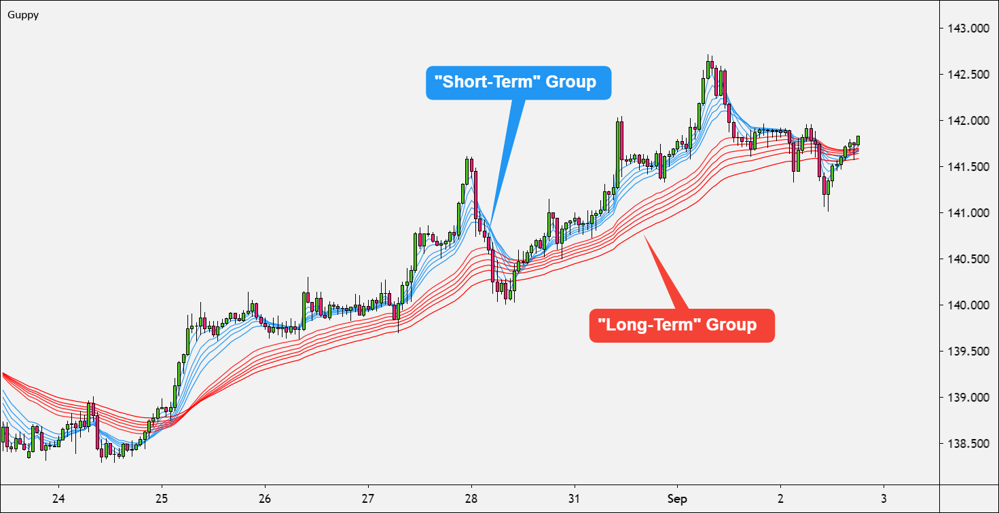

Algorithmic trading has transformed the financial markets, offering a wide range of strategies and technical indicators that traders use to gain an advantage. Among these, the Guppy Multiple Moving Average (GMMA) stands out as a popular tool for identifying market breakouts and trends. 



The GMMA being a sophisticated technical indicator, is specifically designed to capture both short-term and long-term price trends. It consists of several exponential moving averages (EMAs), configured to provide a clearer picture of potential trend reversals or continuations. This makes it especially valuable for traders who aim to refine their entry and exit strategies based on a robust understanding of market dynamics.

The main focus of this article is to explore the function and effectiveness of the GMMA as an algorithmic trading tool. Given the competitive nature of financial markets, understanding whether GMMA can offer a substantial edge is crucial for traders seeking to optimize their trading strategies. By examining the principles behind GMMA and analyzing its application in trading, this article aims to provide insights that will assist traders in making more informed decisions, thereby enhancing their potential for success in various market conditions.

## Table of Contents

## Understanding the Guppy Multiple Moving Average (GMMA)

The Guppy Multiple Moving Average (GMMA) is a sophisticated tool used in technical analysis to assess market trends by leveraging the advantages of exponential moving averages (EMAs). Developed by Australian trader Daryl Guppy, the GMMA is specifically tailored to identify the potential initiation or conclusion of a market trend, providing traders with timely signals for actionable decisions.

The GMMA operates through two distinct sets of moving averages, categorized based on their time horizons to capture both short-term and long-term market trends effectively. The short-term group comprises EMAs with periods of 3, 5, 8, 10, 12, and 15. These moving averages are sensitive to price changes, making them adept at detecting early trend shifts or minor pullbacks in existing trends.

On the other hand, the long-term group includes EMAs with periods of 30, 35, 40, 45, 50, and 60. This set is designed to encapsulate the broader trend of the market, filtering out daily price fluctuations and noise, thus providing a clear depiction of the underlying market direction.

In practice, the interaction between these two groups can present traders with crucial insight. When the short-term EMAs rise above the long-term EMAs, it indicates a strengthening trend and suggests potential buying opportunities. Conversely, when the short-term EMAs fall below the long-term EMAs, it might signal the weakening of a trend, indicating possible selling opportunities.

To understand the GMMA's effectiveness, consider the equations for calculating an Exponential Moving Average (EMA), which is used in constructing both short-term and long-term groups:

$$
\text{EMA}_{\text{current}} = \left( \frac{P_{\text{current}} - \text{EMA}_{\text{previous}}}{N + 1} \right) + \text{EMA}_{\text{previous}}
$$

Where:
- $P_{\text{current}}$ is the current price.
- $\text{EMA}_{\text{previous}}$ is the EMA value of the previous period.
- $N$ is the number of periods over which the EMA is calculated.

The GMMA's analysis is further facilitated by modern trading platforms that automate these complex calculations, allowing traders to focus on interpreting the signals for strategic decision-making. Using multiple EMAs of differing periods, the GMMA offers a broad, nuanced understanding of market behavior, blending the insight from short-term price actions and long-term trends. This dual focus equips traders with a balanced perspective, potentially enhancing their ability to anticipate market movements accurately.

## Calculating the GMMA

To compute the Guppy Multiple Moving Average (GMMA), traders work with exponential moving averages (EMAs) to reflect a weighted average that prioritizes more recent price action. The GMMA specifically utilizes two sets of EMAs, each consisting of multiple periods to effectively capture both short-term and long-term market trends.

**Step-by-Step Calculation of GMMA:**

1. **Select Price Data**: Begin by obtaining historical price data for the asset you wish to analyze. This data typically includes the closing prices over the desired time frame.

2. **Calculate Short-Term EMAs**:
   - Use the closing prices to compute EMAs for each of the short-term periods: 3, 5, 8, 10, 12, and 15.
   - The formula for calculating an EMA is:
$$
     EMA_t = \left( \frac{Price_t - EMA_{t-1}}{N+1} \right) + EMA_{t-1}

$$
     where $EMA_t$ is the EMA at time $t$, $Price_t$ is the price at time $t$, $EMA_{t-1}$ is the EMA of the previous period, and $N$ is the number of periods.

3. **Calculate Long-Term EMAs**:
   - Similarly, calculate EMAs for each of the long-term periods: 30, 35, 40, 45, 50, and 60.

4. **Interpretation**: 
   - The interaction between the short-term and long-term EMAs is crucial. When short-term EMAs cross above long-term EMAs, it may signify a potential buying opportunity. Conversely, a crossover below may indicate a selling signal.

5. **Automated Calculation**:
   - Most traders utilize trading platforms that automatically perform these calculations. However, for those wishing to implement the GMMA independently, programming languages such as Python can be employed. Here is a sample Python function to calculate an EMA:

```python
def calculate_ema(prices, period):
    ema = [sum(prices[:period]) / period]
    multiplier = 2 / (period + 1)
    for price in prices[period:]:
        ema.append((price - ema[-1]) * multiplier + ema[-1])
    return ema
```

Implementing these calculations allows traders to analyze complex market data and act upon the insights provided by the GMMA. While the mathematical formulation involves a series of steps, trading platforms significantly simplify its execution, enabling practitioners to focus on strategic decision-making based on the results.

## Why Use the GMMA in Trading?

The Guppy Multiple Moving Average (GMMA) distinguishes itself from traditional moving averages by utilizing multiple time frames, allowing traders to gain a comprehensive understanding of market trends. This method effectively captures the essence of both short-term and long-term market movements through the amalgamation of two sets of exponential moving averages (EMAs). 

The short-term group—comprising EMAs of 3, 5, 8, 10, 12, and 15 periods—helps identify immediate market sentiment and potential changes in direction. In contrast, the long-term group—comprising EMAs of 30, 35, 40, 45, 50, and 60 periods—provides a broader perspective on the continuing trend [momentum](/wiki/momentum). By analyzing these groups together, the GMMA offers a layered view of price movements, which can be crucial for predicting consolidations or reversals.

In volatile market environments, the GMMA's ability to depict convergence or divergence between the short-term and long-term EMAs can be highly advantageous. Traders can detect early indicators of market consolidation when the short-term averages begin to contract and overlap with the long-term averages. Conversely, a clear separation of these averages can indicate the strengthening or continuation of a trend. This dynamic interaction enhances a trader’s ability to identify potential entry and [exit](/wiki/exit-strategy) points with greater precision.

The strategic advantage of using the GMMA in trading lies in its ability to filter noise and highlight genuine market movements. It reduces the risk of generating false signals that are common in volatile environments, thus aiding traders in making informed decisions. The integration of the GMMA into trading practices can provide an edge by offering timely and actionable insights, tailored to both immediate and extended market conditions. As such, the GMMA serves as a robust tool for traders seeking to approach the market with both agility and depth.

## How to Implement GMMA in Algorithmic Trading

Deploying the Guppy Multiple Moving Average (GMMA) in [algorithmic trading](/wiki/algorithmic-trading) involves the strategic implementation of crossover signals derived from its distinct sets of short-term and long-term exponential moving averages (EMAs). These signals are key indicators for potential buying or selling activities in the market. 

### Understanding Crossover Signals

The core of GMMA's utility in trading algorithms is the crossover signal, which occurs under specific conditions:

1. **Bullish Signal (Buy Signal):** When the short-term EMAs (3, 5, 8, 10, 12, and 15 periods) cross above the long-term EMAs (30, 35, 40, 45, 50, and 60 periods), it suggests a potential upward trend, indicating a buying opportunity.

2. **Bearish Signal (Sell Signal):** Conversely, when the short-term EMAs cross below the long-term EMAs, it signals a potential downward trend, suggesting a selling opportunity.

### Automating GMMA Signals

To efficiently capitalize on GMMA signals, traders often leverage modern trading platforms to automate these processes. Automation minimizes human error, allows for swift execution, and ensures that trades are conducted at optimal times. Here is a basic framework for implementing GMMA in an algorithmic system using Python:

#### Python Implementation

```python
import pandas as pd
import talib

# Sample data: df should contain 'Date' and 'Close' columns
df = pd.read_csv('historical_prices.csv')

# Calculate short-term EMAs
short_emas = {
    period: talib.EMA(df['Close'], timeperiod=period) for period in [3, 5, 8, 10, 12, 15]
}

# Calculate long-term EMAs
long_emas = {
    period: talib.EMA(df['Close'], timeperiod=period) for period in [30, 35, 40, 45, 50, 60]
}

# Signal generation logic
buy_signals = (short_emas[3] > long_emas[30])  # Simplified crossover logic
sell_signals = (short_emas[3] < long_emas[30])

# Adding signals to DataFrame
df['Buy_Signal'] = buy_signals
df['Sell_Signal'] = sell_signals

print(df[df['Buy_Signal'] | df['Sell_Signal']])  # Display signals
```

### Integration into Trading Platforms

To integrate GMMA into broader trading systems, it is essential to ensure that:

- **Continuous Monitoring:** The trading algorithm should continuously monitor market prices and update EMA calculations in real-time.
- **Risk Management:** Incorporate risk management strategies, such as stop-loss and take-profit levels, to mitigate potential losses.
- **Backtesting:** Conduct thorough backtesting to evaluate the strategy's performance across historical data and adjust parameters for optimal results.

### Final Considerations

Implementing GMMA in algorithmic trading systems offers traders improved market insights through systematic crossover signals. When combined with robust risk management and comprehensive [backtesting](/wiki/backtesting), GMMA integration can enhance the profitability and reliability of trading strategies.

## Performance Evaluation through Backtesting

Backtesting is a fundamental component of evaluating the effectiveness of the Guppy Multiple Moving Average (GMMA). It involves applying the GMMA to historical price data to assess how well this indicator would have predicted market movements in the past. By systematically examining past performance across various market conditions, traders can better understand the potential profitability and risk associated with using the GMMA as part of their trading strategy.

To conduct a backtest, the GMMA is applied to historical price data, and trades are simulated based on the GMMA's signals—specifically the crossovers between short-term and long-term moving averages. A positive signal, characterized by short-term averages crossing above long-term averages, indicates a buying opportunity, while the reverse suggests a selling signal. The outcomes of these simulated trades are then analyzed to determine the indicator's efficacy.

Key variables in backtesting the GMMA include different asset classes such as equities, [forex](/wiki/forex-system), and commodities. Each asset class can exhibit unique price behaviors, influencing the GMMA's performance. Additionally, the time periods used in backtesting are crucial. Shorter time frames, like intraday, can produce different results compared to longer time frames, like daily or weekly, due to the inherent [volatility](/wiki/volatility-trading-strategies) and noise within shorter periods.

A successful backtest should reveal the GMMA's capability to generate profitable signals consistently across different assets and time frames. For example, in a volatile market, the GMMA might more accurately identify and capture trends, whereas in a range-bound market, it could generate false signals, leading to potential losses.

One approach to backtesting with Python involves utilizing libraries like `pandas` for data manipulation and `numpy` for numerical operations. Below is a basic Python script illustrating how one could backtest the GMMA:

```python
import pandas as pd
import numpy as np

# Load historical price data
data = pd.read_csv('historical_prices.csv')  # Assume this file contains 'Date' and 'Close' columns
data['Date'] = pd.to_datetime(data['Date'])
data.set_index('Date', inplace=True)

# Function to calculate EMAs
def calculate_ema(data, period):
    return data.ewm(span=period, adjust=False).mean()

# GMMA calculations
short_periods = [3, 5, 8, 10, 12, 15]
long_periods = [30, 35, 40, 45, 50, 60]

# Calculate short and long EMAs
for period in short_periods:
    data[f'Short_EMA_{period}'] = calculate_ema(data['Close'], period)

for period in long_periods:
    data[f'Long_EMA_{period}'] = calculate_ema(data['Close'], period)

# Generate signals
data['Signal'] = np.where(data[[f'Short_EMA_{p}' for p in short_periods]].mean(axis=1) > 
                          data[[f'Long_EMA_{p}' for p in long_periods]].mean(axis=1), 1, -1)

# Backtest performance
data['Returns'] = data['Close'].pct_change()
data['Strategy_Returns'] = data['Signal'].shift(1) * data['Returns']

# Calculate cumulative returns
cumulative_strategy_returns = (1 + data['Strategy_Returns']).cumprod()

print(cumulative_strategy_returns)
```

The script above computes the GMMA by calculating short and long exponential moving averages for specified periods. It then generates buy and sell signals based on the crossover points of these averages. The backtesting logic calculates the returns derived from following these signals, allowing traders to analyze the cumulative strategy performance.

Evaluating the GMMA through backtesting provides traders with a realistic sense of its effectiveness and risks. However, traders must also account for slippage, transaction costs, and varying market [liquidity](/wiki/liquidity-risk-premium), which are not always captured in a simple historical backtest.

## Drawbacks and Limitations of GMMA

The Guppy Multiple Moving Average (GMMA) is a popular tool in technical analysis, but it is not without its drawbacks and limitations. A primary concern with the GMMA is its inherent lagging nature, as it is based on historical price data. This lag can diminish the responsiveness of the GMMA to sudden market changes, which is a common challenge in rapidly fluctuating markets. 

In highly volatile or choppy market conditions, the GMMA may generate misleading signals. These false signals can provoke traders into entering or exiting trades at inopportune moments, potentially resulting in what is known as whipsaw effects. Whipsaw effects refer to situations where a trader gets caught in a sequence of recurrent commands to buy and sell before a trend is firmly established, leading to significant trading losses.

Misleading signals arise because the GMMA uses multiple moving averages, and in volatile markets, the numerous crossings of short-term averages over long-term ones can occur too frequently. This frequent crossing can make it challenging for traders to discern true trend reversals from noise, resulting in increased transaction costs and reduced profitability.

To mitigate these issues, traders can adopt several strategies:

1. **Combination with Other Indicators**: One approach is to use the GMMA alongside other technical indicators to confirm signals. For example, incorporating momentum indicators like the Relative Strength Index (RSI) or the Moving Average Convergence Divergence (MACD) can provide additional context, helping to filter out false signals.

2. **Adjusting Time Frames**: Traders can experiment by adjusting the time periods of the GMMA's moving averages to better fit the specific asset or market condition they are trading. For example, extending the periods might help reduce the frequency of false crossovers during volatile markets.

3. **Risk Management**: Given the potential for whipsaw effects, robust risk management strategies are essential. Traders might implement stop-loss orders to limit potential losses or use position sizing techniques to manage their risk exposure based on market conditions.

In conclusion, while the GMMA can be a valuable tool for identifying trends, traders need to be aware of its limitations, particularly in volatile markets. By complementing the GMMA with other indicators and applying sound risk management practices, traders can enhance their decision-making process and improve their system's overall effectiveness.

## Complementary Indicators for GMMA

To enhance the predictive power of the Guppy Multiple Moving Average (GMMA), traders can incorporate complementary technical indicators such as the Relative Strength Index (RSI), Average Directional Index (ADX), and Moving Average Convergence Divergence (MACD). By doing so, traders can obtain a broader and more nuanced perspective when making trading decisions. 

The RSI is used to measure the speed and change of price movements. It oscillates between zero and 100 and is typically used to identify overbought or oversold conditions in a market. When combined with the GMMA, traders can confirm the strength of a trend by checking the RSI: an RSI above 70 might indicate an overbought market, while below 30 might indicate an oversold market. In context, if the short-term GMMA averages cross above the long-term averages and RSI is signaling overbought conditions, traders might be cautious about entering long positions.

The ADX, on the other hand, is useful for gauging the strength of a trend. It is often used in conjunction with the GMMA to validate whether a trend has enough strength to justify a trade based on GMMA signals. The ADX values range from zero to 100, with values above 20 often indicating a strong trend. In this setting, a significant GMMA crossover in the direction of a trend shown by a high ADX value can offer robust trading signals.

The MACD, which displays trend-following and momentum characteristics, consists of two moving averages and a histogram. When trading with the GMMA, the MACD can be used to discern divergences or confirm trend changes suggested by the GMMA crossovers. A typical approach might involve entering a trade when both the GMMA and MACD indicate a similar direction.

A practical example of integrating these indicators into a trading strategy could involve automating such a strategy using Python. Below is a simplified outline of how this might be achieved:

```python
import pandas as pd
import talib

# Load your data into a DataFrame
data = pd.read_csv('your_data.csv')

# Calculate GMMA Short and Long term EMAs
short_emas = [3, 5, 8, 10, 12, 15]
long_emas = [30, 35, 40, 45, 50, 60]

for ema in short_emas:
    data[f'SHORT_EMA_{ema}'] = talib.EMA(data['Close'], timeperiod=ema)

for ema in long_emas:
    data[f'LONG_EMA_{ema}'] = talib.EMA(data['Close'], timeperiod=ema)

# Calculate RSI, ADX, and MACD
data['RSI'] = talib.RSI(data['Close'], timeperiod=14)
data['ADX'] = talib.ADX(data['High'], data['Low'], data['Close'], timeperiod=14)
data['MACD'], data['MACDSignal'], data['MACDHist'] = talib.MACD(data['Close'], fastperiod=12, slowperiod=26, signalperiod=9)

# Implement your logic for trading signals
# This could involve checking for GMMA crossovers, and then looking at MACD & RSI confirmation
```

By combining these indicators, traders can construct robust strategies that capitalize on GMMA’s ability to identify potential trends, while also using RSI, ADX, and MACD for confirming signals and managing risks more effectively. This integrated approach can help in avoiding false signals and improving overall trading performance.

## Conclusion

The Guppy Multiple Moving Average (GMMA) presents a sophisticated methodology for detecting trends within financial markets. Its design allows both novice and experienced traders to identify market momentum and potential [breakout](/wiki/breakout-trading) points effectively. While the GMMA is a powerful tool, it does present challenges, particularly its reliance on historical price data which may lead to lagging signals. This lag can result in missed opportunities in rapidly changing markets or induce premature entry or exit in volatile conditions. 

Effective utilization of the GMMA requires a careful approach, integrating it with comprehensive backtesting to gauge its performance under various market scenarios. By analyzing historical data, traders can assess the profitability and identify any risk factors associated with their strategies. Additionally, risk management protocols are crucial when deploying the GMMA in trading. These protocols can help mitigate potential losses arising from false signals or market fluctuations, which are inherent risks of technical indicators.

To maximize the potential of the GMMA, traders may consider using it in combination with other technical indicators. This strategic augmentation can enhance the robustness of trading algorithms, helping to filter noise and confirm signals. Ultimately, while the GMMA offers significant insights and opportunities, traders should employ it judiciously within a framework of thorough analysis and strategic planning.

## References & Further Reading

[1]: Guppy, D. (2003). ["Trading with Guppy Multiple Moving Averages."](https://www.babypips.com/learn/forex/guppy-multiple-moving-average) Wrightbooks.

[2]: Pring, M. J. (2002). ["Technical Analysis Explained: The Successful Investor's Guide to Spotting Investment Trends and Turning Points."](https://www.amazon.com/Technical-Analysis-Explained-Fifth-Successful/dp/0071825177) McGraw-Hill.

[3]: Murphy, J. J. (1999). ["Technical Analysis of the Financial Markets: A Comprehensive Guide to Trading Methods and Applications."](https://www.amazon.com/Technical-Analysis-Financial-Markets-Comprehensive/dp/0735200661) New York Institute of Finance.

[4]: Elder, A. (2014). ["The New Trading for a Living: Psychology, Discipline, Trading Tools and Systems, Risk Control, Trade Management."](https://www.amazon.com/New-Trading-Living-Psychology-Discipline/dp/1118443926) Wiley.

[5]: Colby, R. W. (2003). ["The Encyclopedia of Technical Market Indicators."](https://www.amazon.com/Encyclopedia-Technical-Market-Indicators-Second/dp/0070120579) McGraw-Hill.