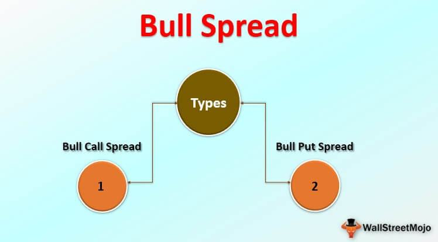

Understanding the dynamic intersections between biology and technology is key to innovations across multiple fields. This article explores the intriguing parallels between biological systems, particularly the gut microbiota, and technological processes like algorithmic trading. Both fields operate as complex adaptive systems, characterized by interactions that lead to emergent behavior. By examining how these systems function, we can uncover patterns and strategies relevant across domains, leading to novel insights and methodologies.

In biological systems, trillions of microorganisms within the human gut form a complex and dynamic community that plays a crucial role in digestion and health regulation. These gut microbiota engage in processes that optimize nutrient absorption and modulate physiological functions through diverse interactions, reminiscent of algorithms optimizing trading strategies based on a myriad of market inputs.

A compelling analogy can be drawn between gut spread options in trading, a strategy involving simultaneous buying and selling of assets, and gut microbiota's regulatory mechanisms in maintaining homeostasis in the digestive tract. Both strategies aim to harness fluctuations—whether in asset values or nutrient availability—by adopting mechanisms that ensure maximal benefit under conditions of uncertainty.

These seemingly unrelated concepts share principles of optimization and efficiency. In algorithmic trading, the development of adaptive algorithms mirrors the biological evolution of microbial populations adapting to shifting environmental conditions. Such processes, whether in controlled financial markets or within the human body, underscore the importance of responsive systems that continually adjust to dynamic conditions to maintain optimal performance and efficiency.

By exploring these parallels, we identify insights that transcend their respective fields, offering potential pathways for enhanced applications. Understanding the synergy between biological processes and technological systems can drive cross-disciplinary innovations, paving the way for advancements that leverage the strengths of both domains to address complex challenges.

## Table of Contents

## Biological Mechanisms: Gut Microbiota and Digestive Functions

The human gastrointestinal tract is a complex ecosystem, home to an estimated 100 trillion bacteria, collectively called the gut microbiota. This microbial community plays an integral role in digestion and the maintenance of overall health, functioning in symbiosis with the human host. One of the primary functions of gut microbiota is the breakdown of complex carbohydrates, which are indigestible by human enzymes. Through fermentation processes, these bacteria convert carbohydrates into short-chain fatty acids (SCFAs) such as acetate, propionate, and butyrate. These SCFAs are not only pivotal in providing energy to colon cells but also play essential roles in regulating metabolism and inflammatory responses in the host.

Additionally, the gut microbiota influences host metabolism by participating in processes like bile acid metabolism and the synthesis of vitamins essential for human health. Their role in modulating immune responses is profound; microbial populations in the gut interact with the mucosal immune system, influencing its development and function. This interaction is crucial for maintaining the immune homeostasis and protecting against pathogenic infections.

Recent research emphasizes the gut microbiota's impact on neural signaling pathways. The gut-brain axis, a bidirectional communication system between the gut and the brain, is significantly modulated by gut bacteria. This modulation affects brain chemistry and has been implicated in various neurological and psychological conditions, including depression and anxiety.

The diversity of the gut microbiota is essential for its resilience and functionality. Variations in microbial diversity have been linked to a range of health conditions such as obesity, inflammatory bowel disease, and autism spectrum disorders. For instance, lower microbial diversity is often observed in obese individuals, suggesting that a diverse microbiota contributes to metabolic health. These associations underscore the potential for developing therapeutic strategies that target microbiota composition, such as probiotics or dietary modifications, to treat or mitigate these conditions.

Understanding these intricate biological processes offers fascinating parallels to algorithmic procedures in trading, where complex systems are optimized for efficiency and adaptability. For example, just as microbial communities dynamically adjust to optimize nutrient extraction, trading algorithms adjust to optimize financial outcomes in varying market conditions. These insights pave the way for innovative strategies that transcend disciplinary boundaries, illustrating the profound interconnectedness of biological systems and technological processes.

## Gut Spread in Options Trading: A Strategic Parallel

A gut spread is an options trading strategy that involves simultaneously buying and selling in-the-money options. It is designed to benefit from anticipated significant movements in the underlying asset's price, analogous to how the gut microbiota adapts to varying conditions within the human digestive system. This strategy typically involves purchasing an in-the-money call option and an in-the-money put option with the same expiration date. Traders often use gut spreads to capitalize on pricing inefficiencies, akin to the microbiota's role in maximizing nutrient extraction from diverse diets.

In financial markets, pricing inefficiencies can occur when an asset's market price deviates from its perceived intrinsic value. Gut spreads exploit these inefficiencies by hedging bets on significant price changes, regardless of the direction. This mirrors how gut microbiota processes nutrients, adapting to changing conditions to optimize nutrient absorption and energy extraction.

The analogy extends further as both gut spreads and gut microbiota function within complex adaptive systems characterized by uncertainty and the need for dynamic adjustments. Traders employing gut spreads must continuously analyze market trends and adjust their strategies to accommodate unexpected shifts, similar to how the microbiota adjusts its composition and functions in response to dietary changes and environmental factors.

The concept of adaptation in the face of uncertainty is crucial in both systems. For traders, the ability to optimize their strategy in response to market [volatility](/wiki/volatility-trading-strategies) ensures potential profitability. Similarly, a well-adapted microbiota contributes to health by efficiently metabolizing nutrients, regulating immune function, and communicating with the nervous system. 

Understanding these parallels provides a lens through which we can view financial strategies and biological processes as interconnected systems that thrive on the principles of adaptability and optimization. This cross-disciplinary perspective not only enhances our comprehension of complex systems but also informs the development of more resilient trading models and holistic healthcare strategies.

## Cross-Disciplinary Insights: Optimization and Adaptation

In both the biological realm of gut microbiota and the technological domain of [algorithmic trading](/wiki/algorithmic-trading), optimization and adaptation play crucial roles. These systems operate under complex and ever-changing conditions, requiring mechanisms to maintain balance and efficiency.

Biological systems, such as the human gut microbiota, dynamically adjust the microbial populations to efficiently break down nutrients and maintain metabolic balance. This process involves the selective increase or decrease in specific bacterial strains depending on dietary intake, environmental factors, and host needs. The adaptability is crucial for sustaining physiological functions, improving nutrient absorption, and modulating immune responses to maintain overall health.

Similarly, algorithmic trading leverages adaptive strategies to optimize financial returns in volatile markets. Trading algorithms are designed to adjust in real-time, analyzing market trends, asset prices, and trading volumes to predict and respond to changes. The algorithms incorporate a variety of techniques, such as [machine learning](/wiki/machine-learning) and statistical analysis, to modulate trading strategies according to market fluctuations, thereby ensuring sustainability and profitability. For example, a common approach involves the use of [reinforcement learning](/wiki/reinforcement-learning), where trading strategies evolve based on outcomes, akin to selecting beneficial microbial populations.

Both biological and trading systems emphasize proactive responses to potential shifts. A microbe's ability to rapidly adjust its activity parallels how trading algorithms adapt to new information, optimizing outcomes even under uncertainty. These adaptive strategies allow systems to thrive amidst variability, achieving sustainability whether through optimal nutrient allocation or profit maximization.

The parallels between these seemingly disparate fields suggest that strategies developed in one can inspire innovation in the other. For example, understanding microbial community adaptability can inform bioengineering applications to enhance gut health or develop probiotics. Simultaneously, principles from adaptive trading algorithms can guide the development of interventions in microbiota management or bioinformatics, optimizing system performance in diverse biological contexts.

This interdisciplinary insight is invaluable for advancing both biotechnological and financial methodologies. By adopting adaptive strategies inspired by nature, algorithmic trading systems can become more resilient, while biological systems can benefit from the computational models used in finance. In essence, recognizing and applying these cross-disciplinary insights unlocks potential for improved problem-solving across domains, paving the way for more efficient and adaptable solutions.

## Conclusion

The synergy between biological processes and technological systems offers vast potential for cross-disciplinary innovations. By examining gut microbiota and trading strategies such as gut spreads, we uncover frameworks for optimized interaction with complex environments. These systems, which operate under principles of optimization and efficiency, demonstrate the adaptability necessary to respond to dynamic conditions.

Understanding and integrating these systems can lead to enhanced efficiency and adaptability in both biological and financial arenas. For instance, just as gut microbiota adapts to different dietary inputs, trading algorithms can adjust strategies based on market shifts, illustrating a shared mechanism of adaptation and optimization. This cross-disciplinary approach encourages the development of innovative strategies that enhance performance and resilience.

As frontier research progresses, these parallels could fuel significant advancements in biotechnological and financial methodologies. The integration of biological insights into computational models can improve algorithmic design, while technological advancements can inform new methods for manipulating biological systems. This reciprocal influence promises to expand the boundaries of what can be achieved in each field individually.

The future beckons deeper exploration into such interdisciplinary applications, paving the way for groundbreaking solutions. The potential to harness biological principles within technological frameworks suggests a new horizon for innovation, one that could lead to transformative approaches in addressing complex challenges across sectors. This progression not only enhances our understanding of these systems but also opens up new pathways for sustainable and effective solutions.

## References & Further Reading

[1]: Marchesi, J. R., & Ravel, J. (2015). ["The vocabulary of microbiome research: a proposal."](https://microbiomejournal.biomedcentral.com/articles/10.1186/s40168-015-0094-5) Microbiome.

[2]: Cryan, J. F., & Dinan, T. G. (2012). ["Mind-altering microorganisms: the impact of the gut microbiota on brain and behavior."](https://pubmed.ncbi.nlm.nih.gov/22968153/) Physiological Reviews.

[3]: Turnbaugh, P. J., & Gordon, J. I. (2009). ["The core gut microbiome, energy balance and obesity."](https://pubmed.ncbi.nlm.nih.gov/19491241/) The Journal of Physiology.

[4]: Lopez de Prado, M. (2018). ["Advances in Financial Machine Learning."](https://www.amazon.com/Advances-Financial-Machine-Learning-Marcos/dp/1119482089) Wiley.

[5]: Friedman, J., Hastie, T., & Tibshirani, R. (2001). ["The Elements of Statistical Learning: Data Mining, Inference, and Prediction."](https://link.springer.com/book/10.1007/978-0-387-84858-7) Springer.