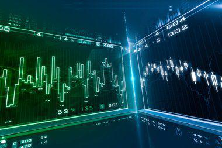

## Table of Contents

## What is the Guyanese Dollar and why is it important?

The Guyanese Dollar is the official money used in Guyana, a country in South America. It is important because it is what people in Guyana use to buy things and pay for services. Just like how people in the United States use the US Dollar, people in Guyana use the Guyanese Dollar every day.

The Guyanese Dollar is important for the economy of Guyana. It helps the country trade with other countries and manage its money. When the Guyanese Dollar is strong, it can help the people of Guyana buy more things from other countries. When it is weak, it can make things from other countries more expensive. So, the value of the Guyanese Dollar affects the lives of people in Guyana.

## How is the Guyanese Dollar abbreviated and symbolized?

The Guyanese Dollar is abbreviated as GYD. This is a short way to write it when you are talking about money in Guyana.

The symbol for the Guyanese Dollar is a dollar sign with two vertical lines, which looks like this: $G. When people in Guyana write prices or amounts of money, they use this symbol to show that they are talking about Guyanese Dollars.

## What is the history behind the introduction of the Guyanese Dollar?

The Guyanese Dollar was first used in Guyana in 1839. Before that, Guyana used the Dutch guilder because it was a Dutch colony. When the British took over Guyana, they decided to change the money to the British West Indies dollar. But in 1951, Guyana decided to have its own money, and that's when the Guyanese Dollar was born.

At first, the Guyanese Dollar was linked to the British pound. This meant that the value of the Guyanese Dollar depended on the value of the British pound. But in 1975, Guyana decided to let the Guyanese Dollar have its own value, not tied to the British pound anymore. This was a big change for Guyana's money and helped the country have more control over its economy.

## How does the exchange rate of the Guyanese Dollar work?

The exchange rate of the Guyanese Dollar tells you how much one Guyanese Dollar is worth compared to other countries' money. For example, if you want to know how many US Dollars you can get for one Guyanese Dollar, you look at the exchange rate. This rate changes every day because it depends on things like how much people want to buy and sell Guyanese Dollars and what is happening in Guyana's economy.

When the exchange rate is high, it means the Guyanese Dollar is strong, and you can get more of another country's money for one Guyanese Dollar. When the exchange rate is low, the Guyanese Dollar is weak, and you get less of another country's money. This can affect how much things cost in Guyana if they are bought from other countries. For example, if the Guyanese Dollar is weak, things like cars or electronics from other countries might cost more in Guyana.

## What are the different denominations of the Guyanese Dollar?

The Guyanese Dollar comes in different sizes of money, called denominations. For paper money, you can find notes of 20, 50, 100, 500, 1,000, and 5,000 Guyanese Dollars. These are the big bills that people use to buy more expensive things or when they need a lot of money at once.

For coins, there are smaller amounts of money. You can find coins worth 1, 5, and 10 Guyanese Dollars. These coins are used for smaller purchases or to give change when buying things. So, whether you need a lot of money or just a little, there are different kinds of Guyanese Dollars to help you out.

## How is the Guyanese Dollar used in everyday transactions in Guyana?

In Guyana, people use the Guyanese Dollar every day to buy things they need. When someone goes to the store to buy food, like rice or bread, they use Guyanese Dollars to pay for it. If they need to take a bus or a taxi, they use Guyanese Dollars to pay the fare. Even when they want to eat at a restaurant or buy clothes, they use Guyanese Dollars. It's the money that everyone in Guyana uses for all kinds of everyday purchases.

Sometimes, people in Guyana need to use Guyanese Dollars to pay bills, like electricity or water. They might go to a bank or a payment center and use their Guyanese Dollars to pay these bills. Also, if someone wants to save money or get a loan, they do it in Guyanese Dollars at the bank. So, the Guyanese Dollar is very important for everyday life in Guyana, helping people buy what they need and take care of their responsibilities.

## What institutions regulate the Guyanese Dollar and control its monetary policy?

The main institution that regulates the Guyanese Dollar and controls its monetary policy is the Bank of Guyana. This bank is like the boss of all the money in Guyana. It decides how much money should be in the country and makes rules about how banks can use that money. The Bank of Guyana works hard to keep the Guyanese Dollar stable and to make sure the economy of Guyana stays healthy.

The government of Guyana also has a say in the money. They work together with the Bank of Guyana to make big decisions about the economy. This includes deciding on things like interest rates, which affect how much it costs to borrow money. By working together, they try to make sure the Guyanese Dollar works well for everyone in the country.

## How does inflation affect the value of the Guyanese Dollar?

Inflation is when prices for things like food and clothes go up over time. When inflation happens in Guyana, it can make the Guyanese Dollar worth less. This means that with the same amount of Guyanese Dollars, people can buy less than before. For example, if a loaf of bread cost 100 Guyanese Dollars last year and now it costs 120 Guyanese Dollars, that's because of inflation. The Guyanese Dollar doesn't buy as much as it used to.

The Bank of Guyana tries to control inflation by making rules about money. If inflation is too high, they might try to slow it down by making it harder for people to borrow money. This can help keep prices from going up too fast. But if inflation is too low, it might mean the Guyanese Dollar is getting too strong, and the Bank of Guyana might do things to make it easier for people to borrow money. This helps keep the economy moving and the Guyanese Dollar at a good value.

## What are the key economic factors influencing the Guyanese Dollar's performance?

The Guyanese Dollar's performance is influenced by many things in Guyana's economy. One big [factor](/wiki/factor-investing) is how much oil Guyana is producing and selling. Since Guyana found a lot of oil, the money from selling it can make the Guyanese Dollar stronger. But if the price of oil goes down, it can make the Guyanese Dollar weaker. Another factor is how much stuff Guyana is buying and selling with other countries. If Guyana is selling more things than it's buying, the Guyanese Dollar can get stronger. But if it's buying more than it's selling, the Guyanese Dollar can get weaker.

Another important thing that affects the Guyanese Dollar is inflation. If prices in Guyana are going up fast, it can make the Guyanese Dollar worth less. The Bank of Guyana tries to keep inflation under control by making rules about money and interest rates. Also, how stable the government is can affect the Guyanese Dollar. If people think the government is doing a good job, they might trust the Guyanese Dollar more. But if there are problems with the government, it can make people less sure about the Guyanese Dollar.

## How does the Guyanese Dollar compare to other Caribbean currencies?

The Guyanese Dollar is one of many currencies used in the Caribbean. Compared to some Caribbean countries that use the Eastern Caribbean Dollar, like St. Lucia or Grenada, the Guyanese Dollar is a separate currency and not part of a shared currency system. The Eastern Caribbean Dollar is often stronger than the Guyanese Dollar because it is used by several countries together, which can make it more stable. On the other hand, countries like Jamaica and Trinidad and Tobago have their own currencies, the Jamaican Dollar and the Trinidad and Tobago Dollar, which are also different from the Guyanese Dollar.

The value of the Guyanese Dollar compared to these other Caribbean currencies can change a lot. For example, the Guyanese Dollar is usually weaker than the Trinidad and Tobago Dollar, which means you need more Guyanese Dollars to buy one Trinidad and Tobago Dollar. This can make things from Trinidad and Tobago more expensive for people in Guyana. But, the Guyanese Dollar can be stronger than the Jamaican Dollar at times, making things from Jamaica cheaper for Guyanese people. The strength of the Guyanese Dollar compared to other Caribbean currencies depends on things like how much oil Guyana is selling and how stable its economy is.

## What are the implications of currency devaluation for the Guyanese Dollar?

When the Guyanese Dollar goes through devaluation, it means that it becomes worth less compared to other countries' money. This can make things from other countries more expensive for people in Guyana. For example, if the Guyanese Dollar gets weaker, buying a car or a phone from another country might cost more Guyanese Dollars than before. This can make life harder for people in Guyana because their money doesn't go as far when they need to buy things from outside the country.

On the other hand, devaluation can help Guyana sell more things to other countries. When the Guyanese Dollar is weaker, other countries can buy Guyanese products, like rice or sugar, for less of their own money. This can be good for businesses in Guyana because they might sell more and make more money. But it's a tricky balance because while it might help some parts of the economy, it can also make life more expensive for regular people in Guyana.

## How does the Guyanese Dollar fit into Guyana's broader economic strategy?

The Guyanese Dollar is a big part of Guyana's plan to make its economy better. Guyana wants to use its money to help the country grow and become stronger. One way they do this is by selling oil, which can make the Guyanese Dollar stronger. When the Guyanese Dollar is strong, it can help Guyana buy things from other countries more easily. The government and the Bank of Guyana work together to make rules about money that help keep the Guyanese Dollar stable and the economy healthy.

But it's not always easy. Sometimes, the Guyanese Dollar can get weaker, which can make things from other countries more expensive for people in Guyana. This can be hard for people who need to buy things like food or medicine from outside the country. The government tries to balance this by making sure that Guyana can still sell its own products, like rice and sugar, to other countries. By doing this, they hope to keep the economy moving and help everyone in Guyana have a better life.

## References & Further Reading

[1]: ["Guyana's Oil Boom: The Fortune and Risks"](https://www.imf.org/en/News/Articles/2019/11/07/na110819-the-fortune-and-risks-of-guyanas-oil-boom) by the International Monetary Fund

[2]: ["Algorithmic and High-Frequency Trading"](https://www.amazon.com/Algorithmic-High-Frequency-Trading-Mathematics-Finance-ebook/dp/B012GS2MY0) by Álvaro Cartea, Sebastian Jaimungal, and José Penalva

[3]: ["Energy, Oil & Gas in the Guyanese Economy"](https://guyanachronicle.com/2024/02/25/a-new-era-of-prosperity-how-guyanas-oil-boom-can-fuel-regional-integration-and-sustainable-development/) by Ganpat Ramakrishna in the Journal of Energy Resources Technology

[4]: ["The Effect of Algorithmic Trading on Market Liquidity"](https://www.sciencedirect.com/science/article/pii/S0927538X16300956) by Terrence Hendershott, Charles M. Jones, and Albert J. Menkveld in the Journal of Financial Markets

[5]: ["International Reserves and Monetary Policy in Emerging Markets"](https://www.nber.org/digest/202111/international-reserve-management-emerging-market-economies) by Joshua Aizenman and Hiro Ito, National Bureau of Economic Research Working Paper No. 27835