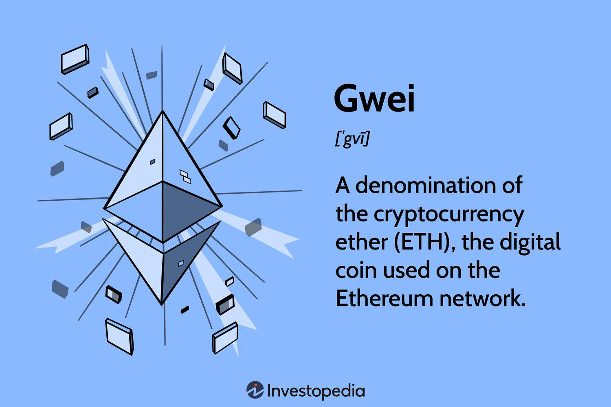

Ethereum stands as a pioneering platform in the cryptocurrency sector, acting not only as a digital currency but as a robust framework facilitating a wide range of decentralized applications. Launched in 2015 by Vitalik Buterin and other co-founders, Ethereum introduced the world to the concept of smart contracts, allowing developers to create applications that automatically execute terms of agreement. Its native currency, Ether (ETH), serves as both a financial asset and a critical fuel for the network’s operations, setting it apart from other cryptocurrencies like Bitcoin.

At the heart of Ethereum transactions is the concept of "gas" which is a fee required to conduct transactions and execute smart contracts on the Ethereum network. The unit of measure for gas fees is Gwei, a subunit of Ether wherein 1 ETH equals 1 billion Gwei. Essentially, Gwei represents the cost of computational resources on the Ethereum network, making it a crucial metric for both developers and traders. Understanding Gwei is essential for predicting transaction costs and managing expenses within the Ethereum ecosystem.



Algorithmic trading involves using computer algorithms to execute trades based on pre-defined criteria such as timing, price, or volume. In the cryptocurrency sphere, algorithmic trading has gained prominence due to the market's 24/7 availability and high volatility. By leveraging algorithmic strategies, traders can efficiently capitalize on market movements, while minimizing human error and emotional biases. This article aims to provide insights into how the concept of Gwei impacts Ethereum algorithmic trading, equipping readers with knowledge to optimize their trading strategies.

Understanding Gwei pricing and fluctuations is significant when engaging in Ethereum trading as it directly influences transaction costs and therefore the profitability of trades. Throughout this article, readers will explore how Gwei plays a pivotal role in transaction fees, the strategies for incorporating Gwei variations into algorithmic trading, and the tools available for monitoring real-time Gwei prices. By the end of this article, readers will appreciate the importance of Gwei in Ethereum trading and have actionable strategies to incorporate Gwei considerations into their trading algorithms.

## Table of Contents

## Understanding Ethereum and Gwei

Ethereum is a decentralized, open-source blockchain system that facilitates the development of various decentralized applications (DApps) and smart contracts. Unlike Bitcoin's blockchain, which primarily functions as a ledger for financial transactions, Ethereum's blockchain offers a decentralized Turing-complete virtual machine known as the Ethereum Virtual Machine (EVM). This allows developers to execute scripts using an international network of public nodes.

Ether (ETH) serves as the native cryptocurrency of the Ethereum platform. It acts as both a store of value and the "fuel" that powers transactions on the Ethereum network. Transactions and smart contract executions require computational effort, for which ETH is utilized to compensate network participants, known as miners.

To manage and prioritize network activities, Ethereum employs a system of gas fees. Gas in this context is a unit that measures the computational effort required to perform operations such as transactions, contract executions, and other changes to the blockchain state. The cost of a given transaction or smart contract execution is determined by two factors: the gas limit and the gas price.

Gas is denominated in small units called Gwei, a subunit of Ether. One ETH is equal to 1,000,000,000 Gwei (1 ETH = 10^9 Gwei). In Ethereum transactions, users specify a gas price they are willing to pay, measured in Gwei, for each unit of gas. Miners prioritize transactions with higher gas prices, resulting in faster transaction processing. 

The calculation of gas fees in an Ethereum transaction is given by the formula:
$$
\text{Total Gas Fee (in Ether)} = \text{Gas Limit} \times \text{Gas Price (in Gwei)} \times 10^{-9}
$$

Monitoring Gwei prices is crucial for both traders and developers. Fluctuations in Gwei prices can significantly impact transaction costs, affecting the profitability of trading strategies and the feasibility of executing smart contracts. Developers must account for gas fees when designing DApps to ensure operations remain cost-effective and that users are not deterred by high transaction costs. Similarly, traders must consider Gwei fluctuations when executing trades, as variations can influence their overall transaction expenses and impact net returns.

In conclusion, understanding Gwei and its role in Ethereum transactions is vital for anyone involved with the Ethereum blockchain, whether developing applications or engaging in trading activities. Careful monitoring of Gwei prices helps optimize transaction costs, making Ethereum a more accessible and efficient platform for its wide range of users.

## The Basics of Cryptocurrency Algorithmic Trading

Algorithmic trading represents a significant advancement in the [cryptocurrency](/wiki/cryptocurrency) market, leveraging computational algorithms to automate and enhance the decision-making processes in trading activities. In essence, [algorithmic trading](/wiki/algorithmic-trading) involves using pre-programmed instructions to execute trades at optimal speeds and frequency, much faster and more efficiently than human traders could accomplish manually. These operations are carried out based on varied criteria, including price, timing, and [volume](/wiki/volume-trading-strategy), designed to maximize profits and minimize risks.

Various types of algorithmic trading strategies commonly used in the cryptocurrency markets include:

1. **Market Making**: This strategy involves placing both buy and sell limit orders to profit from the spread between the bid and ask prices. By continuously offering to buy and sell, market makers aim to capture small gains on each trade while providing liquidity to the market.

2. **Arbitrage**: Arbitrageurs exploit price differentials of a cryptocurrency across different exchanges to make risk-free profits. They buy the asset where the price is lower and simultaneously sell it where the price is higher.

3. **Trend Following**: These strategies rely on technical analysis to identify and capitalize on momentum within the markets. The algorithms may use moving averages or other indicators to decide when to enter or exit positions based on the perceived direction of the market.

4. **Statistical Arbitrage**: This involves mathematical and statistical models to trade various coin combinations in search of short-term anomalies or inefficiencies. This method often employs machine learning techniques to optimize the trading strategy continually.

5. **Mean Reversion**: This strategy predicts that a cryptocurrency's price will revert to its historic mean price over time. Traders using mean-reversion strategies look for unusual spikes or drops in price to enter into contrarian trades with the expectation of profiting as the price moves back to its average.

The benefits of algorithmic trading for Ethereum and other cryptocurrencies include increased efficiency and execution speed, allowing traders to capitalize on fleeting market opportunities that manual trading might miss. Moreover, this approach helps reduce human emotional interference and biases, ensuring that trading strategies are followed as planned.

However, algorithmic trading in volatile cryptocurrency markets presents several challenges and risks. The high [volatility](/wiki/volatility-trading-strategies) can lead to abrupt market swings, necessitating robust risk management strategies and resilient algorithms capable of adapting to rapid changes. Furthermore, technical issues or software bugs can result in erroneous trades and financial losses, thus requiring constant monitoring and maintenance of the systems.

Numerous trading platforms support algorithmic trading by providing APIs and development environments where traders can develop and test their algorithms. Examples include MetaTrader, NinjaTrader, and dedicated cryptocurrency exchanges such as Binance and Coinbase Pro, offering APIs for programmatically performing trading operations.

In conclusion, algorithmic trading plays a crucial role in the modern cryptocurrency markets, offering both opportunities and challenges to traders. By understanding the various strategies and platforms available, traders can optimize their approaches to handle the inherent volatility and dynamics of digital currencies.

## Integrating Gwei into Ethereum Algorithmic Trading

Integrating Gwei into Ethereum algorithmic trading involves developing strategies that account for the fluctuations in Gwei prices, as these directly impact transaction fees and, consequently, trading profitability. Understanding how to efficiently integrate Gwei dynamics into trading algorithms can enhance cost-effectiveness and improve overall trading performance.

One of the primary strategies is to build algorithms that adjust orders based on Gwei price movements. Given that Gwei prices can significantly affect transaction costs, algorithms can include logic to postpone or expedite trades based on predetermined Gwei thresholds. For example, an algorithm might delay executing a transaction if Gwei prices exceed a set maximum, thereby avoiding prohibitively high fees. Conversely, the algorithm could prioritize transactions when Gwei prices fall below a target level, thus minimizing costs.

To achieve real-time tracking of Gwei prices, traders utilize various tools and APIs. Platforms like Etherscan (etherscan.io) and EthGasStation (ethgasstation.info) provide API endpoints that deliver up-to-date gas price information. These APIs can be integrated into trading systems to fetch and analyze current Gwei data. For instance, using Python, a trader can employ the `requests` library to pull Gwei prices continuously:

```python
import requests

def get_gwei_price():
    response = requests.get('https://api.etherscan.io/api?module=gastracker&action=gasoracle')
    data = response.json()
    return data['result']['SafeGasPrice']

current_gwei_price = get_gwei_price()
```

Successful trading algorithms that account for Gwei variations consider both short-term fluctuations and long-term trends. A common approach is to incorporate [machine learning](/wiki/machine-learning) models that predict future gas prices based on historical data, allowing for more strategic timing of transactions.

The impact of Gwei fees on profitability is profound, as high transaction costs can erode gains. An efficient trading algorithm will consider Gwei fees as part of the total transaction cost and adjust its strategy accordingly. For instance, it might calculate the ratio of transaction cost to expected profit and set a threshold to ensure trades are only executed when profitable:

$$
\text{Net Gain} = \text{Expected Profit} - (\text{Amount of Gas Used} \times \text{Gwei Price})
$$

Case studies of traders who have successfully integrated Gwei dynamics into their algorithms reveal adaptations such as dynamically adjusting trading frequency based on Gwei volatility or implementing cap-and-trade models for gas fees within the algorithm. These adjustments help maintain profitability even in volatile markets with fluctuating Gwei prices.

In conclusion, incorporating Gwei price fluctuations into Ethereum algorithmic trading requires a comprehensive understanding of Gwei dynamics, strategic use of APIs for real-time tracking, and the development of algorithms that adapt to changing transaction costs. By effectively managing these elements, traders can optimize their trading strategies to better account for the often unpredictable nature of Ethereum gas fees.

## Best Practices for Ethereum Algo Trading with Gwei

Managing gas fees effectively and optimizing cost-efficiency in Ethereum algorithmic trading requires a strategic approach, especially when dealing with Gwei price fluctuations. Traders must integrate these considerations within their algorithms to enhance profitability. Key practices include setting thresholds and triggers, adapting strategies to market trends, [backtesting](/wiki/backtesting), and ensuring robust security measures.

**Managing Gas Fees and Cost-Effectiveness**

Gas fees, denominated in Gwei, are pivotal in determining transaction costs on the Ethereum network. To optimize these costs, traders should monitor Gwei prices closely, ideally by using automated tools and APIs that provide real-time updates. Setting predefined transaction thresholds can help in executing trades only when it is financially viable. For example, if the trader determines that a gas price greater than a certain threshold renders the trade unprofitable, the algorithm can be programmed to bypass such transactions.

```python
def should_execute_trade(current_gwei_price, max_gwei_threshold):
    return current_gwei_price <= max_gwei_threshold

# Example usage
current_gwei_price = 120  # hypothetical real-time Gwei price
max_gwei_threshold = 100
execute_trade = should_execute_trade(current_gwei_price, max_gwei_threshold)
```

**Setting Thresholds and Triggers**

Incorporating dynamic thresholds based on historical data and predictive analysis can offer an advantage. For example, algorithms can adjust according to the moving averages of Gwei prices, distinguishing between transient and stable low-fee periods. Traders may implement machine learning models to predict future gas prices, enhancing threshold accuracy.

**Adapting Trading Strategies**

Trading strategies must remain flexible to accommodate fluctuations in both market conditions and Gwei prices. Employing multi-faceted strategies, such as diversification across multiple assets or hedging against gas price volatility, can mitigate risks associated with sudden price shifts. Algorithms could be designed to pause or resume activities based on pre-programmed criteria tied to market volatility or predicted Gwei spikes.

**Backtesting Trading Algorithms**

Backtesting is essential for refining trading algorithms to ensure they perform optimally. By simulating trades with historical Gwei data, traders can identify patterns and outcomes under various scenarios. This involves systematically analyzing past performance to fine-tune thresholds, timing, and decision trees used by the algorithm.

**Security Considerations**

Ensuring security in algorithmic trading on Ethereum is paramount. Employing secure coding practices and regular audits can prevent vulnerabilities. It's crucial to update and patch software against known exploits and to safeguard private keys using hardware security modules (HSMs) or secure enclaves. Additionally, implementing multi-signature wallets may prevent unauthorized transactions.

In conclusion, mastering the management of Gwei within Ethereum algorithmic trading not only enhances profitability but also tailors strategies to evolving market conditions. By integrating cost-effective gas management and security best practices, traders can significantly elevate their trading efficiency on the Ethereum network.

## Conclusion

In this article, we have explored the intricate dynamics of Ethereum and its integral role within the cryptocurrency landscape. A key focus was on understanding Gwei, the smallest denomination of Ether, and its critical function in calculating gas fees for transactions and smart contracts on the Ethereum network. Recognizing the importance of Gwei, particularly for traders and developers, is vital for making informed decisions and optimizing the cost-effectiveness of Ethereum transactions.

Algorithmic trading, a significant mechanism in cryptocurrency markets, offers various strategies that leverage advanced algorithms to execute trades. The integration of Gwei price fluctuations into these algorithms can offer traders a competitive edge. Through the diligent use of tools and APIs to track real-time Gwei prices, traders can enhance their trading models, ultimately impacting profitability when fluctuating gas fees are accounted for.

In contemplating Ethereum's future, potential developments such as upgrades to the network could significantly influence Gwei pricing. The Ethereum 2.0 upgrade, with its aim to shift from a proof-of-work to a proof-of-stake consensus mechanism, is expected to bring efficiencies that might stabilize and possibly lower gas fees.

For traders, there is both an opportunity and a challenge in algorithmic trading with a focus on Gwei. Embracing this approach requires a keen understanding of market dynamics and the technical skills to adapt algorithms to ever-changing conditions. The ability to efficiently manage gas fees and execute cost-effective trades can lead to enhanced profitability in volatile markets.

Staying informed about advances in Ethereum and Gwei is crucial for anyone engaged in cryptocurrency trading or development. The rapidly evolving nature of blockchain technology offers fertile ground for continuous learning and innovation. As the Ethereum network continues to grow and evolve, traders and developers are encouraged to further their studies and explore novel strategies that incorporate Gwei, ensuring they remain at the forefront of this dynamic and transformative field.

## References & Further Reading

[1]: Antonopoulos, A. M., & Wood, G. (2018). ["Mastering Ethereum: Building Smart Contracts and DApps."](https://www.amazon.com/Mastering-Ethereum-Building-Smart-Contracts/dp/1491971940) O'Reilly Media.

[2]: Buterin, V. (2013). ["A Next-Generation Smart Contract and Decentralized Application Platform."](https://www.semanticscholar.org/paper/A-NEXT-GENERATION-SMART-CONTRACT-%26-DECENTRALIZED-Buterin/0dbb8a54ca5066b82fa086bbf5db4c54b947719a) Ethereum Whitepaper.

[3]: Wang, S. (2020). ["Introduction to Algorithmic Trading for Cryptocurrencies."](https://www.sciencedirect.com/science/article/pii/S0957417423023084) arXiv preprint arXiv:2001.02842.

[4]: Narayanan, A., Bonneau, J., Felten, E., Miller, A., & Goldfeder, S. (2016). ["Bitcoin and Cryptocurrency Technologies: A Comprehensive Introduction."](https://press.princeton.edu/books/hardcover/9780691171692/bitcoin-and-cryptocurrency-technologies) Princeton University Press.

[5]: EthGasStation. ["Ethereum Gas Price Recommendations."](https://etherscan.io/gastracker)

[6]: Etherscan. ["Ethereum Gas Tracker."](https://etherscan.io/gastracker)

[7]: Hull, J. (2012). ["Options, Futures, and Other Derivatives."](https://www.semanticscholar.org/paper/Options%2C-Futures%2C-and-Other-Derivatives-Hull/89bdee500c8623864fc9eb7a471546aa713acc44) Pearson Education.