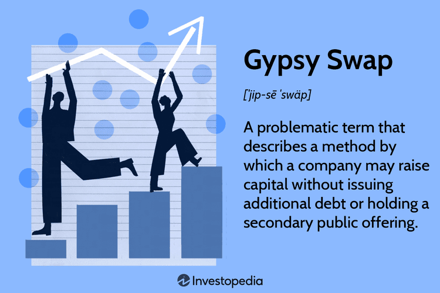

In modern business, financial strategies have evolved to include complex mechanisms designed to maximize capital efficiency and minimize risks. One such strategy that has garnered attention is the Gypsy Swap. This technique involves a shareholder selling shares to an investor, who agrees to resell them once the company issues new shares, usually at a set price. This arrangement allows companies to raise capital without increasing their debt burden, a critical advantage in maintaining favorable financial ratios and avoiding the restrictive covenants associated with debt financing.

Equity financing, where funds are raised through the sale of company shares, plays an essential role in the capital structure of businesses. Unlike debt financing, which requires regular interest payments and eventual repayment of principal, equity financing does not impact cash flow in the same manner. However, it does result in the dilution of ownership among existing shareholders, potentially altering control dynamics within the company. Despite these trade-offs, equity financing is a valuable tool for businesses seeking growth without incurring additional debt.



Algorithmic trading is another pivotal development in modern finance, shaping the way equity markets operate. By utilizing algorithms to execute trades at high speeds and volumes, this trading method enhances liquidity, reduces transaction costs, and allows for the continuous adjustment of positions in response to market conditions. The integration of computational power and finance has provided an edge in executing sophisticated trading strategies, including those involved in facilitating Gypsy Swaps. Algorithmic trading simplifies the process of acquiring and offloading equity positions, making it easier to carry out complex financial maneuvers efficiently.

The purpose of this article is to explore these interrelated financial strategies and their implications for businesses today. It will provide a comprehensive understanding of Gypsy Swaps, examine the strategic use of equity financing, and assess the transformative impact of algorithmic trading on modern financial practices. By delving into these topics, the article aims to elucidate how businesses can leverage these strategies to achieve optimal financial success.

## Table of Contents

## Understanding Gypsy Swap

A Gypsy Swap is a financial maneuver utilized by companies to raise capital without incurring additional debt. This method involves selling an entity's new or existing shares, typically held by major shareholders like private equity firms, to investors. The term "Gypsy Swap" originated from the financial industry's jargon and reflects the strategy of swapping assets creatively to facilitate stock liquidity and capital generation.

Historically, Gypsy Swaps emerged as a pragmatic solution for firms looking to meet financial obligations or foster growth without increasing their leverage. This approach allows current shareholders to exchange their shares while maintaining a company's capital structure's integrity, bypassing the traditional method of securing debt financing.

A key advantage of a Gypsy Swap is its potential to provide a company with fresh capital without altering its debt-to-equity ratio. Unlike rights offerings, where existing shareholders are given the opportunity to purchase additional shares at a set price, Gypsy Swaps involve the reallocation of existing shares to new investors, thus avoiding dilution for current shareholders participating in the transaction. Secondary public offerings (SPOs), meanwhile, involve issuing new shares to the public, which can impact the share price and alter the ownership structure. Gypsy Swaps, conversely, enable streamlined stock reallocation, benefiting parties looking to preserve existing shareholder value.

Despite the potential benefits, Gypsy Swaps [carry](/wiki/carry-trading) inherent risks and costs. These transactions can be complex to execute and may require careful coordination with market participants. The process might also lead to market disruptions, as sudden changes in shareholding patterns could trigger [volatility](/wiki/volatility-trading-strategies) in stock prices. Additionally, companies engaging in these swaps must consider regulatory requirements and potential scrutiny from bodies such as the Securities and Exchange Commission (SEC), which monitors such trades for compliance with securities laws.

In summary, Gypsy Swaps serve as a strategic tool for capital generation without increasing indebtedness, offering an alternative to traditional capital-raising mechanisms. Understanding the nuances and implications of this technique is crucial for firms aiming to maintain financial flexibility while navigating the intricacies of equity markets.

## Equity Financing: A Strategic Tool

Equity financing is a method through which companies raise capital by issuing shares of stock to investors. Unlike debt financing, where companies borrow money that must be repaid over time with interest, equity financing involves selling a portion of ownership in the company. This differentiates it fundamentally from debt as it does not require repayment or accrue interest. Instead, investors obtain equity stakes in the company, yielding returns through dividends and appreciation of stock value.

The primary advantage of equity financing is the avoidance of debt and interest obligations, which can relieve a company's financial burden, especially useful for startups or businesses without substantial cash flow. It also provides long-term capital, allowing companies to invest in growth initiatives without the immediate pressure of repayment. Furthermore, equity financing can enhance a company’s credibility and attractiveness, as investor involvement often signals market confidence.

However, equity financing has potential drawbacks, foremost being the dilution of company ownership. By issuing additional shares, existing shareholders' ownership percentage decreases, possibly altering the distribution of control and decision-making power within the company. This aspect may deter founders or existing shareholders wary of losing control. Additionally, equity financing could place pressure on companies to produce returns for shareholders, potentially influencing strategic decisions to favor short-term gains over long-term stability.

Equity financing is particularly favorable in scenarios where companies face high growth potential but low [liquidity](/wiki/liquidity-risk-premium). In such cases, debt obligations might overly burden the nascent financial structure, making equity a preferable alternative. It also suits industries with high capital needs but variable cash flows like technology or biotechnology, where immediate revenue generation may not be feasible.

A Gypsy Swap is closely related to equity financing as it involves a creative equity transaction. In a Gypsy Swap, shareholders sell their shares while simultaneously, the company issues new shares to different investors. This maneuver enhances liquidity without burdening the company with additional debt, aligning with the goals of equity financing by retaining financial flexibility while securing capital. However, it may result in further ownership dilution, which is a consideration analogous to generic equity financing issues.

In summary, equity financing is a potent strategic tool that can support businesses in their growth journeys while avoiding debt-associated risks. Its implications for ownership and control must be carefully managed, especially when leveraged through mechanisms like Gypsy Swaps, to ensure alignment with the company’s long-term strategic goals.

## Algorithmic Trading in Equity Markets

Algorithmic trading has increasingly become a crucial component of modern equity markets, leveraging computational algorithms to execute trading orders at speeds and frequencies beyond human capability. These algorithms are designed to make trades based on pre-set rules that determine timing, price, or quantity, and in some instances, automate the entire trading process without human intervention.

This transformation of equity markets through [algorithmic trading](/wiki/algorithmic-trading) primarily revolves around efficiency and speed. Algorithms can quickly analyze vast datasets and execute trades in a fraction of a second, reducing transaction costs and capitalizing on market inefficiencies that would otherwise be too fleeting for manual trading. This capability has significantly increased market liquidity and reduced bid-ask spreads, benefiting the overall efficiency of the markets. 

However, algorithmic trading introduces several challenges. One of the primary concerns is the risk of market instability due to the sheer speed and [volume](/wiki/volume-trading-strategy) of trades that algorithms can generate. Events such as the 2010 Flash Crash, where rapid automated sell-offs led to a sudden, severe dip in stock prices, highlight the potential for systemic issues. There are also concerns about the transparency and fairness of algorithm-driven markets, as high-frequency trading firms with sophisticated algorithms often have competitive advantages over smaller traders.

Several types of algorithms are employed in trading strategies. For instance, [arbitrage](/wiki/arbitrage) algorithms exploit price discrepancies between different markets or instruments, ensuring profits with minimal risk. Meanwhile, trend-following algorithms might initiate trades based on the analysis of moving averages or other [momentum](/wiki/momentum) indicators.

```python
# Example: A simple moving average crossover strategy
def moving_average_crossover(prices, short_window, long_window):
    signals = pd.DataFrame(index=prices.index)
    signals['signal'] = 0.0

    # Create short simple moving average
    signals['short_mavg'] = prices['Close'].rolling(window=short_window, min_periods=1, center=False).mean()

    # Create long simple moving average
    signals['long_mavg'] = prices['Close'].rolling(window=long_window, min_periods=1, center=False).mean()

    # Create signals
    signals['signal'][short_window:] = np.where(signals['short_mavg'][short_window:] > signals['long_mavg'][short_window:], 1.0, 0.0)   

    # Generate trading orders
    signals['positions'] = signals['signal'].diff()
    return signals
```

The interplay between algorithmic trading and financial strategies like Gypsy Swaps is complex. While Gypsy Swaps involve raising capital without incurring additional debt, algorithmic trading can facilitate such strategies by optimizing the timing and pricing of trades. This can ensure that any equity exchanged or sold in a Gypsy Swap is done at optimal market conditions, thereby maximizing potential benefits and minimizing costs. Moreover, algorithmic models can be employed to hedge positions or manage risk during the execution of such corporate strategies, proving to be an invaluable tool in the financial maneuvering landscape.

Ultimately, the integration of algorithmic trading into equity markets has reshaped how trading, investment, and [capital raising](/wiki/hedge-fund-capital-raising) strategies are executed, offering both significant advantages and noteworthy challenges that market participants must navigate.

## Case Studies and Real-World Applications

### Case Studies and Real-World Applications

The practical application of Gypsy Swaps in corporate finance reveals varied outcomes depending on the companies and market conditions involved. One notable example is a mid-sized technology firm that sought to employ a Gypsy Swap to raise capital without increasing its debt burden. The firm executed a Gypsy Swap by exchanging convertible bonds for equity. This maneuver allowed the company to bolster its financial position by converting debt holders into equity shareholders, effectively reducing its liabilities and enhancing liquidity. However, the success of this strategy depended heavily on the company's stock performance, highlighting the contingent nature of Gypsy Swaps on market conditions.

Successful Gypsy Swaps often transpire when companies undertake them in bullish markets, as rising stock prices benefit both issuers and investors, reducing dilution concerns. Conversely, firms executing Gypsy Swaps in bearish markets may encounter adverse effects, such as lower stock valuations and increased dilution, which can deter investor participation. An energy sector corporation attempted a Gypsy Swap during a downturn in oil prices, resulting in an undesirable loss of control and shareholder value due to significant dilution and unfavorable conversion rates.

Algorithmic trading plays a transformative role in the dynamics of equity financing strategies, including Gypsy Swaps. By automating the trading process based on pre-defined parameters, algorithmic trading allows for enhanced liquidity and reduced transaction costs. For instance, a financial institution implementing algorithmic trading as part of its equity financing strategy observed increased efficiency in executing trades during a Gypsy Swap. Algorithms optimized the timing and execution of trades, enabling the company to capitalize on favorable market conditions and reduce the adverse impact of price volatility.

Nevertheless, the integration of algorithmic trading with equity financing is not without challenges. Algorithms, if not properly calibrated, may exacerbate market volatility or lead to unfavorable trade executions during periods of excessive market fluctuations.

The lessons learned from these real-world applications underscore the necessity of strategic planning and market analysis in executing Gypsy Swaps. Companies must carefully evaluate market conditions and investor sentiment to determine the optimal timing and structure of such transactions. Additionally, integrating advanced trading technologies like algorithmic trading requires robust risk management frameworks to mitigate potential adverse impacts.

In conclusion, the deployment of Gypsy Swaps and algorithmic trading in equity markets demands a comprehensive understanding of both market dynamics and technological capabilities. Companies that effectively navigate these complexities can leverage these financial strategies to enhance capital structure and shareholder value.

## Regulatory and Ethical Considerations

### Regulatory and Ethical Considerations

The regulatory frameworks governing Gypsy Swaps are complex and vary by jurisdiction, yet they share commonalities in their emphasis on transparency and fair market practices. Gypsy Swaps, which are private arrangements where existing shareholders swap their shares with new investors without creating additional public shares, pose distinct regulatory challenges. These swaps allow companies to raise capital without taking on additional debt, circumventing traditional equity financing methods like public offerings.

The U.S. Securities and Exchange Commission (SEC) plays a central role in regulating such transactions to prevent market manipulation and ensure investor protection. The SEC mandates comprehensive disclosures regarding these swaps to promote transparency. The regulatory oversight aims to prevent the misuse of these arrangements that might otherwise exploit shareholders and distort market valuations.

Ethical implications of using Gypsy Swaps are also pronounced. The term itself may be viewed as controversial due to its potential derogative connotations, prompting businesses to avoid its use in favor of more neutral terminology. Beyond nomenclature, ethical challenges arise from the potential lack of transparency and unequal access to information among different investor groups, leading to imbalanced investment opportunities and potential conflicts of interest.

Algorithmic trading, which frequently interacts with equity markets and financing mechanisms like Gypsy Swaps, carries its own set of ethical concerns. The rapid, automated nature of algorithmic trading can result in unintended market impacts, such as flash crashes, and raises questions about market fairness. Moreover, algorithms driven by comprehensive data analysis can inadvertently embed and propagate existing market biases.

For businesses, adhering to best practices in these areas is vital to maintain both legal compliance and ethical integrity. This involves robust due diligence in understanding and complying with relevant regulations, such as those imposed by the SEC, and fostering a corporate culture that prioritizes transparency and fair trading practices. Ethical algorithm development, including stress-testing algorithms for potential adverse impacts and ensuring equitable trading practices, is also crucial.

Ultimately, achieving a balance between leveraging innovative financial strategies like Gypsy Swaps and ensuring ethical operation within regulatory frameworks is essential for sustainable business success and market integrity. Businesses must remain vigilant in understanding regulatory changes and refining their practices to align with both legal requirements and ethical standards.

## Conclusion and Future Outlook

The exploration of financial strategies in modern business reveals the intricate interplay of Gypsy Swaps, equity financing, and algorithmic trading. Gypsy Swaps enable companies to raise capital without incurring additional debt, offering an innovative yet complex alternative to traditional offerings. Although this approach provides flexibility, it also introduces certain risks and costs that need careful management. Equity financing remains a powerful tool, allowing businesses to secure funding while impacting company ownership and control. This type of financing is particularly favorable during periods of strong market confidence or when debt markets are less accessible. 

Algorithmic trading has fundamentally transformed equity markets by enhancing efficiency and liquidity. The utilization of sophisticated algorithms allows for the rapid execution of trades, offering significant advantages such as reduced transaction costs and improved market accuracy. However, these benefits are accompanied by challenges, such as market volatility and ethical considerations, which demand constant vigilance.

Current trends indicate a growing acceptance and refinement of Gypsy Swaps as financial instruments. As companies seek more agile capital-raising mechanisms, the trend is likely to persist. Future prospects involve improved regulatory frameworks to provide clearer guidelines and ensure fair practices, shedding light on the potential for Gypsy Swaps to expand beyond their current scope.

Equity financing continues to be a vital component of modern financial strategies. Its evolution is marked by the increasing diversity of financing instruments and emerging markets’ capacity to shape global capital flows. This trend suggests a continuous demand for innovative equity financing solutions that align with dynamic market conditions.

Advancements in algorithmic trading are expected to accelerate further, driven by advances in technology such as [machine learning](/wiki/machine-learning) and [artificial intelligence](/wiki/ai-artificial-intelligence). Such developments promise to enhance predictive analytics and decision-making processes, although they may bring about new challenges and necessitate regulatory adaptations.

Integrating these strategies effectively is crucial for achieving optimal financial success. Companies must balance the agility of Gypsy Swaps, the strategic depth of equity financing, and the technological edge provided by algorithmic trading. By doing so, businesses can navigate market complexities more adeptly and capitalize on emerging opportunities, ensuring long-term sustainability and growth. 

Ultimately, the financial landscape is poised for continued evolution, shaped by technological advancements and evolving market demands. Companies that embrace these changes with ethical considerations and strategic foresight will be better positioned to thrive in the future financial ecosystem.

## References & Further Reading

[1]: Myers, S. C. (1984). ["The Capital Structure Puzzle."](https://onlinelibrary.wiley.com/doi/full/10.1111/j.1540-6261.1984.tb03646.x) The Journal of Finance, 39(3), 575-592.

[2]: Lopez de Prado, M. (2018). ["Advances in Financial Machine Learning."](https://www.amazon.com/Advances-Financial-Machine-Learning-Marcos/dp/1119482089) Wiley.

[3]: Harris, L. (2003). ["Trading and Exchanges: Market Microstructure for Practitioners."](https://www.amazon.com/Trading-Exchanges-Market-Microstructure-Practitioners/dp/0195144708) Oxford University Press.

[4]: Chan, E. P. (2009). ["Quantitative Trading: How to Build Your Own Algorithmic Trading Business."](https://github.com/ftvision/quant_trading_echan_book) Wiley.

[5]: Mackintosh, P. W. (2021). ["Equity Financing: A Primer."](https://www.researchinpsychotherapy.org/rpsy/article/view/826) CFA Institute.

[6]: Hasbrouck, J. (2007). ["Empirical Market Microstructure: The Institutions, Economics, and Econometrics of Securities Trading."](https://academic.oup.com/book/52241) Oxford University Press.