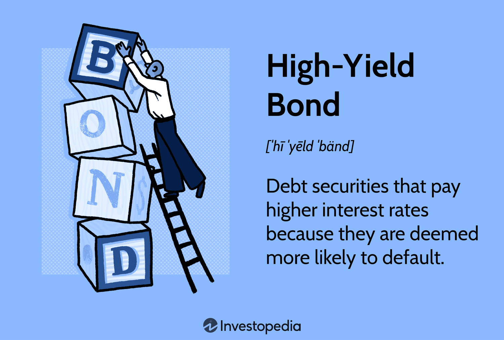

## Table of Contents

## What does 'H' stand for in bonds trading?

In bonds trading, the letter 'H' stands for "High Yield." High Yield bonds are also known as junk bonds. These bonds offer higher interest rates because they come with a higher risk of default. Investors are attracted to these bonds because of the potential for greater returns, but they must also be prepared for the increased risk.

High Yield bonds are typically issued by companies that are not as financially stable as those issuing investment-grade bonds. Because of this, credit rating agencies give these bonds lower ratings. Despite the risks, high yield bonds can be an important part of a diversified investment portfolio. They can provide a balance between risk and reward, helping investors achieve their financial goals.

## How does the 'H' mechanism work in the context of bonds?

In the world of bonds, the 'H' stands for High Yield. This means that these bonds give you more money back in interest than other bonds. They are called High Yield because they are riskier. Companies that issue these bonds might have a harder time paying back the money they borrow. So, to make people want to buy their bonds, they offer to pay more interest.

When you buy a High Yield bond, you are taking a chance. You might get more money because of the high interest, but there's also a bigger chance that the company won't be able to pay you back. That's why these bonds are also called junk bonds. People who invest in them are looking for bigger rewards, but they need to be ready for the possibility that things might not go as planned.

## Why is the 'H' important in bond trading?

The 'H' in bond trading stands for High Yield, which is important because it tells investors that these bonds offer higher interest rates. This is good for people who want to earn more money from their investments. But, there's a catch. High Yield bonds are riskier because the companies that issue them might have trouble paying back the money they borrow. So, investors get paid more to take on this extra risk.

Understanding the 'H' helps investors make smart choices. If someone is okay with taking more risk for the chance to earn more, High Yield bonds might be a good fit. But if someone wants to play it safe, they might choose other types of bonds. Knowing about High Yield bonds can help people build a mix of investments that matches what they want and how much risk they're willing to take.

## Can you explain the historical development of the 'H' in bonds trading?

The 'H' in bonds trading, which stands for High Yield, started becoming important in the 1970s. Before that, most people only wanted to buy bonds from big, safe companies. But then, a man named Michael Milken saw that smaller companies needed money too. He thought that if these companies paid more interest, people would be willing to take the risk. So, he started buying and selling these high-risk bonds, and they became known as High Yield or junk bonds.

As more people started to understand High Yield bonds, they became a bigger part of the bond market. In the 1980s, these bonds helped companies grow and even helped with big business deals called leveraged buyouts. But there were also problems. Some people used High Yield bonds in ways that were not good, and this led to big financial troubles in the late 1980s. Even with these ups and downs, High Yield bonds are still an important part of the bond market today. They help investors earn more money, but they also remind everyone to be careful about the risks they take.

## What are the different types of 'H' used in bond markets?

In the bond market, the 'H' stands for High Yield, but there are different types of High Yield bonds. One type is called 'fallen angels.' These are bonds that used to be safe and had good ratings, but something happened to the company, and now they are riskier. Another type is 'original issue high yield.' These are bonds that were always risky from the start because the company issuing them was not very strong financially.

There are also 'distressed bonds,' which are High Yield bonds that are in big trouble. The company might be close to not being able to pay back the money it owes. These bonds can be very risky, but some investors buy them hoping to make a lot of money if the company gets better. Each type of High Yield bond has its own level of risk and reward, so investors need to think carefully about which ones to buy.

## How does the 'H' affect bond pricing and yield?

The 'H' in bonds stands for High Yield, which means these bonds pay more interest than other bonds. This higher interest is because High Yield bonds are riskier. When a bond is riskier, investors want more money to take that risk. So, the price of a High Yield bond might be lower than a safer bond because people are worried about the company not paying back the money. But, because the [interest rate](/wiki/interest-rate-trading-strategies) is higher, the yield, or the return you get from the bond, is also higher.

When you look at bond pricing, High Yield bonds can change a lot in value. If people think the company is doing better, the price of the bond might go up. But if they think the company is doing worse, the price might go down. The yield goes the opposite way. If the price goes down, the yield goes up because you are getting the same amount of interest on a lower price. So, High Yield bonds can be a roller coaster, with prices and yields moving a lot based on what people think about the company's future.

## What are the regulatory aspects concerning the 'H' in bonds trading?

The 'H' in bonds trading stands for High Yield, and there are rules that keep an eye on these bonds. The main rule-makers are the Securities and Exchange Commission (SEC) in the United States. They make sure that companies tell the truth about their High Yield bonds. This means companies have to share important information about their money situation and any risks. This helps people who want to buy these bonds know what they are getting into.

Another important part of the rules is about how these bonds are sold. High Yield bonds can be tricky because they are riskier. So, the Financial Industry Regulatory Authority (FINRA) makes sure that people selling these bonds are honest and fair. They check that the sellers explain the risks clearly to buyers. This way, people can make smart choices about whether to buy High Yield bonds or not.

## How do traders typically use the 'H' to manage risk?

Traders use the 'H' in bonds, which stands for High Yield, to manage risk by balancing their investments. They know that High Yield bonds can give them more money because they pay higher interest. But these bonds are also riskier because the companies might have trouble paying back the money they owe. So, traders might put some of their money into High Yield bonds to try to earn more, but they also put money into safer bonds to protect themselves. This way, they can have a mix of investments that helps them earn more while also keeping some of their money safe.

Another way traders use High Yield bonds to manage risk is by watching the market closely. They look at how the prices and yields of these bonds change. If they think a company is doing better, they might buy more of its High Yield bonds because the price might go up. But if they think the company is doing worse, they might sell those bonds to avoid losing money. By keeping an eye on the market and making smart choices, traders can use High Yield bonds to try to make more money while also being careful about the risks they take.

## What are some common strategies involving the 'H' in bond trading?

Traders often use High Yield bonds to try to make more money from their investments. They might buy these bonds because they pay more interest than safer bonds. But since High Yield bonds are riskier, traders also mix them with safer bonds in their portfolio. This way, they can earn more from the High Yield bonds while keeping some of their money safe in the safer bonds. It's like having a balance between trying to win big and playing it safe.

Another strategy traders use with High Yield bonds is to watch the market closely. They look at how the prices and yields of these bonds are changing. If they think a company is doing better, they might buy more of its High Yield bonds because the price could go up. But if they think the company is doing worse, they might sell those bonds to avoid losing money. By paying attention to the market and making smart choices, traders can use High Yield bonds to try to earn more while also being careful about the risks they take.

## How does the 'H' interact with other financial instruments?

High Yield bonds, or the 'H' in bond trading, can work together with other financial instruments to help investors make more money while managing risk. For example, investors might use High Yield bonds along with stocks. Stocks can go up and down a lot, but High Yield bonds can give a steady stream of interest payments. By mixing them, investors can try to earn more from the stocks while getting some safety from the bonds. Another way High Yield bonds interact with other instruments is through credit default swaps (CDS). These are like insurance for bonds. If a company can't pay back its High Yield bond, the CDS can help cover the loss. This makes High Yield bonds a bit safer to own.

High Yield bonds can also be used with other types of bonds, like government bonds or investment-grade corporate bonds. Government bonds are very safe but don't pay much interest. By adding High Yield bonds to a mix that includes government bonds, investors can try to earn more interest while still having some safety. Investment-grade corporate bonds are safer than High Yield bonds but still pay more interest than government bonds. Mixing these with High Yield bonds can help investors find a good balance between [earning](/wiki/earning-announcement) more money and keeping their investments safe.

## What are the advanced techniques for optimizing the use of 'H' in bond portfolios?

To make the most out of High Yield bonds in a portfolio, investors can use a strategy called laddering. This means buying High Yield bonds that will pay back at different times. Some bonds might pay back in a year, others in two years, and so on. This way, if interest rates go up, the investor can use the money from the bonds that pay back early to buy new bonds with higher interest rates. If interest rates go down, the investor still has bonds paying higher interest from before. Laddering helps keep a steady flow of money coming in and can make the portfolio safer.

Another advanced technique is to use High Yield bonds with other financial tools like options. Options are like bets on whether a bond's price will go up or down. If an investor thinks a High Yield bond's price might drop, they can buy a put option. This gives them the right to sell the bond at a set price, even if the market price goes lower. This can protect their money if the bond's price falls. On the other hand, if they think the bond's price will go up, they can buy a call option. This lets them buy the bond at a set price if it goes up, so they can make more money. Using options with High Yield bonds can help investors manage risk and try to earn more.

## What future trends might impact the role of 'H' in bonds trading?

In the future, High Yield bonds might change because of new technology. More people might use computers and special math to pick which High Yield bonds to buy. This could make it easier to find good High Yield bonds and understand the risks better. Also, if the world's money situation changes, like if interest rates go up or down a lot, it could affect how much people want to buy High Yield bonds. If interest rates go up, High Yield bonds might not look as good because safer bonds will pay more. But if interest rates go down, High Yield bonds could be more popular because they still pay a lot more than other bonds.

Another thing that might change the role of High Yield bonds is how the world's economy grows. If more countries start to do well and their companies need money to grow, they might issue more High Yield bonds. This could make the market for High Yield bonds bigger and more important. But if the world's economy has problems, like a big recession, High Yield bonds could become riskier. Companies might have a harder time paying back their bonds, so people might be more careful about buying them. Keeping an eye on these trends can help investors make smart choices about High Yield bonds in the future.

## References & Further Reading

[1]: Treleaven, P., Galas, M., & Lalchand, V. (2013). ["Algorithmic trading review."](https://www.researchgate.net/publication/262239006_Algorithmic_Trading_Review) Journal of Financial Markets.

[2]: Fabozzi, F. J., Focardi, S. M., & Jonas, C. (2010). ["High Frequency and Algorithmic Trading."](https://www.semanticscholar.org/paper/Quantitative-Equity-Investing%3A-Techniques-and-Fabozzi-Focardi/1c49a2a53919f7e65cb96f16691b8ff726fd3cd7) John Wiley & Sons.

[3]: O'Hara, M. (2015). ["High-Frequency Trading and Its Impact on Markets."](https://www.semanticscholar.org/paper/High-Frequency-Trading-and-Its-Impact-on-Markets-O'Hara/36480639e541378136f4eb27af5222d2d5905372) Financial Analysts Journal.

[4]: Nasir, M. A., & Du, N. (2016). ["Algorithmic trading and market efficiency: a literature review."](https://papers.ssrn.com/sol3/papers.cfm?abstract_id=2714844) Journal of Economic Surveys.

[5]: Hasbrouck, J., & Saar, G. (2013). ["Low-latency trading."](https://www.sciencedirect.com/science/article/abs/pii/S1386418113000165) The Review of Financial Studies.