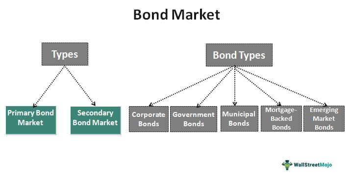

The financial markets have witnessed substantial transformations with the integration of advanced technologies, impacting various sectors, including the bond market. Bonds, as fixed-income instruments, play a vital role in the financial landscape by providing investors with steady returns and offering capital to issuers, whether they be corporations or governments. In recent times, the introduction of algorithmic trading has notably influenced bond trading activities, fundamentally altering the traditional ways these securities are purchased and sold. This advancement has brought about increased efficiency, sophistication, and a larger scope of operation in trading practices. In this article, we will examine the intricate relationship between bonds, finance, and algorithmic trading, and consider how these elements have collectively reshaped the dynamics of financial markets. Understanding this interplay is crucial for investors and financial institutions striving to navigate the evolving financial ecosystem effectively.

## Table of Contents



## Understanding Bonds in Finance

Bonds are financial instruments classified as fixed-income securities. They embody loans from an investor to entities, which are usually corporations or governmental bodies. This financial arrangement allows issuers to raise capital for various purposes, such as funding government projects or corporate expansion, in exchange for periodic interest payments and the return of principal at maturity.

Investors often consider bonds because they provide a consistent income stream through regular interest payments, typically known as coupon payments. This predictability makes bonds an attractive option for those seeking stability, especially when compared to equities, which can exhibit significant price volatility. For this reason, bonds are often deemed a safer investment.

In the broader financial system, bonds play a pivotal role. Governments utilize bonds to finance infrastructure projects, public services, and other essential undertakings. For example, the issuance of government bonds can help fund new roads, schools, and hospitals. Similarly, corporations issue bonds to secure funds for business development, mergers, or managing operational expenses. This mechanism allows entities to access a larger pool of funds than might be available through direct financing methods, thus supporting economic growth and innovation.

The bond market is diverse, encompassing various types of bonds, each with unique features and risk profiles. Some common types include government bonds, corporate bonds, and municipal bonds. Government bonds, often perceived as the safest, are backed by the credit of national governments. In contrast, corporate bonds may offer higher yields to compensate for increased credit risk, depending on the issuer's financial health.

Moreover, bonds contribute significantly to the diversification of investment portfolios. By including fixed-income products, investors can mitigate risk by balancing the more unpredictable nature of stock market investments. This risk management is essential for maintaining portfolio stability and achieving long-term financial objectives. 

In summary, bonds are a cornerstone of finance, essential for the functioning of economies and providing a reliable investment vehicle for a wide array of market participants. Their ability to offer predictability and security in returns makes them indispensable in the financial ecosystem.

## The Evolution of Bond Trading

Traditionally, bond trading was characterized by over-the-counter (OTC) transactions, which involved direct negotiations between buyers and sellers. This approach was predominantly manual, with brokers facilitating trades via phone calls and personal networks. The OTC nature of bond trading limited transparency and often resulted in fragmented markets with inconsistent pricing.

The introduction of electronic trading platforms marked a significant transformation in this landscape. These platforms digitized the trading process, providing a centralized venue for executing trades more efficiently. Electronic trading improved transparency in the bond markets by providing real-time data on prices and trading volumes. As a result, both buyers and sellers gained access to more accurate and timely information, fostering fairer price discovery.

Moreover, the advances in technology paved the way for the integration of [algorithmic trading](/wiki/algorithmic-trading) within bond markets. Algorithmic trading, which utilizes computer algorithms to execute transactions based on predefined instructions, brought about numerous opportunities and challenges. This form of trading is known for its ability to process large volumes of data rapidly and execute complex trading strategies with precision. By automating the trading process, algorithmic trading reduced human error and increased the speed of transactions.

The shift towards electronic and algorithmic trading has further allowed for the emergence of new trading strategies that can exploit market inefficiencies and enhance [liquidity](/wiki/liquidity-risk-premium). However, it also presents challenges, such as the need to develop sophisticated algorithms capable of operating in the highly segmented bond market, where different bonds have varying levels of liquidity and [volatility](/wiki/volatility-trading-strategies). The integration of these technologies necessitates substantial investments in infrastructure to handle the massive data and computational requirements inherent in algorithmic trading systems.

Overall, while the evolution of bond trading through technological advancements has led to increased efficiency and transparency, it also requires market participants to adapt to new modes of operation and overcome the challenges associated with algorithmic trading. The trajectory of these changes points towards a more dynamic and data-driven future for bond markets.

## What is Algorithmic Trading?

Algorithmic trading, often referred to as algo trading, involves the use of computer algorithms to execute financial trades, capitalizing on predefined conditions like timing, price, and [volume](/wiki/volume-trading-strategy). The primary advantage of algorithmic trading lies in its speed and precision, which far surpass human capabilities. By automating the trading process, algorithms can rapidly analyze market conditions and execute trades, potentially in fractions of a second.

The core of algorithmic trading is its ability to implement complex trading strategies with minimal human intervention. These algorithms can handle large volumes of data, performing sophisticated calculations to identify optimal trading opportunities. For example, if a trader wants to execute a large order without disrupting the market price, an algorithmic trading strategy such as the Volume Weighted Average Price (VWAP) can be employed. VWAP executes trades at multiple intervals to achieve an average price that reflects the volume of trading over the specified time period.

Python is one of the most popular languages for developing algorithmic trading strategies due to its extensive libraries and ease of use. For instance, the 'pandas' library offers powerful data manipulation capabilities, while 'numpy' supports large-scale mathematical computations. A basic example of a Python script for a simple moving average crossover strategy is shown below:

```python
import pandas as pd

# Assuming 'data' is a DataFrame with a 'Close' column containing closing prices
short_window = 40
long_window = 100

signals = pd.DataFrame(index=data.index)
signals['signal'] = 0.0

# Creating short and long simple moving averages
signals['short_mavg'] = data['Close'].rolling(window=short_window, min_periods=1, center=False).mean()
signals['long_mavg'] = data['Close'].rolling(window=long_window, min_periods=1, center=False).mean()

# Creating buy signals when short moving average crosses above long moving average
signals['signal'][short_window:] = np.where(signals['short_mavg'][short_window:] > signals['long_mavg'][short_window:], 1.0, 0.0)  

# Generate trading orders
signals['positions'] = signals['signal'].diff()
```

While initially prevalent in equity markets, algorithmic trading is increasingly being adopted in the fixed-income sector, including bond markets. This shift is driven by the same factors that popularized algo trading in equities: the need for increased efficiency, reduced transaction costs, and enhanced market transparency. As technology continues to evolve, algorithmic trading’s role in both equity and fixed-income markets is expected to expand, offering sophisticated tools for pricing, risk management, and trade execution.

## The Role of Algorithmic Trading in Bonds

Algorithmic trading in bonds leverages technology to allow traders to execute transactions with remarkable speed and accuracy. This approach enables market participants to manage vast volumes of data, facilitating the optimization of trading strategies. The automation inherent in algorithmic trading supports improved price discovery, efficient risk management, and enhanced liquidity in bond markets.

One of the principal advantages of algorithmic trading is its contribution to price discovery. Algorithms can analyze numerous market signals, including historical prices, trading volumes, and economic indicators, to estimate the fair value of bonds in real-time. This capability allows traders to make informed decisions based on up-to-the-second data, reducing the informational asymmetries that traditionally existed in over-the-counter markets.

Risk management is another area where algorithmic trading excels. Algorithms can be programmed to monitor various risk parameters continuously, such as [interest rate](/wiki/interest-rate-trading-strategies) risk, credit risk, and liquidity risk. This real-time monitoring allows for instantaneous adjustments to trading positions in response to market changes, ensuring that portfolios remain aligned with risk tolerance levels. For instance, a value-at-risk (VaR) model can be integrated into an algorithm to periodically recalculate risk exposure and execute hedging strategies if the VaR exceeds a predefined threshold.

The infusion of liquidity into the bond markets is a further benefit of algorithmic trading. By facilitating rapid transactions and increasing the number of market participants, these systems help to narrow bid-ask spreads and increase the frequency of trades. This liquidity is vital for both buyers and sellers, as it ensures that there is sufficient market depth to accommodate large transactions without causing significant price fluctuations.

Algorithmic trading strategies are increasingly being employed across various bond types, including government bonds, corporate bonds, and municipal bonds. High-frequency trading ([HFT](/wiki/high-frequency-trading-strategies)) algorithms, for example, are used to exploit fleeting [arbitrage](/wiki/arbitrage) opportunities in government bond markets where the sheer volume of trades and participants supports such strategies. In corporate bond markets, algorithms can assist in navigating the complexities associated with different credit ratings and maturities. Municipal bonds, with their unique tax implications and lower liquidity, also benefit from algorithms that specialize in assessing and executing trades under these conditions.

In conclusion, the role of algorithmic trading in bonds demonstrates a substantial shift towards automation in financial markets. Through swift execution, data management, and optimization of trading strategies, algo trading is transforming how bonds are traded, making the market more efficient and transparent for all participants.

## Benefits and Challenges of Algo Trading in Bonds

Algorithmic trading in bonds offers several advantages that are driving its increasing adoption in the finance industry. One of the primary benefits is increased efficiency. By utilizing algorithms programmed to execute trades based on predefined criteria, transactions can be completed in microseconds. This rapid execution reduces the time required to finalize trades, thereby increasing the overall speed of trading operations. The enhanced execution speed also allows market participants to take advantage of fleeting opportunities, thus potentially improving the profitability of trading strategies.

Reduced transaction costs are another significant benefit of algo trading in bonds. Automating trade execution minimizes the need for manual intervention, which can decrease the cost associated with human errors and inefficiencies. Additionally, the automation reduces reliance on broker fees, as trades can be executed directly through electronic communication networks.

Enhanced market transparency is also a crucial benefit. Algorithmic trading relies on analyzing vast datasets to determine the best trading strategies. This data-driven approach brings more transparency to pricing mechanisms, making it easier for traders to assess market trends and bond valuations. Increased transparency can lead to better price discovery and more informed investment decisions.

Despite these benefits, there are notable challenges associated with algorithmic trading in the bond market. One such challenge is the complexity involved in crafting algorithms capable of adapting to the highly fragmented bond market. Unlike equity markets, where stocks are traded on centralized exchanges, bonds often trade over-the-counter, leading to a lack of uniformity and data accessibility. Creating algorithms that can navigate this diverse landscape requires sophisticated modeling techniques and robust data inputs.

Furthermore, significant infrastructure investment is necessary to support algorithmic trading technologies. Organizations need to invest in advanced hardware and software systems to ensure algorithms function efficiently and effectively. This infrastructure must not only support the rapid processing of large volumes of data but also be scalable to accommodate future growth in trading activities and technological advancements.

In conclusion, while algorithmic trading in bonds presents various advantages, such as increased efficiency, reduced costs, and enhanced transparency, it also brings about challenges that need to be managed. Developing adaptable algorithms for a fragmented market and investing in the necessary technological infrastructure are essential steps for financial institutions seeking to harness the full potential of algorithmic trading in bond markets.

## The Future of Algo Trading in Bond Markets

The future of algorithmic trading in bond markets appears promising, driven by ongoing technological advancements that are expected to further enhance its integration into these markets. As the volume of data available continues to expand, algorithms are poised to become increasingly sophisticated. This development promises to provide traders with deeper insights into market dynamics, thereby improving the execution of trades. Enhanced algorithms will be able to process vast quantities of historical and real-time data, enabling more accurate predictions and efficient trade execution. 

The sophistication of these algorithms could be reflected in more refined models for price prediction and risk assessment. For example, [machine learning](/wiki/machine-learning) techniques, such as [deep learning](/wiki/deep-learning) and [reinforcement learning](/wiki/reinforcement-learning), are expected to play a pivotal role in developing algorithms that can adapt to changing market conditions. This adaptability will be crucial in refining trading strategies that can respond to the complexity and diversity of bond instruments.

Financial institutions that leverage these advanced algorithmic trading technologies are likely to gain a competitive edge. These institutions can benefit from reduced transaction costs and enhanced market transparency, which are direct results of increased efficiency in trade executions. Competitive advantage can manifest through optimized trading strategies that provide higher returns on investments and improved portfolio management.

Moreover, the continued evolution of [artificial intelligence](/wiki/ai-artificial-intelligence) and machine learning will likely introduce even more innovative solutions for data analysis and decision-making processes in bond markets. Python, with its extensive libraries such as Pandas for data manipulation and Scikit-learn for machine learning, is well-suited for developing these algorithms. A simple Python script to demonstrate fetching and processing bond market data might look like this:

```python
import pandas as pd
import requests

url = 'https://api.example.com/bond_data'  # hypothetical API endpoint
response = requests.get(url)
data = response.json()

df = pd.DataFrame(data)
df['expected_returns'] = df['current_yield'] * df['maturity']  # simple return estimation
```

This hypothetical code snippet illustrates how financial institutions can begin to analyze bond data with basic operations that computational algorithms can build upon, bringing new levels of efficiency and accuracy to bond trading.

As technology progresses, the potential for further innovations in algorithmic trading within the bond market is vast. The integration of algorithms that can effectively harness the growing data available will position financial players advantageously, ensuring they are well-prepared to capitalize on these technological shifts.

## Conclusion

Algorithmic trading is revolutionizing the bond market by integrating advanced technologies that enhance efficiency, accuracy, and decision-making capabilities. This transformation is characterized by numerous advantages, such as increased speed of execution, reduced transaction costs, and improved access to market data. These benefits facilitate a more dynamic trading environment, where algorithmic strategies optimize transactions down to milliseconds.

As technology continues to evolve, the application of algorithmic trading in bond markets is anticipated to expand further, unlocking new possibilities for financial institutions and investors. The development of more sophisticated algorithms will likely result in better price discovery, enhanced liquidity, and improved risk management. These advancements are expected to create a competitive edge for those who adopt them, as nuanced strategies can be implemented to capitalize on market inefficiencies.

For investors and institutions, the integration of algorithmic trading represents a critical opportunity to improve performance and manage portfolios more effectively. By leveraging these advances, they can navigate the complexities of modern financial markets with increased precision and insight. This proactive adaptation to technological progress will be essential in ensuring competitive positioning and resilience in a rapidly changing financial landscape.

## References & Further Reading

[1]: Treleaven, P., Galas, M., & Lalchand, V. (2013). ["Algorithmic trading review."](https://www.researchgate.net/publication/262239006_Algorithmic_Trading_Review) Journal of Financial Markets.

[2]: Fabozzi, F. J., Focardi, S. M., & Jonas, C. (2010). ["High Frequency and Algorithmic Trading."](https://www.semanticscholar.org/paper/Quantitative-Equity-Investing%3A-Techniques-and-Fabozzi-Focardi/1c49a2a53919f7e65cb96f16691b8ff726fd3cd7) John Wiley & Sons.

[3]: O'Hara, M. (2015). ["High-Frequency Trading and Its Impact on Markets."](https://www.semanticscholar.org/paper/High-Frequency-Trading-and-Its-Impact-on-Markets-O'Hara/36480639e541378136f4eb27af5222d2d5905372) Financial Analysts Journal.

[4]: Nasir, M. A., & Du, N. (2016). ["Algorithmic trading and market efficiency: a literature review."](https://papers.ssrn.com/sol3/papers.cfm?abstract_id=2714844) Journal of Economic Surveys.

[5]: Hasbrouck, J., & Saar, G. (2013). ["Low-latency trading."](https://www.sciencedirect.com/science/article/abs/pii/S1386418113000165) The Review of Financial Studies.