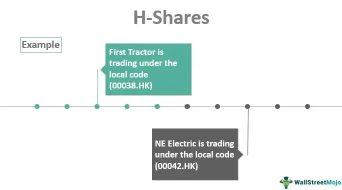

The Hong Kong stock market, a pivotal entity in the global financial system, serves as a vital link connecting the East with the West. It is renowned for its strategic position in Asia, acting as a conduit for international investment into the burgeoning markets of mainland China. Among its many segments, H-Shares play a crucial role. These are shares of Chinese mainland companies that are listed on the Hong Kong Stock Exchange, providing a means for international investors to gain exposure to China's economy without the complexities of direct investment in the mainland markets. Their unique positioning allows H-Shares to bridge the regulatory and cultural gaps between Chinese companies and global investors, facilitating a smoother flow of foreign capital.

Algorithmic trading is increasingly becoming a cornerstone of modern finance. By harnessing the power of sophisticated algorithms and computational prowess, this form of trading enables the execution of orders at unprecedented speeds, offering significant improvements in efficiency and liquidity. The technology’s real-time data analysis and pattern recognition capabilities make it indispensable for traders seeking to exploit market inefficiencies and execute complex strategies. As a central hub of financial trade, Hong Kong has witnessed a significant uptick in the adoption of algorithmic trading, helping to enhance the market’s overall dynamism and appeal.

The regulatory environment governing H-Shares and algorithmic trading in Hong Kong is stringent yet adaptive, ensuring market stability while fostering innovation. The Securities and Futures Commission (SFC) plays a pivotal role in maintaining this balance, promulgating regulations that safeguard investors and maintain fair play, all while encouraging technological advances and efficient market practices. However, challenges remain in aligning regulations with the rapidly evolving landscape of financial technologies.

This article aims to explore the intricate relationship between H-Shares, algorithmic trading, and the regulatory frameworks in Hong Kong. By examining these elements, the article seeks to illuminate the opportunities and challenges present, as well as the strategic advantages offered by one of Asia's most significant financial markets. This exploration intends to equip investors, traders, and regulators with insights necessary to navigate and leverage the evolving landscape effectively.

## Table of Contents

## Understanding H-Shares

H-Shares refer to the shares of companies incorporated in mainland China that are listed on the Hong Kong Stock Exchange (HKEX). These shares are denominated in Hong Kong dollars and are available for purchase by international investors. H-Shares distinguish themselves from A-Shares, which are traded on the Shanghai and Shenzhen stock exchanges and are typically accessible only to domestic investors or certain qualified foreign institutional investors.

The historical backdrop of H-Shares dates back to the early 1990s when the Chinese government initiated reforms to open its economy to global markets and attract foreign capital. The first H-Share was listed in 1993, setting a precedent for subsequent listings. This strategic move has been pivotal in helping Chinese companies access international capital while offering global investors an opportunity to invest in some of China's leading enterprises.

H-Shares have effectively functioned as a conduit between mainland Chinese companies and global investors, facilitating capital inflow into China and sharing corporate growth opportunities with international stakeholders. By listing on the HKEX, these companies benefit from a mature, transparent, and well-regulated financial market while attracting a broader investor base, including institutional investors who might be cautious of the regulatory complexities on the mainland.

In recent years, H-Shares have exhibited varying performance trends influenced by numerous factors, including China's economic policies, global economic conditions, and regulatory changes both domestically and internationally. The Hang Seng China Enterprises Index (HSCEI), often considered a benchmark for H-Share performance, provides a snapshot of the market trends for these securities. Historically, H-Shares have experienced phases of growth driven by China's economic expansion, but they have also faced [volatility](/wiki/volatility-trading-strategies) due to geopolitical tensions and regulatory shifts.

H-Shares predominantly cover several major sectors, reflecting the industrial landscape of China. The most common sectors represented include financials, energy, telecommunications, consumer goods, and industrials. Companies listed as H-Shares often comprise leading Chinese banks, oil companies, state-owned enterprises, and telecommunications giants. This diversity offers investors a broad spectrum of opportunities aligned with China's economic trajectory and sectoral development.

In summary, H-Shares offer a unique vehicle for international investors to gain exposure to China’s economic growth, while providing Chinese companies with access to foreign capital and a prestigious platform for corporate branding and expansion.

## Algorithmic Trading: An Overview

Algorithmic trading refers to the use of computer algorithms to automate trading decisions in financial markets. These algorithms execute pre-determined instructions for trading securities, such as timing, price, and quantity, at a speed and frequency that is impossible for a human trader. The growing importance of [algorithmic trading](/wiki/algorithmic-trading) in global markets is attributed to its ability to process large volumes of data rapidly, allowing traders to capitalize on market opportunities with enhanced precision and efficiency.

Algorithmic trading has gained significant traction due to several factors, including advancements in technology, increased availability of data, and the competitive advantage it provides through reduced transaction costs and improved market [liquidity](/wiki/liquidity-risk-premium). The International Journal of Financial Markets and Derivatives notes that up to 73% of all trading in the U.S. equity markets in 2022 was attributed to algorithmic methods, highlighting its prevalence (source: IJFMD).

The strategies employed in algorithmic trading are varied and often complex. Some commonly used strategies include:

1. **Trend Following**: This strategy involves identifying and capitalizing on trends in the market, executing trades based on technical indicators like moving averages. It is simple yet effective, as it follows the basic principle of buying high and selling higher, or selling low and buying lower.

2. **Arbitrage**: This strategy seeks to profit from price discrepancies between different markets or instruments. Algorithms identify these discrepancies and execute simultaneous buy and sell orders to lock in profits before the price gap closes.

3. **Mean Reversion**: This strategy is founded on the principle that asset prices will revert to their historical average over time. Traders use this strategy to identify assets that have deviated significantly from their average prices and execute trades expecting a reversion to the mean.

4. **Market Making**: This involves providing liquidity to the market by placing buy and sell orders at specified levels around the current market price, thus profiting from the bid-ask spread.

Algorithmic trading offers numerous advantages such as speed, efficiency, and reduced human error. Algorithms can analyze multiple market conditions simultaneously and execute trades within milliseconds. This capability significantly outpaces human traders, who are limited in their ability to process information and react to market changes.

However, algorithmic trading also introduces certain risks and challenges. One significant risk is the potential for market volatility, as algorithms can amplify price movements during periods of market stress. Another challenge is the possibility of technical failures, where errors in algorithm design or implementation can lead to substantial financial losses. Moreover, the complexity of algorithms sometimes makes it difficult for regulatory bodies to monitor and ensure transparency and fairness in the markets (source: FINRA).

In conclusion, algorithmic trading is a dynamic component of modern financial markets, promoting efficiency and liquidity. While it provides considerable benefits, it also poses challenges that require ongoing risk management and regulatory oversight to ensure the stability and integrity of financial markets.

## Regulatory Framework for H-Shares and Algo Trading in Hong Kong

Hong Kong's stock market is governed by a comprehensive regulatory framework designed to maintain market integrity and protect investors. The Securities and Futures Commission (SFC) acts as the primary regulatory body, overseeing various aspects of securities and futures markets in Hong Kong. Established under the Securities and Futures Ordinance (SFO), the SFC is responsible for ensuring a fair, transparent, and efficient market.

### Key Regulatory Bodies

The SFC collaborates with the Hong Kong Stock Exchange (HKEX) and the Hong Kong Monetary Authority (HKMA) to maintain market order and stability. Each of these bodies has distinct roles: the SFC focuses on regulation and enforcement, the HKEX operates the market platform, and the HKMA supervises banking operations and monetary policy.

### Regulations Impacting H-Shares

H-Shares refer to the shares of companies incorporated in mainland China that are listed on the Hong Kong Stock Exchange. These shares are subject to specific regulations that ensure their alignment with international financial practices while accommodating the unique characteristics of mainland Chinese enterprises. The SFC requires that H-Share listed companies comply with both Mainland China's statutory requirements and the Listing Rules of the HKEX. This dual regulatory requirement ensures that H-Shares meet high standards of corporate governance and financial disclosure, thus facilitating better investor protection.

### Regulatory Stance on Algorithmic Trading

Algorithmic trading, characterized by the use of computer algorithms to automate trading orders, has grown significantly within the Hong Kong stock market. The SFC sets rigorous standards to mitigate risks associated with high-frequency trading and other algorithm-related activities. The framework emphasizes robust risk management systems and internal controls to prevent market manipulation and ensure fair access to trading platforms. Entities engaged in algorithmic trading must also adhere to the SFC's guidelines on the use of trading algorithms, which include requirements for order execution reliability, audit trails, and system resilience.

### Recent Regulatory Updates

Recent regulatory measures have focused on enhancing market transparency and preventing systemic risks. The SFC has mandated increased disclosure of short-selling activities and implemented stricter margin requirements to mitigate potential financial instability. Additionally, the SFC has introduced technological safeguards and stress testing procedures to strengthen the resilience of algorithmic trading systems. These updates aim to foster a fair trading environment while accommodating rapid technological advancements in the trading sector.

The interplay between regulatory rigor and market dynamism positions Hong Kong as a pivotal hub for global financial activities. Ongoing regulatory updates ensure that both H-Shares and algorithmic trading practices evolve in a way that supports sustainable market growth and financial innovation.

## Challenges and Opportunities

Regulators face a multifaceted challenge in balancing innovation and inherent risks in algorithmic trading within the Hong Kong stock market. As algorithmic trading leverages complex mathematical models and high-speed data processing, it holds the potential to enhance market efficiency. However, the rapid pace and automated nature of these transactions can amplify systemic risks, market manipulation, and flash crashes. Regulators such as the Securities and Futures Commission (SFC) must therefore implement measures to mitigate these risks while fostering an environment conducive to technological advancement.

Market participants have significant opportunities to harness algorithmic trading, provided they operate within the regulatory frameworks. By adhering to prescribed guidelines, companies can employ algorithms to optimize trading strategies, resulting in reduced transaction costs and improved price discovery. The automation of repetitive trading tasks minimizes human error, while the ability to analyze large volumes of data can give traders a competitive edge in market predictions and decision-making processes.

Global economic factors and policies significantly impact H-Shares and their trading activities. Factors such as trade relations between China and other nations, currency fluctuations, and international monetary policies influence investor sentiment and capital flow. Consequently, algorithmic trading systems must be adaptable, integrating comprehensive geopolitical and economic data to refine predictive accuracy and investment strategies.

Several investors have adeptly navigated Hong Kong's regulatory landscape by aligning their trading systems with compliance measures. For instance, institutional investors often deploy compliance-check algorithms that ensure all transactions adhere to local and international trading regulations. By doing so, these investors have not only safeguarded their operations against legal repercussions but have also maintained trust and credibility in the eyes of both regulators and shareholders.

Looking ahead, the landscape of algorithmic trading is poised for notable shifts driven by technological advancements and evolving market conditions. Artificial intelligence and [machine learning](/wiki/machine-learning) offer enhanced data processing capabilities, enabling more sophisticated trading algorithms that can adapt in real time to market changes. Moreover, as global interconnectedness increases, algorithmic systems will need to incorporate multidimensional datasets spanning various geographic and economic domains.

In conclusion, the juxtaposition of regulation and technology in Hong Kong's stock market presents both challenges and opportunities for stakeholders. A considered approach to regulatory compliance, coupled with strategic utilization of cutting-edge technologies, can propel market participants toward sustainable growth and innovation. To navigate the complexities of this dynamic environment, continuous engagement between regulators and market entities is essential, ensuring that the dual objectives of market integrity and technological advancement are achieved.

## Conclusion

The exploration of H-Shares, algorithmic trading, and their regulation in Hong Kong highlights a multifaceted financial ecosystem that is increasingly critical in the global markets. H-Shares serve as a pivotal conduit linking Chinese companies to international investors, while algorithmic trading is revolutionizing the speed and efficiency of stock transactions. Both elements underscore the vitality and complexity of Hong Kong's stock market.

A robust regulatory environment is essential to ensuring sustainable growth and integrity in this market. The Securities and Futures Commission (SFC) plays a crucial role in overseeing H-Shares and the implementation of algorithmic trading, maintaining a balance between fostering innovation and mitigating risks. Current regulations are designed to uphold market integrity, yet they are continuously evolving to address the dynamism of financial technologies.

Continuous dialogue between market participants and regulators is necessary to adapt to emerging challenges and opportunities. This interaction aids in crafting regulations that not only focus on risk mitigation but also encourage technological advancements and market competitiveness.

Looking forward, the intersection of H-Shares and algorithmic trading in Hong Kong points to a future characterized by greater efficiency and access to global capital. However, the rapid advancement of technology and shifting economic landscapes necessitate that investors and market participants remain vigilant and informed. Understanding the regulatory framework and staying adaptable to changes will be pivotal for success in this dynamic environment.

As a call to action, investors and traders should actively engage with educational resources and stay abreast of regulatory updates to navigate the complexities of the Hong Kong stock market effectively. This proactive approach will enhance their ability to capitalize on opportunities while mitigating potential risks in an ever-evolving market landscape.

## References & Further Reading

[1]: Malkiel, B. G. (2016). ["A Random Walk Down Wall Street: The Time-Tested Strategy for Successful Investing"](https://www.tandfonline.com/doi/full/10.1080/14697688.2016.1256598). W. W. Norton & Company.

[2]: Lopez de Prado, M. (2018). ["Advances in Financial Machine Learning"](https://www.amazon.com/Advances-Financial-Machine-Learning-Marcos/dp/1119482089). Wiley.

[3]: Chan, E. P. (2009). ["Quantitative Trading: How to Build Your Own Algorithmic Trading Business"](https://github.com/ftvision/quant_trading_echan_book). Wiley.

[4]: Aronson, D. R. (2007). ["Evidence-Based Technical Analysis: Applying the Scientific Method and Statistical Inference to Trading Signals"](https://onlinelibrary.wiley.com/doi/book/10.1002/9781118268315). Wiley.

[5]: Jansen, S. (2020). ["Machine Learning for Algorithmic Trading: Predictive Models to Extract Signals from Market and Alternative Data for Systematic Trading Strategies with Python"](https://www.amazon.com/Machine-Learning-Algorithmic-Trading-alternative/dp/1839217715). Packt Publishing.

[6]: Securities and Futures Commission (SFC). ["Overview of the Securities and Futures Commission"](https://www.sfc.hk/en/). 

[7]: International Journal of Financial Markets and Derivatives. ["Impact of Algorithmic Trading on Financial Markets"](https://www.inderscience.com/jhome.php?jcode=ijfmd). 

[8]: Law, K. L., & Singh, R. (2014). ["China’s H-Share Performance and Closer Financial Linkages with Hong Kong"](https://www.sciencedirect.com/science/article/pii/S0378426613004925). International Monetary Fund.