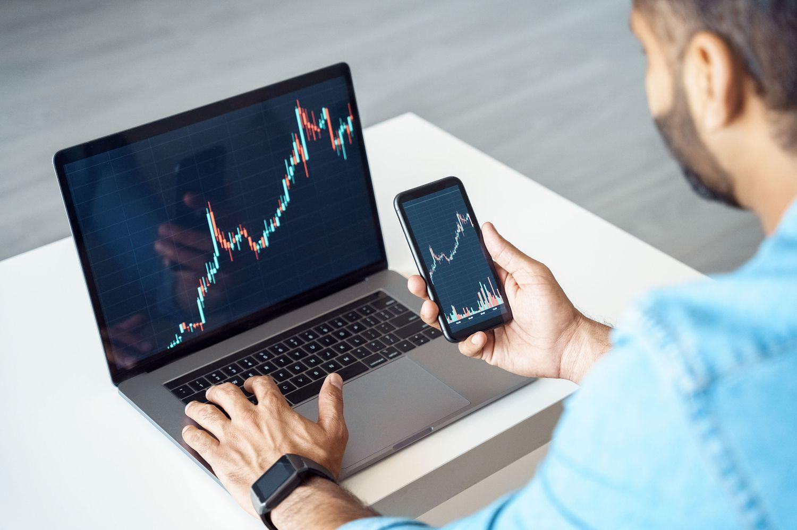

## Table of Contents

## What are H-Shares?

H-Shares are stocks of companies from mainland China that are listed on the Hong Kong Stock Exchange. These companies are incorporated in mainland China but choose to list their shares in Hong Kong to attract international investors. The "H" in H-Shares stands for Hong Kong.

Investors like H-Shares because they can invest in Chinese companies without the restrictions that come with investing directly in mainland China's stock markets. H-Shares are traded in Hong Kong dollars, making them easier for international investors to buy and sell. This helps Chinese companies raise money from a global pool of investors.

## How do H-Shares differ from A-Shares and B-Shares?

H-Shares, A-Shares, and B-Shares are all types of stocks from Chinese companies, but they are listed in different places and have different rules. A-Shares are stocks of companies from mainland China that are listed on the Shanghai or Shenzhen stock exchanges. These are traded in Chinese yuan and are mainly for investors from mainland China. B-Shares, on the other hand, are also from mainland Chinese companies but are listed on the same exchanges as A-Shares. The big difference is that B-Shares are traded in foreign currencies: U.S. dollars in Shanghai and Hong Kong dollars in Shenzhen. This makes B-Shares more accessible to international investors.

H-Shares are different because they are listed on the Hong Kong Stock Exchange. They are also from mainland Chinese companies, but they are traded in Hong Kong dollars. This makes H-Shares attractive to a global audience of investors who want to invest in Chinese companies without dealing with the restrictions of mainland China's stock markets. So, while A-Shares are mostly for Chinese investors, B-Shares and H-Shares open up opportunities for international investors, with H-Shares being particularly popular due to their listing in Hong Kong.

## Why do companies choose to list H-Shares?

Companies from mainland China choose to list H-Shares in Hong Kong because it helps them reach more investors from around the world. When a company lists its shares in Hong Kong, it can attract people who want to invest in Chinese companies but find it hard to buy stocks directly from mainland China's stock markets. Hong Kong has fewer restrictions for foreign investors, making it easier for them to buy and sell H-Shares.

Listing H-Shares also helps Chinese companies raise more money. By selling shares in Hong Kong, they can get funds from a bigger pool of investors. This money can be used to grow their business, invest in new projects, or pay off debts. Since H-Shares are traded in Hong Kong dollars, it's simpler for international investors to buy them, which makes the shares more appealing and can lead to higher demand.

## What are the basic regulations governing H-Shares in Hong Kong?

H-Shares are governed by the rules of the Hong Kong Stock Exchange and the Securities and Futures Commission (SFC). The Hong Kong Stock Exchange has its own listing rules that companies must follow to list their shares. These rules cover things like how much information a company has to share with the public, how they report their finances, and what they need to do to stay listed on the exchange. The SFC makes sure that the market is fair and that investors are protected. They keep an eye on the market to stop any bad behavior and make sure everyone follows the rules.

For H-Shares, companies also have to follow some rules from mainland China. This is because these companies are from China but listed in Hong Kong. The China Securities Regulatory Commission (CSRC) oversees these rules. They make sure that Chinese companies listing H-Shares are following both Hong Kong and Chinese regulations. This can be tricky because the rules might be different in each place, but it's important for keeping the market honest and safe for investors.

## How does the Hong Kong Stock Exchange (HKEX) regulate H-Shares?

The Hong Kong Stock Exchange (HKEX) makes sure H-Shares follow its rules. These rules are called the Listing Rules. They say what companies need to do to list their shares and stay listed. Companies have to tell the public a lot about their business, like how they are doing financially and any big changes. This helps people who want to invest know what's going on. The HKEX checks that companies follow these rules to keep the market fair and safe for everyone.

The Securities and Futures Commission (SFC) also helps regulate H-Shares. They watch the market to make sure no one is doing anything wrong. They want to protect investors and keep the market honest. Since H-Shares are from Chinese companies, they also have to follow some rules from China. The China Securities Regulatory Commission (CSRC) makes sure these companies follow both Hong Kong and Chinese rules. It can be hard because the rules might be different, but it's important for keeping the market fair and safe.

## What role does the Securities and Futures Commission (SFC) play in regulating H-Shares?

The Securities and Futures Commission (SFC) in Hong Kong is very important for making sure H-Shares are regulated well. H-Shares are stocks of Chinese companies listed in Hong Kong. The SFC's job is to watch the market and make sure everything is fair and honest. They check to see if anyone is doing anything wrong and try to stop it. This helps keep the market safe for people who want to invest in H-Shares.

The SFC also works to protect investors. They make rules that companies have to follow, like telling the public about their business and money situation. This helps people make good choices about investing. Even though H-Shares come from Chinese companies, they still have to follow Hong Kong's rules, and the SFC makes sure this happens.

## What are the listing requirements for H-Shares on the HKEX?

To list H-Shares on the Hong Kong Stock Exchange (HKEX), a company needs to follow certain rules. These rules are called the Listing Rules. A company must have been doing business for at least three years. They also need to have a certain amount of money, usually at least HK$50 million in profit over the last three years. This shows they are doing well enough to be listed on the exchange. They also need to have a good plan for their business and tell the public a lot about what they do and how they are doing financially.

The HKEX wants to make sure the market is fair and safe for everyone. So, they check that companies follow all the rules. Companies have to share important information with the public, like any big changes in their business or money situation. This helps people who want to invest know what's going on. Even though H-Shares are from Chinese companies, they still have to follow Hong Kong's rules and share information in a way that's easy for everyone to understand.

## How do regulations affect the pricing and trading of H-Shares?

Regulations have a big effect on how H-Shares are priced and traded. The Hong Kong Stock Exchange (HKEX) and the Securities and Futures Commission (SFC) make rules that companies have to follow. These rules make sure that companies share a lot of information with the public. When people know more about a company, they can decide if they want to buy or sell its shares. If a company is doing well and shares good news, the price of its H-Shares might go up. But if there are problems or bad news, the price might go down. The rules help keep the market fair and stop people from doing anything wrong, which can make investors feel safer and more likely to trade.

The China Securities Regulatory Commission (CSRC) also has rules for H-Shares because these companies are from mainland China. These rules can make things a bit harder because the company has to follow rules from both China and Hong Kong. But it's important for keeping the market honest. Sometimes, news about changes in these rules can also affect the price of H-Shares. If the rules change in a way that makes it easier for people to invest, the price might go up. If the rules get stricter, it might go down. Overall, the regulations help make sure that the trading of H-Shares is done in a fair and open way.

## What are the key compliance issues that companies with H-Shares need to address?

Companies with H-Shares need to follow rules from both Hong Kong and mainland China. This can be tricky because the rules might be different in each place. They have to make sure they are sharing a lot of information with the public, like how their business is doing and any big changes. This is important because it helps people who want to invest know what's going on. If a company doesn't follow these rules, they could get in trouble and it might be hard for them to stay listed on the Hong Kong Stock Exchange.

Another big issue is making sure they are following the financial rules. They need to show that they have been making money for at least three years and have enough money to be listed. They also have to report their money situation in a way that's easy for everyone to understand. This helps keep the market fair and safe for investors. If a company doesn't follow these financial rules, it could affect how much people trust them and the price of their H-Shares.

## How have recent regulatory changes impacted the H-Share market?

Recent regulatory changes have had a big effect on the H-Share market. One big change is that China has made it easier for foreign investors to buy H-Shares. This is called the Stock Connect program, which lets people from mainland China and Hong Kong trade shares more easily. Because of this, more people can invest in H-Shares, which can make the prices go up. But, there are also new rules that make companies share more information with the public. This can be good because it helps people make better choices about investing, but it can also be hard for companies to follow all the new rules.

Another change is that the rules about how companies report their money have gotten stricter. This means companies have to be more careful about how they show their financial situation. If a company doesn't follow these new rules, it could get in trouble and the price of their H-Shares might go down. These changes are trying to make the market more fair and safe for everyone, but they can also make things more complicated for companies that want to list H-Shares in Hong Kong.

## What are the advanced risk management strategies for investors in H-Shares?

Investors in H-Shares need to use smart ways to manage their risks because these stocks can go up and down a lot. One good strategy is to spread out their money by buying different kinds of investments, not just H-Shares. This is called diversification. It can help because if the price of H-Shares goes down, the investor might still make money from other investments. Another strategy is to use stop-loss orders. This means setting a price at which the investor will automatically sell their H-Shares if they start to lose too much money. This can help stop big losses.

Another important strategy is to keep learning about the companies they invest in. Investors should read the news and reports about the companies with H-Shares. This can help them know if there are any big changes or problems that might affect the stock prices. They can also use hedging to protect their investments. Hedging is like buying insurance for their stocks. For example, they can buy options or futures that will make money if the H-Shares lose value. This can help balance out any losses they might have. By using these strategies, investors can feel more safe when they put their money into H-Shares.

## How do international regulatory frameworks influence H-Share listings and trading?

International regulatory frameworks play a big role in how H-Shares are listed and traded. H-Shares are stocks of Chinese companies listed in Hong Kong, and they have to follow rules from both Hong Kong and China. But there are also rules from other countries that can affect them. For example, if a country changes its rules about investing in foreign stocks, it can change how many people want to buy H-Shares. This can make the prices go up or down. Also, international groups like the Financial Action Task Force (FATF) make rules to stop money laundering and terrorism financing. These rules can make it harder or easier for people to trade H-Shares, depending on how strict they are.

Another way international regulations affect H-Shares is through things like the Stock Connect program. This program lets people from mainland China and Hong Kong trade shares more easily. It's a big deal because it can bring more investors to the H-Share market. But if other countries change their rules about how their investors can use programs like Stock Connect, it can change how much money flows into H-Shares. So, even though H-Shares are listed in Hong Kong, what happens in other countries can still have a big impact on them.

## References & Further Reading

[1]: Malkiel, B. G. (2016). ["A Random Walk Down Wall Street: The Time-Tested Strategy for Successful Investing"](https://www.tandfonline.com/doi/full/10.1080/14697688.2016.1256598). W. W. Norton & Company.

[2]: Lopez de Prado, M. (2018). ["Advances in Financial Machine Learning"](https://www.amazon.com/Advances-Financial-Machine-Learning-Marcos/dp/1119482089). Wiley.

[3]: Chan, E. P. (2009). ["Quantitative Trading: How to Build Your Own Algorithmic Trading Business"](https://github.com/ftvision/quant_trading_echan_book). Wiley.

[4]: Aronson, D. R. (2007). ["Evidence-Based Technical Analysis: Applying the Scientific Method and Statistical Inference to Trading Signals"](https://onlinelibrary.wiley.com/doi/book/10.1002/9781118268315). Wiley.

[5]: Jansen, S. (2020). ["Machine Learning for Algorithmic Trading: Predictive Models to Extract Signals from Market and Alternative Data for Systematic Trading Strategies with Python"](https://www.amazon.com/Machine-Learning-Algorithmic-Trading-alternative/dp/1839217715). Packt Publishing.

[6]: Securities and Futures Commission (SFC). ["Overview of the Securities and Futures Commission"](https://www.sfc.hk/en/). 

[7]: International Journal of Financial Markets and Derivatives. ["Impact of Algorithmic Trading on Financial Markets"](https://www.inderscience.com/jhome.php?jcode=ijfmd). 

[8]: Law, K. L., & Singh, R. (2014). ["China’s H-Share Performance and Closer Financial Linkages with Hong Kong"](https://www.sciencedirect.com/science/article/pii/S0378426613004925). International Monetary Fund.