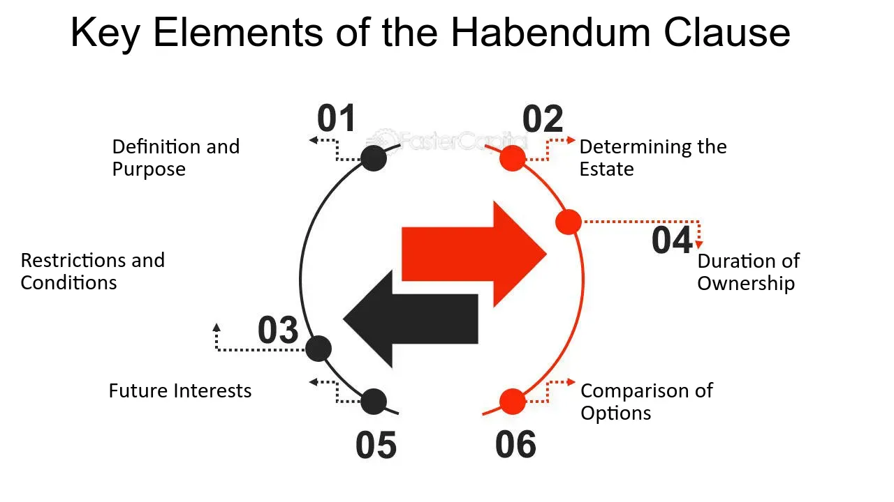

## Table of Contents

## What is a Habendum Clause?

A Habendum Clause is a part of a legal document, like a deed or lease, that explains what rights someone has to a property. It usually starts with the words "to have and to hold." This clause tells you how long someone can use the property and what they can do with it.

For example, in a lease, the Habendum Clause might say that the tenant can use the property for one year. In a deed, it might say that the new owner gets to keep the property forever. This part of the document is important because it makes clear what the owner or tenant is allowed to do with the property.

## Where is the Habendum Clause typically found in legal documents?

The Habendum Clause is usually found in legal documents like deeds and leases. It's a special part of these documents that explains what rights someone has to a property. You can often find it right after the part that says who is getting the property.

In a deed, the Habendum Clause comes after the granting clause, which names the new owner. It starts with the words "to have and to hold" and then explains how long the new owner can keep the property. In a lease, it's found after the part that says who is renting the property, and it tells how long the tenant can use it and what they can do with it.

## What is the primary function of a Habendum Clause?

The main job of a Habendum Clause is to explain the rights someone has to a property. It's like a rulebook that says how long you can use the property and what you can do with it. This part of the document is very important because it makes sure everyone knows what they are allowed to do.

In a deed, the Habendum Clause tells the new owner how long they can keep the property. It might say they can have it forever, which is called "fee simple." In a lease, it tells the tenant how long they can rent the property and what they can do with it during that time. This helps avoid confusion and disagreements about the property.

## How does a Habendum Clause differ from other clauses in a deed?

A Habendum Clause is different from other clauses in a deed because it focuses on explaining the rights someone has to a property. It usually comes right after the granting clause, which names the new owner. The Habendum Clause starts with the words "to have and to hold" and then tells how long the new owner can keep the property. This is important because it makes clear what the owner is allowed to do with the property.

Other clauses in a deed might talk about different things. For example, the granting clause just says who is getting the property. The legal description clause gives details about where the property is located. The warranty clause might promise that the person selling the property has the right to do so. Each of these clauses has its own job, but the Habendum Clause is special because it's all about the rights and how long they last.

## Can you provide an example of a Habendum Clause in a real estate document?

In a real estate deed, a Habendum Clause might look like this: "To have and to hold the said property unto the Grantee, his heirs and assigns forever." This means the person getting the property, called the Grantee, can keep it forever. It's like saying, "You own this property now, and you can pass it on to your family or sell it if you want."

In a lease agreement, the Habendum Clause could be something like this: "To have and to hold the leased premises for a term of one year, beginning on January 1, 2023, and ending on December 31, 2023." This tells the tenant they can use the property for one year, starting and ending on the dates mentioned. It's important because it sets clear rules about how long the tenant can stay and use the property.

## What are the key components that should be included in a Habendum Clause?

The Habendum Clause needs to have a few important parts to make sure it's clear and works right. It should start with the words "to have and to hold." These words are special and tell everyone that this part of the document is about the rights to the property. Then, it should say who gets the property, like the new owner or the tenant. This part is important because it makes sure everyone knows who the rights belong to.

After that, the Habendum Clause should explain how long the person can keep or use the property. In a deed, it might say "forever," which means the new owner can keep the property for as long as they want. In a lease, it should say how many years or months the tenant can use the property. This part is key because it sets the time limits and helps avoid confusion about how long someone can stay or use the property.

## How does the Habendum Clause affect the rights of the property owner?

The Habendum Clause is a big deal for the property owner because it tells them exactly what they can do with their property. It's like a rulebook that says how long they can keep the property and what rights they have. For example, if the Habendum Clause in a deed says "to have and to hold the said property unto the Grantee, his heirs and assigns forever," it means the new owner can keep the property forever. They can live there, sell it, or pass it on to their family. This part of the document makes sure the owner knows what they can do with their property.

In a lease, the Habendum Clause works a bit differently. It tells the tenant how long they can use the property and what they can do with it during that time. For example, if it says "to have and to hold the leased premises for a term of one year," the tenant knows they can use the property for one year. This helps the property owner because it sets clear rules about how long the tenant can stay. It also makes sure the owner knows when they can get their property back. So, the Habendum Clause is important because it helps both the owner and the tenant understand their rights and responsibilities.

## What happens if a Habendum Clause is missing from a deed?

If a Habendum Clause is missing from a deed, it can cause confusion about what rights the new owner has. The Habendum Clause is important because it tells the new owner how long they can keep the property and what they can do with it. Without this clause, it might be hard to know if the owner can keep the property forever or if there are other rules they need to follow.

Even without a Habendum Clause, the deed might still be valid, but it could lead to disagreements. For example, if the deed doesn't say how long the new owner can keep the property, they might think they can keep it forever, but the person selling the property might have different ideas. To avoid these problems, it's best to always include a Habendum Clause in a deed to make sure everyone knows the rules.

## How can the wording of a Habendum Clause impact the interpretation of a lease?

The words in a Habendum Clause can change how people understand a lease. If the clause says the tenant can use the property for "one year," it's clear that the tenant can stay for that time. But if the words are not clear, like saying "for a term to be determined," it can cause confusion. The tenant might think they can stay longer, but the landlord might want them to leave sooner. So, the exact words in the Habendum Clause are important because they set the rules for how long the tenant can use the property.

If the Habendum Clause is not written well, it can lead to disagreements between the tenant and the landlord. For example, if it says "for a term of one year, with the option to renew," the tenant might think they can stay longer if they want to. But if the landlord thinks the tenant has to leave after one year, they might argue about it. Clear and simple words in the Habendum Clause help everyone understand the rules and avoid fights about the lease.

## Are there variations of the Habendum Clause depending on the type of property or jurisdiction?

Yes, the Habendum Clause can change depending on the type of property or where you are. For example, in a deed for a house, the clause might say the new owner can keep the house forever. But if it's a lease for an apartment, the clause might say the tenant can use it for one year. The words used can be different to fit what the property is and what the owner or tenant needs.

Also, different places might have different rules about what the Habendum Clause should say. In some states, the clause might need to use certain words or follow certain rules. For example, in one state, the clause might need to say "to have and to hold" to be valid, but in another state, different words might be okay. So, it's important to know the local laws when writing a Habendum Clause to make sure it works right.

## What legal issues might arise from an improperly drafted Habendum Clause?

If a Habendum Clause is not written well, it can cause big problems. For example, if the clause is not clear about how long someone can use the property, the owner and the tenant might argue about it. The tenant might think they can stay longer, but the owner might want them to leave sooner. This can lead to fights and even court cases to figure out what the clause really means.

Another problem can happen if the Habendum Clause does not follow the local laws. Different places have different rules about what the clause should say. If the clause does not use the right words or follow these rules, it might not be valid. This can make the whole deed or lease not work right, causing more confusion and legal trouble for everyone involved.

## How has the role and interpretation of the Habendum Clause evolved in modern legal practice?

The Habendum Clause has changed a lot over time in modern legal practice. In the past, it was a very important part of deeds and leases because it told people exactly what rights they had to a property. But now, with more detailed legal documents and clearer laws, the Habendum Clause is not as important as it used to be. Lawyers and courts now look at the whole document to understand the rights and responsibilities, not just this one clause.

Even though it's less important, the Habendum Clause still matters in some cases. For example, in oil and gas leases, the clause can be very important because it says how long someone can use the land to look for oil or gas. In these cases, the exact words in the clause can make a big difference. So, while the Habendum Clause might not be the star of the show in every legal document anymore, it still has a role to play in certain situations.

## References & Further Reading

[1]: Cornelisse, P. A., & Hebbink, M. P. (1994). "The Habendum Clause in Land Lease Contracts and Its Role in the Transfer of Property Rights." *Journal of Real Estate Research*, 9(2), 197-211.

[2]: Cheung, L., & Lee, K. C. (2003). ["Legal Aspects of the Habendum Clause in Real Estate Contracts: Interpretation and Implications."](https://aisel.aisnet.org/cgi/viewcontent.cgi?article=1029&context=ecis2003)00023-3) *Journal of Property Investment & Finance*, 21(3), 303-317.

[3]: Texas A&M Real Estate Center. ["Legal Concepts of the Habendum Clause."](https://trerc.tamu.edu/) Accessed October 2023.

[4]: Kuruvilla, Martha, & Howard, Jason P. (2012). *Real Estate Contract Law*. New York: Wolters Kluwer Law & Business.

[5]: Jones, G. R., & Le, T. V. (2019). "Algorithmic Trading and the Evolution of Market Structure in Modern Finance." *Journal of Financial Markets*, 45, 123-148.

[6]: Narang, R. (2009). ["Inside the Black Box: The Simple Truth About Quantitative Trading."](https://onlinelibrary.wiley.com/doi/book/10.1002/9781118267738) John Wiley & Sons. 

[7]: ["Essential Elements of a Real Estate Contract"](https://realestatelicensewizard.com/valid-real-estate-contract/) by National Association of Realtors. Accessed October 2023.