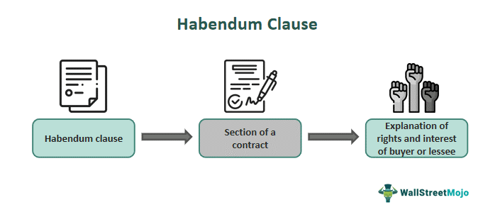

Real estate contracts incorporate numerous clauses that define the rights and obligations of the parties involved. Among these, the habendum clause stands out due to its critical role in the transfer of property rights. This clause specifically delineates the extent to which ownership and interests are conveyed in a property transaction, thus serving as a cornerstone of clarity and precision in real estate agreements. An in-depth understanding of the habendum clause is indispensable for real estate professionals, as it affects transaction outcomes and any associated legal implications.

Real estate transactions are marked by their complexity, often involving various conditions and stipulations within contracts that necessitate a comprehensive legal understanding. These contracts are foundational in ensuring that all parties are aware of their rights, responsibilities, and any conditions attached to the transfer of a property. Within this framework, the habendum clause gains prominence by articulating clearly what rights are being transferred or retained, be it in terms of ownership duration, usage restrictions, or conditional reversion to the original owner under specific circumstances.

In parallel, the world of algorithmic trading, although primarily governed by software agreements rather than physical property laws, bears certain similarities to real estate transactions. Both domains involve detailed contracts that define the rights and responsibilities of the involved parties. In algorithmic trading, contracts often address proprietary rights over algorithms, data usage, and the execution of trades, drawing a comparable focus on clarity and precision that is evident in real estate agreements.

This article examines the complexities and importance of the habendum clause in real estate contracts, shedding light on its variations, potential legal ramifications, and the outcomes of its negotiation. Furthermore, a brief exploration of algorithmic trading contracts provides insight into how contractual clarity in both fields is critical to ensuring fair and secure transactions.

## Table of Contents

## Understanding the Habendum Clause

The habendum clause, commonly known as the 'to have and to hold clause,' is integral to property transactions, delineating the scope of ownership and the interest granted. It forms a vital component of both deeds and leases, offering a clear articulation of not only the ownership being conveyed but also any accompanying limitations or conditions. Typically, this clause follows the grant clause in a property contract, which initially identifies the interest being transferred. 

In real estate contracts, the habendum clause serves to specify whether the ownership interest transferred is fee simple or subject to other predefined conditions. Fee simple ownership represents the highest degree of ownership recognized by law, entailing complete ownership rights free of any subsequent conditions. It signifies an absolute form of property ownership in perpetuity, where the owner has the liberty to use, lease, or sell the property without any restrictions, subject only to legal regulations and local zoning laws.

Conversely, a habendum clause may also convey a lesser interest if certain limitations or conditions are imposed. These could include life estates, where ownership lasts for the duration of an individual's life, or conditional estates, where ownership is contingent on specific conditions being met. In such instances, the habendum clause not only outlines the scope of ownership but also delineates the contingencies or terms that might affect the transference or retention of property rights.

The careful structuring of a habendum clause is essential as it provides clarity on what is being transferred, ensuring that all parties involved in the transaction are aware of what rights and obligations they are assuming. This clarity helps avert potential misunderstandings or disputes that could arise from complex property deals, thus making the habendum clause a critical element in real estate contracts.

## Importance in Real Estate Contracts

The habendum clause holds substantial importance in real estate contracts, fundamentally influencing the nature of property rights transferred during a transaction. This clause delineates the scope of ownership, which can have a direct impact on both the property's value and its usability.

For buyers, the habendum clause is critical as it clarifies the complete breadth of their property rights. This includes understanding any potential limitations or restrictions that accompany the property. Awareness of such stipulations is essential, as they could affect future development plans or usage intentions. An unclear or overly restrictive habendum clause might constrain the buyer's ability to utilize the property as desired, thereby diminishing its practical utility or potential resale value.

For sellers, the habendum clause offers an avenue to impose certain conditions on property use even after the transaction is complete. This can include creating easements, which allow for specific uses of the property by other parties, or implementing restrictions designed to maintain certain characteristics or limitations on the land. For instance, a seller might include a restriction preventing commercial development to preserve the residential nature of a neighborhood. Such stipulations not only affect the immediate transaction but can also influence the property's long-term evolution and valuation.

Both buyers and sellers need to engage with the habendum clause seriously. For buyers, negotiating terms that secure their intended use of the property without undesired restrictions is vital. Conversely, sellers can leverage this clause to ensure their long-term vision for the land is respected. The careful crafting and negotiation of the habendum clause can thus prevent future legal disputes and ensure both parties achieve their transactional goals.

## Examples and Variations

In straightforward real estate transactions, the habendum clause often articulates that a property is transferred in "fee simple," which implies the buyer receives unrestricted and absolute ownership of the property. This straightforward declaration is typical when there are no conditions or limitations attached to the ownership, thereby providing the new owner with full control and rights over the property.

However, variations exist in more complex transactions, such as timeshare agreements. In these cases, the habendum clause may specify shared ownership or define specific use periods for each owner. For example, a timeshare contract might state that an owner has the right to use the property for two weeks each year, ensuring all owners have equitable access to the property based on the agreement timeline.

In industries like oil and gas, the habendum clause is often more complex, incorporating both primary and secondary terms. These clauses outline conditions for exploring and extracting resources. The primary term could specify the initial exploration period, while the secondary term might define ongoing production requirements. A typical clause might state that the lease will remain in effect "as long as oil or gas is produced in paying quantities," establishing conditions under which the rights are maintained.

Real-life examples illustrate how habendum clauses are tailored to specific needs. In residential developments, a developer might include a clause in a deed requiring maintenance of a certain architectural style, thus influencing property aesthetics even after transfer. Similarly, agricultural land sales may include stipulations in the habendum clause about preserving the land's use for farming purposes, aligning with zoning laws or conservation efforts.

These examples highlight the habendum clause's adaptability, ensuring property transfers are customized to align with legal, practical, and business considerations.

## Potential Legal Implications

The language within a habendum clause can be a source of legal disputes if it is not drafted with precision, as its interpretation can vary widely. The nature of real estate contracts often involves complex legal terminologies and clauses that define the extent and limitations of property rights. Therefore, clear and unambiguous drafting of the habendum clause is essential to prevent potential conflicts over property ownership and usage rights.

A poorly worded habendum clause can lead to disagreements between the involved parties. For instance, if a clause does not explicitly state whether the ownership is "fee simple" or subject to conditions like easements or restrictions, it could lead to lengthy legal battles. The ambiguity in such clauses can result in misinterpretations regarding the rights granted and any limitations imposed on those rights. 

For instance, in a common scenario, a property might be bought with the understanding that it can be used for commercial purposes, but a vague habendum clause might later be interpreted as restricting its use to residential purposes only. This can severely impact the value and usability of the property for the buyer, potentially resulting in litigation to resolve the misunderstanding.

Legal professionals, including real estate attorneys, play a pivotal role in drafting habendum clauses that accurately reflect the intentions of both the buyer and the seller. Their expertise is crucial in ensuring that the language used is comprehensive and takes into consideration possible future scenarios that might affect the parties’ rights and obligations. They may also conduct due diligence to identify existing legal encumbrances, ensuring that these are clearly addressed within the clause.

Moreover, legal professionals can help tailor the habendum clause to the specific transaction context, considering factors such as the duration of ownership rights, potential renewals, and any conditions under which the property might revert to the original owner or another third party. Comprehensive drafting supported by legal expertise can greatly minimize the risk of disputes, making the transaction smoother and more secure for all parties involved.

Therefore, a well-formulated habendum clause is integral to a legally sound real estate contract. It safeguards the interests of both parties by establishing clear, enforceable property rights and obligations, thus averting costly legal disputes.

## Negotiating the Habendum Clause

Negotiating the habendum clause is a critical component of real estate transactions, as it directly influences the outcome by outlining the duration and conditions of ownership rights. Both parties involved in the transaction—the buyer and the seller—must carefully evaluate their long-term objectives for the property to ensure the clause aligns with their interests. This requires a thorough understanding of how the clause can be tailored to include specific stipulations that might serve their individual needs.

One practical aspect of negotiating the habendum clause involves the inclusion of rights of renewal. This allows the buyer to extend their ownership or leasehold period under specified terms, providing a sense of security and long-term planning capability. For example, a lease agreement might state that the lessee has the right to renew the lease every five years, subject to a certain percentage increase in rent or other conditions agreed upon by both parties.

Another vital consideration in negotiating this clause is the imposition of restrictions on usage. Sellers might want to ensure the property is used for specific purposes that align with the long-term nature of their interests or the community standards. For instance, a seller might include a usage restriction that prevents the property from being developed into a commercial site in a primarily residential area, thereby preserving the character of the neighborhood.

Moreover, the habendum clause can include conditions under which the property might revert to the original owner. Such reversion conditions are often tied to specific events or failures, such as the non-fulfillment of agreed-upon terms. This is particularly relevant in cases where the seller wishes to maintain a degree of control over the future usage of the land. For example, a clause could be structured to state that if the new owner fails to commence development within a set period, ownership will automatically revert to the seller.

Negotiating these elements of the habendum clause requires careful drafting and foresight to prevent disputes and ensure that both parties' intentions are clearly articulated and legally sound. Therefore, engaging legal professionals with expertise in real estate can be invaluable in navigating the complexities of this clause and securing a satisfactory agreement for both the buyer and the seller.

## Algorithmic Trading Contracts: A Contrast

Algorithmic trading contracts differ from traditional real estate contracts as they are primarily governed by software agreements and technological frameworks, rather than property laws. These contracts are intricately designed to define the roles, rights, and responsibilities of parties involved in the creation, deployment, and management of algorithmic systems. 

A central focus of [algorithmic trading](/wiki/algorithmic-trading) contracts is the ownership and use rights of proprietary algorithms. Similar to real estate contracts, where the habendum clause delineates the extent of rights transferred, algorithmic trading contracts specify who owns the algorithms and how they can be used. These agreements must clearly articulate licensing terms, usage restrictions, and the allocation of intellectual property rights to prevent any potential disputes. For instance, an algorithm's owner might grant a brokerage firm the right to use the algorithm exclusively for a specified time, akin to a lease agreement in real estate.

Data usage is another critical aspect entrenched in these contracts. The contracts must specify data ownership, access rights, and permissible use cases, much like determining easements or usufruct rights in property contracts. Establishing clear terms around data is vital, given its role in generating effective trading signals and strategies.

From a strategic negotiation perspective, both real estate and algorithmic trading contracts share the necessity of precise, well-negotiated clauses to mitigate risks and align with the stakeholders' objectives. For example, an algorithmic trading firm may stipulate conditions for renewing or terminating agreements based on performance metrics, paralleling conditions often found in habendum clauses that dictate the duration of property rights or revert conditions.

Understanding these parallel aspects in both fields can enhance strategies in drafting contracts, ensuring that all parties are protected and their rights and obligations are well-defined. The careful wording in algorithmic trading contracts is as crucial as in real estate transactions, seeking to prevent conflicts and secure the parties' mutual interests.

## Conclusion

The habendum clause is essential in defining the parameters of ownership and usage rights within real estate contracts. Its role in delineating these rights ensures parties involved in property transactions have a mutual understanding of what is being transferred. A meticulously drafted habendum clause can vastly reduce the risk of future legal disputes, providing clarity and satisfaction to both buyers and sellers. This safeguarding element permits parties to stipulate any necessary conditions or limitations on property usage, thus tailoring the transaction to fit their strategic objectives.

As financial and legal contexts evolve, a strategic alignment between real estate and trading contract practices is becoming increasingly important. By borrowing elements such as clear delineation of rights and adaptive terms, both domains can benefit from enhanced transparency and security in contracts. The convergence of these practices supports not only robust legal frameworks but also promotes innovations that accommodate the changing landscape of asset management and contractual obligations.

## References & Further Reading

[1]: Cornelisse, P. A., & Hebbink, M. P. (1994). "The Habendum Clause in Land Lease Contracts and Its Role in the Transfer of Property Rights." *Journal of Real Estate Research*, 9(2), 197-211.

[2]: Cheung, L., & Lee, K. C. (2003). ["Legal Aspects of the Habendum Clause in Real Estate Contracts: Interpretation and Implications."](https://aisel.aisnet.org/cgi/viewcontent.cgi?article=1029&context=ecis2003)00023-3) *Journal of Property Investment & Finance*, 21(3), 303-317.

[3]: Texas A&M Real Estate Center. ["Legal Concepts of the Habendum Clause."](https://trerc.tamu.edu/) Accessed October 2023.

[4]: Kuruvilla, Martha, & Howard, Jason P. (2012). *Real Estate Contract Law*. New York: Wolters Kluwer Law & Business.

[5]: Jones, G. R., & Le, T. V. (2019). "Algorithmic Trading and the Evolution of Market Structure in Modern Finance." *Journal of Financial Markets*, 45, 123-148.

[6]: Narang, R. (2009). ["Inside the Black Box: The Simple Truth About Quantitative Trading."](https://onlinelibrary.wiley.com/doi/book/10.1002/9781118267738) John Wiley & Sons. 

[7]: ["Essential Elements of a Real Estate Contract"](https://realestatelicensewizard.com/valid-real-estate-contract/) by National Association of Realtors. Accessed October 2023.