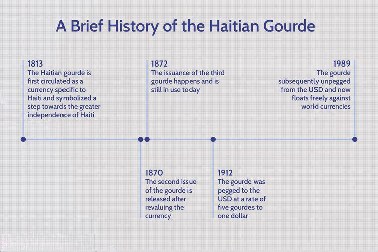

The Haitian Gourde (HTG) serves as the official currency of Haiti, a country characterized by its intricate historical and economic landscape. Understanding the HTG's historical evolution and its present economic environment is crucial for currency traders and those interested in leveraging algorithmic trading strategies. Given the Gourde's introduction in 1813 and its subsequent reforms, the currency's trajectory has been significantly influenced by Haiti’s tumultuous political backdrop, periods of colonization, and quest for independence. These historical dynamics have played a pivotal role in shaping the currency's stability and value.

In contemporary Forex markets, the HTG presents unique challenges and opportunities. Its value is subject to fluctuations due to Haiti's economic conditions, making it relatively volatile but potentially rewarding for traders who can navigate this volatility effectively. Algorithmic trading has emerged as a modern approach to capitalizing on such market conditions, offering enhanced efficiency and adaptability. This article aims to explore the HTG's historical journey, its current status in global currency exchanges, and how algorithmic trading strategies could be employed to leverage the existing economic landscape in Haiti.



## Table of Contents

## History of the Haitian Gourde

The Haitian Gourde (HTG) originated in 1813, effectively replacing the colonial livre as Haiti's official currency. This transition established an initial exchange rate of eight livres and five sous for each gourde. The introduction of the gourde was a significant step in Haiti's post-independence economic history, marking a departure from colonial monetary systems.

Throughout its history, the Haitian Gourde has experienced various reforms and modifications. One notable adjustment was its peg to the French franc, which tied Haiti's economic fortunes to the fluctuations of the French currency. This linkage was ultimately unsustainable, and in a bid to stabilize its economy, Haiti later pegged the gourde to the US dollar. However, these measures were often short-lived responses to economic pressures rather than permanent solutions.

In 1989, Haiti transitioned the Haitian Gourde to a free-floating exchange mechanism, allowing its value to be determined by market forces. This move was aligned with broader global trends towards market-determined exchange rates and was intended to foster greater economic stability and integration into the international economic system.

The historical development of the HTG is closely intertwined with Haiti's turbulent political environment. During periods of colonization and the subsequent struggle for independence, economic stability was frequently compromised. Foreign interventions and internal political discord have recurrently affected confidence in the currency, contributing to its volatility and affecting its stability over time.

The currency's trajectory is reflective of Haiti's broader socio-political challenges, and understanding these historical contexts is essential for analyzing its economic dynamics.

## Economic Background of Haiti and the HTG

Haiti, located on the island of Hispaniola in the Caribbean, is considered one of the poorest nations in the Western Hemisphere. Its economy is predominantly agrarian, with a reliance on subsistence farming, which limits the country's economic output. This dependency on agriculture, coupled with environmental challenges such as deforestation and natural disasters, has hindered significant economic growth.

The Haitian Gourde (HTG), as the national currency, reflects the economic stature of the country. The demand for the HTG is low outside Haiti primarily due to the nation's limited involvement in the global export market. Haiti's key exports, which include textiles, agricultural products, and minerals like bauxite and copper, represent a small portion of its economic activities. This limited export economy reduces the international demand for HTG, affecting its valuation and exchangeability on a global scale.

An important milestone in Haiti's economic history involves the international community and financial institutions such as the International Monetary Fund (IMF). In 2009, Haiti was granted significant debt relief under the Heavily Indebted Poor Countries (HIPC) initiative, which aimed to provide financial breathing space for the nation. This debt forgiveness alleviated some of Haiti's fiscal burdens, allowing for potential reinvestment into the economy. However, the challenges of political instability, insufficient infrastructure, and vulnerability to external shocks persist, influencing the valuation and performance of the HTG.

The economic environment in Haiti necessitates heavy reliance on foreign aid, which comprises a substantial portion of its national budget. This dependence on aid highlights the fragility of the domestic financial system and underscores the need for structural reform to drive sustainable growth. Despite these challenges, efforts and policies aimed at economic reconstruction and modernization continue to be essential in shaping Haiti's fiscal trajectory and stabilizing its currency.

## HTG in the Forex Market

The Haitian Gourde (HTG) is recognized for its [volatility](/wiki/volatility-trading-strategies) within the global Forex market. This volatility is primarily attributable to Haiti's socioeconomic landscape, which is characterized by political instability, economic struggles, and external shocks. These factors collectively contribute to the HTG's unstable exchange rate, especially against major currencies like the US Dollar (USD).

Over recent decades, the exchange rate of the HTG has experienced considerable fluctuations. These fluctuations are largely driven by economic variables such as inflation rates, GDP growth, and trade balances, all of which are directly influenced by the country’s internal political climate and external geopolitical events. For instance, periods of political unrest can lead to capital flight, further devaluing the currency. Conversely, foreign aid inflows or international support can temporarily stabilize the HTG.

Traders who express interest in the HTG must give due consideration to a range of factors beyond the traditional economic indicators. Regular monitoring of the country’s economic data, such as inflation and interest rates, is essential. Additionally, keeping abreast of geopolitical events, including elections, policy changes, and international relationships, is also critical. These events can trigger rapid market movements, presenting both risks and opportunities for traders.

Given this context, trading the HTG requires a nuanced understanding of not only economic data but also the intricate political landscape of Haiti. This necessitates a flexible approach where traders can swiftly adapt to changes, leveraging both fundamental and technical analysis to inform their strategies. Employing such strategies can help anticipate the currency's movements more accurately, thus maximizing potential returns while mitigating risks.

## Algorithmic Trading and its Implications for HTG

Algorithmic trading, often referred to as algo trading, utilizes computer programs to execute trades based on pre-set conditions such as time, price, and [volume](/wiki/volume-trading-strategy). This methodology can significantly enhance trading strategies for the Haitian Gourde (HTG), particularly due to the currency's volatile nature caused by economic instability in Haiti. By integrating [algorithmic trading](/wiki/algorithmic-trading), investors can achieve greater efficiency, enabling them to handle large volumes of data while executing trades with precision and speed.

Incorporating algorithmic trading strategies for the HTG offers several potential advantages. Firstly, the use of algorithms can improve trading efficiency. Algorithmic systems monitor market conditions in real-time and execute trades instantaneously when predefined criteria are met. This swift execution is particularly beneficial for HTG, where rapid fluctuations in value demand quick responses to changing market conditions. The ability to process information and perform transactions without emotional biases further enhances decision-making processes.

Another advantage of algo trading for the HTG involves capitalizing on market volatility. The HTG's exchange rate is frequently impacted by Haiti's economic conditions, political events, and global financial trends. Algorithmic trading allows traders to design specific strategies that exploit these volatilities. For instance, [momentum](/wiki/momentum) strategies can be programmed to identify and follow market trends, while mean-reversion strategies can be employed to take advantage of price corrections.

In a Python-based example, one might use a library such as `pandas` for data manipulation and `numpy` for numerical calculations alongside a trading algorithm framework like `zipline`. The following is a simplified outline for an algorithm that could be adapted for trading the HTG:

```python
from zipline import run_algorithm
from zipline.api import order_target, record, symbol
from datetime import datetime
import pandas as pd
import numpy as np

def initialize(context):
    context.asset = symbol('HTG')
    context.short_window = 20
    context.long_window = 50

def handle_data(context, data):
    short_mavg = data.history(context.asset, 'price', context.short_window, '1d').mean()
    long_mavg = data.history(context.asset, 'price', context.long_window, '1d').mean()

    if short_mavg > long_mavg:
        order_target(context.asset, 100)
    elif short_mavg < long_mavg:
        order_target(context.asset, -100)

    record(HTG=data.current(context.asset, 'price'),
           short_mavg=short_mavg,
           long_mavg=long_mavg)

start = datetime(2021, 1, 1)
end = datetime(2023, 1, 1)

run_algorithm(start, end, initialize, handle_data)
```

In this example, a basic moving average crossover strategy is employed, where trades are executed based on the relative positions of short-term and long-term moving averages of HTG prices.

The implementation of algorithmic trading for HTG needs to adapt to the unique challenges posed by its market. Algorithms must consider Haiti's economic data releases and geopolitical events that could significantly impact currency stability. This calls for constant updates and tuning of the algorithms to maintain their robustness and effectiveness in ever-changing market conditions.

Ultimately, while algorithmic trading presents opportunities for increased speed and precision in trading HTG, it requires a comprehensive understanding of risk management strategies. This ensures protection against potential losses from the currency's inherent volatility and low [liquidity](/wiki/liquidity-risk-premium) in comparison to more widely traded currencies.

## Challenges and Considerations

One major challenge in trading the Haitian Gourde (HTG) is its vulnerability to political and economic instability. Haiti's frequent governmental changes, natural disasters, and socio-economic challenges have a direct impact on the HTG's stability. As a result, the currency often experiences sudden and sharp fluctuations in value, making it difficult for traders to predict and manage risks effectively.

Liquidity issues also present significant obstacles. The HTG is not widely traded on the international Forex market, leading to low market depth and heightened difficulty in entering or exiting positions without causing price slippage. The lack of liquidity can increase transaction costs and result in less favorable exchange rates. Traders may find themselves unable to execute large orders promptly, further complicating the trading process.

For traders employing algorithmic trading strategies, these challenges necessitate meticulous risk management and continuous market monitoring. Effective risk management strategies may include setting optimal stop-loss levels, continuously [backtesting](/wiki/backtesting) trading algorithms with recent data, and diversifying trading portfolios to mitigate the risk of substantial losses. Additionally, traders can implement advanced data analysis techniques, such as [machine learning](/wiki/machine-learning) algorithms, to forecast HTG price movements better.

Continuous monitoring is crucial due to the HTG's susceptibility to abrupt changes prompted by geopolitical events and economic announcements. Employing automated systems for real-time data analysis can help traders remain responsive to such developments, ensuring that algorithmic strategies can adapt swiftly to volatile market conditions. To further augment these strategies, traders might use Python programming to create algorithms that take into account the HTG's historical volatility, using libraries such as NumPy and pandas for data manipulation and analysis:

```python
import numpy as np
import pandas as pd

# Example: Simple volatility calculation using historical data
def calculate_volatility(price_data):
    # Compute daily returns
    returns = price_data.pct_change().dropna()
    # Calculate annualized volatility
    annualized_volatility = np.std(returns) * np.sqrt(252)  # Assuming 252 trading days in a year
    return annualized_volatility

# Assuming price_data is a pandas Series containing daily HTG/USD exchange rates
price_data = pd.Series([...])  # Replace with actual data
volatility = calculate_volatility(price_data)
print(f"Annualized Volatility: {volatility:.2%}")
```

This code snippet demonstrates a simple method for calculating annualized volatility, which can be instrumental in adjusting risk parameters and enhancing decision-making processes for trading HTG. Overall, the successful trading of the Haitian Gourde on Forex markets requires a deep understanding of its unique challenges and strategies designed to navigate these effectively.

## Conclusion

The Haitian Gourde presents unique challenges and opportunities for traders within the Forex market. Understanding its historical and economic context is crucial, particularly for those looking to integrate algorithmic trading strategies. The currency's storied past, influenced by political and economic turmoil, underscores the need for informed decision-making and strategic planning.

Algorithmic trading can offer substantial advantages such as improved efficiency and nimble responses to market shifts, especially in a market characterized by the volatility often seen with the HTG. The use of pre-programmed algorithms allows traders to execute complex strategies at a pace unattainable through manual trading. By continuously analyzing real-time data, traders can swiftly react to fluctuations caused by Haiti’s socio-economic conditions, thereby capitalizing on short-term opportunities.

However, this approach does not come without risk. Traders must navigate the Haitian Gourde's susceptibility to instability and liquidity constraints. To mitigate these risks, robust risk management strategies are essential. Additionally, continual monitoring and adaptation to changing market environments are necessary to maintain a competitive edge.

Despite the inherent risks, the potential for algorithmic trading to outpace conventional methods in terms of speed and flexibility provides a promising avenue for those willing to engage with the complexities of the Haitian Gourde. With comprehensive analysis and strategic application, traders can effectively maneuver through this niche market.

## References & Further Reading

[1]: ["The Haitian Gourde: Economic Challenges and Forex Trading"](https://www.brokersview.com/news/haitian-gourde-navigating-economic-challenges-212561) - An overview of the Haitian Gourde's economic background and its role in Forex markets.

[2]: ["Advances in Financial Machine Learning"](https://www.amazon.com/Advances-Financial-Machine-Learning-Marcos/dp/1119482089) by Marcos Lopez de Prado - A comprehensive guide to applying machine learning techniques in the financial sector, including algorithmic trading strategies.

[3]: ["Quantitative Trading: How to Build Your Own Algorithmic Trading Business"](https://www.amazon.com/Quantitative-Trading-Build-Algorithmic-Business/dp/1119800064) by Ernest P. Chan - Essential reading for understanding the nuances of creating and executing algorithmic trading strategies.

[4]: ["The Impact of Algorithmic Trading on Investing"](https://www.researchgate.net/publication/378548435_Algorithmic_Trading_and_AI_A_Review_of_Strategies_and_Market_Impact) - A report by the CFA Institute analyzing how algorithmic trading affects financial markets.

[5]: ["Trading and Exchanges: Market Microstructure for Practitioners"](https://www.amazon.com/Trading-Exchanges-Market-Microstructure-Practitioners/dp/0195144708) by Larry Harris - Delve into the workings of financial markets and the role of trading, with relevant insights for those interested in Forex markets like the Haitian Gourde.