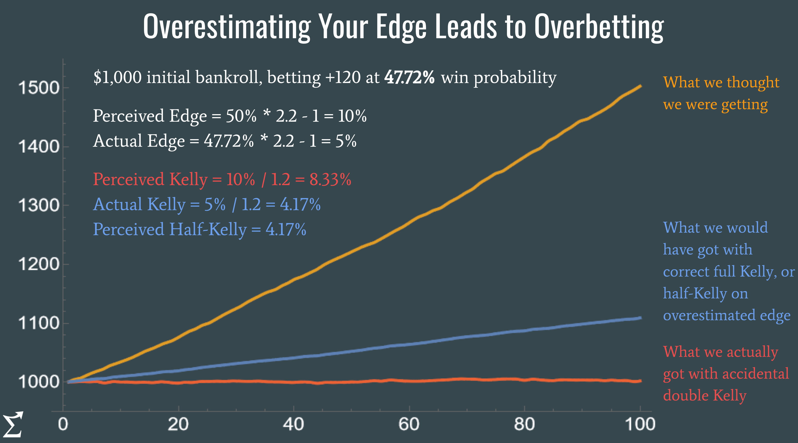

## Table of Contents

## What is Half-Kelly betting?

Half-Kelly betting is a way to bet that is less risky than the full Kelly Criterion. The Kelly Criterion is a formula that tells you how much of your money to bet to grow it the fastest while keeping the risk low. But it can still be too risky for some people. So, with Half-Kelly betting, you bet half of what the Kelly Criterion says. This makes your bets smaller and safer.

By using Half-Kelly betting, you might not grow your money as fast as with the full Kelly Criterion. But it also means you won't lose as much if you have a bad streak. It's a good choice for people who want to be careful with their money but still want to use the Kelly Criterion's ideas. It's like finding a middle ground between being safe and trying to grow your money.

## How does Half-Kelly betting differ from full Kelly betting?

Half-Kelly betting and full Kelly betting are two ways to decide how much money to bet based on the Kelly Criterion. The Kelly Criterion is a formula that tells you the best amount of your money to bet to make it grow the fastest while keeping risk low. With full Kelly betting, you bet the whole amount that the Kelly Criterion suggests. This can be risky because if you lose, you lose a lot. But if you win, you can grow your money quickly.

Half-Kelly betting is safer. Instead of betting the full amount suggested by the Kelly Criterion, you only bet half of it. This means your bets are smaller, so you won't lose as much money if you have a bad streak. The downside is that your money won't grow as fast as it would with full Kelly betting. Half-Kelly betting is a good choice for people who want to be careful with their money but still want to use the ideas from the Kelly Criterion. It's like finding a middle ground between being safe and trying to grow your money.

## What are the basic principles of the Kelly Criterion?

The Kelly Criterion is a way to figure out how much of your money to bet to make it grow the fastest while keeping the risk low. It uses a special formula that looks at how likely you are to win, how much you can win, and how much you can lose. The formula helps you find the best amount to bet so that over time, you can make more money without losing too much.

When you use the Kelly Criterion, you need to know the odds of winning and losing, and what you can win or lose with each bet. If you bet the amount the Kelly Criterion says, you can grow your money faster than if you bet too much or too little. But it can be risky because if you lose, you lose a lot. That's why some people choose to bet less than what the Kelly Criterion suggests, like using Half-Kelly betting, to be safer.

## Why might someone choose Half-Kelly betting over full Kelly betting?

Someone might choose Half-Kelly betting over full Kelly betting because it is less risky. With full Kelly betting, you bet the whole amount that the Kelly Criterion says. This can be scary because if you lose, you lose a lot of money. But with Half-Kelly betting, you only bet half of what the Kelly Criterion says. This means if you lose, you won't lose as much money. It's like being careful and not putting all your eggs in one basket.

Another reason someone might choose Half-Kelly betting is that it feels safer and more comfortable. Even though you won't grow your money as fast as with full Kelly betting, you can still use the Kelly Criterion's ideas without taking such big risks. It's a good middle ground for people who want to grow their money but also want to keep it safe. Half-Kelly betting helps you balance the need to make money with the need to not lose too much.

## What are the potential benefits of using Half-Kelly betting?

Half-Kelly betting can help you keep your money safer than full Kelly betting. When you use Half-Kelly betting, you only bet half of what the Kelly Criterion says. This means if you lose a bet, you won't lose as much money. It's like being careful with your money and not risking too much at once. This can be really helpful if you're worried about losing a lot of money or if you're just starting to bet and want to take it slow.

Another benefit of Half-Kelly betting is that it can make you feel more comfortable. Full Kelly betting can be scary because it tells you to bet a lot of money, and losing can hurt a lot. But with Half-Kelly betting, you're betting less, so it feels less risky. Even though you might not make money as fast, you can still use the ideas from the Kelly Criterion without feeling like you're taking big chances. It's a good way to balance growing your money and keeping it safe.

## What are the risks associated with Half-Kelly betting?

Half-Kelly betting is safer than full Kelly betting, but it still has some risks. One risk is that you might not grow your money as fast as you could with full Kelly betting. When you bet less, your wins are smaller, so it takes longer to see big gains. If you're trying to make money quickly, Half-Kelly betting might not be the best choice because it slows down how fast your money can grow.

Another risk is that even though you're betting less, you can still lose money. Betting is always risky, and even with Half-Kelly betting, you can have a bad streak and lose some of your money. It's less risky than full Kelly betting, but it's not completely safe. You need to be ready for the chance that you might lose some of your bets, even if you're being careful.

## How do you calculate the Half-Kelly bet size?

To calculate the Half-Kelly bet size, you first need to figure out the full Kelly bet size. The Kelly Criterion formula for the full bet size is: bet size = (bp - q) / b. Here, "b" is the net odds you get if you win, "p" is the chance you'll win, and "q" is the chance you'll lose, which is just 1 minus "p". So, if you have a bet where you can win $2 for every $1 you bet, "b" would be 2. If you think you have a 60% chance of winning, "p" is 0.60 and "q" is 0.40. Plugging these numbers into the formula, you get: bet size = (2 * 0.60 - 0.40) / 2 = (1.20 - 0.40) / 2 = 0.80 / 2 = 0.40. This means the full Kelly bet size is 40% of your money.

Once you have the full Kelly bet size, you just need to cut it in half to get the Half-Kelly bet size. In the example above, the full Kelly bet size was 40%, so the Half-Kelly bet size would be 20%. This means you would bet 20% of your money instead of 40%. By betting half of what the Kelly Criterion suggests, you make your bets smaller and safer. It's a good way to balance growing your money with keeping it safe.

## Can you provide an example of a Half-Kelly bet calculation?

Let's say you're betting on a game where you can win $2 for every $1 you bet. You think you have a 60% chance of winning. To find out how much to bet using the Kelly Criterion, you use the formula: bet size = (bp - q) / b. Here, "b" is the net odds, which is 2 because you win $2 for every $1 bet. "p" is the chance of winning, which is 0.60, and "q" is the chance of losing, which is 1 minus "p", so it's 0.40. Plugging these numbers into the formula, you get: bet size = (2 * 0.60 - 0.40) / 2 = (1.20 - 0.40) / 2 = 0.80 / 2 = 0.40. This means the full Kelly bet size is 40% of your money.

To find the Half-Kelly bet size, you just take half of the full Kelly bet size. Since the full Kelly bet size is 40%, the Half-Kelly bet size is 20%. So, if you have $100 to bet, you would bet $20 instead of $40. This makes your bet smaller and safer, helping you balance the need to grow your money with the need to keep it safe.

## How does Half-Kelly betting affect long-term growth of a betting bankroll?

Half-Kelly betting makes your betting bankroll grow slower than full Kelly betting. When you bet using the Kelly Criterion, you bet the amount that helps your money grow the fastest. But with Half-Kelly betting, you only bet half of that amount. This means your wins are smaller, so it takes longer for your bankroll to get bigger. If you're okay with waiting a bit longer to see your money grow, Half-Kelly betting can be a good choice.

Even though Half-Kelly betting slows down how fast your bankroll grows, it also makes your bets safer. When you bet less, you don't risk as much money. This means if you lose a bet, you won't lose as much of your bankroll. Over the long run, this can help keep your money safer and make you feel more comfortable while you're betting. So, while your bankroll might not grow as quickly, it can still grow steadily without big losses.

## What types of betting scenarios are most suitable for Half-Kelly betting?

Half-Kelly betting is great for people who want to bet but don't want to take big risks. It's good for situations where you're not sure how likely you are to win. If you're betting on something like a sports game and you think your team has a good chance, but you're not 100% sure, Half-Kelly betting can help. It lets you bet less money, so if you lose, you won't lose as much. This makes it a safe choice for people who want to be careful with their money.

It's also a good choice for people who are new to betting. When you're just starting out, you might not want to bet a lot of money right away. Half-Kelly betting helps you learn how to bet without risking too much. It's like practicing with smaller bets while still using the smart ideas from the Kelly Criterion. This way, you can grow your money slowly and safely as you get better at betting.

## How does Half-Kelly betting perform in comparison to other betting strategies?

Half-Kelly betting is a safer way to bet than full Kelly betting. When you use Half-Kelly betting, you bet less money than what the Kelly Criterion says. This means if you lose, you won't lose as much as you would with full Kelly betting. But it also means your money won't grow as fast. Compared to other betting strategies like the Martingale system, where you double your bet after a loss, Half-Kelly betting is much less risky. The Martingale system can lead to big losses if you have a long losing streak, but Half-Kelly betting helps you keep your money safer by betting less.

Half-Kelly betting can be a good choice if you want to grow your money slowly and safely. It's better than strategies like flat betting, where you bet the same amount every time, because it still uses the smart ideas from the Kelly Criterion. But it's not as fast as full Kelly betting. If you're okay with waiting a bit longer to see your money grow, Half-Kelly betting can help you balance the need to make money with the need to not lose too much. It's a good middle ground for people who want to be careful with their money but still want to use smart betting ideas.

## Are there any advanced techniques or adjustments one can apply to Half-Kelly betting?

One advanced technique you can use with Half-Kelly betting is to change how much you bet based on how sure you are about your bets. If you feel very sure about a bet, you might want to bet a bit more than half of what the Kelly Criterion says. But if you're not so sure, you could bet even less than half. This way, you can still use the Kelly Criterion's ideas but make your bets fit how you feel about each bet.

Another thing you can do is to keep track of how your bets are doing over time. If you notice that you're winning a lot, you might want to slowly bet a bit more than half of the Kelly amount. But if you're losing a lot, you could bet even less than half. This helps you adjust your bets based on how well you're doing, making your betting safer and smarter.

## What is the Kelly Criterion and how can it be understood?

The Kelly Criterion, established by John L. Kelly Jr. in 1956, serves as a foundational concept in optimizing bet sizes to maximize the geometric growth rate of capital. This criterion integrates key variables such as the probability of winning (P), the probability of losing (Q), and the reward-to-risk ratio (R). Mathematically, the optimal fraction of capital to wager can be expressed as:

$$
f^* = \frac{P \times (R + 1) - 1}{R}
$$

Here, $f^*$ represents the optimal fraction of capital to be bet, $P$ is the probability of a favorable outcome, and $R$ is the ratio of net winnings to the amount bet. The basic premise of the Kelly Criterion is to capitalize on positive expected value opportunities, balancing the trade-off between wealth growth and risk of ruin.

Despite the theoretical allure of the Kelly Criterion—its promise of optimal growth—its practical application is hindered by several assumptions. Accurate predictions of probabilities and outcomes are necessary, yet these inputs are inherently uncertain and challenging to ascertain in financial markets, where dynamics are often unpredictable. Moreover, the Kelly Criterion presumes that probabilities and payoffs are constant throughout, which rarely aligns with the complex and fluctuating nature of market environments. Therefore, while the Kelly Criterion provides a conceptual framework for determining bet sizes, its application requires cautious consideration and adjustment for real-world market imperfections.

## What are the challenges with Full Kelly in trading?

Applying full Kelly in trading can result in both high [volatility](/wiki/volatility-trading-strategies) and significant drawdowns, challenges that underscore the inherent risks of this strategy. The Kelly Criterion is designed to maximize the geometric growth rate of capital by determining what fraction of one’s capital to wager on each trade. However, this aggressive approach can lead to substantial fluctuations in the value of a portfolio, a consequence of the strategy's inherent sensitivity to probability miscalculations and market conditions.

A principal challenge in utilizing full Kelly is the assumption of accurate probability estimation. The optimal bet size $f^*$ according to the Kelly Criterion can be calculated as:

$$

f^* = \frac{P \cdot R - Q}{R} 
$$

where $P$ is the probability of a successful outcome, $Q = 1 - P$ is the probability of an unsuccessful outcome, and $R$ is the reward-to-risk ratio. This formula presupposes precise knowledge of $P$ and $R$, a challenging proposition given the volatility and unpredictability inherent in financial markets. Misestimations can lead to allocating too much capital to trades that do not perform as expected, thereby increasing the potential for severe drawdowns.

Another assumption is the independence of win and loss events. In dynamic markets, however, asset prices, economic indicators, and trader actions are often interdependent, violating this assumption. Market events can drastically alter the conditions under which trades were initially evaluated, leading to correlations that can skew the effectiveness of a full Kelly approach.

Furthermore, psychological factors play a crucial role. Despite its theoretical benefits, many traders find the volatility and risk of significant capital loss unacceptable, as emotional stress can lead to imprudent decision-making or premature [exit](/wiki/exit-strategy) from profitable strategies. The exposure to large swings in portfolio value often deters traders from sticking to the Kelly Criterion. As a result, many prefer more conservative approaches that temper potential gains with decreased exposure to risk.

Effective trading strategies must thus balance mathematical optimization with an understanding of market unpredictability and human psychology, explaining why traders frequently seek fractional strategies like half-Kelly betting. By acknowledging the limitations of full Kelly, traders can adapt their approaches to better manage the complexities of real-world trading environments.

## How can Half-Kelly be implemented in trading algorithms?

Implementing Half-Kelly betting in trading algorithms requires careful adjustment of bet sizes or trade volumes to match the calculated half-Kelly fraction. This approach serves as a middle ground between the full Kelly strategy and more conservative fixed betting, prioritizing risk management even as it pursues optimal returns.

To integrate Half-Kelly parameters effectively, one must consider the adaptability of modern algorithmic trading platforms. These systems can dynamically adjust trade sizes in response to changing market conditions and input variables. The formula for Half-Kelly betting involves taking the original Kelly Criterion output and dividing it by two. The Kelly Criterion itself can be calculated as follows:

$$
f^* = \frac{bp - q}{b}
$$

where $f^*$ is the fraction of capital to bet, $b$ is the odds received on the bet, $p$ is the probability of winning, and $q$ is the probability of losing (i.e., $q = 1 - p$). The Half-Kelly amount is then:

$$
f_{half} = \frac{f^*}{2}
$$

In practice, implementing Half-Kelly requires algorithms that can learn and adapt based on real-time data. Here, continuous learning mechanisms become essential. These systems are capable of performing variance assessments and adjusting the Half-Kelly parameters accordingly. This dynamic adjustment helps traders respond to volatility and incorporate updated probability estimates, mitigating the risks associated with inaccurate initial forecasts.

Modern trading platforms facilitate these operations by providing robust computing capabilities to process large datasets and perform real-time calculations. For instance, Python, a popular programming language in algorithmic trading, offers libraries such as NumPy and pandas for efficient data handling and analysis. A simple Python snippet to compute the Half-Kelly criterion might look like this:

```python
def half_kelly(odds, prob_win, capital):
    kelly_criterion = ((odds * prob_win) - (1 - prob_win)) / odds
    half_kelly_fraction = kelly_criterion / 2
    return capital * half_kelly_fraction

# Example usage:
odds = 2.0  # Example odds
probability_of_winning = 0.55  # Example probability
total_capital = 10000  # Example capital

bet_size = half_kelly(odds, probability_of_winning, total_capital)
print(f"Half-Kelly bet size: {bet_size}")
```

This code snippet demonstrates calculating a Half-Kelly bet size given the input parameters of odds, probability of winning, and total capital. Such tools are instrumental in creating trading algorithms that not only follow theoretical models but also adapt flexibly to real-world conditions, ensuring that the Half-Kelly approach is both practically viable and theoretically sound.

## References & Further Reading

[1]: MacLean, L. C., Thorp, E. O., & Ziemba, W. T. (2011). ["The Kelly Capital Growth Investment Criterion: Theory and Practice."](https://papers.ssrn.com/sol3/papers.cfm?abstract_id=1797366) World Scientific Publishing.

[2]: Van K. Tharp (2006). ["Trade Your Way to Financial Freedom"](https://www.amazon.com/Trade-Your-Way-Financial-Freedom/dp/007147871X). McGraw-Hill Education.

[3]: Aaron Brown (2011). ["Red-Blooded Risk: The Secret History of Wall Street"](https://www.amazon.com/Red-Blooded-Risk-Secret-History-Street/dp/1118043863). Wiley.

[4]: Ed Thorp (2017). ["A Man for All Markets: From Las Vegas to Wall Street, How I Beat the Dealer and the Market"](https://www.amazon.com/Man-All-Markets-Street-Dealer/dp/1400067960). Random House.

[5]: Poundstone, W. (2005). ["Fortune's Formula: The Untold Story of the Scientific Betting System That Beat the Casinos and Wall Street"](https://www.amazon.com/Fortunes-Formula-Scientific-Betting-Casinos/dp/0809045990). Hill and Wang.