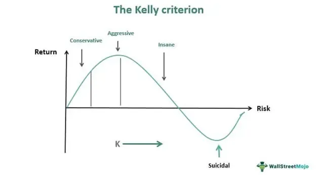

In algorithmic trading, effective strategies to maximize returns while simultaneously managing risk are crucial for traders seeking to enhance portfolio performance. One prominent method that has gained recognition is the Kelly Criterion, a mathematical formula designed to calculate optimal bet sizes based on expected returns and risk. Despite its theoretical promise, applying the full Kelly Criterion can expose traders to substantial short-term volatility, which may not align with their risk tolerance.

To address the volatility issue inherent in the standard Kelly Criterion, some traders adopt a fractional betting approach known as half-Kelly. This strategy involves using only half of the recommended bet size calculated by the Kelly Criterion. By doing so, it aims to reduce the downside risks and potential for significant drawdowns associated with the full-Kelly approach, making it a more palatable option for those wary of short-term fluctuations.



This article examines the concept of half-Kelly betting, particularly its significance in algorithmic trading, where precise risk management and position sizing are cornerstones of success. Understanding half-Kelly betting and its applications provides insight into why traders might choose this method over the full Kelly Criterion, prioritizing stability and manageable risk over maximizing growth potential.

## Table of Contents

## Understanding the Kelly Criterion

The Kelly Criterion, established by John L. Kelly Jr. in 1956, serves as a foundational concept in optimizing bet sizes to maximize the geometric growth rate of capital. This criterion integrates key variables such as the probability of winning (P), the probability of losing (Q), and the reward-to-risk ratio (R). Mathematically, the optimal fraction of capital to wager can be expressed as:

$$
f^* = \frac{P \times (R + 1) - 1}{R}
$$

Here, $f^*$ represents the optimal fraction of capital to be bet, $P$ is the probability of a favorable outcome, and $R$ is the ratio of net winnings to the amount bet. The basic premise of the Kelly Criterion is to capitalize on positive expected value opportunities, balancing the trade-off between wealth growth and risk of ruin.

Despite the theoretical allure of the Kelly Criterion—its promise of optimal growth—its practical application is hindered by several assumptions. Accurate predictions of probabilities and outcomes are necessary, yet these inputs are inherently uncertain and challenging to ascertain in financial markets, where dynamics are often unpredictable. Moreover, the Kelly Criterion presumes that probabilities and payoffs are constant throughout, which rarely aligns with the complex and fluctuating nature of market environments. Therefore, while the Kelly Criterion provides a conceptual framework for determining bet sizes, its application requires cautious consideration and adjustment for real-world market imperfections.

## Challenges with Full Kelly in Trading

Applying full Kelly in trading can result in both high [volatility](/wiki/volatility-trading-strategies) and significant drawdowns, challenges that underscore the inherent risks of this strategy. The Kelly Criterion is designed to maximize the geometric growth rate of capital by determining what fraction of one’s capital to wager on each trade. However, this aggressive approach can lead to substantial fluctuations in the value of a portfolio, a consequence of the strategy's inherent sensitivity to probability miscalculations and market conditions.

A principal challenge in utilizing full Kelly is the assumption of accurate probability estimation. The optimal bet size $f^*$ according to the Kelly Criterion can be calculated as:

$$

f^* = \frac{P \cdot R - Q}{R} 
$$

where $P$ is the probability of a successful outcome, $Q = 1 - P$ is the probability of an unsuccessful outcome, and $R$ is the reward-to-risk ratio. This formula presupposes precise knowledge of $P$ and $R$, a challenging proposition given the volatility and unpredictability inherent in financial markets. Misestimations can lead to allocating too much capital to trades that do not perform as expected, thereby increasing the potential for severe drawdowns.

Another assumption is the independence of win and loss events. In dynamic markets, however, asset prices, economic indicators, and trader actions are often interdependent, violating this assumption. Market events can drastically alter the conditions under which trades were initially evaluated, leading to correlations that can skew the effectiveness of a full Kelly approach.

Furthermore, psychological factors play a crucial role. Despite its theoretical benefits, many traders find the volatility and risk of significant capital loss unacceptable, as emotional stress can lead to imprudent decision-making or premature [exit](/wiki/exit-strategy) from profitable strategies. The exposure to large swings in portfolio value often deters traders from sticking to the Kelly Criterion. As a result, many prefer more conservative approaches that temper potential gains with decreased exposure to risk.

Effective trading strategies must thus balance mathematical optimization with an understanding of market unpredictability and human psychology, explaining why traders frequently seek fractional strategies like half-Kelly betting. By acknowledging the limitations of full Kelly, traders can adapt their approaches to better manage the complexities of real-world trading environments.

## What is Half-Kelly Betting?

Half-Kelly betting is a strategic adaptation of the Kelly Criterion, where a trader opts to wager only half of the calculated optimal bet size. This approach is designed to reduce risk and volatility, making it attractive for those who are wary of the high variability associated with full Kelly betting. By halving the bet, traders intentionally sacrifice some potential for maximized returns in exchange for a lower probability of experiencing substantial losses. 

In practical terms, if the Kelly Criterion suggests betting a fraction $f$ of one's capital, the half-Kelly approach recommends betting $\frac{f}{2}$. This moderation is grounded in the understanding that the estimation of a trader's edge—essentially their perceived advantage—can often be overvalued in real-world conditions. Results show that such overestimation, when followed by aggressive full-Kelly betting, can lead to dire financial consequences, including catastrophic portfolio losses.

This protective strategy aligns with the conservative nature of traders who prioritize capital preservation over potential gains. The adoption of half-Kelly betting also acknowledges the inherent imperfections in estimating probabilities and outcomes accurately, particularly within dynamic and unpredictable financial markets. This method acts as a safeguard against the downside risk that is amplified under market conditions where assumptions fail or edge miscalculations occur, thereby enhancing the robustness of a trading strategy.

## Benefits of Half-Kelly in Algo Trading

Half-Kelly betting offers significant advantages in [algorithmic trading](/wiki/algorithmic-trading), primarily through reduced volatility and risk management. This approach is particularly attractive to traders who are uncomfortable with enduring substantial drawdowns. By betting half of what the Kelly Criterion recommends, traders maintain a more conservative stance, which can prevent catastrophic losses that result from overestimating one’s edge. This reduction in exposure leads to smoother equity curves, making it easier for traders to adhere to their strategy without succumbing to behavioral biases during periods of market stress.

The Half-Kelly method acts as a safeguard against inaccuracies in probability estimation. In financial markets, accurately predicting win probabilities is challenging due to fluctuating conditions and limited information. Half-Kelly provides a buffer by decreasing position sizes, thereby mitigating the adverse effects of estimation errors. This buffer is particularly valuable in imperfect markets where assumptions of independent win/loss distributions and fixed probabilities do not hold.

Integration of Half-Kelly into algorithmic trading strategies allows for adaptive adjustments in market exposure. Algorithms can be designed to assess model confidence and market dynamics, selectively modifying trade sizes according to the half-Kelly fraction. Such adaptivity improves performance by aligning bet sizes with the system's conviction level. This alignment ensures that trades are scaled according to both historical data analysis and real-time information, enhancing the robustness of trading strategies.

Moreover, by using dynamic bet sizing techniques, algorithms can continuously adjust the half-Kelly parameters. For example, a Python-based algorithm could be integrated with continuous learning mechanisms to update its estimations based on incoming data. Here is a basic illustration:

```python
def calculate_half_kelly(p, b):
    kelly_fraction = (p * (b + 1) - 1) / b
    return kelly_fraction / 2

# Example usage
p_win = 0.55  # estimated probability of winning
b_ratio = 2.0  # reward-to-risk ratio
half_kelly_bet = calculate_half_kelly(p_win, b_ratio)
```

This function calculates the half-Kelly bet size based on estimated probabilities and reward-to-risk ratios. By feeding updated parameters into such functions during trading, algorithms can respond to new information swiftly and adjust trade sizes accordingly, thus embodying a smarter risk management approach.

In essence, half-Kelly betting enhances the performance of algorithmic trading systems by incorporating a balance between growth potential and risk management. As markets grow more volatile and complex, the importance of strategies like half-Kelly, which offer resilience and flexibility, becomes increasingly pronounced.

## Case Studies and Simulations

Several simulations have demonstrated the efficacy of half-Kelly betting in minimizing estimation errors and optimizing portfolio growth. One central method to assess this is through Monte Carlo simulations, which provide a comprehensive analysis of different risk profiles over time. These simulations generate a wide range of potential outcomes by repeatedly randomizing variables within a defined mathematical model, allowing traders to visualize the probability distribution of various portfolio growth scenarios.

### Monte Carlo Simulations

Monte Carlo simulations play a crucial role in understanding how half-Kelly betting impacts the growth of a portfolio. By simulating a vast number of random trials, traders can evaluate the potential volatility and returns associated with different betting strategies. In a typical simulation, parameters such as expected returns, volatility, and initial capital are defined. The algorithm then performs numerous iterations to replicate a wide array of market conditions.

For example, a basic simulation might assume an asset with an expected return of 5% and a volatility of 10%. By applying the half-Kelly formula, the fraction of capital to be invested in each iteration is calculated as half of the full Kelly bet. Over thousands of iterations, this approach generally demonstrates lower volatility and drawdowns compared to full Kelly, while still capturing substantial growth.

### Empirical Studies

Empirical studies have corroborated the findings of these simulations, illustrating that under certain market conditions, fractional Kelly betting can outperform both full Kelly and fixed fractional betting strategies. These studies typically evaluate historical market data to compare how different strategies would have performed over past market cycles. Often, they reveal that while the full Kelly criterion might maximize long-term growth in theoretical settings, it poses substantial risks in practical applications due to high volatility and sensitivity to estimation errors.

Fractional Kelly, such as half-Kelly, offers a more stable growth path by mitigating the risks associated with the inaccuracy of parameters like expected return and market volatility. For instance, a comprehensive study spanning multiple asset classes found that portfolios employing a half-Kelly strategy consistently achieved a more favorable risk-adjusted return than those using a full Kelly approach.

### Conclusion

Overall, case studies and simulations unequivocally suggest that half-Kelly betting serves as an effective strategy for managing risk while still achieving significant growth over time. Through Monte Carlo simulations and empirical analyses, it becomes evident that the half-Kelly approach offers a balanced path, providing resilience against estimation errors which are prevalent in dynamic financial environments.

## Implementing Half-Kelly in Trading Algorithms

Implementing Half-Kelly betting in trading algorithms requires careful adjustment of bet sizes or trade volumes to match the calculated half-Kelly fraction. This approach serves as a middle ground between the full Kelly strategy and more conservative fixed betting, prioritizing risk management even as it pursues optimal returns.

To integrate Half-Kelly parameters effectively, one must consider the adaptability of modern algorithmic trading platforms. These systems can dynamically adjust trade sizes in response to changing market conditions and input variables. The formula for Half-Kelly betting involves taking the original Kelly Criterion output and dividing it by two. The Kelly Criterion itself can be calculated as follows:

$$
f^* = \frac{bp - q}{b}
$$

where $f^*$ is the fraction of capital to bet, $b$ is the odds received on the bet, $p$ is the probability of winning, and $q$ is the probability of losing (i.e., $q = 1 - p$). The Half-Kelly amount is then:

$$
f_{half} = \frac{f^*}{2}
$$

In practice, implementing Half-Kelly requires algorithms that can learn and adapt based on real-time data. Here, continuous learning mechanisms become essential. These systems are capable of performing variance assessments and adjusting the Half-Kelly parameters accordingly. This dynamic adjustment helps traders respond to volatility and incorporate updated probability estimates, mitigating the risks associated with inaccurate initial forecasts.

Modern trading platforms facilitate these operations by providing robust computing capabilities to process large datasets and perform real-time calculations. For instance, Python, a popular programming language in algorithmic trading, offers libraries such as NumPy and pandas for efficient data handling and analysis. A simple Python snippet to compute the Half-Kelly criterion might look like this:

```python
def half_kelly(odds, prob_win, capital):
    kelly_criterion = ((odds * prob_win) - (1 - prob_win)) / odds
    half_kelly_fraction = kelly_criterion / 2
    return capital * half_kelly_fraction

# Example usage:
odds = 2.0  # Example odds
probability_of_winning = 0.55  # Example probability
total_capital = 10000  # Example capital

bet_size = half_kelly(odds, probability_of_winning, total_capital)
print(f"Half-Kelly bet size: {bet_size}")
```

This code snippet demonstrates calculating a Half-Kelly bet size given the input parameters of odds, probability of winning, and total capital. Such tools are instrumental in creating trading algorithms that not only follow theoretical models but also adapt flexibly to real-world conditions, ensuring that the Half-Kelly approach is both practically viable and theoretically sound.

## Conclusion

Half-Kelly betting represents a pragmatic balance between maximizing growth and minimizing risk in uncertain financial environments. By opting for a half-Kelly strategy, traders effectively manage their capital exposure, reducing the chances of catastrophic financial losses that can occur with full Kelly betting. This approach inherently considers the imperfections in probability estimates and market conditions, offering a safer alternative for risk-averse investors.

For traders and algorithm designers, adopting half-Kelly betting strategies provides the flexibility and adaptability needed in volatile markets. The fractional approach enables traders to adjust their risk appetite in line with their estimates of market conditions and personal tolerance for risk. This adaptability is crucial, as it allows for dynamic recalibration of trade sizes in response to changing market dynamics.

As trading continues to evolve, incorporating fractional strategies like half-Kelly may become increasingly important to manage the complexities of modern markets. With the constant advancement of technology in algorithmic trading, utilizing these strategies can lead to more sustainable growth. Fractional betting strategies offer a pathway to harnessing the potential of the Kelly Criterion while mitigating its inherent risks, thus appealing to a broader spectrum of investors and traders.

## References & Further Reading

[1]: MacLean, L. C., Thorp, E. O., & Ziemba, W. T. (2011). ["The Kelly Capital Growth Investment Criterion: Theory and Practice."](https://papers.ssrn.com/sol3/papers.cfm?abstract_id=1797366) World Scientific Publishing.

[2]: Van K. Tharp (2006). ["Trade Your Way to Financial Freedom"](https://www.amazon.com/Trade-Your-Way-Financial-Freedom/dp/007147871X). McGraw-Hill Education.

[3]: Aaron Brown (2011). ["Red-Blooded Risk: The Secret History of Wall Street"](https://www.amazon.com/Red-Blooded-Risk-Secret-History-Street/dp/1118043863). Wiley.

[4]: Ed Thorp (2017). ["A Man for All Markets: From Las Vegas to Wall Street, How I Beat the Dealer and the Market"](https://www.amazon.com/Man-All-Markets-Street-Dealer/dp/1400067960). Random House.

[5]: Poundstone, W. (2005). ["Fortune's Formula: The Untold Story of the Scientific Betting System That Beat the Casinos and Wall Street"](https://www.amazon.com/Fortunes-Formula-Scientific-Betting-Casinos/dp/0809045990). Hill and Wang.