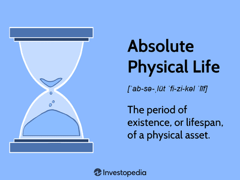

The concept of half-life offers intriguing parallels between chemistry and finance, providing a shared framework to understand decay and erosion over time. In chemistry, half-life typically refers to the period required for a substance to decay to half its initial amount, often observed in radioactive isotopes undergoing spontaneous disintegration. This scientific principle is grounded in the predictable nature of first-order decay reactions, where the rate of decay is proportional to the remaining quantity of the substance.

In finance, the term half-life can be metaphorically applied to describe the gradual erosion of an investment's value, akin to the decay of a radioactive substance. Just as certain isotopes degrade over a consistent time frame, so too can financial assets depreciate due to market forces, inflation, and other economic factors. This correlation invites a deeper analysis of how investors can manage and mitigate the risks associated with investment loss.



Algorithmic trading, known as algo trading, is an area where the concept of half-life can be particularly insightful. In this context, it relates to the lifespan of a trading strategy before it requires adjustment or becomes obsolete. Similar to isotopes which decay predictably, trading algorithms may lose effectiveness due to evolving market conditions and need regular evaluations to maintain profitability. Traders who understand the decay patterns of their strategies can optimize their operations, ensuring their models remain competitive and relevant.

Recognizing the parallels between the scientific and financial realms enhances our understanding of both fields. By examining the principles of half-life, professionals in chemistry and finance can learn to manage decay and renewal processes, fostering innovation and adaptability. This cross-disciplinary approach underscores the significance of half-life as a tool for comprehension and strategic planning across diverse domains.

## Table of Contents

## Understanding Half-Life in Chemistry

Half-life is a core concept in nuclear chemistry, referring to the time required for half of a radioactive substance to decay. This principle is integral to understanding radioactive decay, a spontaneous process wherein unstable atomic nuclei lose energy by emitting radiation. The decay process is classified as a first-order reaction, meaning that the rate at which decay occurs is directly proportional to the amount of the undecayed substance present at any given time. Mathematically, the relationship is often expressed as:

$$
N(t) = N_0 \times \left(\frac{1}{2}\right)^{\frac{t}{t_{1/2}}}
$$

where $N(t)$ is the quantity of substance remaining after time $t$, $N_0$ is the initial quantity of the substance, and $t_{1/2}$ is the half-life of the substance.

The half-life of radioactive isotopes can vary widely, ranging from fractions of a second to millions of years. For instance, Carbon-14, used in radiocarbon dating, has a half-life of about 5,730 years, which suits its application in archeology for dating ancient organic materials. Conversely, Polonium-214 has a half-life of just 164 microseconds, limiting its practical applications but making it useful in understanding rapid nuclear reactions.

The variability in half-lives directly impacts the utilization of isotopes across various fields. In medicine, radioisotopes with short half-lives, such as Technetium-99m, are used in diagnostic imaging because they decay quickly, minimizing radiation exposure to patients. Additionally, in the field of nuclear energy, isotopes such as Uranium-235, with a half-life of around 703.8 million years, are employed as fuel in nuclear reactors due to their ability to sustain nuclear chain reactions over extended periods.

Understanding decay patterns of radioactive isotopes is crucial not only for these applications but also for ensuring safety in handling and storage, predicting long-term environmental impacts, and guiding the development of new technologies in energy production. Consistent advancements in nuclear chemistry continue to leverage this foundational concept to enhance its application in both scientific and industrial domains.

## Radioactive Decay: From Chemistry to Finance

The concept of decay in chemistry is commonly seen through the lens of radioactive decay, where unstable atomic nuclei lose energy by emitting radiation, thus reducing in mass and energy over time. This natural and predictable process serves as a metaphor within financial settings, particularly when describing the depreciation or value erosion of assets. In finance, radioactive decay parallels can be instrumental in understanding and managing the diminishing value of investments under adverse market conditions.

Radioactive decay follows a first-order kinetic process, where the rate of decay is directly proportional to the quantity of substance present. Mathematically, this process is described by the following equation:

$$
N(t) = N_0 \cdot e^{-\lambda t}
$$

where $N(t)$ is the quantity of the substance at time $t$, $N_0$ is the initial quantity, and $\lambda$ is the decay constant specific to the substance. This formula offers a basis for understanding similar processes in financial contexts where asset values decrease over time.

In financial markets, the depreciation of assets can be related to various factors including inflation, market [volatility](/wiki/volatility-trading-strategies), or sector-specific downturns. By employing strategies analogous to those used in handling radioactive decay, investors can potentially mitigate these losses. For instance, just as scientists work to stabilize decaying substances or use them before significant decay, investors can periodically reassess and reallocate their portfolios to manage risks and preserve the value of their investments.

One approach is to implement a systematic evaluation of asset 'value decay' through statistical and computational models. In Python, such a model could involve calculating exponential decay patterns of asset values, using historical market data as input:

```python
import numpy as np
import matplotlib.pyplot as plt

# Assume initial value of asset
initial_value = 1000

# Assume constant, representative of decay rate
decay_constant = 0.05 

# Time period (days)
time = np.arange(0, 100, 1)

# Calculating asset value over time
value_over_time = initial_value * np.exp(-decay_constant * time)

# Plotting the value decay over time
plt.plot(time, value_over_time)
plt.title('Decay of Asset Value Over Time')
plt.xlabel('Time (days)')
plt.ylabel('Asset Value')
plt.show()
```

Through these models, investors can visualize the potential decay trajectory of their investments, allowing them to make informed decisions regarding portfolio adjustments. Understanding the decay analogies not only facilitates better risk management but also mirrors the systematic approach seen in chemical processes where stability and loss management are key. By drawing these parallels, one can enhance strategies to navigate through financial instability efficiently, fostering resilience against the inevitable 'decay' within market dynamics.

## Algorithmic Trading and Half-Life

Algorithmic trading, popularly known as algo trading, leverages sophisticated computer programs to execute trades at speeds and frequencies that surpass human capabilities. The rapid evolution of market conditions and technological advancements necessitates continuous strategy adjustments, paralleling the concept of half-life frequently discussed in chemical contexts.

In [algorithmic trading](/wiki/algorithmic-trading), the concept of half-life pertains to the duration a trading strategy remains effective before requiring modification or replacement. Similar to how isotopes decay at a steady rate, trading strategies can also decline in effectiveness over time due to market volatility and evolving economic indicators. This decline necessitates a dynamic approach to strategy management, including regular reevaluation and adaptation to maintain alignment with market conditions.

The decay of a trading strategy can be quantitatively analyzed using metrics such as Sharpe ratio, a measure of risk-adjusted return, or alpha decay rate, which identifies how quickly a trading strategy loses its predictive power. A practical implementation involves [backtesting](/wiki/backtesting) algorithms on historical data and calculating the half-life of their predictive ability. Traders can use Python libraries like `pandas` and `numpy` to conduct time series analysis and determine the half-life of strategies.

```python
import numpy as np
import pandas as pd

def calculate_half_life(strategy_returns):
    strategy_returns = pd.Series(strategy_returns)
    log_returns = np.log(strategy_returns)

    lagged_log_returns = log_returns.shift(1).dropna()
    diff_log_returns = log_returns.diff(1).dropna()

    beta = np.polyfit(lagged_log_returns, diff_log_returns, 1)[0]
    half_life = -np.log(2) / beta

    return half_life

# Example use case
strategy_returns = [1.05, 1.03, 1.04, 1.02, 1.01, 1.00, 0.99, 0.98]  # hypothetical returns
hl = calculate_half_life(strategy_returns)
print("Strategy Half-Life:", hl)
```

Using these calculations, traders can determine when a strategy starts to underperform and proactively adjust or replace it to optimize their trading operations. This approach ensures strategies remain current and capable of maximizing profitability amidst constantly shifting market dynamics. By tracking the decay patterns, much like observing the half-life in a chemical process, traders can sustain their competitive edge in the financial markets.

## Applying Chemical Half-Life Concepts to Trading

Assessing the 'half-life' of trading models involves a critical analysis of how long a particular strategy can maintain profitability under current market conditions. This evaluation is analogous to monitoring the decay of chemical substances, whereby a trading strategy gradually loses its effectiveness as market conditions evolve. Key to extending the 'half-life' of a trading strategy is the ability to refresh or replace it in response to market data, much like the replacement of decayed substances in chemical processes.

In practice, maintaining the efficiency of trading strategies requires continuous monitoring and adjustment. Market behavior is dynamic, necessitating the regular analysis of data to identify shifts that could affect the performance of a strategy. Traders employ statistical and mathematical models to evaluate the performance of their strategies. For example, they may use a formula like:

$$
\text{Half-life} = \frac{\ln(2)}{\lambda}
$$

where $\lambda$ represents the decay constant of a strategy's performance, analogous to radioactive decay in chemistry. Here, $\lambda$ could be determined by metrics such as a decline in return on investment (ROI) or an increase in volatility indicating changing market trends.

Moreover, algorithmic trading systems are often programmed to automatically adjust parameters based on real-time market data. A sample Python code snippet for integrating such adjustments is:

```python
def update_strategy_params(current_params, market_data):
    # Perform analysis on market data to determine new parameters
    new_params = current_params.copy()
    # For instance, adjust based on volatility or volume changes
    if market_data['volatility'] > threshold:
        new_params['trade_volume'] *= 0.9  # example adjustment
    return new_params

# Example use case
current_params = {'trade_volume': 100}
market_data = {'volatility': 0.05}
updated_params = update_strategy_params(current_params, market_data)
```

Anticipating shifts in market behavior is akin to predicting the decay curve of a radioactive element. By understanding these patterns, traders can formulate strategies to preempt deficiencies, thereby maintaining a competitive edge. The adaptive nature of these strategies is crucial for long-term success in algorithmic trading, mirroring the necessity of adapting chemical processes to achieve desired outcomes. Such cross-disciplinary applications of the half-life concept enhance trading systems by integrating scientific methodologies, fostering a robust approach to coping with the stochastic nature of financial markets.

## Conclusion

The intersection of half-life in chemistry and finance reveals a common language of decay and renewal that transcends disciplinary boundaries. By examining these principles, investors and traders can enhance their understanding of risk management and strategic planning. In chemistry, the half-life concept helps predict the time it takes for substances to diminish to half their initial quantity, allowing for precise calculations in various applications, such as medicine and archaeology. Similarly, in finance, understanding the metaphorical half-life of investments enables market participants to anticipate the depreciation of asset values and adjust their portfolios accordingly.

This cross-disciplinary approach underscores the importance of recognizing patterns of decay and renewal in both scientific and economic contexts. Continuous learning from principles such as half-life encourages innovation and adaptability. By applying these insights, investors can better navigate the complexities of the financial markets, while scientists can develop more efficient methods for managing chemical processes. The shared concepts of decay and renewal in half-life not only bridge the gap between chemistry and finance but also promote a broader understanding of dynamic systems across diverse fields.

## References & Further Reading

[1]: Bergstra, J., Bardenet, R., Bengio, Y., & Kégl, B. (2011). ["Algorithms for Hyper-Parameter Optimization."](https://dl.acm.org/doi/10.5555/2986459.2986743) Advances in Neural Information Processing Systems 24.

[2]: ["Advances in Financial Machine Learning"](https://www.amazon.com/Advances-Financial-Machine-Learning-Marcos/dp/1119482089) by Marcos Lopez de Prado

[3]: ["Evidence-Based Technical Analysis: Applying the Scientific Method and Statistical Inference to Trading Signals"](https://www.amazon.com/Evidence-Based-Technical-Analysis-Scientific-Statistical/dp/0470008741) by David Aronson

[4]: ["Machine Learning for Algorithmic Trading"](https://github.com/stefan-jansen/machine-learning-for-trading) by Stefan Jansen

[5]: ["Quantitative Trading: How to Build Your Own Algorithmic Trading Business"](https://www.amazon.com/Quantitative-Trading-Build-Algorithmic-Business/dp/1119800064) by Ernest P. Chan

[6]: Atkins, P., & De Paula, J. (2010). "Atkins' Physical Chemistry." Oxford University Press.

[7]: ["The New Science of Retailing: How Analytics are Transforming the Supply Chain and Improving Performance"](https://www.semanticscholar.org/paper/The-New-Science-of-Retailing%3A-How-Analytics-are-the-Fisher-Raman/2ae1a6e2026c4a371d15bbbd4d3ab0cb3a6a277b) by Marshall Fisher and Ananth Raman