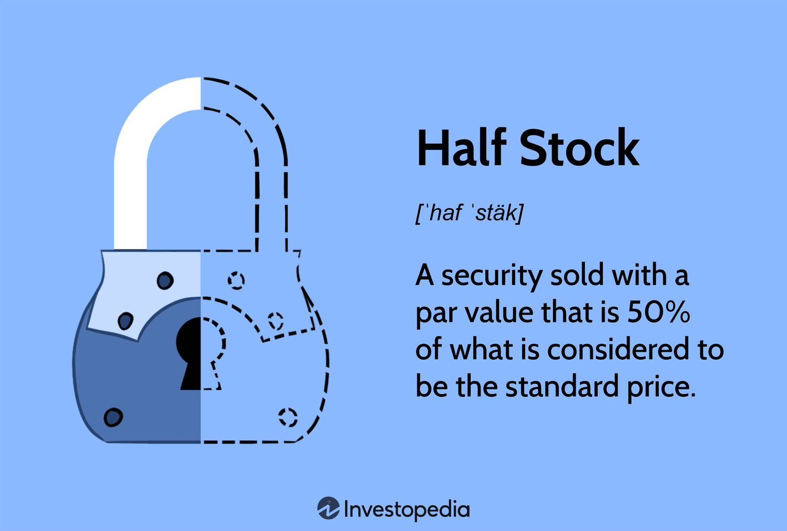

In the ever-evolving world of finance, traditional investment methodologies are continually being challenged and transformed by innovative approaches, including investing in stocks, leveraging half stock structures, and implementing algorithmic trading strategies. This progression is driven by the need to enhance returns, reduce risk, and adapt to rapidly changing market conditions.

This article explores the intersections of half stock investments, finance, and algorithmic trading. The primary objective is to provide insights into each component and examine how they can interact to potentially foster financial growth. Understanding these elements requires a granular analysis of the characteristics of half stocks, their role in the investment landscape, and the principles driving algorithmic trading.



We will begin by understanding the concept of half stock in investment finance. Half stocks represent a strategic option for investors seeking to balance capital expenditure with dividend generation, particularly in preferred stock markets. They aim to offer lower entry points while diversifying investment portfolios.

Next, we explore the significance of algorithmic trading in the modern financial landscape. Automated trading systems, powered by sophisticated algorithms, have revolutionized the way trading is conducted, allowing for enhanced precision and efficiency by minimizing human error and bias. Algorithmic trading helps optimize transaction execution and can handle high trading volumes at speeds beyond human capability.

Finally, we'll cover strategies and considerations for integrating these elements in a cohesive investment approach. By understanding the mechanics of half stock investments and leveraging algorithmic trading, investors can innovate their portfolios to maximize returns while mitigating associated risk factors. This holistic approach positions investors to navigate the complexities of the financial markets with increased confidence and strategic foresight.

## Table of Contents

## Understanding Half Stock in Investment Finance

Half stock, often referred to as a security available at a par value that is 50% of the nominal standard price, plays a significant role in the landscape of investment finance. It is generally classified as preferred stock, highlighting its dividend-yielding characteristics which attract investors seeking steady income streams. 

Preferred stock, including half stock, often comes with predetermined dividend payouts, giving it an advantage over common stock in terms of income predictability. While common stocks do offer greater potential for capital gains, they do not guarantee dividends, thus presenting a higher risk profile. In contrast, preferred stocks, and by extension half stocks, usually ensure fixed dividend returns, albeit with limited capital appreciation opportunities.

Understanding the par value of half stocks is crucial for investors aiming to optimize their portfolio management strategies. The par value represents the face value of the stock, a baseline figure set by the issuing company. For a half stock, this par value is calculated as 50% of the typical standard price of full-value stocks. This calculation can be simply illustrated with:

$$
\text{Half Stock Par Value} = 0.5 \times \text{Full Stock Par Value}
$$

This lowered entry point can be particularly advantageous for investors with capital constraints, as it allows them to participate in the stock market at a reduced cost relative to full-value securities.

Moreover, half stocks contribute to portfolio diversification by enabling investors to broaden their holdings across different asset classes and sectors without a substantial capital outlay. Diversification serves as a risk management strategy, potentially reducing the [volatility](/wiki/volatility-trading-strategies) of an investment portfolio while still capturing relative gains in the stock market.

In summary, half stocks hold a strategic place in investment finance by offering a blend of income stability through dividends, cost-effective market entry, and portfolio diversification benefits. Investors seeking to balance risk and income potential often consider including half stocks as part of their comprehensive investment strategies.

## Algorithmic Trading: A Financial Revolution

Algorithmic trading, often referred to as algo trading, signifies a transformative approach within modern financial markets. It leverages sophisticated computer algorithms to automate the process of executing trades, which are defined by pre-set rules such as timing, price, and [volume](/wiki/volume-trading-strategy). This automation serves to eliminate human error and emotional biases, providing a heightened level of precision in trading activities.

A variety of strategies are employed in [algorithmic trading](/wiki/algorithmic-trading). Trend following is a common strategy where algorithms execute trades based on the direction of asset prices over time. Arbitrage strategies exploit price differentials across different markets; for example, buying an asset in one market at a lower price and selling it in another at a higher price. Mean reversion assumes that asset prices will return to their historical average, promoting trades when prices deviate significantly from this average.

The advantages of algorithmic trading are manifold. Speed and efficiency are primary benefits, as algorithms can process vast amounts of data and execute trades in fractions of a second, far beyond human capabilities. Anonymity in execution is another perk, as trades can be conducted without revealing strategic intentions to other market participants. Additionally, algorithms can utilize [backtesting](/wiki/backtesting) methodologies to simulate trading strategies on historical data, thus gauging their potential effectiveness before actual deployment.

Despite these benefits, algorithmic trading is not without its challenges. System failures are a critical risk; the malfunction of trading systems can lead to significant financial losses. Regulatory compliance is another major concern, especially in environments with strict high-frequency trading regulations. Furthermore, over-optimization, where algorithms are excessively fine-tuned to historical data, can lead to poor performance in live markets due to changing conditions and unanticipated variables.

In summary, algorithmic trading represents a significant leap forward in trading technology, offering enhanced precision and efficiency. However, careful management of potential pitfalls is essential to harness its full potential. As the financial landscape continues to evolve, the role of algorithmic trading is expected to grow, necessitating a comprehensive understanding of its mechanics and implications.

## Combining Half Stock Investments with Algorithmic Trading

Innovative investors are increasingly combining half stock investments with algorithmic trading to maximize returns and minimize risks. This integration leverages the unique pricing structures of half stocks with the precision and speed of algorithmic trading, thereby creating a robust investment strategy.

Algorithmic trading facilitates efficient handling of both acquisition and liquidation of half stocks, ensuring that investors can take full advantage of price fluctuations without manual intervention. The algorithms used in trading rely on pre-defined parameters such as timing, price, and volume. Python, among other programming languages, is frequently employed to create these algorithms due to its simplicity and extensive financial libraries. For instance, an investor could use the `pandas` library to manage datasets and `numpy` for numerical computation related to stock pricing.

```python
import numpy as np
import pandas as pd

# Sample dataframe creation for half stock analysis
data = {'Stock': ['HalfStock1', 'HalfStock2'],
        'Current Price': [50, 75],
        'Expected Growth (%)': [5, 3]}

df = pd.DataFrame(data)

# Calculating the expected future price based on growth
df['Future Price'] = df['Current Price'] * (1 + df['Expected Growth (%)'] / 100)
print(df)
```

Beyond coding, algorithmic trading offers various strategies, such as mean reversion and [arbitrage](/wiki/arbitrage), tailored for half stock investments. Mean reversion assumes that stock prices will revert to their historical averages over time, providing buy and sell signals when prices veer from these norms. On the other hand, arbitrage exploits price differences in different markets or forms of security.

Investors must carefully strategize around market [liquidity](/wiki/liquidity-risk-premium), volatility, and execution timing. Liquidity considerations ensure that trades can be executed without significantly affecting stock prices. Volatility measures the rate at which stock prices increase or decrease, helping to assess risk levels. Optimal execution timing is crucial, particularly given the fast-paced nature of algorithmic trading, allowing investors to capitalize on fleeting opportunities.

In summary, the alignment of algorithmic trading systems with half stock investments offers a sophisticated means to enhance portfolio performance. By automating trade processes and utilizing systematic strategies, investors can not only maximize their returns but also effectively manage associated risks.

## Steps to Effectively Integrate Half Stock and Algorithmic Trading

To effectively integrate half stock investments with algorithmic trading, a structured approach is crucial. Here are the essential steps for investors to follow:

**Research and Understanding**: Investors should begin with a comprehensive understanding of half stocks and algorithmic trading mechanisms. Half stocks represent securities with a par value that is 50% of the standard price. Familiarity with the nuances between common and preferred stocks, especially in the context of half stocks, is essential. Simultaneously, understanding algorithmic trading involves knowing how algorithms execute trades based on criteria like timing and volume. This foundational knowledge is critical for informed decision-making.

**Select Appropriate Technology**: Investing in robust trading platforms and software is imperative. These should support algorithmic functions and provide real-time data analytics. The chosen platform should also offer features like backtesting and live market tracking to accommodate the complexities of half stock investments. Tools such as MetaTrader or Interactive Brokers can be beneficial due to their extensive support for algorithmic trading.

**Develop a Comprehensive Strategy**: Define and align investment goals with risk tolerance and the capabilities of algorithmic trading. Strategies should incorporate half stocks, considering their pricing structures and dividend features. For instance, mean reversion algorithms can be suitable for half stock investments, identifying and exploiting deviations in stock pricing. Clear strategies ensure systematic and disciplined trading practices.

**Backtesting and Simulation**: Utilize historical data to rigorously test algorithmic models before actual implementation. This process helps in evaluating the performance of strategies under different market conditions and ensures their robustness. Tools like Python's `pandas` and `backtrader` libraries can be utilized for this purpose:

```python
import pandas as pd
import backtrader as bt

# Example of setting up a simple backtest
class MyStrategy(bt.Strategy):
    def next(self):
        if not self.position:
            if self.data.close[0] < self.data.close[-1]:
                self.buy(size=10)
        else:
            self.sell(size=10)

cerebro = bt.Cerebro()
cerebro.addstrategy(MyStrategy)

# Assuming 'data' is a DataFrame with historical data
data = bt.feeds.PandasData(dataname=pd.read_csv('historical_prices.csv'))
cerebro.adddata(data)

cerebro.run()
```

**Continuous Monitoring and Optimization**: Trading strategies should be continuously monitored and optimized in response to market trends to ensure they remain aligned with financial goals. Regularly updating and refining algorithms to adapt to changing market conditions is necessary for maintaining a competitive edge. Additionally, keeping track of volatility and liquidity ensures appropriate timing and execution of trades.

By systematically implementing these steps, investors can effectively integrate half stock investments with algorithmic trading, thus optimizing their portfolios for potential financial growth while managing risks.

## Potential Risks and Challenges

Integrating half stock investments with algorithmic trading presents several notable challenges that investors must carefully navigate. One primary concern is the potential for technical failures. Algorithmic trading systems rely on complex software and hardware infrastructure to execute trades seamlessly. Any disruption, such as server downtime or software bugs, can lead to missed opportunities or unintended trades. To mitigate such risks, investors should ensure that their systems are robust, incorporating redundant failsafes and rigorous testing procedures.

Data inaccuracies also pose significant threats to successful algorithmic trading. These inaccuracies can arise from erroneous financial feeds, delayed data streams, or incorrect historical data, leading to ill-informed trading decisions. Ensuring data integrity through partnerships with reliable data providers and implementing strong data validation mechanisms can help address these risks.

Another challenge lies in the complexities of the systems themselves. Algorithmic trading systems often comprise numerous interconnected components, each requiring precise configuration and ongoing maintenance. As a result, investors may face increased operational costs to maintain such sophisticated setups. It’s essential to regularly audit system components, streamline processes, and allocate resources effectively to manage these complexities.

Regulatory compliance is another critical aspect that investors must adhere to, especially when engaging in high-frequency trading. Financial markets are governed by stringent regulations designed to protect market integrity and participant interests. Non-compliance can result in substantial penalties, thus necessitating a thorough understanding of applicable regulations and continuous updates to stay compliant.

Investors must also contend with market volatility and liquidity risks. Stock markets can be unpredictable, with price swings that can affect the execution and profitability of trades. Solutions like diversification, employing hedging strategies, or using stop-loss orders can help manage such risks. Additionally, liquidity constraints, particularly in less active markets or specific half stock securities, necessitate adaptive trading strategies that account for execution timing and volume.

In conclusion, while the integration of half stock investments with algorithmic trading presents certain risks and challenges, careful planning and ongoing management can help navigate this complex landscape effectively. By addressing technical, data, regulatory, and market-related concerns, investors can better position themselves to leverage these advanced financial tools.

## Conclusion

The fusion of half stock investments with algorithmic trading offers a range of opportunities for investors aiming to innovate in the financial markets. Combining the potential of half stocks, which allow for cost-effective diversification and attractive dividend payments, with the precision and speed of algorithmic trading, investors can achieve improved efficiency and reduced emotional bias in their trading decisions. This integration leverages modern technology to maximize potential returns while minimizing the typical risks associated with human-driven investments.

One of the key benefits of this approach is the potential for enhanced gains. By utilizing advanced algorithms to analyze market data and execute trades, investors can identify and exploit market inefficiencies more effectively than traditional trading methods. The use of algorithmic strategies, such as mean reversion and arbitrage, can capitalize on the unique pricing structures of half stocks, potentially leading to improved portfolio performance.

However, these benefits come with the imperative for careful consideration and management of associated risks. Technical failures, data inaccuracies, and regulatory compliance are critical factors that necessitate robust risk management frameworks. An understanding of market liquidity and volatility is essential to align trading systems with investment goals effectively.

As technology and markets continue to evolve, it is crucial for investors to stay informed and adaptable. Continuous monitoring and optimization of trading strategies are essential to maintaining alignment with financial objectives. Regular backtesting and refinement of algorithms using historical data can further enhance strategy robustness. 

Ultimately, the strategic incorporation of half stock investments coupled with algorithmic trading can significantly bolster the sophistication of an investment portfolio. By aligning these innovative financial tools, investors can navigate the complexities of modern financial markets with enhanced precision and agility.

## References & Further Reading

[1]: Bergstra, J., Bardenet, R., Bengio, Y., & Kégl, B. (2011). ["Algorithms for Hyper-Parameter Optimization."](https://dl.acm.org/doi/10.5555/2986459.2986743) Advances in Neural Information Processing Systems 24.

[2]: ["Advances in Financial Machine Learning"](https://www.amazon.com/Advances-Financial-Machine-Learning-Marcos/dp/1119482089) by Marcos Lopez de Prado

[3]: ["Evidence-Based Technical Analysis: Applying the Scientific Method and Statistical Inference to Trading Signals"](https://www.amazon.com/Evidence-Based-Technical-Analysis-Scientific-Statistical/dp/0470008741) by David Aronson

[4]: ["Machine Learning for Algorithmic Trading"](https://github.com/stefan-jansen/machine-learning-for-trading) by Stefan Jansen

[5]: ["Quantitative Trading: How to Build Your Own Algorithmic Trading Business"](https://www.amazon.com/Quantitative-Trading-Build-Algorithmic-Business/dp/1119800064) by Ernest P. Chan