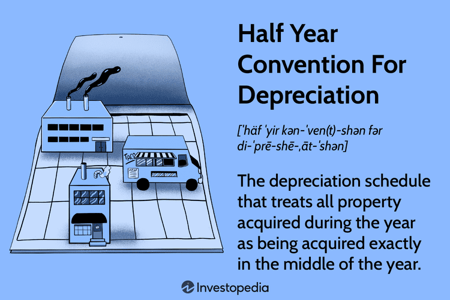

In finance, mastering various accounting and depreciation methods is essential for successful asset management and financial planning. One such method, the half-year convention for depreciation, plays an integral role. This approach, among other accounting strategies, provides a bridge to algorithmic trading, a domain where technology meets financial markets. By focusing on the half-year convention, this article highlights how these accounting strategies can enhance optimization within trading models, contributing to the financial success of algorithmic trading operations.

Algorithmic trading, relying heavily on computer programs and algorithms, benefits greatly from precise and well-implemented accounting principles. Understanding these intersections allows traders and analysts to leverage accounting strategies to optimize algorithm performance and improve decision-making in the markets. This article aims to provide readers with insights into the intersection of accounting and modern trading techniques, offering both technical and practical applications that are essential in today's financial environments. Integrating these domains empowers businesses to maximize efficiency and seek enhanced returns.



## Table of Contents

## Understanding the Half-Year Convention for Depreciation

The half-year convention for depreciation is a commonly employed method in accounting that offers a pragmatic approach to asset depreciation scheduling. This method operates on the assumption that all assets are acquired at the midpoint of the fiscal year. Consequently, only half of the normal annual depreciation amount is recognized in the asset's first year of service. This approach helps align depreciation expense more accurately with the revenue period an asset contributes to, ensuring precise financial reporting and adherence to accounting standards.

In practical terms, this principle allows businesses to better match the cost of an asset with the income it generates. This alignment is fundamental to maintaining transparency and compliance in financial statements. By recognizing depreciation over a more balanced time frame, companies can present a more stable and realistic view of their financial performance.

The half-year convention can be applied across various depreciation methodologies, including the straight-line method, double declining balance, and the sum-of-the-years' digits. Each of these methods calculates depreciation differently, but they can all incorporate the half-year convention to manage initial depreciation costs more efficiently. For instance, in the straight-line method, the depreciation expense is evenly spread over the asset's useful life. By adopting the half-year convention, an asset with a useful life of 10 years and a cost of $10,000 would have first-year depreciation calculated as follows:

$$
\text{First-year Depreciation} = \frac{\text{Asset Cost}}{\text{Useful Life}} \times \frac{1}{2} = \frac{10,000}{10} \times \frac{1}{2} = 500
$$

Exploring the accounting principles behind the half-year convention, its application is particularly advantageous in businesses with a high rate of asset turnover. These enterprises frequently acquire and dispose of assets, necessitating a precise and systematic approach to depreciation that the half-year convention provides. This method allows for better cash flow management and enhances the accuracy of profitability measurements. In sectors such as manufacturing or technology, where rapid asset acquisition and replacement are prevalent, the half-year convention facilitates smoother financial transitions and more reliable fiscal analysis.

Overall, the half-year convention for depreciation offers a strategic tool for businesses seeking to align asset costs with revenue generation effectively, thereby optimizing productivity and financial reporting accuracy.

## Impact of Half-Year Convention on Financial Statements

The half-year convention for depreciation serves as a strategic tool in financial reporting, allowing for a judicious spread of asset value reduction over time. By assuming that assets are acquired halfway through the fiscal year, this method permits only half of the standard annual depreciation to be recorded in the first year. This systematic allocation of depreciation expenses leads to a smoother valuation of assets across accounting periods.

The primary advantage of the half-year convention is its ability to dampen fluctuations in financial statements, providing a more accurate depiction of a company's fiscal health. It achieves this by moderating the initial impact of asset depreciation on income statements, thus avoiding sudden spikes in expenses that could distort the financial outlook.

For example, consider an asset with a purchase cost of $100,000 and a straight-line depreciation over five years. Without the half-year convention, the annual depreciation expense would be $20,000. However, with the half-year convention applied in the first year, the depreciation expense would be $10,000, reflecting the assumption that the asset was only utilized for half the year.

This predictive consistency is vital for stakeholders who rely on financial statements for decision-making. Investors, in particular, seek assurance that a company maintains a stable financial [course](/wiki/best-algorithmic-trading-courses), minimizing unforeseen shifts that could affect future cash flows or investment strategies. By presenting a consistent depreciation schedule, companies can enhance investor confidence, showcasing a manageable and predictable erosion of asset value over the years.

Furthermore, the half-year convention facilitates compliance with accounting standards that emphasize cautious asset valuation and revenue recognition. By deferring part of the depreciation to subsequent years, companies align more closely with these principles, ensuring that their financial statements adhere to regulatory frameworks.

Incorporating the half-year convention into financial practice not only aids in achieving a tempered view of asset depreciation but also reinforces a company's reputation as financially astute and capable of informed, strategic planning. This consistent approach underscores a balanced financial narrative, imperative for sustaining business credibility and fostering long-term stakeholder trust.

## Algorithmic Trading: An Overview

Algorithmic trading involves the utilization of computer programs and sophisticated algorithms to execute financial trades automatically based on pre-established criteria. This method of trading seeks to exploit technological advancements to achieve superior outcomes in financial markets. The fundamental appeal of [algorithmic trading](/wiki/algorithmic-trading) is encapsulated in three primary benefits: speed, precision, and an enhanced capacity to back-test trading strategies using historical and real-time market data.

Speed is a critical advantage offered by algorithmic trading, as computer algorithms can execute trades in milliseconds, significantly faster than human traders. This time efficiency allows traders to capitalize on brief market opportunities that may not be visible or actionable within human time scales. The immediacy of response afforded by algorithms is particularly important in high-frequency trading, where profits are derived from minute price discrepancies across securities exchanged millions of times a day.

Precision in algorithmic trading ensures that trades are executed with minimal error. Algorithms are pre-programmed with specific parameters and instructions, which allows them to eliminate the emotional and psychological influences that can plague human trading decisions. This results in a disciplined and consistent trading approach, as algorithms adhere to predefined rules without deviation.

Back-testing is a vital component of algorithmic trading, facilitating the evaluation of trading strategies against historical data to assess their potential efficacy. By analyzing past performance, traders can refine their strategies to optimize profitability while mitigating risk. Additionally, real-time data feeds allow algorithms to adapt strategies swiftly, responding to evolving market conditions with agility.

Understanding algorithmic trading is increasingly essential for financial analysts and traders who aim to leverage these technological tools to maintain a competitive edge. In modern markets, the capacity to harness algorithmic trading effectively can distinguish successful trading operations from their less proficient counterparts. It empowers traders to process vast amounts of data efficiently, generating insights that inform strategic decisions.

In conclusion, algorithmic trading represents a pivotal intersection of finance and technology, offering enhanced trade execution speed, precision, and strategic development through comprehensive data analysis. As financial markets continue to evolve, the mastery of algorithmic trading techniques will remain crucial for those seeking to advance in the competitive landscape of modern finance.

## Integrating Accounting Methods with Algoritmic Trading

Incorporating accounting principles such as the half-year convention into algorithmic trading strategies can significantly enhance their operational efficiency. The half-year convention is a systematic approach that influences how depreciation is accounted for, affecting various financial metrics that are crucial in developing and executing trading algorithms. By applying this convention, businesses aim to achieve a more accurate depiction of asset depreciation, which is particularly important for trading models relying on precise financial data for effective decision-making.

Depreciation conventions like the half-year convention influence financial statements by spreading out the expense of an asset more evenly over time. In algorithmic trading, this approach has profound implications. Trading models often utilize financial statements to derive trading signals, and any inconsistencies or inaccuracies in these reports can lead to flawed trading decisions. For instance, a sudden spike in depreciation expense could skew profit metrics, leading to misleading signals if not correctly accounted for.

Algorithmic trading systems benefit from integrating accurate accounting practices as these ensure a realistic financial context within which trading decisions are made. The precision in asset valuation directly impacts the algorithms' ability to assess investment opportunities and risks accurately. A coding example in Python to illustrate the integration of depreciation data into an algorithmic trading framework might look like this:

```python
import pandas as pd

# Example asset data with half-year convention depreciation
asset_data = {
    'year': [1, 2, 3, 4, 5],
    'initial_value': 10000,
    'depreciation_rate': 0.2,  # 20% per year with half-year convention
}

# Calculate depreciation per year
def calculate_depreciation(data):
    depreciation_schedule = []
    current_value = data['initial_value']
    half_year_rate = data['depreciation_rate'] / 2

    for year in data['year']:
        depreciation = current_value * half_year_rate if year == 1 else current_value * data['depreciation_rate']
        current_value -= depreciation
        depreciation_schedule.append((year, current_value))

    return pd.DataFrame(depreciation_schedule, columns=['Year', 'Net Book Value'])

depreciation_df = calculate_depreciation(asset_data)
print(depreciation_df)
```

In this code, assets are depreciated using the half-year convention, beginning with a reduced rate in the first year. This practice aligns the asset's book value more consistently over its useful life, producing financial records that accurately reflect asset value for use in trading algorithms.

Ultimately, using robust accounting methodologies like the half-year convention supports the development of more reliable and predictive trading systems. By ensuring trading models are built upon realistic financial data and asset valuations, investors and businesses harness a more truthful representation of financial realities, leading to better risk management, strategy optimization, and enhanced returns on investment.

## Practical Applications in Algo Trading

Traders and financial analysts can enhance the effectiveness of algorithmic trading by integrating accounting data, such as depreciation schedules, into trading algorithms. This holistic approach allows for the development of more comprehensive trading strategies that take into account broader financial metrics. Depreciation schedules, for instance, impact key financial indicators like net income and asset turnover, which algorithms might use as inputs for trading decisions.

Consider a situation where a trading algorithm evaluates stocks based on a company's asset efficiency. Incorporating depreciation into this evaluation can influence metrics such as return on assets (ROA) or earnings per share (EPS). For example, if a company uses the straight-line method with the half-year convention, its depreciation expense and, consequently, net income will differ from what they would be under a full-year depreciation approach. This variation influences the ROA, potentially altering the algorithm's investment decision.

Integrating accounting principles requires programming these algorithms to adjust for accounting inputs. In Python, this may involve calculating adjusted earnings or asset values within an algorithm. Here is a simple example demonstrating an adjustment for depreciation effects:

```python
def adjust_for_depreciation(net_income, assets, depreciation_expense):
    adjusted_net_income = net_income - depreciation_expense
    return adjusted_net_income / assets

net_income = 1000000  # Example net income
assets = 5000000  # Example total assets
depreciation_expense = 50000  # Example depreciation expense considering half-year convention

roa = adjust_for_depreciation(net_income, assets, depreciation_expense)
print(f"Adjusted ROA: {roa:.2%}")
```

By accounting for these variables, algorithms can make more informed decisions, assessing a company’s performance with greater accuracy.

Collaboration between accountants and algorithm developers is instrumental in achieving these innovative solutions. Accountants can provide detailed insights into how different depreciation schedules affect financial metrics, while developers can codify these insights into algorithmic models. This interdisciplinary collaboration fosters more robust trading systems capable of dynamic adaptation to accounting variations.

Embracing the synthesis of accounting data with algorithmic trading not only improves the algorithm’s performance by reflecting true financial health, but also paves the way for developing strategies that are deeply aligned with a company’s financial realities. This leads to more informed trading decisions and, potentially, superior investment returns.

## Conclusion

The convergence of accounting methods and algorithmic trading represents a significant evolution in the financial sector, underscoring the importance of cross-disciplinary integration. By incorporating accounting strategies such as the half-year convention, trading algorithms can achieve enhanced accuracy and potentially increased profitability. This method of depreciation enables traders and financial analysts to create more balanced and predictable financial statements, which are crucial for making informed investment decisions and maintaining investor confidence.

Integrating accounting principles into algorithmic trading not only improves the precision of financial metrics used in trading models but also provides a realistic financial context that can improve the reliability of these models. For instance, using Python, one could develop a function to simulate the impact of different depreciation schedules on asset valuation within trading algorithms. Here's a simplified example:

```python
def half_year_depreciation(initial_value, annual_depreciation_rate, useful_life):
    mid_year_rate = annual_depreciation_rate / 2
    depreciation_schedule = [initial_value * (1 - mid_year_rate)]

    for year in range(1, useful_life):
        remaining_value = depreciation_schedule[-1]
        depreciation_expense = remaining_value * annual_depreciation_rate
        depreciation_schedule.append(remaining_value - depreciation_expense)

    return depreciation_schedule

# Example usage
initial_value = 100000  # Initial asset value
annual_depreciation_rate = 0.10  # 10% annual depreciation rate
useful_life = 5  # Useful life of the asset in years

schedule = half_year_depreciation(initial_value, annual_depreciation_rate, useful_life)
print(schedule)
```

This code demonstrates the calculation of a depreciation schedule using the half-year convention, providing insights into how accounting data can be integrated into trading strategies. These insights allow algorithmic systems to forecast with greater accuracy and establish more robust trading strategies.

By embracing the synergies between these domains, businesses and traders can substantially enhance their operational efficiency and optimize returns. As the financial landscape continues to evolve, the integration of accounting strategies into algorithmic trading promises to empower practitioners with the tools necessary to navigate the complexities of modern finance adeptly. This holistic approach not only drives innovation but also paves the way for sustainable financial success.

## References & Further Reading

[1]: IRS. (2023). ["Publication 946: How to Depreciate Property."](https://www.irs.gov/publications/p946) Internal Revenue Service.

[2]: ["Depreciation and Amortization Guide"](https://www.coursehero.com/file/241462844/FORM4562pdf/) by CFA Institute

[3]: Hull, J. C. (2018). ["Options, Futures, and Other Derivatives."](https://www.semanticscholar.org/paper/Options%2C-Futures%2C-and-Other-Derivatives-Hull/89bdee500c8623864fc9eb7a471546aa713acc44) Pearson.

[4]: De Prado, M. L. (2018). ["Advances in Financial Machine Learning."](https://www.amazon.com/Advances-Financial-Machine-Learning-Marcos/dp/1119482089) Wiley.

[5]: Chan, E. P. (2009). ["Quantitative Trading: How to Build Your Own Algorithmic Trading Business."](https://github.com/ftvision/quant_trading_echan_book) Wiley.

[6]: Aronson, D. R. (2006). ["Evidence-Based Technical Analysis: Applying the Scientific Method and Statistical Inference to Trading Signals."](https://www.amazon.com/Evidence-Based-Technical-Analysis-Scientific-Statistical/dp/0470008741) Wiley.

[7]: Jansen, S. (2020). ["Machine Learning for Algorithmic Trading."](https://github.com/stefan-jansen/machine-learning-for-trading) Packt Publishing.