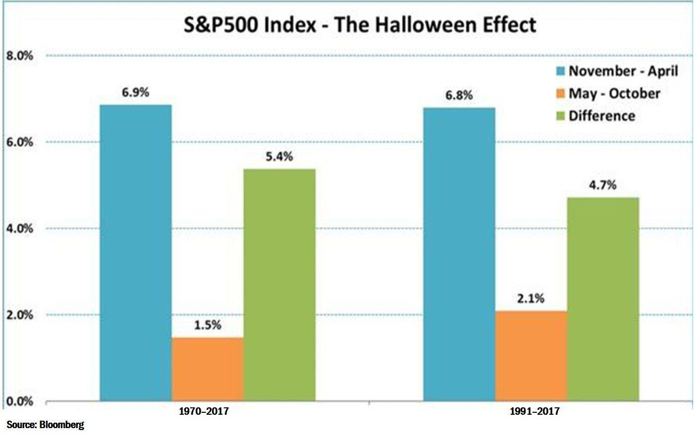

## Table of Contents

## What is the Halloween strategy in stock trading?

The Halloween strategy in stock trading is a simple rule that suggests investors should buy stocks on Halloween, October 31st, and sell them on May 1st of the next year. This strategy is based on the idea that stock markets tend to perform better during the winter months than in the summer months. It's often summed up with the saying, "Sell in May and go away, but remember to come back on Halloween."

People who follow this strategy believe that it can help them make more money because the stock market often goes up more during the winter. Studies have shown that, over many years, this pattern has been true in some places, like the United States and Europe. However, it's important to remember that no strategy works perfectly all the time, and past results don't guarantee future success. So, while the Halloween strategy might be a fun and simple rule to follow, it's not a sure way to make money in the stock market.

## How does the Halloween strategy differ from other seasonal trading strategies?

The Halloween strategy is different from other seasonal trading strategies because it focuses on a specific time period from November to April. Other seasonal strategies might look at different times of the year or use different signals to decide when to buy and sell. For example, some strategies might suggest buying stocks in the fall and selling in the spring, but they might not use Halloween and May 1st as the exact dates like the Halloween strategy does.

Another way the Halloween strategy is different is that it is very simple and easy to follow. Many other seasonal strategies might involve looking at more complicated things like economic reports, weather patterns, or holiday shopping trends. The Halloween strategy just tells you to buy on Halloween and sell on May 1st, without needing to look at a lot of other information. This makes it easier for people who want a simple rule to follow, but it also means it might not be as accurate or flexible as other strategies that take more factors into account.

## What is the historical performance of the Halloween strategy?

The Halloween strategy has shown good results over many years. Studies have found that, in the United States, the stock market often does better from November to April than from May to October. For example, from 1950 to 2013, the S&P 500 went up an average of about 7% during the winter months, but only about 2% during the summer months. This means that if you followed the Halloween strategy, you might have made more money than if you just kept your money in the stock market all year.

However, the Halloween strategy does not work perfectly every year. There have been times when the stock market did better in the summer than in the winter. Also, the strategy might work better in some countries than in others. For example, it seems to work well in the United States and Europe, but it might not work as well in other places. So, while the Halloween strategy has a good track record, it is not a sure way to make money, and it is important to think about other things before deciding to use it.

## What are the key months involved in the Halloween strategy?

The Halloween strategy tells you to buy stocks on October 31st, which is Halloween, and sell them on May 1st. These two dates are the key months for this strategy. The idea is that the stock market usually does better from November to April than from May to October.

People who follow this strategy believe that they can make more money by only having their money in the stock market during the winter months. Studies have shown that, over many years, the stock market has gone up more during this time. But, it's important to remember that this strategy does not work every year, and it might work better in some countries than others.

## How can a beginner implement the Halloween strategy in their trading?

To start using the Halloween strategy, a beginner needs to buy stocks on October 31st, which is Halloween. This means you should have money ready to invest on that day. You can buy stocks through a brokerage account, which you can set up online. Choose stocks or a stock market index fund that you think will do well. Once you've bought the stocks, you just need to wait until May 1st of the next year.

On May 1st, you should sell the stocks you bought back in October. This is when you take your money out of the stock market according to the Halloween strategy. You can then keep the money in a safe place like a savings account until the next Halloween when you start the process all over again. Remember, while this strategy has worked well in the past, it doesn't always work, so it's good to learn more about investing and maybe talk to a financial advisor before you start.

## What are the potential risks associated with following the Halloween strategy?

Following the Halloween strategy can be risky because the stock market does not always go up during the winter months. Sometimes, the market might go down, and if you have all your money in stocks, you could lose money. Also, this strategy is based on what happened in the past, but the future might be different. Just because the market went up in November to April in the past does not mean it will happen every year. So, you might miss out on gains if the market does well in the summer months when you are not invested.

Another risk is that the Halloween strategy might not work as well in every country. It has been studied mostly in the United States and Europe, so it might not be as good in other places. If you live in a different country, the strategy might not help you make more money. Also, this strategy is very simple and does not take into account other important things like economic news or company earnings. Relying only on this strategy might mean you miss out on other chances to make money or protect your investments.

## Can the Halloween strategy be applied to different types of investments, such as stocks, ETFs, or mutual funds?

The Halloween strategy can be used with different types of investments like stocks, ETFs, and mutual funds. If you want to use this strategy with stocks, you can buy individual company stocks on Halloween and sell them on May 1st. For ETFs, which are like baskets of stocks, you can buy an [ETF](/wiki/etf-trading-strategies) that follows a stock market index, like the S&P 500, on October 31st and sell it on May 1st. Mutual funds work the same way; you can buy a mutual fund that invests in stocks on Halloween and sell it on May 1st.

However, it's important to remember that the Halloween strategy might work differently with different types of investments. Stocks can be riskier because their prices can go up and down a lot. ETFs and mutual funds might be less risky because they spread your money across many stocks, but they still follow the stock market's ups and downs. No matter what type of investment you choose, the Halloween strategy is not a sure way to make money, and it's good to learn more about investing before you start using it.

## How does market volatility affect the effectiveness of the Halloween strategy?

Market [volatility](/wiki/volatility-trading-strategies) can make the Halloween strategy less effective. Volatility means the stock market goes up and down a lot. If the market is very volatile during the winter months, the stocks you buy on Halloween might lose value before you sell them on May 1st. This could mean you make less money or even lose money, even if the strategy usually works well.

On the other hand, if the market is less volatile, the Halloween strategy might work better. When the market is stable, the stocks you buy in November are more likely to go up in value by the time you sell them in May. But, you can't predict how volatile the market will be, so the Halloween strategy is not a sure way to make money. It's important to think about other things, like how much risk you are willing to take, before deciding to use this strategy.

## What advanced techniques can be used to optimize the Halloween strategy?

To make the Halloween strategy work better, you can use a technique called "dollar-cost averaging." Instead of putting all your money into stocks on Halloween, you can spread out your investments over the winter months. For example, you could buy some stocks on Halloween, some more in December, and some more in February. This way, if the market goes down at first, you can still buy stocks at a lower price later on. It can help reduce the risk of losing money if the market is volatile.

Another way to improve the Halloween strategy is to look at other things besides just the calendar dates. You can pay attention to economic reports, company earnings, and even world events that might affect the stock market. If you see that the market might go down in the winter, you might decide to wait a bit before buying stocks. Or, if you think the market will do well in the summer, you might keep your money in stocks longer than just until May 1st. By being more flexible and using other information, you can make the Halloween strategy work better for you.

## How do macroeconomic factors influence the success of the Halloween strategy?

Macroeconomic factors can have a big impact on how well the Halloween strategy works. Things like interest rates, inflation, and how the economy is doing overall can make the stock market go up or down. If interest rates go up, it might make borrowing money more expensive for companies, which could make their stocks go down. On the other hand, if the economy is doing well and people are spending more money, the stock market might go up, making the Halloween strategy more successful.

It's also important to think about what's happening in the world. If there's a big event like a war or a natural disaster, it can make the stock market more unpredictable. These events can change how people feel about the economy and make them more likely to sell their stocks, which could hurt the Halloween strategy. So, while the Halloween strategy is based on a simple rule, it's good to keep an eye on these bigger economic factors to understand why the market might be going up or down during the winter months.

## Are there any notable case studies or examples where the Halloween strategy significantly outperformed or underperformed the market?

One example where the Halloween strategy did really well was during the period from 2008 to 2009. This was the time of the big financial crisis. If you followed the strategy and bought stocks on Halloween in 2008, you would have bought them when the market was very low. By May 1st, 2009, the market had started to recover a bit, so you would have made a good profit. This shows how the strategy can work well when the market goes up a lot during the winter.

On the other hand, there have been times when the Halloween strategy did not work so well. For example, in 2015, the stock market did not go up much from November to April. If you bought stocks on Halloween that year, you might have made only a little money or even lost some when you sold them in May. This shows that the strategy does not always work, and it can underperform if the market does not follow the usual pattern of going up more in the winter.

## How can one use quantitative analysis to further refine the Halloween strategy?

You can use numbers and data to make the Halloween strategy work better. This is called quantitative analysis. One way to do this is by looking at past data to see how the stock market has done from November to April over many years. You can use this information to find out if there are certain years or conditions when the strategy works better. For example, you might find that the strategy works well when the economy is growing but not so well when there's a lot of uncertainty. By understanding these patterns, you can decide when it might be a good time to use the Halloween strategy.

Another way to use quantitative analysis is by using something called "[backtesting](/wiki/backtesting)." This means you take the Halloween strategy and see how it would have worked in the past with real stock market data. You can use a computer to do this and see how much money you would have made or lost if you had followed the strategy over many years. This can help you see if the strategy is really good or if it just worked well by chance. By doing this kind of analysis, you can make smarter choices about when to buy and sell stocks, making the Halloween strategy more likely to help you make money.

## References & Further Reading

[1]: Bouman, S., & Jacobsen, B. (2002). ["The Halloween Indicator, 'Sell in May and Go Away': Another Puzzle."](https://www.jstor.org/stable/3083268) The Review of Financial Studies, 15(4), 1617-1633.

[2]: ["Advances in Financial Machine Learning"](https://www.amazon.com/Advances-Financial-Machine-Learning-Marcos/dp/1119482089) by Marcos Lopez de Prado

[3]: ["Evidence-Based Technical Analysis: Applying the Scientific Method and Statistical Inference to Trading Signals"](https://www.amazon.com/Evidence-Based-Technical-Analysis-Scientific-Statistical/dp/0470008741) by David Aronson

[4]: ["Machine Learning for Algorithmic Trading"](https://github.com/stefan-jansen/machine-learning-for-trading) by Stefan Jansen

[5]: Hong, H., & Yu, J. (2009). ["Gone Fishing: Seasonality in Trading Activity and Asset Prices."](https://papers.ssrn.com/sol3/papers.cfm?abstract_id=1949419) Journal of Finance, 64(2).

[6]: ["Quantitative Trading: How to Build Your Own Algorithmic Trading Business"](https://www.amazon.com/Quantitative-Trading-Build-Algorithmic-Business/dp/1119800064) by Ernest P. Chan