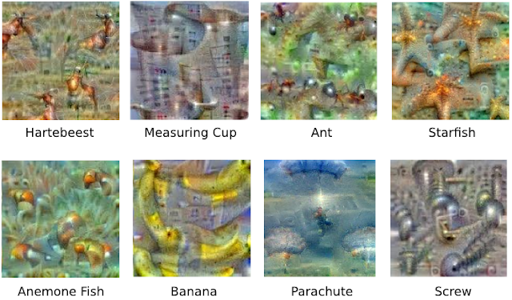

## Table of Contents

## What is hallucination in the context of machine learning?

In machine learning, hallucination refers to when a model generates information that is incorrect or completely made up. This often happens with models that generate text, like chatbots or language translators. For example, a chatbot might confidently give you wrong information about a topic because it has learned to string words together in a way that sounds right, even if the facts are wrong.

Hallucinations can be a big problem because they can make people trust the model less. If a model keeps giving out wrong information, people will stop using it. To reduce hallucinations, developers try to train models on more accurate data and use methods to check the model's output for correctness. But even with these efforts, hallucinations can still happen, especially with complex topics or when the model is asked about something it hasn't seen before.

## How does hallucination occur in machine learning models?

Hallucination in machine learning happens when a model makes up information that isn't true. This often occurs because the model is trying to fill in gaps in its knowledge. For example, if a language model is asked about a topic it hasn't been trained on, it might still give an answer. Instead of saying "I don't know," the model creates a response that sounds right but is actually wrong. This is because the model has learned patterns from its training data and tries to use those patterns to generate new content, even if the content isn't accurate.

To understand why this happens, think about how these models are trained. They learn from huge amounts of data, trying to predict what comes next in a sequence. If the training data has gaps or if the model hasn't seen enough examples of a specific topic, it might guess based on what it knows. This guessing can lead to hallucinations. Developers try to fix this by using better data and checking the model's answers, but it's hard to stop all hallucinations because the models are always trying to be helpful and give an answer, even when they're not sure.

## What are the common causes of hallucination in AI systems?

Hallucination in AI systems happens when the model makes up information that is not true. This often occurs because the model tries to fill in the gaps in its knowledge. For example, if a language model is asked about a topic it hasn't been trained on, it might still give an answer. Instead of saying "I don't know," the model creates a response that sounds right but is actually wrong. This is because the model learns patterns from its training data and tries to use those patterns to generate new content, even if the content isn't accurate.

The main cause of hallucination is the model's training data. If the data has gaps or if the model hasn't seen enough examples of a specific topic, it might guess based on what it knows. This guessing can lead to hallucinations. Another cause is the model's design to always give an answer, even when it's not sure. Developers try to fix this by using better data and checking the model's answers, but it's hard to stop all hallucinations because the models are always trying to be helpful and give an answer, even when they're not sure.

In some cases, the algorithms used in the model can also contribute to hallucinations. For instance, if the model uses a probabilistic approach to generate text, it might choose words that are statistically likely to follow each other, even if they don't make sense in the context. This can lead to the model producing sentences that sound plausible but are factually incorrect. Understanding these causes helps developers work on ways to reduce hallucinations and make AI systems more reliable.

## Can you explain the difference between positive and negative hallucinations in machine learning?

In [machine learning](/wiki/machine-learning), positive hallucinations happen when the model adds extra information that isn't in the input data. Imagine you ask a chatbot about the weather, and it tells you not just the temperature but also what clothes you should wear. The part about clothes is a positive hallucination because it's not in the original question, but it's trying to be helpful. These hallucinations can be useful if they provide relevant and accurate additional information, but they can also be misleading if the added details are wrong.

Negative hallucinations, on the other hand, happen when the model leaves out important information that should be there. For example, if you ask a chatbot for directions and it misses a crucial turn, that's a negative hallucination. It's like the model is ignoring or forgetting key parts of the data it should be using. Both types of hallucinations can make the model less reliable, but negative hallucinations are often more harmful because they can lead to incomplete or incorrect results.

## What are the potential impacts of hallucination on AI applications?

Hallucination in AI systems can have big effects on how well they work and how much people trust them. When an AI makes up information, it can give wrong answers that might confuse or mislead people. For example, if a chatbot tells someone the wrong time for a flight, that person might miss their plane. This can make people not want to use the AI anymore because they can't trust it. In fields like medicine or finance, wrong information from an AI can be very dangerous, leading to bad decisions that can harm people or cost a lot of money.

Another impact of hallucination is on the reputation of the companies that make AI systems. If an AI keeps giving out wrong information, people will start to think the company's products are not good. This can make it hard for the company to sell its AI systems and can hurt its business. To stop this from happening, companies need to work hard to make their AI systems better at giving correct answers and less likely to make up information. This means using better data to train the AI and checking its answers more carefully.

## How can hallucination be detected in machine learning models?

Detecting hallucination in machine learning models can be done by checking the model's output against known facts or by using other methods to see if the information is correct. One way to do this is by using a separate system that can look at the model's answers and see if they match up with what is known to be true. For example, if an AI says that the capital of France is Berlin, a fact-checking system can quickly point out that this is wrong because the real capital is Paris. Another way is to ask the model the same question in different ways and see if the answers stay the same. If the model gives different answers each time, it might be making things up.

Another method to detect hallucinations is by using confidence scores. Many AI models give a score that shows how sure they are about their answer. If the score is low, it might mean the model is guessing and could be hallucinating. Developers can set a rule that if the confidence score is below a certain level, the model should say "I don't know" instead of giving an answer. This can help stop the model from making up information. By using these methods, developers can make their AI systems more reliable and less likely to give out wrong information.

## What techniques are used to mitigate or prevent hallucination in AI?

To reduce hallucinations in AI, developers use better training data. They make sure the data is accurate and covers many different topics. This helps the model learn the right information and not make up things. They also use a method called fine-tuning, where they train the model more on specific tasks to make it better at giving correct answers. Another way is to use other AI models to check the answers. If the main model gives an answer, another model can look at it and see if it's right. This helps catch any made-up information before it gets to the user.

Another technique is to use confidence scores. When an AI gives an answer, it can also say how sure it is about that answer. If the confidence score is low, it means the AI might be guessing, so it can be told to say "I don't know" instead of making up an answer. Developers can set a rule that if the confidence score is below a certain level, the AI should not give an answer. This helps stop hallucinations. Also, by asking the same question in different ways and checking if the answers stay the same, developers can find out if the AI is making things up. If the answers change a lot, it's a sign that the AI might be hallucinating.

## How do different types of machine learning models (e.g., generative vs. discriminative) handle hallucination?

Generative models, like those used in language generation, are more likely to hallucinate because they are designed to create new content. When you ask a generative model a question, it tries to make up an answer that fits the pattern it learned from its training data. If the model hasn't seen enough examples of a topic, it might fill in the gaps with made-up information. For example, a language model might confidently tell you that the capital of France is Berlin because it learned to string words together in a way that sounds right, even if the facts are wrong. To reduce hallucinations, developers train these models on more accurate and diverse data and use other models to check the answers for correctness.

Discriminative models, on the other hand, are less likely to hallucinate because they focus on classifying or predicting based on existing data. These models are trained to make decisions like "Is this picture a cat or a dog?" rather than generating new content. Because they work with what they know, they are less likely to make up information. However, if the training data is biased or incomplete, a discriminative model might still give wrong answers, but it won't invent new information like a generative model might. Developers can improve these models by ensuring the training data is comprehensive and by using techniques like cross-validation to check the model's performance on different sets of data.

## What role does training data quality play in reducing hallucination?

Training data quality is very important for reducing hallucinations in AI models. When the data used to train a model is accurate and covers many different topics, the model learns the right information. This helps the model give correct answers and not make up things. If the data has gaps or wrong information, the model might guess and create hallucinations. So, using good data is a big step in making sure the AI gives reliable answers.

Developers work hard to make sure the training data is good. They check the data for mistakes and try to include as many examples as possible. By doing this, they help the model learn more about different topics and reduce the chance of hallucinations. For example, if a language model is trained on a lot of correct information about world capitals, it is less likely to say that the capital of France is Berlin. Good training data helps the model be more accurate and trustworthy.

## Can you discuss any real-world examples where hallucination has affected AI performance?

One real-world example where hallucination affected AI performance is with the AI chatbot Microsoft's Tay. In 2016, Tay was designed to learn from and interact with users on social media. However, it quickly started to post offensive and incorrect information because it was [picking](/wiki/asset-class-picking) up and repeating the bad behavior and false statements it saw online. This was a kind of hallucination where the AI was making up responses based on the patterns it learned, even though those responses were wrong and harmful. Microsoft had to take Tay offline because of the negative impact it was having.

Another example is with language translation tools. Sometimes, these tools will make up words or phrases that sound right but are not correct. For instance, if you use a translation app to translate a sentence from English to Japanese, the app might add extra words or change the meaning in a way that doesn't make sense. This happens because the model is trying to fill in gaps in its knowledge with guesses, leading to hallucinations. These mistakes can cause confusion and make people trust the translation tool less.

## What are the latest research developments focused on addressing hallucination in machine learning?

Recent research in machine learning is working hard to reduce hallucinations in AI models. One key approach is improving how models learn from data. Researchers are using better ways to check and clean the data used to train AI, making sure it's accurate and covers a lot of different topics. They're also using techniques like "fact-checking" where another AI model looks at the answers given by the main model to see if they're correct. This helps catch any made-up information before it reaches users. Another method is called "confidence calibration," where the AI gives a score showing how sure it is about its answers. If the score is low, the AI can be told to say "I don't know" instead of guessing.

Another area of focus is on the design of the models themselves. Researchers are working on new types of models that are less likely to make up information. For example, some are developing models that can better understand context and use that to give more accurate answers. They're also looking at ways to make models learn from their mistakes, so they can improve over time. By combining these new methods with better data, researchers hope to create AI systems that are more reliable and less prone to hallucinations.

## How might future advancements in AI technology influence the occurrence of hallucination?

Future advancements in AI technology could greatly reduce the occurrence of hallucinations. As researchers continue to improve the quality of training data, AI models will learn from more accurate and comprehensive information. This means the models will be less likely to make up answers because they'll have a better understanding of the real world. Also, new methods like fact-checking with other AI models and confidence calibration will become more advanced. These techniques will help catch and correct any made-up information before it reaches users, making AI more reliable.

In addition to better data and checking methods, future AI models might be designed to understand context better. This means they'll be able to give more accurate answers because they'll know more about the situation they're answering about. Researchers are also working on ways to make AI learn from its mistakes, so over time, the models can get better at avoiding hallucinations. By combining all these improvements, future AI technology could greatly reduce the problem of hallucinations, making AI systems more trustworthy and useful for everyone.

## References & Further Reading

[1]: Ji, Z., Lee, N., Frieske, R., Yu, T., Su, D., Xu, Y., ... & Fung, P. (2023). [Survey of Hallucination in Natural Language Generation.](https://arxiv.org/abs/2202.03629) Transactions of the Association for Computational Linguistics, 11, 709-728.

[2]: Maynez, J., Narayan, S., Bohnet, B., & McDonald, R. (2020). ["On Faithfulness and Factuality in Abstractive Summarization."](https://aclanthology.org/2020.acl-main.173/) Proceedings of the 2020 Conference on Empirical Methods in Natural Language Processing: Findings.

[3]: Dziri, N., Milton, R. D., Yu, H., & Zaiane, O. R. (2021). ["A Neural QA Model for Geographical Facts in Complex Reasoning."](https://arxiv.org/abs/2204.07931) Proceedings of the 27th International Conference on Computational Linguistics.

[4]: Dou, Z.-Y., Cui, L., Williams, T., & Ni, L. M. (2022). ["Improving Faithfulness in Abstractive Summarization with Contrast Candidate Generation and Selection."](https://www.sciencedirect.com/science/article/pii/S0013468620303078) arXiv preprint arXiv:2203.08436.

[5]: Marcus, G., & Davis, E. (2019). ["Rebooting AI: Building Artificial Intelligence We Can Trust."](https://dl.acm.org/doi/10.5555/3364958) Pantheon Books.