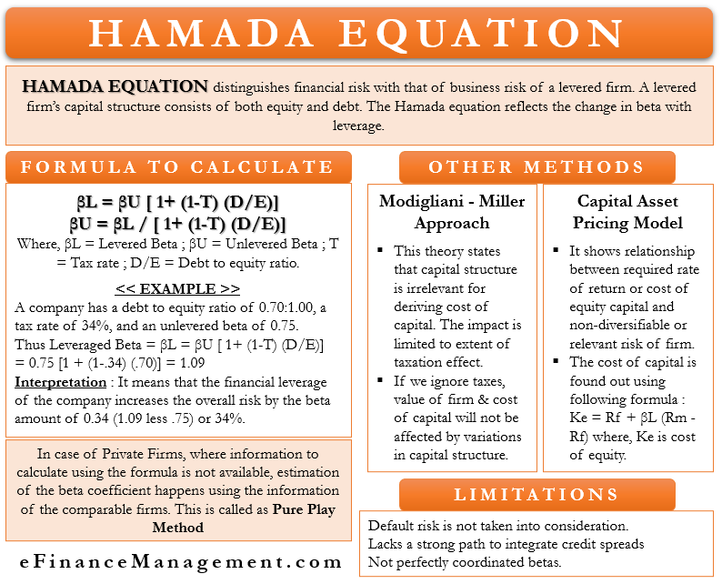

## Table of Contents

## What is the Hamada Equation?

The Hamada Equation is a financial tool used to understand how a company's debt affects its overall risk. It helps figure out the cost of equity, which is the return a company needs to give its shareholders to keep them happy. The equation shows how using more debt can make a company riskier because it has to pay back that debt no matter what. This is important for investors who want to know how safe their investment is.

The equation itself looks at the company's beta, which measures how much the company's stock price moves compared to the overall market. The Hamada Equation adjusts this beta to account for the company's debt level. If a company has a lot of debt, its adjusted beta will be higher, showing it's riskier. By using this equation, investors and financial analysts can better understand the risks they're taking when they invest in a company with debt.

## Who developed the Hamada Equation?

The Hamada Equation was developed by Robert Hamada. He was a professor at the University of Chicago and worked in the field of finance. He came up with this equation in the 1970s while trying to understand how debt affects a company's risk.

Hamada wanted to help investors figure out how safe their investments were. He noticed that when companies borrow money, it can make them riskier because they have to pay back the debt no matter what happens. So, he created the Hamada Equation to adjust a company's beta, which shows how much its stock price moves compared to the market, to account for this debt. This way, investors could see the true risk of investing in a company with a lot of debt.

## What is the purpose of the Hamada Equation in finance?

The Hamada Equation helps people in finance figure out how much risk a company has because of its debt. It's like a tool that shows how borrowing money can make a company more risky. When a company borrows money, it has to pay it back no matter what, which can be scary if the company isn't doing well. The Hamada Equation takes this into account and changes the company's beta, which is a number that shows how much the company's stock price moves compared to the whole market.

By using the Hamada Equation, investors can see the real risk of putting their money into a company that has a lot of debt. It helps them decide if the potential reward is worth the risk. For example, if a company's adjusted beta is high because of a lot of debt, an investor might think twice before investing, knowing that the company could be in trouble if it can't pay back its loans. So, the Hamada Equation is really useful for making smarter investment choices.

## What are the key components of the Hamada Equation?

The Hamada Equation has a few important parts that help figure out how debt affects a company's risk. One key part is the company's unlevered beta, which is the company's beta without any debt. This shows how the company's stock price moves compared to the market when there's no debt involved. Another important part is the company's debt-to-equity ratio, which tells us how much debt the company has compared to its equity. This ratio is important because it shows how much the company is relying on borrowed money.

The third key component is the tax rate, because interest on debt can be deducted from taxes, which makes debt a bit less risky. The Hamada Equation uses these parts to adjust the company's beta to account for its debt. By doing this, it gives investors a better idea of the real risk they're taking when they invest in a company with a lot of debt. This helps them make smarter decisions about where to put their money.

## How do you calculate the unlevered beta using the Hamada Equation?

To calculate the unlevered beta using the Hamada Equation, you start with the company's levered beta, which is the beta that includes the effect of debt. You also need to know the company's debt-to-equity ratio and the tax rate. The formula to find the unlevered beta is: Unlevered Beta = Levered Beta / (1 + (1 - Tax Rate) * Debt-to-Equity Ratio). This equation takes the levered beta and adjusts it to remove the impact of debt, giving you the unlevered beta.

The unlevered beta shows how the company's stock price would move compared to the market if it had no debt at all. It's like looking at the company's risk without the added risk from borrowing money. By using the Hamada Equation, investors can see the true risk of the company's business operations, separate from the risk that comes from its debt. This helps them make better decisions about whether to invest in the company.

## Can you explain the relationship between financial leverage and beta in the Hamada Equation?

The Hamada Equation shows how financial leverage, which is the amount of debt a company uses, affects its beta. Beta is a measure of how much a company's stock price moves compared to the overall market. When a company uses more debt, it's like borrowing money to grow or invest. This can make the company riskier because it has to pay back the debt no matter what happens. The Hamada Equation takes this into account by adjusting the company's beta to show the extra risk from the debt.

In the Hamada Equation, the more debt a company has compared to its equity, the higher its levered beta will be. This means the company's stock price might move more than the market because of the added risk from the debt. The equation uses the debt-to-equity ratio and the tax rate to make this adjustment. By doing this, the Hamada Equation helps investors see how much of the company's risk comes from its business operations and how much comes from its debt. This can help them decide if the potential rewards are worth the extra risk.

## What assumptions are made when using the Hamada Equation?

When using the Hamada Equation, some important assumptions are made. One big assumption is that the company's debt level stays the same over time. This means the equation assumes the company doesn't take on more debt or pay off its existing debt. Another assumption is that the company's tax rate is constant and known. This is important because the tax rate affects how much the company saves on taxes by using debt, which in turn affects the risk.

Another key assumption is that the market values the company's debt and equity correctly. This means the equation assumes that the prices of the company's stocks and bonds reflect their true value. The Hamada Equation also assumes that the company's business risk, which is the risk from its operations, stays the same. This helps separate the risk from the company's operations from the risk added by its debt. By making these assumptions, the Hamada Equation can give a clearer picture of how debt affects a company's overall risk.

## How does the Hamada Equation adjust for taxes?

The Hamada Equation takes into account taxes because when a company borrows money, it can deduct the interest it pays on that debt from its taxes. This makes debt a bit less risky because the company saves money on taxes. In the equation, the tax rate is used to adjust the company's beta, which shows how much the company's stock price moves compared to the market. The tax rate helps figure out how much the company benefits from using debt, and this benefit makes the company's risk look smaller than it would be without considering taxes.

By including the tax rate in the equation, the Hamada Equation gives a more accurate picture of the company's risk. Without considering taxes, the risk from debt might look too high. But because the company can save on taxes with debt, the real risk is a bit lower. This is why the tax rate is an important part of the Hamada Equation. It helps investors see the true risk of investing in a company with debt, making it easier for them to decide if the investment is worth it.

## What are the limitations of the Hamada Equation?

The Hamada Equation is a useful tool, but it has some limitations that can affect how well it works. One big limitation is that it assumes the company's debt level stays the same over time. In real life, companies often change their debt, which can make the equation's results less accurate. Another limitation is that the equation assumes the company's tax rate is constant and known. But tax rates can change, and this can make the equation's adjustments less reliable. The Hamada Equation also assumes that the market values the company's debt and equity correctly, which might not always be true, especially during times when the market is acting strangely.

Another limitation is that the Hamada Equation doesn't consider other risks that can affect a company's stock price. For example, it doesn't account for risks from the economy, changes in interest rates, or even risks specific to the company's industry. These can all make the company's stock price move more than the equation predicts. Also, the equation assumes the company's business risk stays the same, but in reality, a company's operations can become more or less risky over time. Because of these limitations, investors should use the Hamada Equation carefully and not rely on it completely when making investment decisions.

## Can you provide a step-by-step example of using the Hamada Equation to calculate levered beta?

Let's say we have a company called ABC Corp. We want to find out its levered beta, which shows how much risk the company has because of its debt. ABC Corp has an unlevered beta of 0.8, which is the risk of the company without any debt. The company's debt-to-equity ratio is 0.5, meaning for every dollar of equity, the company has 50 cents of debt. The tax rate for ABC Corp is 30%. To find the levered beta, we'll use the Hamada Equation, which is: Levered Beta = Unlevered Beta * (1 + (1 - Tax Rate) * Debt-to-Equity Ratio). 

First, we need to figure out the part inside the parentheses. The tax rate is 30%, so 1 minus the tax rate is 1 - 0.30 = 0.70. Then, we multiply this by the debt-to-equity ratio: 0.70 * 0.5 = 0.35. Now, we add 1 to this result: 1 + 0.35 = 1.35. Finally, we multiply the unlevered beta by this number: 0.8 * 1.35 = 1.08. So, the levered beta for ABC Corp is 1.08. This means that because of its debt, ABC Corp's stock price is expected to move 1.08 times as much as the overall market. This shows how the Hamada Equation helps us see the extra risk from the company's debt.

## How does the Hamada Equation differ from other methods of calculating beta?

The Hamada Equation is different from other ways to calculate beta because it focuses on how a company's debt affects its risk. Other methods might look at the company's stock price movements over time compared to the market without considering debt. But the Hamada Equation takes the company's unlevered beta, which is the risk without debt, and adjusts it to show the extra risk from the debt. It uses the company's debt-to-equity ratio and tax rate to make this adjustment. This helps investors see the true risk of the company, including the risk from borrowing money.

Other methods of calculating beta, like using regression analysis, look at historical stock price data to find out how much a company's stock moves compared to the market. These methods don't adjust for debt, so they might not show the full picture of a company's risk. The Hamada Equation is useful because it gives a more complete view by showing how debt can make a company riskier. This can help investors make better decisions about whether to invest in a company with a lot of debt.

## What advanced applications of the Hamada Equation exist in financial modeling and analysis?

In financial modeling and analysis, the Hamada Equation can be used in more advanced ways to help companies and investors make better decisions. One advanced use is in scenario analysis, where people look at how changes in a company's debt or tax rate might affect its risk. By using the Hamada Equation, they can see how different levels of debt might change the company's beta and overall risk. This can help companies plan their borrowing strategies and investors figure out if the potential rewards of investing in a company are worth the risks.

Another advanced application is in merger and acquisition analysis. When companies are thinking about buying or merging with another company, they need to understand how the new company's debt will affect its risk. The Hamada Equation can help them adjust the target company's beta to account for its debt, giving a clearer picture of the risk they're taking on. This can be really important for deciding if the merger or acquisition makes financial sense. By using the Hamada Equation in these advanced ways, people in finance can make smarter and more informed decisions.

## What is the Hamada Equation and how can it be understood?

The Hamada Equation is a pivotal formula in financial analysis that quantifies the impact of financial leverage on a firm's beta, which is a measure of the systematic risk in comparison to the overall market. This equation, formulated by Robert Hamada, is anchored in the principles of the Capital Asset Pricing Model (CAPM) and the Modigliani-Miller theorem concerning capital structure.

At its core, the Hamada Equation illustrates the relationship between a firm's unlevered beta and its levered beta. The unlevered beta reflects the intrinsic business risk of a firm without considering its debt, thereby representing the firm’s risk profile in an all-equity capital structure. In contrast, the levered beta accounts for the impact of debt, adjusting the firm's risk profile based on its capital structure.

The equation is mathematically expressed as follows:

$$
\beta_L = \beta_U [1 + (1 - T)(\frac{D}{E})]
$$

Where:
- $\beta_L$ is the levered beta.
- $\beta_U$ is the unlevered beta.
- $T$ is the corporate tax rate.
- $\frac{D}{E}$ is the debt-to-equity ratio.

This formula enables financial analysts to assess how leverage modifies a company’s exposure to market risk, facilitating informed decision-making regarding capital structure adjustments. Understanding the elements of this equation is crucial for its effective application. The debt-to-equity ratio serves as an indicator of a firm's leverage, with a higher ratio implying increased debt levels relative to equity. This magnifies the firm's potential risk, as it amplifies beta when accounting for the tax shield (illustrated by $1 - T$) that firms enjoy due to interest tax deductibility.

Employing the Hamada Equation necessitates precise input data, including accurate estimates of unlevered beta, corporate tax rates, and current market valuations of debt and equity. This ensures the reliability of the risk assessments derived from the equation. Incorporating these critical insights aids investors and corporate managers in dissecting the influence of financial leverage on firm risk, enabling strategic planning and optimization of capital structures to align with risk management and value maximization objectives.

## What are the Mechanics of the Hamada Equation?

The Hamada Equation is expressed as:

$$
\text{Levered Beta} = \text{Unlevered Beta} \times \left[1 + (1 - \text{Tax Rate}) \times \frac{\text{Debt}}{\text{Equity}}\right]
$$

This mathematical formulation demonstrates how financial leverage elevates a firm's risk profile, consequently affecting the cost of capital. The equation links the unlevered beta, which signifies the intrinsic risk inherent to the firm's operations without considering debt, to the levered beta, which adjusts for the influence of financial leverage.

The unlevered beta represents the company's fundamental risk, devoid of any debt impact, reflecting only the business risk associated with its operations. The tax rate modifies the debt-to-equity ratio's effect on beta, acknowledging tax shields associated with debt financing. The debt-to-equity ratio is pivotal in this equation as it quantifies the firm's financial leverage, which magnifies the risk exposure denoted by the levered beta.

Through this computation, the Hamada Equation offers key insights into how adjustments in a company’s capital structure—such as altering the levels of debt and equity—implicate changes in the firm’s beta. This adjusted beta is pivotal for strategic financial planning as it affects both the expected returns required by investors and the firm's perceived risk in the marketplace.

To illustrate, a Python implementation for calculating the levered beta might look like this:

```python
def calculate_levered_beta(unlevered_beta, tax_rate, debt, equity):
    debt_to_equity_ratio = debt / equity
    levered_beta = unlevered_beta * (1 + (1 - tax_rate) * debt_to_equity_ratio)
    return levered_beta

# Example usage:
unlevered_beta = 0.8
tax_rate = 0.3
debt = 2_000_000
equity = 8_000_000

levered_beta = calculate_levered_beta(unlevered_beta, tax_rate, debt, equity)
print(f"The levered beta is: {levered_beta}")
```

This clarity provided by the equation helps corporate managers and investors make informed decisions about capital restructuring to strategically balance risks and returns, aligning with the organization's financial goals.

## What is the relationship between Financial Leverage and Risk?

Understanding financial leverage is integral for assessing its impact on risk and return management. Financial leverage refers to the use of borrowed funds to amplify investment returns and is a critical [factor](/wiki/factor-investing) in determining a firm's risk profile. When a company increases its leverage, it has the potential to achieve higher returns on equity. This is primarily because debt can magnify the effects of a company's return on investment by using borrowed capital to generate additional revenue. However, this also increases the company's risk exposure, as the fixed financial obligations that come with debt may heighten the likelihood of financial distress, especially if the return on assets falls short of expectations.

The Hamada Equation is particularly valuable in quantifying this impact. By linking a firm's leverage with its beta—a measure of systematic risk relative to the broader market—the equation allows stakeholders to quantify how changes in capital structure impact a firm's risk exposure and cost structure. The levered beta, calculated as:

$$

\text{Levered Beta} = \text{Unlevered Beta} \times \left(1 + (1 - \text{Tax Rate}) \times \frac{\text{Debt}}{\text{Equity}}\right) 
$$

provides a powerful metric for evaluating the risk levels associated with different leverage scenarios. The unlevered beta reflects the business risk without the effects of financial leverage, representing only the operational risk. In contrast, the levered beta incorporates the financial risk added by the use of debt, giving a comprehensive view of the firm's risk in relation to its capital structure.

In practice, this means that stakeholders, such as investors and corporate managers, can use the Hamada Equation to make informed decisions regarding capital structure optimizations. By redistributing leverage, firms can alter their risk exposure and potentially adjust their cost of capital, a key determinant of a company's valuation and financial strategy. This can involve maintaining a balance between debt and equity to optimize financial outcomes without incurring excessive risk, ensuring sustainable growth and stability.

## What are the applications in capital structure optimization?

The Hamada Equation is instrumental in capital structure optimization, assisting in determining the most advantageous blend of debt and equity to minimize costs while maintaining a manageable financial risk profile. By delineating the relationship between financial leverage and a firm's risk, the equation enables financial analysts and corporate managers to strategize effectively for capital restructuring and growth.

Utilizing the equation, firms can evaluate various financial scenarios and determine the impact of different debt levels on their risk and cost structures. This capability is crucial, especially when corporate growth could be compromised by excessive debt burden. Moreover, by understanding how leverage affects risk, firms can optimize their capital structure to sustain operations and expansion without overexposure to financial distress.

Mathematically expressed as:

$$
\text{Levered Beta} = \text{Unlevered Beta} [1 + (1 - \text{Tax Rate}) (\text{Debt/Equity Ratio})]
$$

the equation is a tool for risk modelers who demand constant updates and assessments of leverage impacts. It supports dynamic risk modeling by providing a framework to quantify changes in risk exposure due to adjustments in capital structure. This quantitative assessment is indispensable for ensuring that financial strategies align with a firm's long-term objectives and market conditions.

In practical terms, firms might implement risk modeling and scenario analysis utilizing a programming language like Python to automate these calculations. Here's a simple Python function for calculating the levered beta using the Hamada Equation:

```python
def calculate_levered_beta(unlevered_beta, tax_rate, debt_equity_ratio):
    return unlevered_beta * (1 + (1 - tax_rate) * debt_equity_ratio)

# Example usage
unlevered_beta = 0.8
tax_rate = 0.3
debt_equity_ratio = 1.5

levered_beta = calculate_levered_beta(unlevered_beta, tax_rate, debt_equity_ratio)
print(f"Levered Beta: {levered_beta}")
```

Such computational tools enable precise evaluations and facilitate decision-making processes, ensuring that capital restructuring efforts are informed by rigorous analysis and effective financial planning.

## What is the role in algorithmic trading?

Algorithmic trading harnesses the power of data and computing to execute trading decisions based on various inputs, including fundamental financial analysis. The Hamada Equation is particularly valuable for [algorithmic trading](/wiki/algorithmic-trading) as it enables a quantitative assessment of how capital structure adjustments impact a firm's risk profile, specifically focusing on the firm's beta. In an algorithmic framework, incorporating this adjusted beta allows traders to assess the risk-return profile of investments and make informed decisions.

The formula for the Hamada Equation is:

$$
\beta_L = \beta_U [1 + (1 - T)(\frac{D}{E})]
$$

where:
- $\beta_L$ is the levered beta,
- $\beta_U$ is the unlevered beta,
- $T$ is the tax rate,
- $D/E$ is the debt-to-equity ratio.

Levered beta ($\beta_L$) is essential for estimating the cost of equity in a leveraged firm, and thus plays a vital role in determining the firm's required rate of return. By incorporating the Hamada Equation, algorithmic trading systems can automatically adjust their models for changes in leverage, directly impacting the valuations and expected returns of securities.

For practical purposes in algorithmic trading, consider a Python implementation that calculates the adjusted beta given a firm’s unlevered beta, tax rate, and debt-to-equity ratio:

```python
def calculate_levered_beta(unlevered_beta, tax_rate, debt_equity_ratio):
    levered_beta = unlevered_beta * (1 + (1 - tax_rate) * debt_equity_ratio)
    return levered_beta

# Example usage
unlevered_beta = 1.0
tax_rate = 0.3
debt_equity_ratio = 1.5

levered_beta = calculate_levered_beta(unlevered_beta, tax_rate, debt_equity_ratio)
print("Levered Beta:", levered_beta)
```

Algorithmic trading strategies can use this function to dynamically update a firm's beta as market conditions or capital structures shift. This computational adjustment allows traders to refine predictions on expected [volatility](/wiki/volatility-trading-strategies) and adjust trading strategies accordingly, such as hedging more aggressively if leverage increases and the corresponding risk, as indicated by the levered beta, rises. 

Moreover, integrating the Hamada Equation into broader trading algorithms offers a comprehensive view by aligning quantitative risk metrics with fundamental corporate finance principles. It supports strategies that rely on both historical price data and current financial metrics, enhancing the precision and reliability of trading actions based on a firm's current financial risk profile. This synthesis of financial fundamentals and algorithmic precision facilitates more informed and potentially more profitable trading actions.

## How does the Hamada Equation compare with the Weighted Average Cost of Capital (WACC)?

The Hamada Equation and the Weighted Average Cost of Capital (WACC) are key tools in financial analysis, each offering distinct perspectives on a firm's financial strategy. The Hamada Equation primarily addresses risk assessment by evaluating how financial leverage influences a company's beta, which in turn reflects changes in its risk profile. It allows analysts to isolate the effect of debt on systematic risk, facilitating decisions related to capital structure that seek to adjust a firm's risk-return balance.

In contrast, WACC represents the overall cost of a company's financing by averaging the cost of its equity and debt, effectively weighing each component according to its proportion in the company's capital structure. The WACC formula is typically expressed as:

$$

\text{WACC} = \left( \frac{E}{E + D} \times r_e \right) + \left( \frac{D}{E + D} \times r_d \times (1 - T) \right)
$$

where:
- $E$ is the market value of equity,
- $D$ is the market value of debt,
- $r_e$ is the cost of equity,
- $r_d$ is the cost of debt, and
- $T$ is the corporate tax rate.

This measure provides insights into the average rate that a company expects to pay to finance its assets, helping in the evaluation of investment opportunities and the formulation of financial strategies.

Integrating the insights from both the Hamada Equation and WACC can yield a more holistic view of a firm's financial positioning. While the Hamada Equation helps in adjusting and interpreting the risk associated with financial leverage, WACC offers a comprehensive measure of capital costs. This integration supports a nuanced approach to evaluating potential leverage impacts and capital structure decisions, ensuring that both the cost and risk associated with financing strategies are thoroughly assessed. By using both frameworks, financial managers can better align the risk appetite with corporate objectives, optimizing financial strategy for both risk management and cost efficiency.

## References & Further Reading

[1]: Hamada, R. S. (1969). ["Portfolio Analysis, Market Equilibrium and Corporation Finance"](https://onlinelibrary.wiley.com/doi/10.1111/j.1540-6261.1969.tb00339.x). *Journal of Finance*, 24(1), 13-31.

[2]: Modigliani, F., & Miller, M. H. (1958). ["The Cost of Capital, Corporation Finance and the Theory of Investment"](https://www.aeaweb.org/aer/top20/48.3.261-297.pdf). *The American Economic Review*, 48(3), 261-297.

[3]: Bodie, Z., Kane, A., & Marcus, A. J. (2014). *Investments* (10th ed.). McGraw-Hill Education.

[4]: Damodaran, A. (2012). *Investment Valuation: Tools and Techniques for Determining the Value of Any Asset* (3rd ed.). Wiley.

[5]: Aswath Damodaran's Faculty Page on Corporate Finance at NYU [Hamada Equation Explained](https://pages.stern.nyu.edu/~adamodar/pdfiles/execs/cfnotes.pdf). 

[6]: Brealey, R. A., Myers, S. C., & Allen, F. (2011). *Principles of Corporate Finance* (10th ed.). McGraw-Hill/Irwin.

[7]: van Deventer, D. R., & Imai, K. (2003). ["Hamada's Adjustment and the Incremental Impact of Leverage"](https://pmc.ncbi.nlm.nih.gov/articles/PMC1782065/). *Journal of Banking & Finance*, 27(7), 1181-1200.

[8]: Hull, J. C. (2014). *Options, Futures, and Other Derivatives* (9th ed.). Prentice Hall.

[9]: Fabozzi, F. J., & Peterson Drake, P. (2009). *Finance: Capital Markets, Financial Management, and Investment Management*. Wiley.