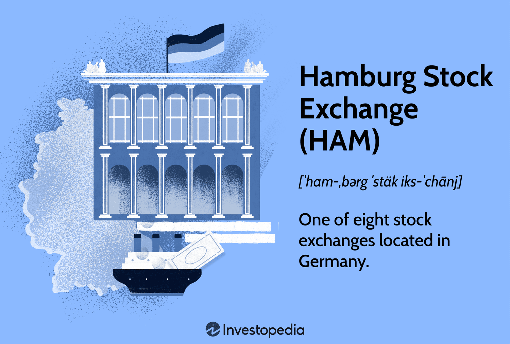

The Hamburg Stock Exchange (HAM) plays a crucial role in Germany's financial landscape, known for its historical significance and continued influence in modern trading. Founded in 1558, HAM is the oldest stock exchange in Germany, representing over four centuries of financial evolution. Initially established as a marketplace for goods, the exchange shifted its focus to financial securities in the 19th century, reflecting the increasing importance of financial markets in Europe and globally.

This article traces HAM's transformation from its beginnings as a goods trading hub to a leading modern securities exchange. A key aspect of its development is its strategic collaboration with the Hannover Stock Exchange, forming a unified framework under Börsen AG. This partnership aims to consolidate trading operations, enhance competitive strength, and sustain the relevance of regional exchanges in the German financial ecosystem.



Furthermore, the article examines the growing impact of algorithmic trading on HAM. This technological advancement has reshaped trading dynamics, emphasizing speed, efficiency, and market liquidity. As algorithmic trading becomes more integrated into German financial markets, HAM adapts by embracing these innovations, supported by regulatory frameworks and fintech advancements.

Overall, the Hamburg Stock Exchange not only reflects a storied past but also embodies the constant evolution required to meet contemporary market demands. As algorithmic trading continues to influence market practices, HAM remains a pivotal entity within Germany's financial markets, poised to expand and adapt to future developments.

## Table of Contents

## History of the Hamburg Stock Exchange

The Hamburg Stock Exchange, founded in 1558, stands as the oldest stock exchange in Germany. Its early operations centered around goods trading, reflecting the economic priorities of the era. This initial focus on commodities was typical of early European exchanges, which provided a centralized venue for merchants to trade goods and manage their financial transactions.

The transition from outdoor trading to an indoor facility in 1583 marked a significant advancement in the exchange's infrastructure, offering a more organized and secure environment for traders. This move was necessitated by the increasing [volume](/wiki/volume-trading-strategy) and complexity of trade. Moreover, the construction of a new building in 1841 signified further growth and modernization, accommodating the burgeoning demands of an expanding financial market.

A pivotal moment in the history of the Hamburg Stock Exchange was its shift to financial securities trading in 1815. This transition introduced a new era in the market's development, positioning HAM at the forefront of financial innovation in Germany. By pioneering the introduction of securities trading, the Hamburg Stock Exchange not only broadened its operational focus but also contributed significantly to the evolution of the country's financial markets.

The expansion and evolution of the exchange underscore the growing importance of financial markets in Germany. By adapting to the changing economic landscape, the Hamburg Stock Exchange played a crucial role in facilitating capital formation and economic development. Its historical trajectory highlights the dynamic nature of financial markets and their critical role in supporting economic growth and modernization.

## HAM's Integration with Hannover Stock Exchange

In 1999, the Hamburg Stock Exchange (HAM) underwent a significant transformation by merging with the Hannover Stock Exchange to form Börsen AG. This strategic integration was aimed at consolidating operations to create a more robust and competitive marketplace within the German financial sector. By combining resources and expertise, the merger sought to enhance the efficiency and function of the exchanges, resulting in a stronger presence in the financial ecosystem.

Together, HAM and the Hannover Stock Exchange manage an extensive array of market sectors, offering a wide range of trading options that cater to different investor needs. This diversified approach not only helps in meeting the demands of a varied investor base but also provides stability and resilience to the regional exchanges. The consolidation under Börsen AG reflects a unified strategy to leverage regional strengths, thereby reinforcing the importance of regional exchanges in the broader German financial market.

The collaboration between HAM and the Hannover Stock Exchange underscores the critical role that these regional entities play in supporting the national economy. By pooling their assets and capabilities, these exchanges are better positioned to compete on both a national and international level, thereby attracting more investors and boosting [liquidity](/wiki/liquidity-risk-premium) in the market. This alliance is a clear indication of how regional exchanges can work together to sustain their relevance and competitiveness in the ever-evolving financial landscape.

## Modern Trading at HAM

The Hamburg Stock Exchange (HAM) is a key venue for modern trading, offering an extensive array of over 8,500 securities, encompassing stocks, bonds, and closed-end funds. This broad selection provides investors with diverse opportunities to tailor their portfolios according to individual risk appetites and investment strategies. HAM’s trading environment is characterized by competitive conditions, which include features such as commission-free trades up to specific limits. This aspect is particularly advantageous for cost-conscious investors aiming to maximize their returns.

Trades at HAM are conducted in euros, which underscores the exchange's role in aligning with the broader European financial system. This currency standardization simplifies transactions for eurozone investors and helps mitigate the complexities associated with currency conversion, thus expanding its appeal to a wider investor base.

The exchange operates on weekdays from 8:00 a.m. to 8:00 p.m. This expansive trading window not only accommodates the schedules of domestic and international investors but also enhances the opportunity for real-time responses to global market events. The accessibility of the Hamburg Stock Exchange during these hours promotes increased market participation, potentially leading to higher liquidity.

A distinct characteristic of HAM's platform is its neutral stance in offering trading services. This means while it provides essential trading infrastructure and resources, it refrains from making investment recommendations to participants. Such an approach ensures that the exchange maintains an impartial role, allowing investors to make informed decisions based on individual research and market analysis rather than guidance from the exchange itself. 

Thus, the Hamburg Stock Exchange stands out in the German financial market by combining traditional trading strengths with modern advancements, offering a comprehensive and efficient trading experience.

## Algorithmic Trading in German Financial Markets

Algorithmic trading has emerged as a significant trend within German financial markets, prioritizing speed and efficiency. This transformative approach leverages computer algorithms to execute trades at unimaginable velocities, often processing multiple transactions in fractions of a second. These algorithms analyze numerous market variables and execute trades based on pre-defined criteria, enabling traders to capitalize on market opportunities more effectively than human intervention alone could allow.

Hamburg Stock Exchange (HAM), along with other prominent German exchanges, has embraced [algorithmic trading](/wiki/algorithmic-trading) to boost liquidity and market dynamics. The increased liquidity is achieved by narrowing the bid-ask spreads, thereby enhancing market efficiency. This process fosters a more robust trading environment where large volumes of transactions can be processed swiftly without significantly impacting market prices.

The advent of algorithmic trading in Germany has been facilitated by a supportive regulatory framework and rapid advancements in financial technology. Regulatory bodies have crafted guidelines to ensure that the deployment of trading algorithms remains fair and transparent, mitigating the risk of market manipulation. Compliance with these frameworks is crucial to maintaining market integrity. Key regulations, such as the EU's Markets in Financial Instruments Directive II (MiFID II), establish stringent reporting and testing requirements for algorithmic trading systems, ensuring that they operate within safe parameters.

In addition to regulations, ongoing advancements in financial technology (fintech) have bolstered the expansion of algorithmic trading. Enhanced processing power and sophisticated algorithmic models allow for the execution of complex trading strategies, optimizing results for traders and investors alike. High-frequency trading ([HFT](/wiki/high-frequency-trading-strategies)), a subset of algorithmic trading, exemplifies this trend, as it exploits short-lived market inefficiencies.

Traders utilize algorithms not only for executing large-scale transactions but also to minimize market impact. By breaking down sizable trades into smaller parts and executing them over time, these algorithms reduce the potential disturbance such trades might have on market prices. This methodology ensures that trades are executed at optimal prices, enhancing overall trade effectiveness.

The continuous evolution of algorithmic trading methodologies promises further enhancements in market efficiency and trading strategies. As technology progresses, German financial markets, supported by HAM's initiatives, are poised to capitalize on these advancements, maintaining a competitive edge in the global financial landscape.

## Challenges and Opportunities in Algorithmic Trading

Algorithmic trading at the Hamburg Stock Exchange (HAM) is an integral component of the modern financial landscape, presenting both challenges and opportunities. One of the primary challenges lies in regulatory concerns, especially regarding the risks of market manipulation. HAM addresses these concerns by ensuring compliance with stringent guidelines aimed at maintaining a fair and transparent trading environment. The regulatory framework includes measures to detect and prevent manipulative practices such as spoofing and layering, where traders place fake orders to mislead the market about supply and demand.

Python code can be utilized to demonstrate how algorithmic trading strategies can be monitored for compliance. For instance, algorithms can be designed to automatically flag or restrict orders that do not adhere to set guidelines.

```python
def monitor_orders(order):
    if order.is_spoofing() or order.does_not_comply_with_guidelines():
        flag_order(order)
```

Despite these challenges, algorithmic trading also offers significant opportunities. One of its key benefits is the enhancement of market efficiency. Algorithmic trading platforms can process vast amounts of data at speeds unattainable by human traders, leading to more accurate pricing and liquidity provision.

Furthermore, the use of algorithms facilitates the development of innovative trading strategies. By leveraging [machine learning](/wiki/machine-learning) techniques and predictive analytics, traders can devise strategies that adapt to market conditions in real-time. This level of sophistication in trading strategies can offer a competitive edge in a dynamic market environment.

The future of algorithmic trading at HAM appears promising, driven by continuous advancements in technology. Developments in [artificial intelligence](/wiki/ai-artificial-intelligence) and big data are expected to further enhance trading algorithms, possibly leading to unprecedented levels of market efficiency and enabling new forms of trading strategies.

As technology evolves, HAM stands poised to integrate these advancements, ensuring that it remains a competitive and efficient marketplace. The exchange's commitment to embracing technology, while simultaneously managing regulatory challenges, positions it well to capitalize on the opportunities presented by algorithmic trading.

## Conclusion

The Hamburg Stock Exchange (HAM) remains a vital entity within Germany's financial architecture, illustrating both historical significance and futuristic readiness. Its robust legacy, originating from its establishment in 1558, underscores a capacity for adaptation, transitioning from a goods-based marketplace to a pioneering securities exchange. This adaptability is further evidenced by HAM's embrace of algorithmic trading technologies, which enhance trading speed, efficiency, and liquidity.

Algorithmic trading is central to HAM's strategy to maintain competitiveness and operational efficiency. By utilizing advanced algorithms, traders at HAM execute transactions with precision, optimizing market dynamics and minimizing the impact of large-scale trades. This approach not only aligns with global trends in financial technology but also ensures that HAM remains a leader in modern trading techniques.

Looking ahead, as Germany's economy continues to flourish, the Hamburg Stock Exchange is poised to extend its influence. Its ongoing investment in technology and innovative trading methods positions HAM favorably for future growth. This commitment to evolution ensures that HAM will continue playing an instrumental role in supporting Germany's economic expansion. As such, the exchange is well-prepared to navigate and lead within the dynamic landscape of global finance.

## References & Further Reading

[1]: ["Börsen AG Consolidation - The Merger of Hamburg and Hannover Stock Exchanges"](https://en.wikipedia.org/wiki/Hamburg_Stock_Exchange) - Börsen AG Official Website

[2]: Gomber, P., Arndt, B., Lutat, M., & Uhle, T. (2011). ["High-Frequency Trading."](https://papers.ssrn.com/sol3/papers.cfm?abstract_id=1858626) Journal of Business Economics, 81(2), 161-193.

[3]: Narang, R. (2013). ["Inside the Black Box: A Simple Guide to Quantitative and High Frequency Trading."](https://onlinelibrary.wiley.com/doi/book/10.1002/9781118662717) Wiley Finance.

[4]: MiFID II Regulations. ["Markets in Financial Instruments Directive II (MiFID II)"](https://www.esma.europa.eu/publications-and-data/interactive-single-rulebook/mifid-ii) - European Securities and Markets Authority (ESMA).

[5]: Aldridge, I. (2013). ["High-Frequency Trading: A Practical Guide to Algorithmic Strategies and Trading Systems."](https://www.amazon.com/High-Frequency-Trading-Practical-Algorithmic-Strategies/dp/1118343506) Wiley Trading.