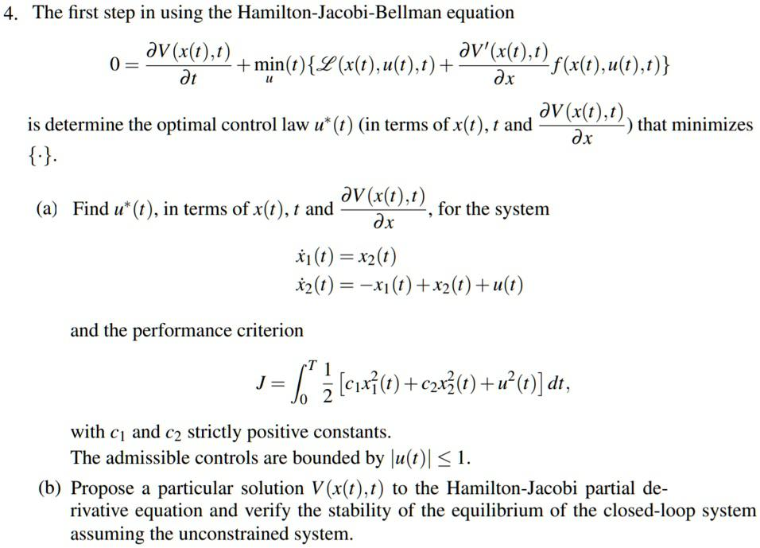

The Hamilton-Jacobi-Bellman (HJB) equation is a cornerstone in control theory, embodying the principles necessary for determining optimal control strategies. As a nonlinear partial differential equation, it provides a comprehensive framework for optimizing decision-making processes, ensuring that a given system operates at its most efficient state. The essence of the HJB equation lies in its ability to compute the value function, which represents the minimal cost associated with controlling a system from a specific state. By continuously adjusting control strategies, the HJB equation facilitates the realization of objectives such as minimizing cost or maximizing returns over time.

In recent years, the HJB equation has been particularly influential in algorithmic trading, an area where decision-making speed and precision are paramount. Algorithmic trading harnesses the power of algorithms to make decisions regarding the buying and selling of securities, based on predefined criteria. Through the application of the HJB equation, traders can derive optimal trading strategies that maximize profit or minimize risk, depending on the desired financial objectives. By calculating the value function, the HJB equation identifies the controls that will yield the best possible outcome under given market conditions. This optimization process is crucial in high-frequency trading, where decisions are executed in fractions of a second.



Throughout this article, we explore various applications and implications of the HJB equation in trading, elucidating how it enhances decision-making in an ever-evolving financial landscape. Understanding its foundational role provides insights into how algorithmic traders leverage this powerful equation to stay competitive.

## Table of Contents

## Understanding the Hamilton-Jacobi-Bellman Equation

The Hamilton-Jacobi-Bellman (HJB) equation is a fundamental concept in optimal control theory, encapsulating the essence of decision-making processes aimed at optimizing control strategies. At its core, the HJB equation is a nonlinear partial differential equation, crucial for providing both necessary and sufficient conditions to determine the optimality of a control process.

The genesis of the HJB equation can be traced to the need for formalizing optimal control problems, which are characterized by the objective of minimizing or maximizing a certain cost or reward function over time. These problems involve finding a sequence of decisions or controls that optimize the expected value of a function of the state and control vectors over a given time horizon. The HJB equation encapsulates this by expressing the relationship between the current value of the optimal control problem and the best possible control actions at any point in time.

Mathematically, the HJB equation is derived by considering the principle of dynamic programming. For a controlled dynamic system described by the state $x(t)$ at time $t$ and governed by differential equations such as $\dot{x}(t) = f(x(t), u(t), t)$, with a control function $u(t)$, the control objective is often to minimize a cost functional of the form:

$$
J(u) = \int_{t_0}^{T} L(x(t), u(t), t) \, dt + g(x(T)),
$$

where $L$ is the running cost rate and $g$ is the terminal cost. The value function $V(x, t)$ represents the minimum cost-to-go from state $x$ at time $t$ and satisfies the HJB equation:

$$
\frac{\partial V}{\partial t} + \min_{u} \left\{ L(x, u, t) + \nabla V \cdot f(x, u, t) \right\} = 0,
$$

subject to the boundary condition $V(x(T), T) = g(x(T))$.

Solving the HJB equation involves determining the control $u^*$ that minimizes the Hamiltonian:

$$
H(x, u, \nabla V, t) = L(x, u, t) + \nabla V \cdot f(x, u, t).
$$

The minimization of the Hamiltonian provides the optimal control policy $u^*(x, t)$, which in turn helps in deriving the solution to the HJB equation. The complexity of solving the HJB equation analytically necessitates numerical methods and approximations, particularly for higher-dimensional systems or systems with non-linear dynamics.

In summary, the Hamilton-Jacobi-Bellman equation serves as a critical tool in the formulation and solution of optimal control problems, bridging the gap between theoretical constructs and practical solutions through a precise mathematical framework.

## HJB Equation in Optimal Control Problems

Optimal control problems are concerned with determining a control policy that minimizes or maximizes a certain performance criterion over time. The Hamilton-Jacobi-Bellman (HJB) equation serves as a fundamental tool for addressing these problems by providing a framework for deriving the optimal control law. 

The HJB equation is derived from the principles of dynamic programming introduced by Richard Bellman. It is expressed as a nonlinear partial differential equation that defines the necessary conditions for optimality. The solution to this equation yields the value function, which represents the minimal cost associated with a given state when starting from that state and following the optimal policy thereafter.

In the context of optimal control problems, two key components are the state vector and the control vector. The state vector, denoted as $\mathbf{x}(t)$, represents the variables of the system that are to be controlled. The control vector, $\mathbf{u}(t)$, represents the set of control actions to be applied to the system. The evolution of the state vector over time is governed by a system of differential equations:

$$
\frac{d\mathbf{x}(t)}{dt} = f(\mathbf{x}(t), \mathbf{u}(t), t)
$$

where $f$ is a function describing the system dynamics.

The value function $V(\mathbf{x}, t)$ is defined as the minimum cost incurred from time $t$ to a terminal time $T$, when starting in state $\mathbf{x}(t) = \mathbf{x}$. The cost is typically represented by an integral of a running cost function $c(\mathbf{x}, \mathbf{u}, t)$ over time, plus a terminal cost $\phi(\mathbf{x}(T))$:

$$
V(\mathbf{x}, t) = \min_{\mathbf{u}(\cdot)} \left[ \int_{t}^{T} c(\mathbf{x}(s), \mathbf{u}(s), s) \, ds + \phi(\mathbf{x}(T)) \right]
$$

The HJB equation provides a way to directly compute the value function:

$$
-\frac{\partial V}{\partial t} = \min_{\mathbf{u}}\left[ c(\mathbf{x}, \mathbf{u}, t) + \nabla V \cdot f(\mathbf{x}, \mathbf{u}, t) \right]
$$

This equation is solved backward in time from the terminal condition $V(\mathbf{x}, T) = \phi(\mathbf{x})$. The optimal control $\mathbf{u}^{*}(t)$ is the one that satisfies the minimization in the HJB equation. Therefore, the HJB equation not only provides conditions for optimality but also serves as a method to compute both the optimal cost and the corresponding control policy.

Solving the HJB equation analytically is often challenging due to its nonlinear nature and the dimensionality of the problem. Therefore, numerical methods and approximations are frequently employed, such as finite difference approximations, policy iteration, and value iteration algorithms. These techniques enable the practical computation of optimal strategies in real-world scenarios, where the complexity of the system might otherwise render analytical solutions infeasible.

## Extension to Stochastic Control Problems

Stochastic systems are those where uncertainty and randomness are integral components, in contrast to deterministic systems which operate under predictable dynamics. In deterministic systems, the future states of the system are determined by known initial conditions and control actions; there is no room for randomness. However, stochastic systems incorporate randomness directly into their models, leading to equations and systems where the output is not a singular, assured outcome but a probability distribution of possible outcomes. This fundamental difference necessitates different tools for analysis and control.

The Hamilton-Jacobi-Bellman (HJB) equation is pivotal in optimizing decision-making in stochastic environments. In stochastic control problems, the HJB equation becomes a nonlinear partial differential equation that incorporates probabilistic elements. Its solution provides the optimal control policy by minimizing the expected value of a cost function over time, taking into account the uncertainties inherent in the system's dynamics.

Consider a stochastic differential equation (SDE) that governs the dynamics of a system:

$$
dX_t = f(X_t, u_t) \, dt + \sigma(X_t, u_t) \, dW_t
$$

where $X_t$ is the state vector, $u_t$ is the control input, $f$ represents the deterministic part of the system's drift, $\sigma$ represents the diffusion term, and $W_t$ is a Wiener process. The goal is to minimize a cost functional:

$$
J(u) = \mathbb{E} \left[ \int_0^T L(X_t, u_t) \, dt + g(X_T) \right]
$$

Here, $L$ is the running cost and $g$ is the terminal cost. The corresponding stochastic HJB equation is:

$$
V_t + \min_u \left\{ L(X_t, u) + (f(X_t, u) \cdot \nabla V) + \frac{1}{2} \text{Tr}(\sigma(X_t, u) \sigma^T(X_t, u) \nabla^2 V) \right\} = 0
$$

where $V(X_t, t)$ is the value function representing the minimum expected cost, $\nabla V$ is the gradient of $V$, and $\nabla^2 V$ is the Hessian matrix.

An example application of the HJB equation in stochastic control is in finance, particularly in option pricing problems. The famous Black-Scholes model can be viewed as a direct application of the stochastic HJB framework. The Black-Scholes differential equation is derived by considering the stochastic dynamics of an underlying asset and seeking the optimal strategy to replicate a given financial option.

Another area where the HJB equation is applied is in inventory management under uncertainty. Firms must decide on the optimal reorder levels for stock considering fluctuating demand and supply chain issues modeled as stochastic processes. By solving the stochastic HJB equation, firms can derive policies that minimize the expected cumulative cost of ordering, holding, and stockout penalties over time.

In conclusion, the extension of the HJB equation to stochastic systems allows for the development of optimal control strategies in scenarios characterized by uncertainty. Its applications in finance and operations research highlight its significance as a powerful tool for decision-making in complex, uncertain environments.

## Application to Algorithmic Trading

Algorithmic trading refers to the use of algorithms to make trading decisions and execute trades at speeds and frequencies that are beyond human capabilities. Within this domain, the Hamilton-Jacobi-Bellman (HJB) equation is a powerful tool that helps in determining optimal trading strategies by solving complex decision-making problems over time.

The HJB equation is pivotal in identifying optimal trading strategies, especially when dealing with high-frequency data and rapid execution demands. The primary goal here is to maximize expected returns while minimizing associated risks and costs over a specified time horizon. This is achieved by modeling the trading problem as an optimal control problem where the evolution of asset prices and the corresponding trading actions are governed by stochastic processes.

In mathematical terms, the problem often involves optimizing a value function $V(t, x)$, which denotes the maximum expected utility of an investor starting at time $t$ with a state $x$. The HJB equation provides a condition for this optimization:

$$
\sup_{u} \left\{ \frac{\partial V}{\partial t} + \mathcal{L}^uV + f(t, x, u) \right\} = 0
$$

Here, $\mathcal{L}^u$ is the generator of the controlled stochastic process, $u$ represents the control variable, and $f(t, x, u)$ is the running cost which needs to be minimized.

In high-frequency trading ([HFT](/wiki/high-frequency-trading-strategies)), the advantages of using the HJB equation are particularly pronounced. HFT requires extremely rapid decision-making, reacting to market changes within milliseconds. By formulating the trading strategy as an HJB problem, traders can dynamically adjust their strategies in real time to optimize performance. This is essential for capturing small price disparities across markets, hedge risk exposures, and managing trading inventory levels effectively.

One of the significant advantages of applying the HJB equation in [algorithmic trading](/wiki/algorithmic-trading) is its ability to manage and optimize the risk-return trade-off. By considering all stochastic elements affecting asset prices, traders can devise strategies that are not only beneficial in optimizing profitability but also in maintaining risk within acceptable levels.

Moreover, in the context of HFT, the computational efficiency of HJB solutions benefits from advances in numerical methods and modern computing power. Methods such as finite difference schemes and the application of [machine learning](/wiki/machine-learning) algorithms like [reinforcement learning](/wiki/reinforcement-learning) can be employed to approximate solutions to the HJB equation, facilitating real-time applications in trading environments.

In summary, the HJB equation enhances algorithmic trading by providing a structured mathematical framework to devise and implement optimal trading strategies that are capable of responding effectively to the fast-paced and stochastic nature of financial markets. Its application in high-frequency trading settings underscores its value in improving trading efficiency and profitability, demonstrating why it is a critical component of modern trading systems.

## Challenges and Solutions

Solving the Hamilton-Jacobi-Bellman (HJB) equation in high complexity systems poses significant challenges due to the nonlinear nature of the equation and the high dimensionality often involved in practical applications. These difficulties arise particularly in financial systems like algorithmic trading, where rapid decision-making and precision are crucial.

The HJB equation is inherently complex because it is a nonlinear partial differential equation (PDE) requiring the calculation of a value function that encapsulates the trade-offs between immediate costs and future rewards. As the dimensionality of the problem increases, the computational burden grows exponentially, a phenomenon known as the "curse of dimensionality". This makes it infeasible to employ straightforward analytical methods for solutions, necessitating the use of numerical approaches and approximations.

Numerical methods such as finite difference methods, finite element methods, and spectral methods are commonly employed to discretize the HJB equation. These techniques involve approximating the continuous state space with a grid, which simplifies the PDE into a system of algebraic equations that can be solved using numerical algorithms. However, these methods can be computationally intensive, especially for high-dimensional spaces, and may lead to inaccuracies unless the grid is sufficiently fine, which further exacerbates computational demand.

To overcome the limitations of traditional numerical methods, contemporary approaches incorporate artificial neural networks (ANNs) and approximate dynamic programming (ADP). ANNs offer a powerful framework for function approximation, making them suitable for estimating the value function in the HJB equation. These networks are capable of handling large-scale data, learning complex patterns, and generalizing well to new scenarios, which can be leveraged to better approximate solutions to the HJB equation. A [neural network](/wiki/neural-network) can be trained to approximate the value function $V(x)$ by minimizing the error in satisfying the HJB equation over a sampling of the state space.

Moreover, ADP is used to iteratively improve policy decisions by approximating the optimal strategy in a step-by-step manner. This approach uses the concept of value iteration, where neural networks can help approximate the value functions or policy functions, thereby refining control policies iteratively. The combination of ADP and neural networks can thus enable more efficient exploration of the state and control spaces, reducing computational requirements and enhancing the tractability of solving the HJB equation.

An example of the integration of ANNs in solving the HJB equation can be illustrated with the following Python pseudocode using TensorFlow:

```python
import tensorflow as tf

# Define the neural network model to approximate the value function
model = tf.keras.Sequential([
    tf.keras.layers.Dense(units=64, activation='relu', input_shape=(state_dim,)),
    tf.keras.layers.Dense(units=64, activation='relu'),
    tf.keras.layers.Dense(units=1)
])

# Compile the model with a suitable optimizer and loss function
model.compile(optimizer='adam', loss='mse')

# Train the model using the sampled states and calculated targets, derived from the HJB
model.fit(states_sampled, targets, epochs=100)

# Use the trained model to estimate the value function
value_function_approx = model.predict(new_states)
```

This methodological synergy enhances the ability to address the curse of dimensionality, providing effective solutions to complex optimal control problems as encountered in algorithmic trading and other high-fidelity dynamic systems.

## Conclusion

The Hamilton-Jacobi-Bellman (HJB) equation holds a pivotal position in control theory, offering essential tools for optimizing decision-making processes, especially in the dynamic landscape of algorithmic trading. As a nonlinear partial differential equation, the HJB equation provides a framework for determining optimal control strategies that can significantly enhance the efficiency and effectiveness of trading systems. By guiding the development of optimal policies, the HJB equation enables traders to make informed decisions that balance risk and reward over time, crucial in achieving financial objectives.

Looking forward, the potential applications of the HJB equation extend beyond contemporary trading paradigms. With the continuous evolution of financial markets and the increasing complexity of trading instruments, the HJB equation can catalyze advancements in algorithmic trading. Its integration with emerging technologies such as [artificial intelligence](/wiki/ai-artificial-intelligence) and machine learning offers promising research avenues. These technologies have the potential to enhance the computational solving of the HJB equation, offering more accurate and efficient solutions tailored for real-time trading applications.

Moreover, the exploration of HJB in areas such as portfolio optimization, risk management, and derivative pricing is poised to expand. As markets become more data-driven and interconnected, the ability to implement sophisticated mathematical models like the HJB equation will be indispensable in crafting strategies that are both adaptive and resilient.

In conclusion, the impact of the Hamilton-Jacobi-Bellman equation on algorithmic trading is profound. It not only reinforces the importance of mathematical models in strategic decision-making but also sets the stage for future innovations in trading technologies. As technological advancements continue to reshape the financial landscape, the HJB equation will likely remain a cornerstone in developing robust trading strategies that navigate the complexities of global markets.

## References & Further Reading

[1]: Bellman, R. (1957). ["Dynamic Programming."](https://archive.org/details/dynamicprogrammi0000bell) Princeton University Press.

[2]: Fleming, W. H., & Rishel, R. W. (1975). ["Deterministic and Stochastic Optimal Control."](https://link.springer.com/book/10.1007/978-1-4612-6380-7) Springer Verlag.

[3]: Øksendal, B. (2003). ["Stochastic Differential Equations: An Introduction with Applications."](https://link.springer.com/book/10.1007/978-3-642-14394-6) Springer.

[4]: Bertsekas, D. P. (1995). ["Dynamic Programming and Optimal Control, Vol. I."](https://www.researchgate.net/publication/224773123_Dynamic_Programming_and_Optimal_Control) Athena Scientific.

[5]: Sutton, R. S., & Barto, A. G. (2018). ["Reinforcement Learning: An Introduction."](https://ieeexplore.ieee.org/book/6267343) MIT Press.

[6]: Merton, R. C. (1973). ["Theory of Rational Option Pricing."](https://dspace.mit.edu/bitstream/handle/1721.1/49331/theoryofrational00mert.pdf?sequence=1) The Bell Journal of Economics and Management Science, 141-183.

[7]: Basar, T., & Olsder, G. J. (1999). ["Dynamic Noncooperative Game Theory."](https://epubs.siam.org/doi/book/10.1137/1.9781611971132) SIAM.

[8]: Marx, L. S. (2000). ["Capital Markets: Institutions and Instruments."](https://archive.org/details/isbn_9780130090683) Prentice Hall.