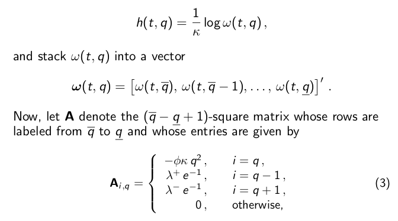

## Table of Contents

## What is the Hamilton-Jacobi-Bellman (HJB) equation?

The Hamilton-Jacobi-Bellman (HJB) equation is a mathematical tool used in control theory and optimization. It helps us find the best way to control a system over time to get the best outcome. Imagine you're driving a car and want to reach your destination as quickly as possible. The HJB equation helps you figure out the best route and speed to use at every moment of your journey.

In simple terms, the HJB equation looks at all possible actions you can take at any given time and calculates which action will lead to the best result in the future. It's like a guide that tells you the best decision to make right now, considering what might happen later. This equation is very useful in fields like economics, engineering, and robotics, where making the right decisions over time is important.

## How does the HJB equation relate to optimal control theory?

The HJB equation is a key part of optimal control theory, which is all about finding the best way to control a system to get the best results. In optimal control, you want to make decisions that lead to the best outcome over time. The HJB equation helps by giving you a way to figure out what those decisions should be at every step. It does this by looking at all possible actions you can take right now and figuring out which one will lead to the best future results.

Think of it like playing a video game where you need to collect as many points as possible. At each moment, you have different moves you can make. The HJB equation helps you choose the move that will give you the highest score in the end. By solving the HJB equation, you can create a strategy that tells you exactly what to do at each point in the game to win. This makes the HJB equation a powerful tool in optimal control theory, helping to guide decisions in complex systems.

## Can you explain the basic mathematical formulation of the HJB equation?

The HJB equation is a way to figure out the best way to control a system over time. Imagine you have a system with a state, which you can think of as where the system is right now, and a control, which is what you can do to change the state. The HJB equation uses something called a value function, which tells you how good it is to be in a certain state. The goal is to find the best control that makes the value function as high as possible over time. The equation looks at the current state and control, and predicts how the value function will change in the future based on the choices you make now.

In math, the HJB equation is written as a partial differential equation. It involves the value function, which we call V(x,t), where x is the state and t is time. The equation says that the rate of change of V over time, plus the best control you can pick right now, equals zero. This means you're always looking for the control that makes the value function grow as much as possible. Solving this equation gives you a rule for choosing the best control at every moment, leading to the best overall outcome for your system.

## What are the key components of the HJB equation?

The HJB equation has a few main parts that help us figure out the best way to control a system. One key part is the value function, often called V(x,t). This function tells us how good it is to be in a certain state at a certain time. The value function depends on the state of the system, which we call x, and time, which we call t. The goal is to make this value function as high as possible over time by choosing the right actions.

Another important part is the control, which we can think of as the actions we take to change the state of the system. The HJB equation looks at all possible controls and picks the one that makes the value function grow the most. This is done by solving a special kind of math problem called a partial differential equation. The equation balances the rate at which the value function changes over time with the best control we can choose right now, aiming to make the overall outcome as good as possible.

## How is the HJB equation derived?

The HJB equation comes from a big idea in math called dynamic programming. Dynamic programming is about breaking a big problem into smaller pieces and solving them step by step. Imagine you want to get to the top of a mountain. You can think about the whole trip at once, or you can break it into smaller steps, like reaching the first base camp, then the second, and so on. The HJB equation uses this idea to find the best way to control a system over time. It starts by looking at the end goal and works backward, figuring out the best action to take at each step to reach that goal.

To get the HJB equation, we use something called the principle of optimality. This principle says that whatever the best way to do something is, it should also be the best way to do the last part of it. So, if you're trying to get to the top of the mountain, the best way to get there should also be the best way to get to the last part of the climb. By using this idea, we can write down a math equation that looks at the current state of the system and all the possible actions you can take. The equation then picks the action that makes the future look the best, based on how it affects the value function, which tells us how good it is to be in a certain state. This is how we end up with the HJB equation, which helps us find the best control for our system at every moment.

## What are some common methods used to solve the HJB equation?

Solving the HJB equation can be tricky, but there are some common methods that help. One popular way is to use numerical methods, like the finite difference method. This method breaks down the problem into a grid and solves it step by step on a computer. Imagine you're trying to find the best path through a maze. You can divide the maze into small squares and check each square to see which direction leads to the [exit](/wiki/exit-strategy) the fastest. This is similar to how the finite difference method works with the HJB equation.

Another method is to use approximation techniques, like the method of characteristics. This method looks at how the value function changes along certain paths in the system. It's like following a river to see where it leads. By tracking these paths, you can get a good idea of how to solve the HJB equation without having to solve it exactly everywhere. Both of these methods help make solving the HJB equation more manageable, even though it can still be a complex task.

## Can you provide an example of a simple problem solved using the HJB equation?

Imagine you're saving money for a big trip. You want to figure out the best way to save over time so you can go on the trip as soon as possible. The HJB equation can help you with this. It looks at how much money you have now, how much you can save each month, and how much your savings will grow with interest. The goal is to find the best amount to save each month that gets you to your trip the fastest.

In this example, the state of the system is how much money you have saved, and the control is how much you decide to save each month. The HJB equation helps you figure out the best saving strategy by looking at all possible amounts you could save and [picking](/wiki/asset-class-picking) the one that leads to the trip the quickest. By solving the HJB equation, you might find that saving a certain amount each month, while considering the interest you earn, is the best way to reach your goal. This way, the HJB equation turns a complex problem into a clear plan for action.

## What are the challenges in solving the HJB equation numerically?

Solving the HJB equation on a computer can be tough. One big challenge is that the equation often involves a lot of math, and computers can only handle so much at once. The HJB equation looks at how things change over time and across different states, which means you need to break the problem into tiny pieces to solve it. This can make the computer work really hard, and sometimes it might not have enough memory or power to finish the job.

Another challenge is making sure the solution is accurate. When you break the problem into small pieces, you might miss some important details, and this can lead to mistakes in the final answer. It's like trying to draw a perfect circle by connecting lots of tiny straight lines – the more lines you use, the closer you get to a circle, but it's never quite perfect. So, you need to find a good balance between using enough pieces to get a good answer and not using so many that the computer gets overwhelmed.

## How does the HJB equation apply to stochastic control problems?

The HJB equation is super important when you're dealing with stochastic control problems. These are situations where things can happen randomly, like the stock market going up or down. In this case, the HJB equation helps you make the best decisions even when you're not sure what will happen next. It does this by figuring out the value of being in a certain state, taking into account all the possible random events that could happen. The equation looks at your current situation and all the choices you can make, and it tells you which choice will likely lead to the best outcome, even with all the uncertainty.

For example, imagine you're investing money and the value of your investments can go up or down randomly. The HJB equation can help you decide how much to invest at any given time to make the most money in the long run. It considers the current value of your investments, the possible future changes due to market randomness, and your investment choices. By solving the HJB equation, you can come up with a strategy that tells you the best amount to invest at each step, helping you navigate the ups and downs of the market to reach your financial goals.

## What is the relationship between the HJB equation and dynamic programming?

The HJB equation and dynamic programming are closely linked because they both help you solve problems by breaking them into smaller, easier parts. Dynamic programming is a way of solving big problems by looking at the smaller steps you need to take to get to the end goal. It's like planning a trip by figuring out the best way to reach each stop along the way. The HJB equation uses this idea to find the best way to control a system over time. It looks at the current situation and all the choices you can make, then picks the best choice to move forward.

The HJB equation comes from the principle of optimality, which is a big part of dynamic programming. This principle says that the best way to solve a problem should also be the best way to solve the last part of it. So, if you want to get to the top of a mountain, the best path to the top should also be the best way to reach the last part of the climb. By using this idea, the HJB equation helps you figure out the best action to take at each step, considering how it will affect your future steps. This makes the HJB equation a powerful tool in dynamic programming, helping you make the best decisions over time to reach your goal.

## How can the HJB equation be extended to multi-agent systems?

The HJB equation can be used in multi-agent systems, where more than one person or thing is making decisions at the same time. Imagine a game where several players are trying to win by making the best moves. The HJB equation can help each player figure out the best action to take, considering what the other players might do. It does this by looking at the current situation of all players and calculating the best strategy for each one, taking into account the possible actions of others. This makes the problem more complex because you need to think about how the decisions of different players interact with each other.

To extend the HJB equation to multi-agent systems, you need to consider the value function for each agent. Each agent has their own value function that depends on their state and the states of other [agents](/wiki/agents). The HJB equation for each agent looks at how their own actions and the actions of others affect their value function over time. By solving these equations together, you can find a set of strategies that leads to the best outcome for all agents. This is like playing a team sport where each player needs to work together to win, and the HJB equation helps them coordinate their actions to achieve the best result.

## What are some advanced techniques or recent developments in solving the HJB equation?

Solving the HJB equation has gotten a lot better thanks to new techniques and recent developments. One cool way is using machine learning. Imagine teaching a computer to play a game by showing it lots of examples. Machine learning can help solve the HJB equation by learning from lots of data and finding patterns that help make better decisions. This can make solving the equation faster and more accurate, especially when things are very complex or there's a lot of randomness involved.

Another advanced technique is using something called the Deep Galerkin Method (DGM). This method uses a special kind of math called neural networks to solve the HJB equation. It's like using a super smart calculator that can figure out really hard problems by breaking them down into smaller parts. DGM is good at handling the tricky parts of the HJB equation, like when the system changes a lot over time or when there are many different states to consider. These new methods are making it easier to solve the HJB equation and use it in more places, like robotics and finance.

## What is the Hamilton-Jacobi-Bellman Equation and how can it be understood?

The Hamilton-Jacobi-Bellman (HJB) equation is a fundamental concept in optimal control theory, encapsulating the essence of decision-making processes aimed at optimizing control strategies. At its core, the HJB equation is a nonlinear partial differential equation, crucial for providing both necessary and sufficient conditions to determine the optimality of a control process.

The genesis of the HJB equation can be traced to the need for formalizing optimal control problems, which are characterized by the objective of minimizing or maximizing a certain cost or reward function over time. These problems involve finding a sequence of decisions or controls that optimize the expected value of a function of the state and control vectors over a given time horizon. The HJB equation encapsulates this by expressing the relationship between the current value of the optimal control problem and the best possible control actions at any point in time.

Mathematically, the HJB equation is derived by considering the principle of dynamic programming. For a controlled dynamic system described by the state $x(t)$ at time $t$ and governed by differential equations such as $\dot{x}(t) = f(x(t), u(t), t)$, with a control function $u(t)$, the control objective is often to minimize a cost functional of the form:

$$
J(u) = \int_{t_0}^{T} L(x(t), u(t), t) \, dt + g(x(T)),
$$

where $L$ is the running cost rate and $g$ is the terminal cost. The value function $V(x, t)$ represents the minimum cost-to-go from state $x$ at time $t$ and satisfies the HJB equation:

$$
\frac{\partial V}{\partial t} + \min_{u} \left\{ L(x, u, t) + \nabla V \cdot f(x, u, t) \right\} = 0,
$$

subject to the boundary condition $V(x(T), T) = g(x(T))$.

Solving the HJB equation involves determining the control $u^*$ that minimizes the Hamiltonian:

$$
H(x, u, \nabla V, t) = L(x, u, t) + \nabla V \cdot f(x, u, t).
$$

The minimization of the Hamiltonian provides the optimal control policy $u^*(x, t)$, which in turn helps in deriving the solution to the HJB equation. The complexity of solving the HJB equation analytically necessitates numerical methods and approximations, particularly for higher-dimensional systems or systems with non-linear dynamics.

In summary, the Hamilton-Jacobi-Bellman equation serves as a critical tool in the formulation and solution of optimal control problems, bridging the gap between theoretical constructs and practical solutions through a precise mathematical framework.

## What is the role of the HJB Equation in Optimal Control Problems?

Optimal control problems are concerned with determining a control policy that minimizes or maximizes a certain performance criterion over time. The Hamilton-Jacobi-Bellman (HJB) equation serves as a fundamental tool for addressing these problems by providing a framework for deriving the optimal control law. 

The HJB equation is derived from the principles of dynamic programming introduced by Richard Bellman. It is expressed as a nonlinear partial differential equation that defines the necessary conditions for optimality. The solution to this equation yields the value function, which represents the minimal cost associated with a given state when starting from that state and following the optimal policy thereafter.

In the context of optimal control problems, two key components are the state vector and the control vector. The state vector, denoted as $\mathbf{x}(t)$, represents the variables of the system that are to be controlled. The control vector, $\mathbf{u}(t)$, represents the set of control actions to be applied to the system. The evolution of the state vector over time is governed by a system of differential equations:

$$
\frac{d\mathbf{x}(t)}{dt} = f(\mathbf{x}(t), \mathbf{u}(t), t)
$$

where $f$ is a function describing the system dynamics.

The value function $V(\mathbf{x}, t)$ is defined as the minimum cost incurred from time $t$ to a terminal time $T$, when starting in state $\mathbf{x}(t) = \mathbf{x}$. The cost is typically represented by an integral of a running cost function $c(\mathbf{x}, \mathbf{u}, t)$ over time, plus a terminal cost $\phi(\mathbf{x}(T))$:

$$
V(\mathbf{x}, t) = \min_{\mathbf{u}(\cdot)} \left[ \int_{t}^{T} c(\mathbf{x}(s), \mathbf{u}(s), s) \, ds + \phi(\mathbf{x}(T)) \right]
$$

The HJB equation provides a way to directly compute the value function:

$$
-\frac{\partial V}{\partial t} = \min_{\mathbf{u}}\left[ c(\mathbf{x}, \mathbf{u}, t) + \nabla V \cdot f(\mathbf{x}, \mathbf{u}, t) \right]
$$

This equation is solved backward in time from the terminal condition $V(\mathbf{x}, T) = \phi(\mathbf{x})$. The optimal control $\mathbf{u}^{*}(t)$ is the one that satisfies the minimization in the HJB equation. Therefore, the HJB equation not only provides conditions for optimality but also serves as a method to compute both the optimal cost and the corresponding control policy.

Solving the HJB equation analytically is often challenging due to its nonlinear nature and the dimensionality of the problem. Therefore, numerical methods and approximations are frequently employed, such as finite difference approximations, policy iteration, and value iteration algorithms. These techniques enable the practical computation of optimal strategies in real-world scenarios, where the complexity of the system might otherwise render analytical solutions infeasible.

## What are the Extensions to Stochastic Control Problems?

Stochastic systems are those where uncertainty and randomness are integral components, in contrast to deterministic systems which operate under predictable dynamics. In deterministic systems, the future states of the system are determined by known initial conditions and control actions; there is no room for randomness. However, stochastic systems incorporate randomness directly into their models, leading to equations and systems where the output is not a singular, assured outcome but a probability distribution of possible outcomes. This fundamental difference necessitates different tools for analysis and control.

The Hamilton-Jacobi-Bellman (HJB) equation is pivotal in optimizing decision-making in stochastic environments. In stochastic control problems, the HJB equation becomes a nonlinear partial differential equation that incorporates probabilistic elements. Its solution provides the optimal control policy by minimizing the expected value of a cost function over time, taking into account the uncertainties inherent in the system's dynamics.

Consider a stochastic differential equation (SDE) that governs the dynamics of a system:

$$
dX_t = f(X_t, u_t) \, dt + \sigma(X_t, u_t) \, dW_t
$$

where $X_t$ is the state vector, $u_t$ is the control input, $f$ represents the deterministic part of the system's drift, $\sigma$ represents the diffusion term, and $W_t$ is a Wiener process. The goal is to minimize a cost functional:

$$
J(u) = \mathbb{E} \left[ \int_0^T L(X_t, u_t) \, dt + g(X_T) \right]
$$

Here, $L$ is the running cost and $g$ is the terminal cost. The corresponding stochastic HJB equation is:

$$
V_t + \min_u \left\{ L(X_t, u) + (f(X_t, u) \cdot \nabla V) + \frac{1}{2} \text{Tr}(\sigma(X_t, u) \sigma^T(X_t, u) \nabla^2 V) \right\} = 0
$$

where $V(X_t, t)$ is the value function representing the minimum expected cost, $\nabla V$ is the gradient of $V$, and $\nabla^2 V$ is the Hessian matrix.

An example application of the HJB equation in stochastic control is in finance, particularly in option pricing problems. The famous Black-Scholes model can be viewed as a direct application of the stochastic HJB framework. The Black-Scholes differential equation is derived by considering the stochastic dynamics of an underlying asset and seeking the optimal strategy to replicate a given financial option.

Another area where the HJB equation is applied is in inventory management under uncertainty. Firms must decide on the optimal reorder levels for stock considering fluctuating demand and supply chain issues modeled as stochastic processes. By solving the stochastic HJB equation, firms can derive policies that minimize the expected cumulative cost of ordering, holding, and stockout penalties over time.

In conclusion, the extension of the HJB equation to stochastic systems allows for the development of optimal control strategies in scenarios characterized by uncertainty. Its applications in finance and operations research highlight its significance as a powerful tool for decision-making in complex, uncertain environments.

## What is the Application to Algorithmic Trading?

Algorithmic trading refers to the use of algorithms to make trading decisions and execute trades at speeds and frequencies that are beyond human capabilities. Within this domain, the Hamilton-Jacobi-Bellman (HJB) equation is a powerful tool that helps in determining optimal trading strategies by solving complex decision-making problems over time.

The HJB equation is pivotal in identifying optimal trading strategies, especially when dealing with high-frequency data and rapid execution demands. The primary goal here is to maximize expected returns while minimizing associated risks and costs over a specified time horizon. This is achieved by modeling the trading problem as an optimal control problem where the evolution of asset prices and the corresponding trading actions are governed by stochastic processes.

In mathematical terms, the problem often involves optimizing a value function $V(t, x)$, which denotes the maximum expected utility of an investor starting at time $t$ with a state $x$. The HJB equation provides a condition for this optimization:

$$
\sup_{u} \left\{ \frac{\partial V}{\partial t} + \mathcal{L}^uV + f(t, x, u) \right\} = 0
$$

Here, $\mathcal{L}^u$ is the generator of the controlled stochastic process, $u$ represents the control variable, and $f(t, x, u)$ is the running cost which needs to be minimized.

In high-frequency trading ([HFT](/wiki/high-frequency-trading-strategies)), the advantages of using the HJB equation are particularly pronounced. HFT requires extremely rapid decision-making, reacting to market changes within milliseconds. By formulating the trading strategy as an HJB problem, traders can dynamically adjust their strategies in real time to optimize performance. This is essential for capturing small price disparities across markets, hedge risk exposures, and managing trading inventory levels effectively.

One of the significant advantages of applying the HJB equation in [algorithmic trading](/wiki/algorithmic-trading) is its ability to manage and optimize the risk-return trade-off. By considering all stochastic elements affecting asset prices, traders can devise strategies that are not only beneficial in optimizing profitability but also in maintaining risk within acceptable levels.

Moreover, in the context of HFT, the computational efficiency of HJB solutions benefits from advances in numerical methods and modern computing power. Methods such as finite difference schemes and the application of [machine learning](/wiki/machine-learning) algorithms like [reinforcement learning](/wiki/reinforcement-learning) can be employed to approximate solutions to the HJB equation, facilitating real-time applications in trading environments.

In summary, the HJB equation enhances algorithmic trading by providing a structured mathematical framework to devise and implement optimal trading strategies that are capable of responding effectively to the fast-paced and stochastic nature of financial markets. Its application in high-frequency trading settings underscores its value in improving trading efficiency and profitability, demonstrating why it is a critical component of modern trading systems.

## References & Further Reading

[1]: Bellman, R. (1957). ["Dynamic Programming."](https://archive.org/details/dynamicprogrammi0000bell) Princeton University Press.

[2]: Fleming, W. H., & Rishel, R. W. (1975). ["Deterministic and Stochastic Optimal Control."](https://link.springer.com/book/10.1007/978-1-4612-6380-7) Springer Verlag.

[3]: Øksendal, B. (2003). ["Stochastic Differential Equations: An Introduction with Applications."](https://link.springer.com/book/10.1007/978-3-642-14394-6) Springer.

[4]: Bertsekas, D. P. (1995). ["Dynamic Programming and Optimal Control, Vol. I."](https://www.researchgate.net/publication/224773123_Dynamic_Programming_and_Optimal_Control) Athena Scientific.

[5]: Sutton, R. S., & Barto, A. G. (2018). ["Reinforcement Learning: An Introduction."](https://ieeexplore.ieee.org/book/6267343) MIT Press.

[6]: Merton, R. C. (1973). ["Theory of Rational Option Pricing."](https://dspace.mit.edu/bitstream/handle/1721.1/49331/theoryofrational00mert.pdf?sequence=1) The Bell Journal of Economics and Management Science, 141-183.

[7]: Basar, T., & Olsder, G. J. (1999). ["Dynamic Noncooperative Game Theory."](https://epubs.siam.org/doi/book/10.1137/1.9781611971132) SIAM.

[8]: Marx, L. S. (2000). ["Capital Markets: Institutions and Instruments."](https://archive.org/details/isbn_9780130090683) Prentice Hall.