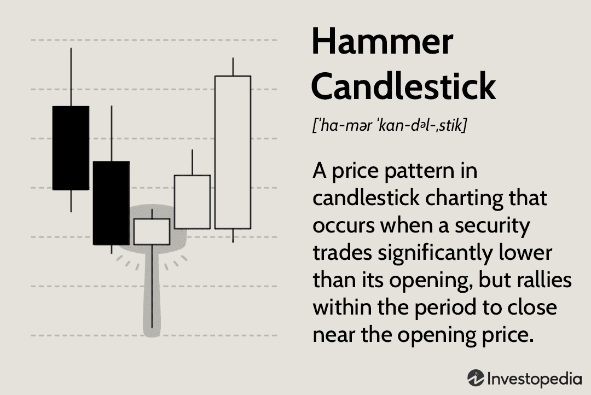

Investing in financial markets requires an understanding of various analytical tools and strategies. Among these tools, the hammer candlestick pattern stands out as a vital component of technical analysis. This pattern is particularly significant because it indicates potential market reversals, often signaling the end of a downward trend and the beginning of an upward movement. Such insights can be crucial for traders looking to optimize their investment strategies.

Algorithmic trading has revolutionized the way trades are executed by integrating technical patterns like the hammer candlestick into automated systems. This approach not only enhances the speed and efficiency of decision-making but also allows traders to capitalize on market movements more effectively. By processing complex data at high speed, algorithmic trading systems can identify these patterns in real-time and make informed, timely trades that align with market conditions.



This article explores the synergy between hammer candlestick technical analysis and algorithmic trading. By merging time-tested analytical methods with cutting-edge technology, traders can achieve more precise and optimal trading outcomes. The harmonious integration of these elements allows for a more comprehensive understanding of market dynamics and the development of robust investment strategies.

## Table of Contents

## Understanding the Hammer Candlestick Pattern

The hammer candlestick pattern is a pivotal element in technical analysis, widely recognized for its distinctive hammer-like shape. This pattern is instrumental for traders seeking indications of a potential bullish reversal in market trends. It predominantly emerges at the culmination of a downward trend, signaling the potential commencement of a bullish turnaround.

### Structure of the Hammer Candlestick Pattern

The hammer candlestick is characterized by a small real body positioned at the upper extremity of the trading range and a significant lower shadow, which ideally should be at least twice the length of the real body. This extended lower shadow demonstrates buyers' control, hinting at the potential shift in market sentiment from bearish to bullish. A hammer can appear in any color, but a white or green hammer, indicating a closing price higher than the opening price, is often seen as more bullish.

### Significance in Technical Analysis

The hammer pattern's significance lies in its potential to predict bullish reversals at the end of a downtrend. When traders recognize this pattern, it suggests that although there was strong selling pressure indicated by the long lower shadow, buyers managed to drive prices back up to close near the high of the session. This broad movement within a single period can signal a stop in the decline, possibly initiating a new upward trajectory.

### Market Psychology

The market psychology underpinning the hammer candlestick pattern reflects a tug-of-war between sellers and buyers. During the formation of this pattern, the asset prices initially fall significantly, indicating the sellers' dominance. However, as the session progresses, buyers regain control, pushing prices back up and creating a small real body at the session's upper end. This price action suggests a shift in sentiment, where buyers are gaining strength and sellers are losing control, encouraging traders to consider a change in trend direction. The hammer pattern is essentially a visual representation of the market's indecision and subsequent transition towards a potential bullish sentiment.

By understanding the hammer candlestick pattern's structure, its role in technical analysis, and the psychology it represents, traders can better interpret market signals and make informed decisions about their entry and [exit](/wiki/exit-strategy) strategies.

## Identifying a Hammer Candlestick Pattern

Recognizing a hammer candlestick pattern is essential for traders employing technical analysis to predict market reversals. The hallmark of a hammer pattern is its distinct visual structure, characterized by a short real body positioned at the upper end of the trading range, accompanied by a long lower shadow. This lower shadow should be at least twice the length of the real body, signifying that buyers have begun to push prices upward after a period of downward pressure.

In technical charting, identifying a hammer pattern involves meticulous attention to the shadow-body ratio. Specifically, the pattern emerges most convincingly when the lower shadow is at least double the size of the real body, with minimal to no upper shadow present. This configuration illustrates a scenario where, despite opening lower, the buying pressure toward the end of the trading period is strong enough to push the closing price above or near the opening price.

When analyzing different time frames, it is crucial to maintain consistency in identifying hammer patterns. Whether examined on hourly, daily, or weekly charts, the core visual criteria remain unchanged: a small real body, a proportionately substantial lower shadow, and little to no upper shadow. This consistency across time frames can help traders determine the potential strength of a bullish reversal signal.

Differentiating a genuine hammer pattern from similar candlestick formations is integral to effective technical analysis. A commonly confused pattern is the "hanging man," which also features a small real body and long lower shadow. However, unlike the hammer, the hanging man appears at the top of an uptrend and signals a potential bearish reversal—a crucial distinction for interpreting market signals correctly.

The table below summarizes the distinctions:

| Feature             | Hammer Pattern                   | Hanging Man Pattern                  |
|---------------------|----------------------------------|--------------------------------------|
| Trend Context       | Appears at the bottom of a downtrend | Appears at the top of an uptrend     |
| Shadow to Body Ratio| Lower shadow at least twice the body | Lower shadow at least twice the body |
| Upper Shadow        | Little to none                    | Little to none                       |
| Market Implication  | Indicates potential bullish reversal | Indicates potential bearish reversal |

Recognizing the subtle differences in candlestick patterns can significantly enhance a trader's ability to interpret market conditions accurately and make informed trading decisions, particularly when using algorithmic systems to automate these recognitions. Employing software platforms can assist in accurately scanning for correct patterns, where algorithms can codify these visual and technical parameters to ensure reliable identification across variable market conditions.

## The Role of Hammer Candlestick in Algo Trading

In [algorithmic trading](/wiki/algorithmic-trading), the hammer candlestick is an essential indicator utilized for identifying potential market reversals. Its distinct shape, characterized by a small body and a long lower shadow, signals a shift in market sentiment from bearish to bullish. The appeal of the hammer pattern in automated trading systems lies in its straightforward identification criteria, allowing for reliable and efficient detection.

Automated trading systems are designed to scan vast datasets across various time frames, seeking the unique structure of the hammer pattern. These systems use predefined criteria to recognize the hammer pattern: the lower shadow must be at least twice the length of the body, and there should be minimal to no upper shadow. These parameters enable algorithms to distinguish hammer patterns from similar candlestick formations, such as the hanging man.

Python, a favored programming language in algorithmic trading, offers robust libraries and tools for pattern recognition. For instance, the `pandas` library can be used to manage and analyze trading data, while `numpy` assists with numerical calculations. The `talib` library, in particular, provides functions for technical analysis, including candlestick pattern identification. Below is a sample Python code snippet for detecting a hammer pattern using the `talib` library:

```python
import pandas as pd
import talib

# Assuming 'data' is a pandas DataFrame with 'Open', 'High', 'Low', 'Close' columns
hammer = talib.CDLHAMMER(data['Open'], data['High'], data['Low'], data['Close'])

# Identify the index of hammer patterns
hammer_indices = data[hammer != 0].index
print("Hammer patterns detected at indices:", hammer_indices)
```

The efficiency of algorithmic detection is further enhanced by integrating the hammer pattern with other technical indicators to confirm signals and reduce false positives. For example, combining the hammer with moving averages or the Relative Strength Index (RSI) can validate the reversal indicated by the pattern.

Automated trading systems can utilize the hammer pattern's signals to trigger buy orders at optimal entry points. By swiftly executing trades when a hammer pattern is confirmed, these systems capitalize on the pattern's reliability to secure advantageous positions before the market fully reverses. This strategic approach to trading enables investors to optimize their returns through highly efficient decision-making processes, enhancing their competitiveness in dynamic financial markets.

## Backtesting the Hammer Candlestick Pattern

Backtesting is a fundamental process for evaluating the effectiveness of the hammer candlestick pattern in predicting bullish reversals in financial markets. It involves applying the pattern to past market data to assess its performance and reliability. The process generally encompasses several key steps and employs various technical platforms like Amibroker and TradingView.

### Process of Backtesting

1. **Data Collection**: The first step entails gathering historical financial data. This data should be high-quality and cover various market conditions to ensure comprehensive testing. Sources might include financial data providers or databases integrated into platforms like Amibroker or TradingView.

2. **Pattern Identification**: Develop an algorithm or a set of rules that can identify the hammer candlestick pattern within the historical data. This pattern is characterized by a small real body at the upper end of the trading range and a long lower shadow.

3. **Backtesting Framework**: Utilize a backtesting framework to apply the pattern-identification rules to historical data. Platforms like TradingView offer script languages such as Pine Script, whereas Amibroker uses AFL (Amibroker Formula Language). Here is a simple example in Python pseudocode using a pandas DataFrame to identify a hammer pattern:

   ```python
   import pandas as pd

   def identify_hammer(df):
       body_size = abs(df['Open'] - df['Close'])
       lower_shadow = df['Low'] - df[['Open', 'Close']].min(axis=1)

       is_hammer = (lower_shadow > 2 * body_size) & (df['Close'] > df['Open'])
       return is_hammer

   # Assuming 'data' is a DataFrame with columns: 'Open', 'High', 'Low', 'Close'
   data['Hammer'] = identify_hammer(data)
   ```

4. **Performance Metrics**: Evaluate the identified pattern using performance metrics such as the hit rate, average return, and risk-adjusted return measures like the Sharpe Ratio.

### Statistical Methods for Validation

To ensure the pattern's reliability, statistical methods can be employed, such as:

- **Significance Testing**: Conduct hypothesis tests to ascertain whether the identified patterns correspond to statistically significant gains or are results of random chance.
- **Cross-Validation**: Use techniques like k-fold cross-validation to assess the model's generalizability and robustness across different data samples.
- **Out-of-Sample Testing**: Vital for preventing overfitting, this involves testing the pattern on data not used during the initial analysis. It helps ascertain the predictive power of the hammer pattern in unseen market conditions.

Out-of-sample testing typically divides the dataset into a training set (for developing the algorithm) and a testing set (to assess performance). The testing data set must not overlap with the training data to ensure objectivity.

### Technical Platforms

- **Amibroker**: An advanced charting and backtesting software that allows custom scripting using AFL. Its robust features enable comprehensive backtesting and optimization of trading strategies.

- **TradingView**: A widely used platform that offers a user-friendly interface and the ability to write custom indicators and strategies using Pine Script. TradingView is accessible for both novice and experienced traders.

By methodically [backtesting](/wiki/backtesting) the hammer candlestick pattern, traders gain insights into its reliability and can integrate it more effectively into their trading strategies, enhancing decision-making and performance in live trading environments.

## Integrating the Hammer Pattern into Your Trading Strategy

Integrating the hammer candlestick pattern into your trading strategy can significantly enhance the precision of both entry and exit decisions. By combining this pattern with other technical indicators, traders can construct a more robust system that leverages multiple signals to assess market conditions. 

### Entry and Exit Strategies

The hammer pattern often identifies potential bullish reversals. However, for a more comprehensive trading strategy, traders should seek confirmation from additional indicators before entering a trade. One effective combination is the use of the moving average (MA). A common strategy is to look for a hammer pattern forming near a significant support level established by a longer-term moving average, such as the 50-day or 200-day MA. If the price subsequently closes above this moving average, it adds strength to the reversal signal provided by the hammer pattern.

For exit strategies, traders can employ a combination of resistance levels and technical indicators. For instance, traders might consider taking profits as the price approaches a resistance level or when a [momentum](/wiki/momentum) indicator like the Relative Strength Index (RSI) shows overbought conditions.

### Risk Management Techniques

Risk management is a critical component of any trading strategy. Stop-loss orders can be strategically placed just below the low of the hammer candlestick to limit potential losses. This placement ensures that the stop-loss is below the recent low, which serves as an invalidation point for the bullish reversal indicated by the hammer pattern.

Incorporating Bollinger Bands into your strategy can also provide a dynamic range for setting stop-loss and take-profit levels. If the hammer pattern forms near the lower Bollinger Band with the bands contracting, this may signal an impending increase in [volatility](/wiki/volatility-trading-strategies), which can be crucial for timing both entry and exit.

### Enhancing Signal Accuracy with Additional Indicators

Apart from moving averages and Bollinger Bands, the RSI is another useful tool when integrating the hammer pattern. An RSI value below 30 before the formation of a hammer pattern can confirm that the market is potentially oversold, strengthening the case for a bullish reversal. A subsequent RSI crossover above the 30 level after the hammer formation can serve as a valid entry signal.

Moreover, traders can enhance their strategy by using [volume](/wiki/volume-trading-strategy) as a confirming indicator. A hammer candlestick accompanied by high trading volume signals stronger investor conviction, increasing the reliability of the reversal pattern. 

### Example in Python

Traders can automate this strategy using Python by implementing scripts to scan daily candlestick data for potential hammer formations. Here is a basic example of an algorithm that identifies hammer patterns and checks for additional indicator confirmations:

```python
import pandas as pd
import talib

# Assume 'data' is a DataFrame with 'Close', 'High', 'Low', 'Volume' columns

# Calculate moving averages
data['MA50'] = talib.SMA(data['Close'], timeperiod=50)

# Calculate RSI
data['RSI'] = talib.RSI(data['Close'], timeperiod=14)

# Calculate Bollinger Bands
data['upper_band'], data['middle_band'], data['lower_band'] = talib.BBANDS(data['Close'], timeperiod=20, nbdevup=2, nbdevdn=2)

# Function to detect hammer pattern
def is_hammer(row):
    body_length = abs(row['Close'] - row['Open'])
    lower_shadow = row['Open'] if row['Close'] > row['Open'] else row['Close']
    lower_shadow = lower_shadow - row['Low']
    return lower_shadow >= 2 * body_length and body_length <= (row['High'] - row['Low']) * 0.3

# Apply the function
data['Hammer'] = data.apply(is_hammer, axis=1)

# Strategy conditions
data['Buy_Signal'] = (data['Hammer'] & 
                     (data['Close'] > data['MA50']) &
                     (data['RSI'] < 30) &
                     (data['Volume'] > data['Volume'].rolling(20).mean()))

# Print potential buy signals
print(data[data['Buy_Signal']])
```

By structuring the strategy to accommodate these combinations, traders can improve their probability of success and maintain sound risk management practices, enabling more consistent trading outcomes.

## Common Mistakes in Hammer Pattern Trading

Traders frequently encounter pitfalls when relying exclusively on the hammer candlestick pattern without seeking additional confirmation, which can lead to premature and often erroneous trading decisions. One common mistake is interpreting any candlestick with a small body and long lower shadow as a hammer, without considering the context of market trends and additional technical indicators. Recognizing the pattern in isolation can lead to false signals, particularly if it appears during a minor price retracement rather than a true downtrend.

Effective trading practices recommend validating the hammer pattern with complementary tools such as volume analysis, which provides insights into the strength of buying pressure indicated by the lower shadow. A significant increase in volume accompanying a hammer pattern often confirms a genuine market sentiment shift. Furthermore, integrating moving averages can help determine the prevailing trend, as a hammer pattern is more reliable when it coincides with trends identified by longer-term moving averages.

Another common error is neglecting to consider the broader market context and news events, which can significantly impact price movements. Even a well-formed hammer pattern may fail to predict accurate reversals if external factors overwhelmingly influence market dynamics. Thus, staying informed about market news and economic data releases is essential for correct pattern interpretation.

In terms of disciplined trading practices, using risk management strategies such as stop-loss orders is crucial. These orders help protect against substantial losses if the anticipated reversal, indicated by the hammer pattern, does not materialize. Additionally, employing risk-reward ratios can aid in assessing the potential profit against possible loss, ensuring a balanced approach.

To mitigate these common pitfalls, it's advisable to use a diversified set of technical indicators, such as the Relative Strength Index (RSI) or Bollinger Bands, alongside the hammer candlestick pattern. This multi-faceted analysis increases the likelihood of successful trades by providing a more comprehensive understanding of market conditions. Ultimately, disciplined and informed trading practices are vital in leveraging the hammer pattern effectively and reducing the risks associated with relying on this pattern alone.

## Advanced Techniques for Hammer Pattern Algo Trading

Incorporating advanced techniques like pattern recognition algorithms and [machine learning](/wiki/machine-learning) can significantly enhance the detection and execution of the hammer candlestick pattern in algorithmic trading. Pattern recognition involves the development and implementation of computational algorithms that can efficiently scan vast amounts of market data to identify specific candlestick formations such as the hammer pattern. Machine learning, in particular, offers robust methods for improving the accuracy of these detections by training models on historical data to recognize subtle nuances that distinguish a valid hammer pattern from other candlestick structures.

One approach is to use supervised learning algorithms to train a model to classify candlestick sequences. This entails defining the hammer pattern features—such as the ratio of the body to the shadow—and using a labeled dataset comprising historical candlestick data. Python libraries such as scikit-learn provide tools for implementing classification models. For example:

```python
from sklearn.ensemble import RandomForestClassifier
import numpy as np

# Example data: features could be body-to-shadow ratio, upper shadow length, etc.
X_train = np.array([[0.2, 0.1], [0.5, 0.2], [0.8, 0.03]])  # Feature matrix
y_train = np.array([1, 0, 1])  # Labels: 1 - Hammer, 0 - Not Hammer

# Initialize and train the model
model = RandomForestClassifier(n_estimators=100, random_state=42)
model.fit(X_train, y_train)

# Predicting a new candlestick
X_new = np.array([[0.3, 0.05]])
prediction = model.predict(X_new)
```

In addition to pattern recognition, analyzing the hammer pattern across multiple timeframes can provide more reliable signals. This technique verifies signal strength by ensuring that the hammer pattern remains consistent across different temporal scales, which helps reduce false signals often associated with short-term fluctuations. For example, validating a pattern on both hourly and daily charts can confirm its legitimacy before executing a trade.

Automating these techniques within algorithmic frameworks boosts their efficiency and effectiveness. Automation not only processes data at a faster rate but also minimizes the risk of human error. Algorithmic systems can be programmed to continuously monitor market data, execute trades based on predefined criteria, and adapt to new market conditions through machine learning-driven insights.

To deploy these advanced approaches in an algorithmic trading environment, platforms such as MetaTrader or proprietary trading systems can be utilized to incorporate both the pattern recognition models and the multi-timeframe analysis modules. The integration process involves scripting the logic that defines the conditions under which a trade should be executed based on the hammer pattern detection. By leveraging these sophisticated techniques, traders can achieve greater precision in market entries and exits, leading to improved trading performance.

## FAQs

### FAQs

**1. What is a hammer candlestick pattern, and how does it differ from similar patterns?**

The hammer candlestick pattern is characterized by a small real body at the top of the trading range and a long lower shadow, typically appearing at the bottom of a downtrend. It indicates a potential bullish reversal, signifying that buyers are starting to gain control. It differs from the "hanging man," which appears at the top of an uptrend and implies a potential bearish reversal. The primary distinction lies in their position within the trend and the implication for price movement.

**2. How is the hammer pattern used in technical analysis?**

In technical analysis, the hammer pattern is used as a signal for potential market reversals from bearish to bullish trends. Traders look for confirmation from subsequent price movements or additional technical indicators before making trading decisions. The pattern's reliability is further enhanced when it appears at a significant support level, corroborated by increased trading volume.

**3. Can algorithmic trading systems effectively identify and trade on hammer patterns?**

Yes, algorithmic trading systems can be programmed to efficiently identify hammer patterns using predefined criteria based on price data. These systems can scan through vast amounts of historical and real-time data to detect patterns and execute trades rapidly, thereby capitalizing on short-lived market opportunities. Automation helps in minimizing human errors and latency in trading decisions.

**4. What is the importance of backtesting hammer patterns in algo trading?**

Backtesting is crucial to determine the effectiveness of the hammer pattern in previous market conditions. By running historical data through the trading algorithms, traders can evaluate the pattern's success rate, refine strategy parameters, and improve prediction accuracy. Platforms like TradingView and Amibroker provide tools to facilitate comprehensive backtesting, enabling traders to optimize their strategies before real-world implementation.

**5. How can the hammer pattern be integrated with other technical indicators in trading strategies?**

The hammer pattern is most effective when used in conjunction with other indicators. For instance, combining it with moving averages can help confirm trend direction, while relative strength index (RSI) and Bollinger Bands can help assess overbought or oversold conditions. A typical strategy might involve entering a long position after a hammer is confirmed by a crossover of a short-term moving average over a long-term one, with the RSI indicating a reversal from an oversold level.

**6. What are common mistakes to avoid when trading using the hammer candlestick pattern?**

One common mistake is acting on the hammer pattern without additional confirmation, leading to false signals. Traders should avoid relying solely on the pattern and should incorporate other indicators or waiting for a follow-up price action to confirm the reversal. It's also essential not to ignore the broader market context and trends when analyzing patterns and to maintain strong risk management practices.

**7. What advanced techniques are available for employing hammer patterns in algorithmic trading?**

Advanced techniques involve the integration of machine learning and pattern recognition algorithms to enhance the detection and execution of trades based on hammer patterns. These methods can improve pattern recognition accuracy and adaptive learning based on market changes. Additionally, analyzing multiple timeframes can strengthen the signal by ensuring alignment in longer and shorter durations, thus bolstering the reliability of trading decisions.

## Conclusion

The hammer candlestick pattern stands as a fundamental component in technical analysis, crucial for identifying potential bullish reversals in financial markets. Its utility is significantly enhanced through integration into algorithmic trading systems, where it facilitates precise and timely market decisions. This seamless synergy allows traders to optimize both entry and exit points within their strategies, leveraging the systematic nature of algorithmic processes.

By incorporating the hammer pattern into their trading systems, traders can experience improved decision-making outcomes. This process involves using advanced algorithms to automatically detect the hammer pattern, ensuring that traders can act on these signals without delay. This approach minimizes the emotional biases often associated with manual trading and enhances the overall efficiency and accuracy of trades.

Furthermore, embracing automation and advanced techniques is vital for achieving consistent success in the ever-evolving market environments. Technologies such as machine learning and [artificial intelligence](/wiki/ai-artificial-intelligence) can further refine the detection and execution of trades based on the hammer candlestick pattern, allowing for sophisticated analysis that takes into account various market conditions and historical data. By doing so, traders position themselves advantageously, enabling them to adapt swiftly to market changes and capitalize on potential opportunities with increased confidence and reduced risk.

## References & Further Reading

[1]: Bergstra, J., Bardenet, R., Bengio, Y., & Kégl, B. (2011). ["Algorithms for Hyper-Parameter Optimization."](https://proceedings.neurips.cc/paper/2011/file/86e8f7ab32cfd12577bc2619bc635690-Paper.pdf) Advances in Neural Information Processing Systems 24.

[2]: ["Advances in Financial Machine Learning"](https://www.amazon.com/Advances-Financial-Machine-Learning-Marcos/dp/1119482089) by Marcos Lopez de Prado

[3]: ["Evidence-Based Technical Analysis: Applying the Scientific Method and Statistical Inference to Trading Signals"](https://www.amazon.com/Evidence-Based-Technical-Analysis-Scientific-Statistical/dp/0470008741) by David Aronson

[4]: ["Machine Learning for Algorithmic Trading"](https://github.com/PacktPublishing/Machine-Learning-for-Algorithmic-Trading-Second-Edition) by Stefan Jansen

[5]: ["Quantitative Trading: How to Build Your Own Algorithmic Trading Business"](https://www.amazon.com/Quantitative-Trading-Build-Algorithmic-Business/dp/1119800064) by Ernest P. Chan