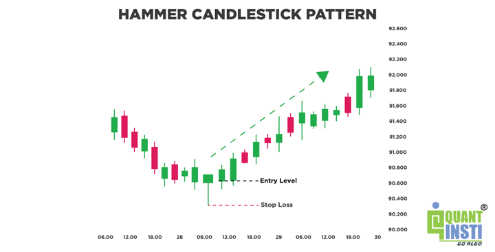

## Table of Contents

## What is a hammer candlestick pattern?

A hammer candlestick pattern is a type of chart pattern that traders look for in the stock market. It looks like a hammer, with a small body at the top and a long lower wick. This pattern usually shows up at the bottom of a downtrend. When you see a hammer, it means that the price went down a lot during the day, but then it came back up near the opening price. This suggests that buyers are starting to take control and the price might go up soon.

The hammer pattern is important because it can signal that a downtrend is about to end. Traders often use it to decide when to buy a stock. If the next candle after the hammer is bullish, it confirms the pattern and gives traders more confidence. However, it's not a guarantee, so traders should use other tools and indicators to make sure their decision is a good one.

## What does a hammer candlestick look like?

A hammer candlestick looks like a small rectangle with a long line sticking out from the bottom. The small rectangle is the body of the candlestick, and it can be either green or red. The long line below the body is called the lower wick or shadow. The top of the body is close to where the price opened and closed, and the bottom of the wick shows the lowest price during that time period.

When you see a hammer on a chart, it means that during that time, the price dropped a lot but then came back up near where it started. The long lower wick shows that sellers pushed the price down, but buyers stepped in and pushed it back up. This shape looks like a hammer, which is why it's called a hammer candlestick.

## In what type of market conditions does a hammer candlestick typically appear?

A hammer candlestick usually shows up when the market has been going down for a while. Imagine prices have been falling, and people are feeling worried. Then, one day, the price drops a lot during the trading session, but by the end of the day, it comes back up close to where it started. This makes a hammer shape on the chart. It's like the market is saying, "Enough is enough," and buyers are starting to step in.

This pattern often signals that the downtrend might be over. It's a sign that the sellers are losing their power and buyers are getting ready to take control. When you see a hammer, it's a good idea to look at other signs too, to make sure it's a good time to buy. But if the next day's price goes up, it can confirm that the hammer was a good signal and the market might start going up soon.

## What does the hammer candlestick pattern signify?

A hammer candlestick pattern shows up when a stock's price has been falling for a while. It looks like a hammer with a small body at the top and a long line, called a wick, sticking out from the bottom. This pattern means that during the day, the price dropped a lot but then came back up near where it started. It's a sign that the people selling the stock are getting tired, and the people wanting to buy are starting to take over.

When you see a hammer on a chart, it could mean that the price might start going up soon. It's like a signal that the downtrend might be over. But, it's important to check other things too, like what happens the next day. If the price goes up after the hammer, it's more likely that the pattern is telling the truth and it's a good time to buy.

## How can a hammer candlestick pattern be used in trading?

When you see a hammer candlestick pattern on a chart, it can be a good sign for traders. It means the price of a stock has been going down, but then it dropped a lot in one day and came back up near where it started. This shows that the people selling the stock might be getting tired, and the people who want to buy are starting to take over. If you are a trader, seeing a hammer can mean it's a good time to think about buying the stock because the price might start going up soon.

To use the hammer pattern in trading, you should look at what happens after the hammer appears. If the next day's price goes up, it can confirm that the hammer was a good signal. But it's smart to not just rely on the hammer. You should also look at other signs and tools to make sure it's really a good time to buy. Using the hammer pattern along with other things can help you make better choices and maybe make more money in trading.

## What is the difference between a hammer and a hanging man candlestick pattern?

A hammer and a hanging man candlestick pattern look very similar. They both have a small body at the top and a long lower wick. The main difference is where they show up on a chart. A hammer appears at the bottom of a downtrend, which means the price has been going down for a while. When you see a hammer, it's a sign that the price might start going up because buyers are starting to take over.

On the other hand, a hanging man appears at the top of an uptrend, which means the price has been going up for a while. When you see a hanging man, it's a warning that the price might start going down because sellers might be getting ready to take over. So, even though they look the same, where they appear on the chart tells you if it's a good sign or a warning sign.

## Can a hammer candlestick pattern be confirmed by other indicators?

Yes, a hammer candlestick pattern can be confirmed by other indicators. Traders often look at things like moving averages, the Relative Strength Index (RSI), and [volume](/wiki/volume-trading-strategy) to make sure the hammer is a good sign. For example, if the price is above a key moving average like the 50-day or 200-day moving average when the hammer appears, it can make the signal stronger. Also, if the RSI is showing that the stock is not overbought, it can support the idea that the price might go up.

Another important thing to check is the volume. If the volume is higher on the day the hammer appears, it means more people are trading, which can make the signal more reliable. Traders also look at what happens the next day. If the price goes up after the hammer, it's a good sign that the pattern is working. Using these other indicators along with the hammer can help traders make better decisions and feel more confident about their trades.

## What are the key considerations when identifying a valid hammer candlestick pattern?

When looking for a valid hammer candlestick pattern, it's important to check where it shows up on the chart. A hammer should appear at the bottom of a downtrend, which means the price has been going down for a while. If you see a hammer in the middle of an uptrend, it might not mean the same thing. Also, the hammer should have a small body at the top and a long lower wick, at least twice the size of the body. The color of the body, whether it's green or red, doesn't matter as much as the shape of the candlestick.

Another thing to think about is what happens after the hammer appears. If the next day's price goes up, it can confirm that the hammer is a good sign. It's also helpful to look at other indicators like volume and moving averages. If the volume is high on the day the hammer appears, it shows more people are trading, which can make the signal stronger. Checking if the price is above important moving averages, like the 50-day or 200-day moving average, can also help confirm the hammer. Using these extra checks can help traders feel more sure about their decisions.

## How does the position of a hammer candlestick within a trend affect its reliability?

The position of a hammer candlestick within a trend is really important for figuring out if it's a good sign. A hammer is most reliable when it shows up at the bottom of a downtrend. This means the price has been going down for a while, and the hammer can signal that the price might start going up soon. If you see a hammer in the middle of an uptrend, it might not mean the same thing. It could just be a normal day where the price went down a bit and then came back up.

The reason the position matters is because it tells you about the mood of the people trading. At the bottom of a downtrend, a hammer shows that sellers are getting tired and buyers are starting to take over. This can be a strong sign that the price is about to change direction. But if a hammer appears in the middle of an uptrend, it might just be a small pause in the upward movement and not a big change. So, always look at where the hammer is on the chart to decide if it's a good signal or not.

## What are some common mistakes traders make when interpreting hammer candlestick patterns?

One common mistake traders make when looking at hammer candlestick patterns is not checking where the hammer shows up on the chart. A hammer is most useful at the bottom of a downtrend, but if it appears in the middle of an uptrend, it might not mean the same thing. Traders can get confused and think it's a good time to buy when it's not. It's important to look at the bigger picture and see if the hammer is really at the end of a downtrend before making a decision.

Another mistake is relying only on the hammer without looking at other signs. A hammer by itself is not enough to make a good trading decision. Traders should also check things like volume, moving averages, and what happens the next day. If the volume is high on the day the hammer appears, it can make the signal stronger. And if the price goes up after the hammer, it's a good sign that the pattern is working. Using other tools along with the hammer can help traders make better choices and avoid big mistakes.

## How can one backtest the effectiveness of trading strategies based on hammer candlestick patterns?

To backtest the effectiveness of trading strategies based on hammer candlestick patterns, you need to look at past data to see how well the strategy would have worked. Start by choosing a time period and a stock or market to study. Then, go through the historical price data and find all the times a hammer pattern appeared at the bottom of a downtrend. For each hammer, check what happened next. Did the price go up like the hammer suggested? Keep track of how often the hammer led to a price increase and how big those increases were. Also, look at times when the hammer didn't work and the price kept going down.

It's important to use other indicators along with the hammer pattern when [backtesting](/wiki/backtesting). Look at things like volume, moving averages, and what happened the next day after the hammer appeared. If the volume was high on the day of the hammer, it might make the signal stronger. And if the price went up the next day, it's a good sign that the hammer was a good signal. By comparing the results with and without these extra indicators, you can see if they make the strategy more reliable. Backtesting helps you understand if using hammer patterns in your trading strategy could be a good idea, and it can show you how to make your strategy better.

## What advanced techniques can be used to enhance the predictive power of hammer candlestick patterns?

To make hammer candlestick patterns more useful for predicting what the stock price will do, you can use other tools along with the hammer. One way is to look at the trading volume on the day the hammer appears. If the volume is high, it means more people are trading, which can make the hammer's signal stronger. Another way is to check moving averages like the 50-day or 200-day moving average. If the hammer appears when the price is above these averages, it can mean the hammer is a good sign. Also, looking at what happens the next day after the hammer can help. If the price goes up, it's a good sign that the hammer was right.

Another advanced technique is to use other chart patterns and indicators along with the hammer. For example, if you see a hammer and then a bullish engulfing pattern the next day, it can make the hammer's signal even stronger. You can also use tools like the Relative Strength Index (RSI) to see if the stock is overbought or oversold. If the RSI shows the stock is not overbought when the hammer appears, it can support the idea that the price might go up. By combining the hammer pattern with these other tools, you can get a better idea of what might happen to the stock price and make smarter trading choices.

## References & Further Reading

[1]: Nison, S. (2001). *Japanese Candlestick Charting Techniques: A Contemporary Guide to the Ancient Investment Techniques of the Far East*. Prentice Hall Press.

[2]: Bulkowski, T. (2008). *Encyclopedia of Candlestick Charts*. Wiley.

[3]: Chan, E. P. (2008). *Quantitative Trading: How to Build Your Own Algorithmic Trading Business*. John Wiley & Sons.

[4]: Lopez de Prado, M. (2018). *Advances in Financial Machine Learning*. Wiley.

[5]: Aronson, D. R. (2006). *Evidence-Based Technical Analysis: Applying the Scientific Method and Statistical Inference to Trading Signals*. Wiley.

[6]: Jansen, S. (2020). *Machine Learning for Algorithmic Trading: Predictive models to extract signals from market and alternative data for systematic trading strategies with Python*. Packt Publishing.

[7]: Elder, A. (1993). *Trading for a Living: Psychology, Trading Tactics, Money Management*. Wiley.