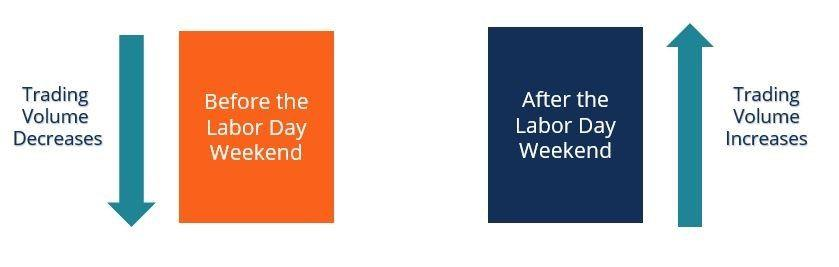

The term 'Hamptons Effect' describes a fascinating phenomenon in financial markets, characterized by specific patterns in trading activity. This effect becomes particularly relevant during late summer when many Wall Street professionals take vacations, often resulting in noticeable shifts in trading volumes. Typically, as these professionals retreat to the Hamptons, a popular summer destination for New York's elite, trading activity can see a temporary dip, followed by a resurgence once they return to their desks.

Beyond mere vacation cycles, the Hamptons Effect has broader implications, influencing real estate trends and even affecting algorithmic trading strategies. It highlights the intricate relationship between seasonal human behaviors and market responses, as the temporary exodus of key market players can lead to changes in market dynamics. The effect is not confined to trading activities alone but also impacts luxury real estate markets in the Hamptons and similar locales. During peak vacation periods, demand for high-end properties in these areas escalates, driving up real estate values and altering local market conditions.



This article will explore these interconnected phenomena, providing insights into how seasonal travel patterns impact financial and real estate markets. By understanding the nuances of the Hamptons Effect, investors and market participants can better anticipate and adapt to the shifts it may cause, whether through adjusting trading strategies or timing real estate investments strategically. The Hamptons, with its unique status as a retreat for New York's financial elite, offers a backdrop that illustrates the broader intersection of human behavior and market activity.

## Table of Contents

## Understanding the Hamptons Effect

The Hamptons Effect, a notable phenomenon in financial markets, correlates with predictable shifts in trading activities. It primarily manifests as a reduction in trading volumes and volatility in the financial markets, most prominently occurring before major holidays. This pattern is attributed to Wall Street professionals extending their vacations to the Hamptons, a favored summer destination for New York's financial elites. Typically, their absence from the trading floors leads to decreased market activity, which is only restored upon their return post-holidays.

Anecdotal evidence from financial insiders coupled with statistical analysis supports the existence of this effect. Data shows consistent patterns of market behaviors during these periods, suggesting a tangible impact. This has been observed in lower bid-ask spreads and reduced trading [momentum](/wiki/momentum), indicative of a thinly traded market. For instance, during late August, when the Hamptons Effect is most pronounced, market depth often sees tangible reductions, influencing liquidity and trader behaviors.

The origins of the Hamptons Effect are entrenched in the cultural practices of the financial community. The tradition of seasonal retreats has been ingrained within the corporate culture of Wall Street, with many high-net-worth individuals opting to spend their late summer in the Hamptons. This mass exodus results in fewer market participants, diminishing the usual robust trading environment and subsequently influencing the price discovery process.

To further substantiate and quantify this market behavior, a simple Python analysis could evaluate historical trading volumes and [volatility](/wiki/volatility-trading-strategies) indices during late summer months. A hypothetical script might analyze trading [volume](/wiki/volume-trading-strategy) data from a financial database using libraries like Pandas for data manipulation and Matplotlib for visualization:

```python
import pandas as pd
import matplotlib.pyplot as plt

# Hypothetical function to fetch trading data
data = pd.read_csv('historical_trading_volumes.csv')

# Filter data for late summer months
late_summer_data = data[(data['date'].dt.month == 8) & (data['date'].dt.week > 3)]

# Calculate average trading volume
average_volume = late_summer_data['trading_volume'].mean()

# Plot trading volume trend
plt.figure(figsize=(10, 5))
plt.plot(late_summer_data['date'], late_summer_data['trading_volume'], label='Trading Volume')
plt.axhline(y=average_volume, color='r', linestyle='--', label='Average Volume')
plt.title('Trading Volume During Late Summer')
plt.xlabel('Date')
plt.ylabel('Trading Volume')
plt.legend()
plt.show()
```

Such analyses can provide deeper insights into how these cultural practices translate into quantifiable market patterns and assist in devising strategies that account for these seasonal variations.

## Seasonal Travel Patterns and Real Estate Trends

The seasonal movement of affluent New Yorkers to the Hamptons significantly impacts local real estate markets, particularly during the summer months. This migration drives up demand for luxury properties, contributing to increased property values. The influx of seasonal residents often leads to heightened competition for available real estate, as both temporary renters and potential buyers seek to secure desirable locations. As a result, prices for premium properties can rise substantially in response to this increased demand.

This pattern of seasonal real estate fluctuation is not unique to the Hamptons but is evident in other high-profile vacation destinations as well. Locations such as Aspen, Palm Beach, and Martha's Vineyard experience similar trends, with property demand peaking during specific times of the year. Consequently, real estate investment strategies must take these variations into account to optimize returns. 

Investors looking to capitalize on these seasonal trends can benefit from strategic timing when entering or exiting the market. By purchasing properties during off-peak periods when prices may be lower and selling during peak demand seasons, investors can potentially maximize their profits. Additionally, understanding these cyclical patterns helps investors predict market movements, providing a framework for more informed decision-making.

Besides, recognizing these seasonal trends can aid investors in devising rental strategies for vacation homes. During peak periods, short-term rental rates in these areas can be significantly higher, offering an opportunity for increased income from properties in these luxury markets. Understanding the rhythms of vacation migration can thus be a valuable component in formulating effective real estate strategies, aligning investment decisions with predictable consumer behaviors.

## Implications for Algorithmic Trading

Algorithmic trading strategies must adapt to the seasonal variations in trading volume and volatility associated with the Hamptons Effect. This period is marked by reduced [liquidity](/wiki/liquidity-risk-premium), which can disrupt the efficiency of algorithms that rely on stable trading conditions. Adjustments are necessary to maintain strategy performance and execution accuracy. Typically, algorithmic systems are designed to operate under assumptions of normal market behavior. When these assumptions are challenged by seasonal patterns, calibration of risk management approaches becomes crucial.

One significant impact of reduced liquidity is the potential for increased slippage, where the execution price deviates from the expected price due to insufficient market depth. To mitigate this, algorithms may need to incorporate liquidity-adjusted measures. For example, an order execution strategy could be enhanced by accounting for lower volume periods using a volume-weighted average price (VWAP) benchmark that adjusts for anticipated daily volume fluctuations.

```python
def adaptive_vwap(prices, volumes, expected_volume):
    return sum(p * v for p, v in zip(prices, volumes)) / max(sum(volumes), expected_volume)
```

This adaptive approach allows the algorithm to adjust its execution logic when detecting seasonal changes in volume, thereby maintaining desired execution performance.

Another critical aspect is risk management. Traditional metrics like Value-at-Risk (VaR) may need recalibration to [factor](/wiki/factor-investing) in seasonally adjusted volatility. This can be achieved by updating historical data sets to include only periods that reflect similar market conditions or by applying a volatility scaling factor.

Despite the increased use of automation in trading, human behavior still significantly influences market dynamics. The tendency for human behavioral patterns to manifest in predictable seasonal trends presents opportunities for algorithmic traders to optimize strategies. Identifying these behavioral rhythms allows traders to anticipate market movements and adjust positions accordingly, though it is essential to recognize the associated challenges. Such focus on the underlying behavioral drivers enriches the strategist's toolbox, allowing them to leverage historical patterns while remaining agile enough to adapt to evolving market conditions.

## Conclusion

The Hamptons Effect underscores how human behavior coincides with financial market dynamics, primarily during specific seasonal periods. This phenomenon exemplifies how trading and real estate markets are not just influenced by economic factors but also by collective behavioral patterns, particularly the vacation habits of financial professionals. While the Hamptons Effect offers intriguing insights, it's important for investors to recognize that relying exclusively on this pattern may not provide a foundation for substantial financial gain. 

Instead, the Hamptons Effect should be integrated as part of a broader, diversified investment strategy. Financial markets are complex and subject to various forces, and recognizing the potential impact of human behavior is merely one aspect of a comprehensive analysis. By understanding and anticipating these market anomalies, investors can better adapt their strategies to capitalize on fluctuations in market activity, thereby enhancing their ability to navigate the often unpredictable financial environment.

In practical terms, investors might use knowledge of the Hamptons Effect to adjust their exposure in conjunction with other market insights. It's not a standalone strategy but a supplementary consideration that, together with fundamental and technical analysis, can enrich an investor's approach. Adapting to such seasonal trends allows market participants to potentially optimize timing for entry and [exit](/wiki/exit-strategy) decisions, thus positioning themselves advantageously within the market's cycle.

## FAQs

### FAQs

**What triggers the Hamptons Effect in financial markets?**

The Hamptons Effect is primarily triggered by the seasonal vacation patterns of Wall Street professionals. As traders, brokers, and financial analysts take time off to visit the Hamptons during the late summer months, trading volumes on financial markets typically decrease. This reduction in active participation leads to lower liquidity and can influence market volatility. Essentially, the financial market experiences a temporary lull due to the absence of a significant number of active participants.

**How does the Hamptons Effect compare to other seasonal market anomalies?**

The Hamptons Effect is similar to other seasonal market anomalies like the "January Effect," where stock prices often increase at the beginning of the year. However, the Hamptons Effect is distinct in that it revolves around decreases in trading activity instead of price movements. While the January Effect is driven by tax-related motivations, the Hamptons Effect stems from social and cultural habits. Both effects demonstrate that non-economic factors can heavily impact market behaviors.

**Can investors reliably profit from the Hamptons Effect?**

Profiting from the Hamptons Effect can be challenging and is not guaranteed. The decreased trading volumes can result in lower volatility, often leading to narrow price swings that limit profit opportunities. Investors attempting to capitalize on the Hamptons Effect must be cautious and aware that market dynamics can quickly shift upon the return of traders, necessitating agile responses. Employing a diversified approach and integrating the Hamptons Effect with other market analyses may yield better results.

**What are the risks of basing trading strategies around the Hamptons Effect?**

The primary risk of basing trading strategies around the Hamptons Effect lies in the potential for unexpected market shifts. As trading volumes decline, liquidity decreases, which can exacerbate price movements due to large trades. Additionally, relying solely on the Hamptons Effect ignores broader market trends and macroeconomic indicators that can impact investment returns. Traders may also face challenges with executing trades at favorable prices due to low liquidity during this period.

**How do different sectors respond to the Hamptons Effect?**

The response to the Hamptons Effect varies across sectors. Highly liquid sectors such as technology and consumer goods may experience a more pronounced decline in trading activity due to their typically high trading volumes. In contrast, sectors such as utilities, which usually see less daily trading, might be less affected. Additionally, companies with operations heavily tied to tourism or luxury real estate in areas like the Hamptons could see direct impacts on their market dynamics during this period.

## References & Further Reading

[1]: Swedroe, L. (2011). ["The January Effect: Rationality And Irrationality In Returns."](https://www.theibfr2.com/RePEc/ibf/ijbfre/ijbfr-v5n4-2011/IJBFR-V5N4-2011-1.pdf) Forbes.

[2]: Thaler, R. H. (1987). ["Anomalies: The January Effect."](https://pubs.aeaweb.org/doi/pdfplus/10.1257/jep.1.1.197) Journal of Economic Perspectives, 1(1), 197-201.

[3]: Kim, C. W., & Park, J. (1994). ["Holiday Effects and Stock Returns: Further Evidence."](https://www.jstor.org/stable/2331196) The Journal of Financial and Quantitative Analysis, 29(1), 145-157.

[4]: Lopez de Prado, M. (2018). ["Advances in Financial Machine Learning."](https://www.amazon.com/Advances-Financial-Machine-Learning-Marcos/dp/1119482089) John Wiley & Sons.

[5]: Chan, E. (2008). ["Quantitative Trading: How to Build Your Own Algorithmic Trading Business."](https://github.com/ftvision/quant_trading_echan_book) John Wiley & Sons.

[6]: Shiller, R. J. (2000). ["Irrational Exuberance."](https://en.wikipedia.org/wiki/Irrational_Exuberance_(book)) Princeton University Press.